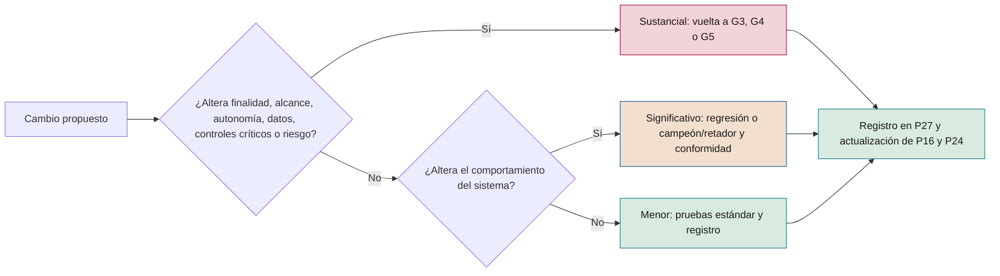
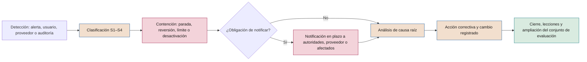

# Manual de operación de IA

**Operación de ML predictivo, IA generativa, agentes e IA de terceros: monitorización, cambios, incidentes, continuidad, registros y retirada**

| | |
|---|---|
| Documento | Documento 52 · Manual de operación de IA |
| Versión | 0.1 (borrador de trabajo) |
| Fecha | 16-09-2026 |
| Autor | Fernando García · SEACHAD |
| Estado | Borrador para revisión. Los umbrales y tiempos son referencias iniciales a calibrar; los de incidentes se confirman en el documento 37. |

<!-- cifras: 4 | tipos de sistema con operación diferenciada ; 9 | capas de monitorización ; 3 | clases de cambio con regla de gate ; 4 | plantillas de operación P24–P27 -->

---

> **Aviso legal y exención de responsabilidad.** SEVEN-G es un marco metodológico de referencia que se ofrece «tal cual» y con fines exclusivamente informativos. No constituye asesoramiento jurídico, regulatorio, financiero ni profesional, ni garantiza el cumplimiento de ninguna norma. Las referencias a regulación general (como el Reglamento Europeo de IA, el RGPD, DORA o NIS2), a normas técnicas y a regulación específica de cada sector o jurisdicción pueden ser incompletas, no aplicar a un caso concreto o quedar desactualizadas por cambios normativos, interpretaciones o criterios de las autoridades posteriores a su fecha de consulta. **Cada organización que use SEVEN-G es la única responsable de identificar la normativa que le aplica, verificar su vigencia y certificar su propio cumplimiento regulatorio**, con el asesoramiento cualificado que corresponda. El autor y SEACHAD no asumen responsabilidad alguna por el uso que se haga de este contenido ni por las decisiones que se adopten con él. Los datos, cifras, compañías y casos de los ejemplos son ficticios o ilustrativos.

## 1. Objeto y alcance

Este documento desarrolla la **fase 6 · Operación y gobierno** del ciclo de vida (01 §6.8) y fija cómo se operan los sistemas de IA en producción para que **sigan funcionando, aportando valor y bajo control**. Es genérico: cada sistema concreta lo que aquí se establece en su manual de operación (P24).

Cubre:

- La operación específica de cada tipo de sistema: **ML predictivo, IA generativa, agentes e IA de terceros embebida**.
- La **monitorización y las alertas** (P25), con métricas y umbrales tipo.
- La **gestión de cambios** y qué cambios obligan a volver a un *gate*.
- La **gestión de incidentes** (P26, P27), con la escala S1–S4, que se desarrolla en el documento 37.
- La preparación de la **revisión de continuidad R6**.
- La **vigilancia posterior a la comercialización** que exige la regulación.
- La **continuidad y la reversión**.
- Los **registros y la trazabilidad**, incluida su conservación.
- La **retirada técnica**.

**Destinatarios.** Responsables de operación y técnicos de IA, equipos de plataforma y seguridad, responsables de riesgos y auditores de IA.

**No cubre** la construcción de soluciones (documento 53), los controles de seguridad en detalle (documento 35) ni la gestión contractual de proveedores (documento 36).

Este documento contiene referencias regulatorias y no constituye asesoramiento jurídico.

---

## 2. Principios de operación

1. **Un sistema de IA puede fallar sin caerse:** se vigilan calidad, deriva, sesgo, coste y acciones, no solo la disponibilidad.
2. **Sin responsable no hay producción:** todo sistema tiene un responsable de operación localizable según su nivel de servicio.
3. **Toda alerta tiene dueño y acción;** si no, es ruido y se corrige.
4. **Cambiar es volver a validar,** en proporción al efecto del cambio.
5. **Parar es siempre posible,** con un procedimiento probado; los agentes tienen interruptor de parada.
6. **Lo que no está registrado no ocurrió.**
7. **El proveedor también cambia,** y sus cambios se tratan como propios.

---

## 3. Modelo de operación

### 3.1 Responsabilidades

En la fase 6 el **responsable de operación de IA** responde y realiza (01 §8.4). El **responsable técnico** realiza reentrenamientos, evaluaciones y cambios y responde del campeón/retador; el **responsable de producto** responde del valor y la adopción en R6; el **responsable de riesgos** emite conformidad en cambios significativos Enterprise; **seguridad** responde de la revisión de permisos de agentes; el **auditor de IA** verifica pruebas, permisos, R6 y retiradas.

### 3.2 Preparación para operar

G5 no puede resolverse con *Continuar* si no existen, verificados, el **manual de operación** (P24), la **configuración de monitorización y alertas** (P25) con alertas probadas, el **plan de respuesta a incidentes** (P26) y el **registro de incidentes y cambios** (P27) abierto, además del **plan de reversión probado** (P19). El responsable de operación **debe** haber participado en la fase 5 y aceptar formalmente el traspaso.

### 3.3 Requisitos de operación por nivel de autonomía

| Nivel | Requisitos mínimos adicionales de operación |
|---|---|
| **A0 · Asistencia** | Calidad de resultados y coste; canal de reporte de errores. |
| **A1 · Recomendación** | Más registro de recomendación y decisión humana; tasa de modificación humana (PER-10). |
| **A2 · Actuación supervisada** | Más registro de cada acción con su intención; límites técnicos; interruptor probado; revisión por muestreo. |
| **A3 · Actuación autónoma** | Más detección de anomalías en tiempo real; umbrales sobre agregados; permisos revisados trimestralmente; guardia con capacidad de parada. |

---

## 4. Operación por tipo de sistema

### 4.1 ML predictivo

#### 4.1.1 Deriva

| Tipo | Qué cambia | Cómo se detecta | Dificultad |
|---|---|---|---|
| **Deriva de datos** | La distribución de las variables de entrada respecto a la de entrenamiento o validación. | Comparación de distribuciones por variable y en conjunto (por ejemplo, índice de estabilidad de la población o distancias entre distribuciones). | Se detecta pronto y sin etiquetas, pero no toda deriva de datos degrada el modelo. |
| **Deriva de predicciones** | La distribución de los resultados del modelo. | Comparación con la distribución de referencia. | Señal temprana útil cuando las etiquetas tardan. |
| **Deriva de concepto** | La relación entre las variables y lo que se predice. | Rendimiento frente a etiquetas reales; indicadores de negocio como aproximación. | Requiere etiquetas, que pueden llegar con semanas o meses de retraso. |

**Regla.** P25 **debe** declarar, para cada modelo, el **retraso de las etiquetas** y qué indicadores aproximados se usan mientras tanto. Un modelo sin forma de medir su rendimiento real en un plazo razonable no **debería** superar G5.

#### 4.1.2 Reentrenamiento

| Modalidad | Cuándo | Condiciones |
|---|---|---|
| **Programado** | Con periodicidad fija definida en P24. | Mismos datos de origen, variables y método validados; pasa por campeón/retador. |
| **Por disparador** | Cuando una alerta de deriva o de rendimiento lo justifica. | Antes se analiza la causa: reentrenar no corrige un error de datos de entrada ni un cambio de proceso. |
| **Automático** | Canalización que reentrena y propone sin intervención. | Solo si la canalización está validada, los criterios de promoción están predefinidos y la promoción a producción la aprueba una persona en Enterprise. |

Todo reentrenamiento: usa datos que superan los controles de calidad (documento 51), congela y versiona el conjunto, actualiza P16 y se registra en P27 como cambio.

#### 4.1.3 Validación campeón/retador

| Paso | Actividad | Criterio |
|---|---|---|
| 1 · Evaluación fuera de línea | El modelo nuevo (retador) y el vigente (campeón) se evalúan sobre el mismo conjunto de prueba reciente, no usado en el entrenamiento. | Métrica principal y secundarias definidas en P24. |
| 2 · Segmentos y sesgo | Comparación por segmentos relevantes y pruebas de sesgo. | El retador no empeora por encima de la tolerancia en ningún segmento protegido. |
| 3 · Modo sombra | El retador recibe datos reales y produce resultados sin efecto. | Estabilidad, latencia, coste y concordancia con el campeón dentro de lo esperado. |
| 4 · Despliegue gradual | Una parte del tráfico pasa al retador, o prueba controlada cuando el diseño lo permite. | Sin alertas críticas durante el periodo definido. |
| 5 · Decisión | Promoción, rechazo o prolongación de la prueba. | Criterios de promoción **fijados antes** de la evaluación; registro del decisor. |
| 6 · Conservación | El campeón anterior queda disponible para reversión. | Durante el periodo definido en P19. |

En Lite pueden omitirse los pasos 3 y 4 si el sistema es A0 y sin exposición directa, con justificación en P27.

### 4.2 IA generativa

#### 4.2.1 Evaluaciones continuas

- **Conjunto de evaluación de referencia:** casos representativos, difíciles, sensibles y adversos (incluida la inyección de instrucciones), versionado y ampliado con cada incidente y fallo detectado.
- **Evaluación de regresión** completa ante cualquier cambio de modelo, instrucciones, fuentes, filtros o parámetros; sin resultado conforme, el cambio no se promociona.
- **Evaluación periódica** aunque no haya cambios propios, para detectar cambios silenciosos del proveedor.
- **Muestreo de producción** con revisión humana; tamaño y frecuencia en P25.
- **Modelo evaluador** solo si se ha medido su acuerdo con evaluadores humanos y se recalibra periódicamente.

#### 4.2.2 Calidad de las respuestas y alucinaciones

| Dimensión | Métrica tipo |
|---|---|
| **Fidelidad** a fuentes o datos proporcionados | Respuestas sin afirmaciones no soportadas (OPE-09; documento 51, CNC-04). |
| **Corrección** | Respuestas correctas en el conjunto de referencia. |
| **Pertinencia y completitud** | Valoración por criterios. |
| **Rechazo adecuado** | Tasa de rechazos indebidos y de respuestas indebidas. |
| **Formato y tono** | Cumplimiento de reglas. |
| **Seguridad del contenido** | Hallazgos de contenido dañino, datos personales o confidenciales por cada mil interacciones. |

Se denomina **alucinación** a la afirmación presentada como cierta que no está soportada por los datos o fuentes disponibles o es falsa. Su gestión combina diseño (recuperación de fuentes, cita obligatoria, instrucciones), filtros, supervisión humana en usos sensibles y medición continua. Una alucinación con efecto sobre clientes o decisiones es un **incidente**.

#### 4.2.3 Filtros

| Filtro | Qué controla | Qué se monitoriza |
|---|---|---|
| **De entrada** | Intentos de inyección de instrucciones, datos personales o confidenciales, contenido prohibido. | Tasa de activación y su variación brusca (posible ataque o cambio de uso). |
| **De salida** | Datos personales, contenido dañino, afirmaciones prohibidas (por ejemplo, promesas contractuales), formato. | Tasa de activación, falsos positivos reportados. |
| **De contexto recuperado** | Instrucciones incrustadas en documentos o páginas (inyección indirecta). | Detecciones y fuentes de origen. |

Los filtros son **controles críticos**: su desactivación es un cambio sustancial (sección 6) y su fallo, un incidente.

#### 4.2.4 Costes por consumo

- **Unidad:** coste por transacción útil (consulta resuelta, documento procesado), no solo volumen de consumo.
- **Presupuesto** mensual por sistema, con alertas al 80 % y al 100 % como referencia inicial.
- **Límites** por usuario, sesión y periodo; tamaño máximo de contexto; llamadas máximas por tarea.
- **Anomalías:** coste por transacción creciente sin cambio de uso (bucles, contexto excesivo, abuso).
- **Al alcanzar el límite:** degradación por coste en cascada (sección 10.3), definida en P24 y validada en G5; corte total solo si no afecta a una función crítica.
- **Imputación** en la categoría *consumo de modelos* (documento 42) y seguimiento en T13.

#### 4.2.5 Versiones del modelo del proveedor

1. Fijar la **versión exacta** del modelo en producción (no alias a la "última versión") y registrarla en P16.
2. Registrar las **fechas de obsolescencia** anunciadas e iniciar la migración con margen para evaluación completa y campeón/retador.
3. Detectar **cambios de comportamiento sin cambio de versión** con la evaluación periódica y consultas de control diarias.
4. Revisar los avisos sobre **uso de datos y ubicación del tratamiento** y reevaluar en P14 (documento 36).

La migración a una nueva versión del mismo proveedor es un **cambio significativo**; a otra familia de modelos o a otro proveedor, un **cambio sustancial** (sección 6).

#### 4.2.6 Deriva de uso

En IA generativa y en agentes no hay variables de entrada fijas ni etiquetas que permitan medir la deriva como en el ML predictivo, pero el sistema también se degrada cuando **cambia lo que se le pide**: nuevos temas, nuevos tipos de usuario, consultas que nadie previó. El sistema se validó en G5 con un alcance y un conjunto de evaluación concretos; si el uso real se aleja de ellos, las evaluaciones dejan de representar lo que ocurre en producción.

| Señal | Qué se compara | Cómo se mide |
|---|---|---|
| **Distribución de temas o intenciones** | Reparto de las consultas por tema o intención frente al del uso validado en G5. | Clasificación de las consultas (por reglas, por un clasificador o por muestreo humano) y distancia entre distribuciones; se usa el mismo índice de estabilidad de la población de la sección 4.1.1 sobre las categorías. |
| **Consultas fuera del alcance validado** | Proporción de consultas que no corresponden a ningún tema o tarea validados. | Clasificación anterior o muestreo; tasa sobre el total del periodo (OPE-19). |
| **Forma de las entradas** | Longitud, idioma, canal, tipo de documento, herramientas invocadas por los agentes. | Distribuciones frente a la referencia. |
| **Recuperación sin fuente pertinente** | Consultas para las que la búsqueda no encuentra fuentes adecuadas. | Tasa del periodo (documento 51, CNC-08). |

**Regla.** P25 **debe** fijar la **referencia de uso** (temas, intenciones y alcance validados en G5), la forma de clasificar las consultas y los umbrales. Cuando la deriva de uso supera el nivel crítico: se amplía el conjunto de evaluación con los casos nuevos y se evalúa el sistema sobre ellos; si el uso nuevo cae fuera de la finalidad aprobada, se limita el alcance o se trata como **nuevo uso** (tabla 6.2, vuelta a G3).

> **Por qué importa.** Un asistente validado para consultas sobre productos que empieza a recibir reclamaciones o preguntas jurídicas sigue «funcionando» y sus evaluaciones siguen en verde, porque miden lo que se previó y no lo que ocurre. La deriva de uso es la señal temprana de que el riesgo real ya no es el aprobado y de que el valor medido puede estar en otro sitio.

#### 4.2.7 Sesgo en las respuestas

El sesgo no es exclusivo de los modelos que puntúan o deciden: un sistema generativo puede **tratar de forma distinta** a personas o grupos en el contenido, el tono, las recomendaciones o la calidad de la respuesta.

| Prueba | Qué detecta | Cómo se hace |
|---|---|---|
| **Pares contrafactuales** | Diferencias de respuesta atribuibles a un atributo protegido (sexo, edad, origen, discapacidad u otros que fije la evaluación de impacto) o a un indicio de él (nombre, idioma, forma de escribir). | Parte del conjunto de evaluación de referencia (4.2.1) está formada por pares de casos idénticos salvo en ese atributo; se compara el resultado de cada par con los criterios de P25 (decisión o recomendación, importe, tono, rechazo, completitud). |
| **Calidad por segmento** | Peor exactitud o más rechazos para un colectivo. | Métricas de 4.2.2 desglosadas por los segmentos definidos en la evaluación de impacto, en la evaluación periódica y en el muestreo de producción. |
| **Contenido estereotipado** | Afirmaciones o supuestos estereotipados sobre grupos. | Criterio específico en la revisión humana del muestreo y en los filtros de salida. |

**Reglas.**

1. La **tasa de respuestas desiguales** (pares con diferencia material ÷ pares evaluados, OPE-20) se mide en cada evaluación de regresión y en la evaluación periódica; su umbral se fija en P17 junto a los de supervisión humana.
2. Es **obligatoria** cuando el sistema recomienda, prioriza, redacta comunicaciones o decide sobre personas o tiene exposición directa a clientes; en el resto de sistemas, cuando la evaluación de riesgos lo indique (documento 33).
3. Un cambio de modelo, de instrucciones o de fuentes no se promociona si empeora esta tasa por encima de la tolerancia, igual que el retador en el ML predictivo (4.1.3, paso 2).

> **Por qué importa.** En la IA generativa el sesgo no aparece en una columna de resultados que se pueda contar; aparece en cómo se redacta, se recomienda o se rechaza. Sin una prueba diseñada para ello no se ve, y es precisamente lo que un regulador, un cliente afectado o un medio de comunicación sí verán.

### 4.3 Agentes

Los controles de diseño de agentes (identidad, permisos, control de intención, interruptor de parada) se definen en el documento 35 y se evalúan con T10. Este apartado fija su operación.

#### 4.3.1 Monitorización de acciones

Cada acción de un agente **debe** registrar: identidad propia del agente (no compartida con personas) y versión; usuario o proceso en cuyo nombre actúa; **intención declarada** (objetivo de la tarea y justificación de la acción); herramienta, operación y datos usados; resultado y efecto; validación humana previa y quién la dio, si aplica; marca temporal e identificador de correlación para reconstruir la secuencia.

#### 4.3.2 Límites

- **Por acción:** importe, número de destinatarios, tipos de datos.
- **Por periodo:** número de acciones, gasto acumulado, operaciones sobre un mismo cliente o registro.
- **De alcance:** sistemas, entornos y funciones permitidos.
- **De ejecución:** pasos, tiempo y reintentos máximos por tarea.
- **De escalado:** acciones que siempre requieren validación humana, sea cual sea la autonomía.

Los límites se aplican **técnicamente fuera del agente** (en las herramientas, pasarelas o permisos), no solo mediante instrucciones al modelo. Una acción bloqueada por un límite se registra y, según P25, genera alerta.

#### 4.3.3 Anomalías de intención

Una **anomalía de intención** es una acción o secuencia que no es coherente con el objetivo declarado de la tarea.

| Señal | Respuesta tipo |
|---|---|
| Herramientas que no corresponden a la tarea (posible inyección o error de planificación). | Bloqueo de la acción y revisión. |
| Acceso a datos o sistemas fuera de alcance. | Bloqueo, alerta crítica, revisión de seguridad. |
| Instrucciones procedentes de contenido externo procesado (inyección indirecta). | Bloqueo y análisis de la fuente. |
| Bucles o repetición de la misma acción. | Corte por límite de ejecución. |
| Crecimiento brusco del volumen de acciones o del coste. | Pausa del agente y revisión. |
| Intento de ampliar sus permisos o modificar sus límites. | Parada del agente; incidente de al menos S2. |

#### 4.3.4 Interruptor de parada

- **Niveles:** por acción, sesión, agente y conjunto de agentes de un tipo.
- **Quién lo activa:** responsable de operación, supervisor humano designado y seguridad, **sin aprobación previa**.
- **Efecto:** detiene nuevas acciones, cancela las pendientes, revoca credenciales temporales y deja los sistemas en el estado coherente definido en P24, en un tiempo objetivo fijado en P25.
- **Pruebas:** trimestral en Enterprise, semestral en Lite y tras cada cambio significativo o sustancial (OPE-12).
- **Reactivación:** tras análisis de causa, con aprobación del responsable de operación y, si hubo incidente S1 o S2, del responsable de riesgos.

#### 4.3.5 Revisión de permisos

1. Inventario de **identidades no humanas** de cada agente, con propietario.
2. **Mínimo privilegio**: cada permiso se justifica por una tarea del agente.
3. **Credenciales de corta duración** siempre que la plataforma lo permita.
4. Revisión **trimestral** para A2–A3 y **semestral** para A0–A1 (OPE-13).
5. Retirada de permisos **no usados** en el periodo definido (referencia inicial: 90 días).
6. Toda ampliación de permisos que permita **nuevos efectos** sobre terceros, dinero, datos personales o sistemas de producción es un **cambio sustancial**.

### 4.4 IA de terceros embebida

Software de un proveedor con funciones de IA que intervienen en procesos de la compañía (01 §1.2).

- **Funciones de IA nuevas activadas por el proveedor**, a veces por defecto: revisión de notas de actualización, verificación de la configuración tras cada versión y desactivación hasta su evaluación cuando el contrato lo permite.
- **Cambios de modelo o de comportamiento sin aviso:** indicadores de resultado del proceso, muestreo y pruebas de regresión antes de actualizaciones relevantes.
- **Falta de registros:** exigencia contractual de acceso a registros y soporte en incidentes (documento 36).
- **Cambios en el tratamiento de datos** (ubicación, subencargados, entrenamiento): reevaluación en P14.
- **Incidentes del proveedor:** canal y plazos de notificación en P26.

La intensidad de estos controles depende del nivel de exigencia al tercero: **N1 Estándar · N2 Reforzado · N3 Crítico** (documento 36).

---

## 5. Monitorización y alertas (P25)

### 5.1 Capas de monitorización

| Capa | Qué se vigila | Aplica a |
|---|---|---|
| 1 · Disponibilidad e infraestructura | Disponibilidad, latencia, errores, capacidad. | Todos |
| 2 · Calidad de datos de entrada | Nulos, rangos, esquema, actualidad, volumen. | Todos |
| 3 · Deriva | Datos, predicciones y concepto (4.1.1); uso: temas, intenciones y consultas fuera del alcance validado (4.2.6). | Datos, predicciones y concepto: ML predictivo. Uso: IA generativa y agentes |
| 4 · Rendimiento del modelo | Métricas frente a la validación de G5, por segmento. | ML predictivo |
| 5 · Calidad de respuestas | Fidelidad, corrección, rechazo adecuado, vigencia de fuentes; sesgo en las respuestas (4.2.7). | IA generativa |
| 6 · Acciones y límites | Acciones, bloqueos, anomalías de intención, permisos. | Agentes |
| 7 · Seguridad | Activación de filtros, intentos de inyección, accesos indebidos. | Todos, con énfasis en IA generativa y agentes |
| 8 · Coste | Consumo, coste por transacción, presupuesto. | Todos, con énfasis en IA generativa y agentes |
| 9 · Supervisión humana, uso y valor | Tasa de modificación humana, adopción, indicadores de la hipótesis de valor, sesgo. | Todos |

### 5.2 Métricas y umbrales tipo

Los valores son **ilustrativos y a calibrar** por sistema en la fase 5 a partir de su línea base. La severidad indicada es la inicial del incidente si se confirma efecto; la clasificación final sigue la sección 7.

| Capa | Métrica | Aviso | Crítico | Severidad inicial si hay efecto |
|---|---|---|---|---|
| 1 | Disponibilidad mensual frente al nivel de servicio | Por debajo del objetivo en el periodo parcial | Incumplimiento del nivel de servicio | S3; S2 si es función crítica |
| 1 | Latencia en percentil 95 | > objetivo durante 15 min | > 2 × objetivo durante 15 min | S4–S3 |
| 2 | Proporción de nulos en variables críticas | > 2 × media de 30 días | > umbral de calidad de la fase 3 | S3 |
| 2 | Antigüedad de los datos de entrada | > plazo de actualización previsto | > 2 × plazo | S3 |
| 3 | Índice de estabilidad de la población por variable | > 0,1 | > 0,25 | S4–S3 (convención habitual en la práctica; a calibrar) |
| 3 | Índice de estabilidad de la distribución de temas o intenciones | > 0,1 | > 0,25 | S4–S3 (a calibrar) |
| 3 | Consultas fuera del alcance validado | > 2 × referencia de G5 | > 3 × referencia de G5 o > 10 % de las consultas | S3; S2 si el uso nuevo afecta a personas o a temas regulados |
| 4 | Métrica principal frente a validación de G5 | Caída relativa > 5 % | Caída relativa > 10 % | S3; S2 si afecta a decisiones sobre personas o clientes |
| 4 | Ratio de impacto adverso entre grupos | < umbral de P17 + margen | < umbral de P17 | S2 |
| 5 | Fidelidad a las fuentes en muestreo | < objetivo − 2 puntos | < objetivo − 5 puntos | S3; S2 con exposición directa |
| 5 | Respuestas con contenido caducado | > 0 en temas regulados o contractuales | Repetición tras corrección | S3–S2 |
| 5 | Tasa de respuestas desiguales en pares contrafactuales | > umbral de P17 − margen | > umbral de P17 | S3; S2 si hay decisiones o comunicaciones sobre personas |
| 6 | Acciones bloqueadas por límites | > 2 × media de 7 días | Cualquier intento de superar límite de importe o alcance | S3; S2 si hay intento de ampliar permisos |
| 6 | Anomalías de intención | Cualquier anomalía no explicada | Anomalía con efecto sobre terceros, dinero, datos personales o producción | S2; S1 si hay daño material |
| 7 | Activación de filtros de entrada | > 3 × media de 7 días | Patrón sostenido de ataque | S3–S2 |
| 7 | Exposición de datos personales o confidenciales | — | Cualquier caso confirmado | S2; S1 si es masiva o de categorías especiales |
| 8 | Coste mensual frente a presupuesto | ≥ 80 % | ≥ 100 % | S4–S3 |
| 8 | Coste por transacción | > 1,5 × media de 30 días | > 3 × media de 30 días | S3 |
| 8 | Funcionamiento en modo degradado por coste | Cualquier activación | > 5 días en el mes o calidad en el modo por debajo del mínimo de P25 | S4; S3 si la calidad cae por debajo del mínimo |
| 9 | Tasa de modificación humana | Próxima a 0 % durante 30 días | — | Revisión en R6 |
| 9 | Indicador principal de valor | Por debajo de la hipótesis dos periodos seguidos | Por debajo del criterio de parada | Revisión en R6; adelanta G7 |

### 5.3 Reglas de diseño de alertas

1. Cada alerta tiene **responsable**, **procedimiento** en P24 y **severidad inicial**.
2. Las alertas críticas llegan a una persona localizable en el horario de actuación del sistema.
3. Se **prueban** antes de G5 y tras cada cambio que las afecte.
4. Se mide el **ruido** (OPE-16) y se revisan los umbrales en cada R6.
5. Una alerta desactivada o silenciada se registra en P27 con motivo, responsable y fecha de reactivación.

---

## 6. Gestión de cambios

### 6.1 Clases de cambio

| Clase | Definición | Ejemplos | Qué exige |
|---|---|---|---|
| **Menor** | No altera el comportamiento del sistema ni sus controles. | Escalado de infraestructura; parche de seguridad sin cambio funcional; corrección de un panel. | Pruebas estándar; aprobación del responsable de operación; registro en P27. |
| **Significativo** | Altera el comportamiento dentro de la finalidad, el alcance, la autonomía y los riesgos aprobados. | Reentrenamiento con los mismos datos de origen y método; nueva versión del modelo del mismo proveedor y familia; cambio de instrucciones de sistema; nuevas fuentes de conocimiento del mismo tipo y permisos; ajuste de umbrales dentro de rangos aprobados. | Evaluación de regresión o campeón/retador; actualización de P16 y P24; conformidad del responsable de riesgos en Enterprise; informe en la siguiente R6; verificación por muestreo del auditor. |
| **Sustancial** | Altera la finalidad, el alcance, la autonomía, los datos, los controles críticos o el perfil de riesgo aprobados. | Ver tabla 6.2. | **Vuelta a *gate*** según la tabla 6.2. |

En caso de duda entre dos clases, se aplica la **superior**.

### 6.2 Cambios sustanciales y *gate* al que se vuelve

| Cambio | Se vuelve a | Motivo |
|---|---|---|
| Nueva finalidad o nuevo uso del sistema | **G3** | Cambian valor, riesgo y posiblemente la clasificación regulatoria. |
| Ampliación a nuevos colectivos, países, canales o clientes | **G3** (o nueva fase 0 si se decide como escalado en G7) | Cambian exposición, regulación y efecto sobre personas. |
| Aumento del nivel de autonomía (por ejemplo, de A1 a A2) | **G4 y G5** | Cambian supervisión humana, límites y seguridad. |
| Nuevas herramientas o permisos de agente con efectos sobre terceros, dinero, datos personales o producción | **G4 y G5** | Cambia la superficie de actuación. |
| Nuevas categorías de datos personales, categorías especiales o nuevas fuentes con datos personales | **G3** | Base legal y evaluación de impacto. |
| Cambio de variables en sistemas que deciden sobre personas | **G4 y G5** | Pruebas de sesgo e información a la representación (documento 50). |
| Cambio de proveedor o de familia de modelos | **G5** (y **G3** si cambia el nivel de exigencia del tercero) | Evaluación completa y evaluación del proveedor. |
| Desactivación o sustitución de un control crítico (filtros, supervisión humana, límites) | **G4 y G5** | Controles críticos no admiten condiciones (01 §7.3). |
| Cambio que puede alterar la clasificación regulatoria o la intensidad | **G3** | Nueva clasificación (T07) y determinación de intensidad (T04). |
| Modificación que pueda considerarse sustancial según el Reglamento Europeo de IA en un sistema de alto riesgo | **G3**, con análisis jurídico | Puede exigir una nueva evaluación de la conformidad y, en determinados supuestos, convertir al responsable del despliegue en proveedor (arts. 3.23 y 25; documento 34). |

<!-- grafico: Clasificación de un cambio | La clase decide la validación; los cambios sustanciales vuelven a un gate -->

### 6.3 Cambios de emergencia

- Se admiten para **contener un incidente**. Pueden aplicarse antes de su aprobación ordinaria.
- **Solo pueden reducir** funcionalidad, autonomía, alcance o permisos (parada, reversión, desactivación de una función, límites más estrictos). Nunca ampliarlos.
- Se registran en P27 en un plazo máximo de 24 horas y se revisan en 5 días hábiles, con decisión sobre si se consolidan, se revierten o se tramitan como cambio ordinario.

### 6.4 Reglas

1. Un cambio sustancial aplicado sin volver al *gate* correspondiente es una **no conformidad mayor**; si afecta a un control crítico o a un sistema de alto riesgo, **crítica** (01 §12).
2. Todo cambio de un sistema que afecta a condiciones de trabajo revisa si debe actualizarse la información a la representación de los trabajadores (documento 50, sección 7).
3. Los cambios del proveedor se clasifican con las mismas reglas que los propios.
4. **Activar un modo degradado previsto** en P24 y validado en G5, incluido el paso a un modelo de respaldo de la sección 10.3, **no es un cambio**: es un modo de operación aprobado y se registra en P27 como evento de operación. Sí es un cambio incorporar un modelo de respaldo nuevo o modificar sus condiciones de uso: **significativo** si es de la misma familia y proveedor ya evaluados; **sustancial** en otro caso (tabla 6.2).

---

## 7. Gestión de incidentes

El proceso completo, los plazos definitivos y la relación con las no conformidades se fijan en el documento 37. Este apartado establece lo necesario para operar.

### 7.1 Qué es un incidente de IA

Cualquier hecho que produce o puede producir un efecto no deseado por el funcionamiento o el uso de un sistema de IA, **aunque el sistema esté disponible**: resultados erróneos con efecto, sesgos, alucinaciones con consecuencias, acciones no autorizadas de agentes, exposición de información, costes anómalos, fallos de controles, ataques y caídas.

### 7.2 Severidad

| Severidad | Criterio | Ejemplos ilustrativos | Tiempos de respuesta orientativos (37 §4.3) | Informa a |
|---|---|---|---|---|
| **S1 · Crítica** | Posible incidente grave según el Reglamento Europeo de IA; incidente grave según DORA o NIS2 cuando apliquen; daño material significativo a personas, clientes, dinero o derechos; o pérdida de control de un sistema que actúa. | Agente que ejecuta pagos o comunicaciones no autorizadas a clientes; discriminación sistemática en decisiones sobre personas; exposición masiva de datos personales. | Triaje en 1 hora, a cualquier hora; coordinador inmediato; comité de IA en 4 horas; comisión delegada en 24 horas. | Comité de IA y comisión delegada del consejo; autoridades cuando proceda. |
| **S2 · Alta** | Impacto 4 en algún eje; brecha de datos personales notificable a la autoridad sin alto riesgo para las personas; errores repetidos visibles para clientes; compromiso de una identidad de agente contenido antes de causar efecto; fallo de un control crítico sin daño; incidente relevante de un proveedor N3. | Respuestas erróneas sobre condiciones contractuales a clientes; interruptor de parada que no funciona en prueba; intento de ampliar permisos por un agente. | Triaje en 4 horas; coordinador inmediato; comité de IA en 24 horas; comisión delegada en el informe trimestral. | Comité de IA (24 horas); comisión delegada del consejo (informe trimestral). |
| **S3 · Media** | Impacto 3; degradación fuera de umbral en un proceso relevante; inyección de instrucciones con éxito sin acción sensible; fuga interna limitada sin riesgo para las personas. | Deriva crítica con revisión humana que corrige los resultados; filtro que falla en casos aislados. | Triaje en 1 día hábil; resolución planificada; comité de IA en el informe mensual; comisión delegada en el informe trimestral. | Comité de IA (informe mensual); comisión delegada del consejo (informe trimestral). |
| **S4 · Baja** | Sin efecto en usuarios ni en decisiones. | Alertas de aviso; defectos menores de formato. | Triaje en 5 días hábiles; análisis en R6. | Registro en P27; comité de IA (informe mensual). |

La severidad se asigna al **detectar** con el criterio más grave que se cumpla (basta uno; ejes de impacto del documento 33 §4.2, criterios de 37 §4.2) y se revisa al conocer el alcance. Ante la duda, se asigna la superior.

### 7.3 Flujo

<!-- grafico: Flujo de un incidente de IA | Contener primero, notificar a tiempo y aprender siempre -->

### 7.4 Notificaciones regulatorias

Consulta realizada en septiembre de 2026; los plazos y supuestos se detallan en los documentos 34 y 37.

| Norma | Supuesto | Referencia |
|---|---|---|
| **Reglamento Europeo de IA** | Incidentes graves de sistemas de alto riesgo: notificación del proveedor a la autoridad de vigilancia del mercado, con un plazo general máximo de 15 días desde que se tiene conocimiento y plazos más cortos en los supuestos más graves. El responsable del despliegue que detecta un incidente grave informa de inmediato al proveedor. | Arts. 73 y 26.5 |
| **RGPD** | Violación de la seguridad de datos personales: notificación a la autoridad de control sin dilación indebida y, cuando sea posible, en 72 horas; comunicación a los interesados si hay alto riesgo. | Arts. 33 y 34 |
| **NIS2** (según su transposición) | Incidentes significativos: alerta temprana en 24 horas y notificación en 72 horas. | Art. 23 de la Directiva (UE) 2022/2555 |
| **DORA** | Incidentes graves relacionados con las TIC en entidades financieras, con los plazos de sus normas técnicas. | Reglamento (UE) 2022/2554 |
| **Normativa sectorial** | Según la declaración de contexto. | P02 |

P26 **debe** identificar, para cada sistema, qué notificaciones pueden aplicar, quién decide si procede notificar y quién notifica.

### 7.5 Relación con las no conformidades

Un incidente puede revelar un incumplimiento del marco (por ejemplo, un cambio sustancial sin *gate* o un control crítico desactivado). En ese caso se abre además una **no conformidad** con su propia escala: menor, mayor o crítica (01 §12). Ambos se registran en T08 y se enlazan.

---

## 8. Revisión de continuidad R6

### 8.1 Periodicidad

Al menos **trimestral en Enterprise** y **semestral en Lite** (01 §6.8). Se adelanta tras un incidente S1 o S2, un cambio sustancial o un cambio relevante del proveedor.

### 8.2 Paquete de R6

El responsable de producto y el responsable de operación preparan, con los datos del periodo:

| Bloque | Contenido |
|---|---|
| **Valor** (P28, T12) | Valor realizado frente a hipótesis con su estado; criterios de parada. |
| **Capacidad liberada** (T20) | Horas liberadas, materializadas, reasignadas y sin decisión. |
| **Coste** (T13) | Coste real frente a presupuesto; coste por transacción; activaciones y días en modo degradado por coste, con la calidad durante el modo (OPE-18). |
| **Estabilidad, rendimiento y calidad** (P25) | Disponibilidad, alertas críticas y ruido; métricas del modelo o de respuestas; deriva, también de uso (OPE-19); sesgo, también en las respuestas (OPE-20). |
| **Incidentes y cambios** (P27, T08) | Incidentes por severidad y acciones; no conformidades abiertas; cambios por clase y del proveedor. |
| **Agentes** (P25, T10) | Acciones bloqueadas, anomalías, prueba del interruptor, revisión de permisos. |
| **Supervisión humana y adopción** (documento 50) | Tasa de modificación humana, adopción, formación de supervisores. |
| **Riesgo y cumplimiento** (P11, P12, T04, T07) | Riesgos; vigencia de clasificación, intensidad y evaluaciones de impacto; información a la representación. |
| **Continuidad** (P19, P14) | Última prueba de reversión; situación del proveedor. |
| **Propuesta** | Continuar la operación, Continuar con condiciones o Adelantar G7 (01 §7.3), con motivos. |

El paquete se documenta con P65. Los criterios `R6.<nn>` se codifican en el documento 21.

### 8.3 Resultados

| Resultado | Cuándo |
|---|---|
| **Continuar la operación** | Valor, estabilidad, riesgo y cumplimiento dentro de lo aprobado. |
| **Continuar con condiciones** | Desviaciones no críticas con acción, plazo y responsable. No se admite para controles críticos, cumplimiento legal o supervisión humana. |
| **Adelantar G7** | Desviación relevante de valor (criterio de parada alcanzado), aumento del riesgo o alternativa mejor. |

Si en G7 se decide mantener el sistema sin cambios, se registra como *Iterar* con vuelta a la fase 6 (21 §5.3). Si durante la revisión se detecta un riesgo inaceptable, no se espera a G7: se activa el procedimiento de incidentes y, si procede, la parada.

Omitir una R6 es una **no conformidad mayor** (01 §12).

---

## 9. Vigilancia posterior a la comercialización

El Reglamento Europeo de IA exige a los **proveedores** de sistemas de alto riesgo establecer y documentar un **sistema de vigilancia posterior a la comercialización**, basado en un plan, que recopile y analice de forma activa y sistemática datos sobre el funcionamiento del sistema durante su vida útil para evaluar el cumplimiento continuo (art. 72). Los **responsables del despliegue** deben vigilar el funcionamiento conforme a las instrucciones de uso, informar al proveedor cuando proceda y, si consideran que el uso puede presentar un riesgo, informar y suspender el uso (art. 26.5). Las obligaciones de alto riesgo se aplican desde el 2 de diciembre de 2027 (anexo III) y el 2 de agosto de 2028 (anexo I), tras el Reglamento (UE) 2026/1744; el calendario y las demás modificaciones se tratan en el documento 34 (§3.1 y §3.2).

- **Como proveedor** (también si lo pasa a ser por modificación sustancial o cambio de finalidad): plan de vigilancia integrado en P24 y P25, con los datos que se recogen, su análisis periódico y la conexión con riesgos, cambios, incidentes y R6.
- **Como responsable del despliegue:** monitorización conforme a las instrucciones del proveedor, canal para informarle, criterio de suspensión y conservación de registros (P25, P26).
- **Sistemas que no son de alto riesgo:** la monitorización de la sección 5 cumple una función equivalente.

Este documento no constituye asesoramiento jurídico.

---

## 10. Continuidad y reversión

### 10.1 Modos de funcionamiento degradado

| Modo | Cuándo |
|---|---|
| **Versión anterior** validada (modelo, instrucciones, configuración) | Degradación tras un cambio. |
| **Alternativa sin IA** (reglas, proceso manual, sistema anterior) | Fallo del sistema o del proveedor; incidente S1–S2. |
| **Autonomía reducida** (de A2–A3 a A1) | Anomalías de intención; dudas sobre límites. |
| **Alcance reducido** a casos o canales de menor riesgo | Problemas en un segmento. |
| **Proveedor alternativo** previamente evaluado; si no lo está, es un cambio sustancial | Indisponibilidad prolongada o retirada del proveedor. |
| **Modelo de respaldo de menor coste**, validado en G5 (sección 10.3) | Presupuesto de consumo agotado o previsión de cierre por encima del 100 %; picos de volumen o de precio. |

### 10.2 Reglas

1. El **plan de reversión** (P19) se prueba antes de G5 y **periódicamente** en producción: al menos anual en Lite y semestral en Enterprise, y tras cada cambio sustancial (OPE-15).
2. El plan identifica las **personas y capacidades** necesarias para operar sin el sistema y se coordina con el documento 50 (sección 5.4).
3. Para sistemas que soportan una **función crítica o importante**, el tiempo máximo de recuperación y la pérdida máxima de datos admisible se fijan en P24 y se alinean con el plan de continuidad de negocio y, cuando aplique, con DORA.
4. La **dependencia de un proveedor** se valora en P14 con una estrategia de salida (documento 36).

### 10.3 Degradación por coste en cascada

Los sistemas con consumo variable (IA generativa y agentes) **deben** tener definido en P24 qué ocurre cuando el consumo alcanza el presupuesto, para que la respuesta no se improvise ni sea un corte brusco. La degradación sigue una **cascada** de niveles, del menos al más restrictivo:

| Nivel | Qué se hace | Condición para poder usarlo |
|---|---|---|
| **N0 · Operación normal** | Modelo principal y configuración aprobada en G5. | — |
| **N1 · Optimización sin cambio de modelo** | Límites más estrictos por usuario y sesión, contexto más corto, reutilización de respuestas, procesamiento por lotes de lo que no es urgente. | Parámetros y rangos aprobados en G5 (ajuste de umbrales dentro de rango). |
| **N2 · Modelo de respaldo** | Una parte o todo el tráfico pasa a un modelo de menor coste. | Modelo **evaluado antes de G5** con el mismo conjunto de evaluación de referencia (4.2.1), incluidas las pruebas de sesgo (4.2.7), con resultado dentro de la calidad mínima de P25; versión fijada y registrada en P16. |
| **N3 · Alcance reducido** | El sistema atiende solo los casos o canales de menor riesgo o de mayor valor; el resto pasa a personas. | Criterio de reparto definido en P24 y personas disponibles (documento 50). |
| **N4 · Alternativa sin IA** | Proceso manual, reglas o sistema anterior. | Plan de reversión probado (P19). |

**Reglas.**

1. Los niveles, sus disparadores (por ejemplo, N1 al 80 % del presupuesto, N2 al 100 %) y quién los activa se fijan en P24; su activación se prueba antes de G5 junto con el plan de reversión.
2. **No se degrada de modelo** (N2) en los usos que deciden o recomiendan sobre personas, en funciones críticas o importantes ni en sistemas de alto riesgo, salvo que el modelo de respaldo se haya validado para ese uso con la misma exigencia que el principal; en esos casos se pasa directamente a N3 o N4, o se aprueba un suplemento de presupuesto (documento 42, sección 8.1).
3. En N2 la **calidad se vigila con más intensidad**: muestreo de producción al menos doble y alerta si cae por debajo del mínimo de P25; si cae, se pasa al nivel siguiente.
4. Cada activación y cada vuelta a N0 se registran en P27 con fecha, nivel, motivo, quién la decide y la calidad medida durante el modo. Volver a N0 lo autoriza el responsable de operación cuando hay presupuesto o se ha corregido la causa.
5. Si el sistema pasa más de un mes en N2 o en un nivel superior, el presupuesto o el diseño están mal dimensionados: se lleva a la siguiente R6 con propuesta (suplemento, optimización definitiva del documento 42, sección 8.5, o cambio del modelo principal como cambio ordinario).
6. Ninguna degradación puede **desactivar controles críticos** (filtros, supervisión humana, límites de agentes, registros): la cascada reduce coste, no controles.

**Ejemplo ilustrativo** (cifras ficticias). Asistente de atención con presupuesto mensual de 12.000 €. El día 20 el consumo alcanza 9.600 € (80 %) y la previsión de cierre es de 14.400 €: se activa N1 (contexto más corto y reutilización de respuestas frecuentes) y la previsión baja a 13.100 €. El día 26 se alcanza el 100 %: se pasa a N2 para las consultas informativas, con un modelo de respaldo validado en G5 que cuesta un 70 % menos, mientras las reclamaciones siguen en el modelo principal. El muestreo de esos días da una exactitud del 91 % frente al mínimo de P25 del 88 %. El mes se cierra con 12.600 € (105 %), seis días en N1 y cinco en N2, y la R6 decide ajustar el presupuesto al crecimiento real del volumen.

> **Por qué importa.** Sin cascada definida, al agotarse el presupuesto solo quedan dos opciones malas: cortar el servicio o seguir gastando sin control. Con ella, el coste se contiene sin improvisar y sin tocar los controles, el consejo sabe qué calidad se da en cada nivel y la organización aprende si el presupuesto o el diseño estaban mal dimensionados.

---

## 11. Registros y trazabilidad

### 11.1 Qué se registra

- **Todos los sistemas:** entradas (o su referencia) y resultados con versión de modelo e instrucciones y marca temporal, con minimización; alertas y acción; cambios e incidentes (P27, T08); resultados de evaluaciones y de campeón/retador.
- **A1–A3 y decisiones sobre personas:** recomendación, decisión humana, quién decide y motivo de la modificación.
- **Agentes A2–A3:** campos de la sección 4.3.1.
- **IA generativa:** fuentes y versiones recuperadas en cada respuesta; activaciones de filtros y bloqueos.

### 11.2 Conservación

| Referencia | Qué establece | Regla en SEVEN-G |
|---|---|---|
| **Reglamento Europeo de IA, arts. 12, 19 y 26.6** | Los sistemas de alto riesgo permiten el registro automático de eventos. Proveedores y responsables del despliegue conservan los registros generados automáticamente que estén bajo su control durante un periodo adecuado a la finalidad prevista, **de al menos seis meses**, salvo que otra norma aplicable disponga otra cosa. | Mínimo de seis meses para sistemas de alto riesgo, ampliable según la finalidad, la normativa sectorial y los plazos de reclamación. |
| **Reglamento Europeo de IA, art. 18** | Los proveedores de sistemas de alto riesgo conservan la documentación técnica y otra documentación durante diez años desde la introducción en el mercado o la puesta en servicio. | Aplica cuando la compañía es proveedor. |
| **RGPD, art. 5.1.c y e** | Minimización y limitación del plazo de conservación. | Los registros con datos personales se limitan a lo necesario, con seudonimización cuando sea posible y plazo definido. |
| **Normativa sectorial y mercantil** | Plazos propios (por ejemplo, en servicios financieros). | Se incorporan en la declaración de contexto (P02). |
| **Plazos de reclamación y prescripción** | Periodos durante los que puede ser necesario acreditar una decisión. | Se consideran con asesoría jurídica para decisiones sobre personas y clientes. |

**Reglas de integridad.** Los registros se protegen frente a modificación, con acceso restringido y trazado; su eliminación al vencer el plazo es automática y registrada. En caso de incidente, reclamación o investigación, se **bloquea la eliminación** de los registros afectados.

Este documento no constituye asesoramiento jurídico.

---

## 12. Retirada técnica

La decisión de retirar se toma en G7 y se documenta en P30; la gestión se apoya en T22. Este apartado fija la ejecución técnica.

1. **Preparación:** sustituto o alternativa sin IA operativos, personas capacitadas y comunicación realizada (P30).
2. **Congelación:** sin cambios salvo emergencias; captura del estado final y de las métricas (P27).
3. **Desconexión progresiva:** retirada del tráfico y de las integraciones y procesos que consumen resultados.
4. **Agentes:** interruptor de parada, cancelación de tareas y **revocación de todas las credenciales e identidades no humanas**, con registro.
5. **Datos:** eliminación, anonimización o archivo según G7 y los plazos de retención (documento 51, sección 4.5), con registro de eliminación.
6. **Modelos, instrucciones e índices:** archivo de la versión final cuando proceda; eliminación de índices derivados de fuentes con datos personales; P16 en estado *retirado*.
7. **Registros:** se conservan hasta el fin de su plazo (sección 11.2); nunca se eliminan con la retirada.
8. **Proveedores:** baja de servicios, confirmación de eliminación de datos por el proveedor, cierre de licencias y consumos (documento 36).
9. **Inventario y registro:** estado *Retirada* en T01 y T02 con fecha, motivo codificado, órgano que decide y sustituto.
10. **Verificación posterior:** tras un periodo definido, comprobar que no quedan accesos, costes ni procesos dependientes; nota de cierre verificada por el auditor de IA en Enterprise.

---

## 13. Indicadores de operación

Los códigos son provisionales hasta su consolidación en el documento 41. Los umbrales son **orientativos y a calibrar**.

| Código | Indicador | Fórmula | Frecuencia | Referencia orientativa |
|---|---|---|---|---|
| **OPE-01** | Disponibilidad | Tiempo disponible ÷ tiempo comprometido en el nivel de servicio | Mensual | Según nivel de servicio |
| **OPE-02** | Cobertura de monitorización | Sistemas en producción con P25 vigente y alertas probadas ÷ sistemas en producción | Trimestral | 100 % |
| **OPE-03** | Tiempo medio de detección | Σ (momento de detección − momento de inicio) ÷ número de incidentes | Trimestral | Tendencia decreciente |
| **OPE-04** | Tiempo medio de contención | Σ (momento de contención − momento de detección) ÷ número de incidentes, por severidad | Trimestral | Dentro de las referencias de 7.2 |
| **OPE-05** | Incidentes por severidad | Incidentes S1, S2, S3 y S4 ÷ sistemas en producción, por trimestre | Trimestral | Tendencia |
| **OPE-06** | Cambios sustanciales sin *gate* | Cambios sustanciales aplicados sin volver al *gate* ÷ cambios sustanciales | Trimestral | 0 % |
| **OPE-07** | Tasa de cambios fallidos | Cambios revertidos o que originan un incidente ÷ cambios aplicados | Trimestral | Tendencia decreciente |
| **OPE-08** | Deriva sin tratar | Modelos con deriva en nivel crítico sin acción registrada en el plazo de P25 ÷ modelos monitorizados | Mensual | 0 % |
| **OPE-09** | Respuestas con afirmaciones no soportadas | Respuestas evaluadas con al menos una afirmación no soportada ÷ respuestas evaluadas | Mensual | Umbral por sistema |
| **OPE-10** | Coste por transacción y desviación | Coste de operación del periodo ÷ transacciones útiles; y coste real ÷ presupuesto | Mensual | Según hipótesis y presupuesto |
| **OPE-11** | Acciones de agente bloqueadas | Acciones bloqueadas por límites ÷ acciones intentadas; y anomalías de intención revisadas ÷ detectadas | Mensual | 100 % de anomalías revisadas |
| **OPE-12** | Interruptor de parada probado | Agentes A2–A3 con prueba del interruptor en plazo y superada ÷ agentes A2–A3 | Trimestral | 100 % |
| **OPE-13** | Permisos de agentes revisados | Identidades de agentes con revisión en plazo ÷ identidades de agentes | Trimestral | 100 % |
| **OPE-14** | R6 en plazo | Revisiones de continuidad realizadas en plazo ÷ revisiones debidas | Trimestral | 100 % |
| **OPE-15** | Reversión probada | Sistemas con prueba de reversión en plazo ÷ sistemas en producción | Semestral | 100 % |
| **OPE-16** | Ruido de alertas | Alertas cerradas sin acción ÷ alertas generadas | Mensual | Tendencia decreciente |
| **OPE-17** | Versiones de proveedor en riesgo | Sistemas cuya versión de modelo de proveedor tiene obsolescencia anunciada sin plan de migración ÷ sistemas con modelo de proveedor | Mensual | 0 % |
| **OPE-18** | Modo degradado por coste | Días del periodo en N1 o superior de la cascada (10.3), por nivel; y calidad medida en el modo ÷ calidad mínima de P25 | Mensual | Tendencia decreciente; calidad ≥ 100 % del mínimo |
| **OPE-19** | Consultas fuera del alcance validado | Consultas clasificadas fuera de los temas o tareas validados en G5 ÷ consultas del periodo | Mensual | Según referencia de G5 |
| **OPE-20** | Respuestas desiguales en pares contrafactuales | Pares con diferencia material de resultado ÷ pares evaluados | En cada evaluación de regresión y periódica | Umbral de P17 |

---

## 14. Operación Lite y Enterprise

| Aspecto | Lite | Enterprise |
|---|---|---|
| Manual de operación (P24) | Simplificado | Completo |
| Capas de monitorización | 1, 2, 5 u 4 según tipo, 8 y 9 | Todas las aplicables |
| Evaluación continua de IA generativa | Periódica y ante cambios | Periódica, ante cambios y con muestreo de producción |
| Campeón/retador | Pasos 1, 2, 5 y 6 | Completo |
| Cambios significativos | Aprobación del responsable de operación | Conformidad del responsable de riesgos |
| Guardia | Horario laboral, salvo A2–A3 | Según horario de actuación del sistema |
| Prueba del interruptor de parada | Semestral | Trimestral |
| Revisión de permisos de agentes | Semestral | Trimestral |
| Prueba de reversión | Anual | Semestral |
| Degradación por coste (10.3) | Al menos N1 y N4 definidos; N2 opcional | Cascada completa definida y probada antes de G5 |
| Deriva de uso (4.2.6) | Consultas fuera del alcance por muestreo | Distribución de temas y consultas fuera del alcance con clasificación sistemática |
| Sesgo en las respuestas (4.2.7) | Cuando hay decisiones o comunicaciones sobre personas o exposición directa | Igual, y siempre que lo indique la evaluación de riesgos |
| R6 | Semestral | Trimestral |
| Verificación | Oficina de IA; auditor por muestreo | Auditor de IA |

---

## 15. Herramientas y plantillas asociadas

### 15.1 Plantillas de operación

| Código | Plantilla | Contenido mínimo | Se revisa en |
|---|---|---|---|
| **P24** | Manual de operación | Descripción del sistema y tipo; nivel de autonomía; niveles de servicio; responsabilidades y guardia; procedimientos por alerta; reentrenamiento o evaluación continua; límites y parada de agentes; modos degradados y cascada de degradación por coste con sus disparadores; costes y límites de consumo; registros y conservación; dependencias y proveedores; plan de vigilancia posterior a la comercialización si procede; tiempo máximo de recuperación en funciones críticas. | G5, R6, tras cambios significativos y sustanciales |
| **P25** | Configuración de monitorización y alertas | Métricas por capa; línea base; umbrales de aviso y crítico; severidad inicial; responsable; procedimiento; retraso de etiquetas; referencia de uso y clasificación de consultas; conjunto de evaluación de referencia con pares contrafactuales y muestreo; calidad mínima en modo degradado; resultado de la prueba de alertas. | G5, R6 |
| **P26** | Plan de respuesta a incidentes | Criterios S1–S4 aplicados al sistema; contactos y escalado; acciones de contención preaprobadas; notificaciones aplicables con responsable y plazo; comunicación a usuarios, afectados y proveedor; relación con el plan de continuidad. | G5, R6, tras cada incidente S1–S2 |
| **P27** | Registro de incidentes y cambios | Cambios: clase, descripción, validación, aprobación, *gate* si procede, fecha. Incidentes: severidad, cronología, contención, notificaciones, causa raíz, acciones, cierre, enlace a no conformidad. | Continuo; R6 |

### 15.2 Otras herramientas y plantillas

- **Herramientas:** T08 (incidentes y no conformidades, soporte de P27), T10 (seguridad de agentes), T13 (costes de operación), T12 (valor en R6), T22 (retiradas), T02, T04 y T07 (vigencia de inventario, intensidad y clasificación).
- **Plantillas:** P16 (linaje, se actualiza con cada cambio), P19 (reversión), P28 (valor en R6), P29 (resultado de R6 y vueltas a *gate*), P30 (retirada), P65 (paquete de revisión de continuidad R6, sección 8.2).

---

## 16. Documentos relacionados

| Documento | Relación |
|---|---|
| **01 y 03 · Metodología y registro** | Fase 6, R6, reglas de *gate*, no conformidades; estados y eventos. |
| **21 y 33 · Criterios de *gate* y riesgos** | Criterios R6 y G5; registro de riesgos en operación. |
| **34 · Mapeo regulatorio** | Vigilancia posterior a la comercialización, registros, incidentes graves y modificación sustancial. |
| **35 y 36 · Seguridad y terceros** | Diseño de controles de agentes; niveles N1–N3 y estrategia de salida. |
| **37 · No conformidades e incidentes** | Proceso completo, escala S1–S4 y plazos definitivos. |
| **41 y 42 · Indicadores y costes** | Indicadores OPE; costes de operación y consumo. |
| **50 y 51 · Personas; datos y conocimiento** | Supervisión humana y capacidades; calidad, vigencia, linaje y retención. |
| **53 · Construcción de soluciones con IA** | Lo que la operación recibe en G5. |

---

## 17. Control de versiones

| Versión | Fecha | Cambios |
|---|---|---|
| 0.1 | 16-09-2026 | Primera versión. Define la operación de ML predictivo (deriva, reentrenamiento, campeón/retador), IA generativa (evaluaciones continuas, calidad, alucinaciones, filtros, costes, versiones del proveedor), agentes (acciones, límites, anomalías de intención, interruptor de parada, permisos) e IA de terceros embebida; nueve capas de monitorización con umbrales tipo; tres clases de cambio con tabla de vuelta a *gate*; operación de incidentes S1–S4 con notificaciones regulatorias; paquete y resultados de R6; vigilancia posterior a la comercialización; continuidad y reversión; registros y conservación; retirada técnica; diecisiete indicadores y el contenido mínimo de P24–P27. Ajustes de coherencia con 01 (separación de funciones en Lite, resultados de R6, criterio de agentes) y con 34 y 37. |
| 0.1 | 18-09-2026 | Deriva de uso en IA generativa y agentes (4.2.6); sesgo en las respuestas con pares contrafactuales (4.2.7); capas 3 y 5 y umbrales ampliados; activar un modo degradado previsto no es un cambio (6.4); degradación por coste en cascada N0–N4 con modelo de respaldo validado en G5 (10.3); indicadores OPE-18 a OPE-20; requisitos Lite y Enterprise y contenido de P24 y P25. |
