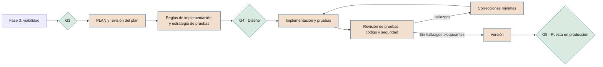

# Construcción de soluciones con IA

**Cómo se gobiernan el diseño, el código y las pruebas generados con asistencia de IA en las fases 4 y 5, y cómo se usa SPAD**

| | |
|---|---|
| Documento | Documento 53 · Construcción de soluciones con IA |
| Versión | 0.1 (borrador de trabajo) |
| Fecha | 16-09-2026 |
| Autor | Fernando García · SEACHAD |
| Estado | Borrador para revisión. Contiene referencias regulatorias consultadas el 16-09-2026. |

<!-- cifras: 2 | fases en las que se aplica (4 y 5) ; 6 | requisitos mínimos para código generado con IA ; 7 | roles de SPAD mapeados ; 0 | aprobaciones que puede dar una IA -->

> Este documento no constituye asesoramiento jurídico. Las cuestiones de propiedad intelectual, licencias y protección de datos deben validarse con asesoría jurídica cualificada.

---

> **Aviso legal y exención de responsabilidad.** SEVEN-G es un marco metodológico de referencia que se ofrece «tal cual» y con fines exclusivamente informativos. No constituye asesoramiento jurídico, regulatorio, financiero ni profesional, ni garantiza el cumplimiento de ninguna norma. Las referencias a regulación general (como el Reglamento Europeo de IA, el RGPD, DORA o NIS2), a normas técnicas y a regulación específica de cada sector o jurisdicción pueden ser incompletas, no aplicar a un caso concreto o quedar desactualizadas por cambios normativos, interpretaciones o criterios de las autoridades posteriores a su fecha de consulta. **Cada organización que use SEVEN-G es la única responsable de identificar la normativa que le aplica, verificar su vigencia y certificar su propio cumplimiento regulatorio**, con el asesoramiento cualificado que corresponda. El autor y SEACHAD no asumen responsabilidad alguna por el uso que se haga de este contenido ni por las decisiones que se adopten con él. Los datos, cifras, compañías y casos de los ejemplos son ficticios o ilustrativos.

## 1. Objeto y alcance

### 1.1 Qué regula

Cada vez más soluciones se **construyen con asistencia de IA**: asistentes de programación, agentes que escriben y ejecutan código, modelos que generan pruebas, configuraciones, consultas o documentación. Esto ocurre tanto si la solución resultante es un sistema de IA como si no lo es.

Este documento fija:

1. Los **requisitos mínimos** que SEVEN-G exige a todo artefacto generado con IA que forme parte de una solución (sección 7).
2. Cómo se usa **SPAD** como método de ingeniería en las fases 4 y 5, y cómo sus fases, roles y política de validación producen evidencias SEVEN-G (secciones 3 a 6).
3. La distinción entre la **IA revisora** (una herramienta) y el **Auditor de IA** (una persona independiente) (sección 5).

### 1.2 Qué no regula

- La gobernanza de la iniciativa, sus *gates* y su valor: los fija el documento 01.
- El uso corporativo de asistentes de IA fuera de proyectos: documento 31.
- La seguridad de agentes en producción: documento 35.
- La evaluación de proveedores de herramientas de IA: documento 36 y P14.

### 1.3 Dos objetos distintos

| Objeto | Qué es | Dónde se gobierna |
|---|---|---|
| **El sistema que se construye** | La solución de la iniciativa (puede ser o no un sistema de IA). | Ciclo de vida 0–7, clasificación regulatoria (documento 34), P15–P23. |
| **Las herramientas de IA que ayudan a construirlo** | Asistentes, agentes y modelos usados por el equipo. | Inventario (T02) como uso corporativo o de equipo; política (documento 31); proveedor (P14); este documento. |

Una herramienta de construcción con capacidad de ejecutar acciones en repositorios, entornos o sistemas es un **agente** y se clasifica en los niveles de autonomía A0–A3 (documento 35). Si actúa sobre sistemas de producción o datos personales en nivel A2 o A3, la iniciativa cumple el criterio Enterprise de 01 §9.2.

---

## 2. Relación entre SEVEN-G y SPAD

### 2.1 Posición de SPAD

**SPAD** (*Structured Prompt-Driven Engineering*) es una **metodología independiente** de ingeniería asistida por IA, referenciada desde SEVEN-G y no integrada en él (decisión D09). No es una marca, un componente ni una "capacidad" de SEVEN-G. SEVEN-G puede aplicarse con SPAD o con otro método de ingeniería que cumpla los requisitos de la sección 7.

| Aspecto | SEVEN-G | SPAD |
|---|---|---|
| Qué gobierna | La iniciativa: valor, riesgo, cumplimiento, decisión. | El trabajo de ingeniería asistido por IA dentro de la construcción. |
| Unidad | Iniciativa (IA-AAAA-NNN) y sistema de IA. | Tema de trabajo (*TOPIC*): funcionalidad, corrección o cambio. |
| Puertas | *Gates* G0–G5, R6, G7 con decisión de un órgano. | Veredictos técnicos por fase (GO, GO con cambios, NO-GO). |
| Quién decide | Personas y órganos con separación de funciones. | El humano orquestador valida; las IA producen y revisan. |
| Evidencia | Plantillas P01–P31 verificadas. | Artefactos por fase agrupados por tema. |

### 2.2 Reglas de uso de SPAD dentro de SEVEN-G

1. Los veredictos de SPAD **no sustituyen** a ningún *gate* ni a la verificación del Auditor de IA.
2. Los artefactos de SPAD **son insumos** de las evidencias SEVEN-G; no son evidencias por sí solos hasta que se referencian en la plantilla correspondiente con autor humano, fecha, versión y verificación (01 §7.2).
3. Algunos materiales de SPAD anteriores a la decisión D09 presentan SPAD como parte de SEVEN-G. Esa relación queda sustituida por la de este documento.
4. Los materiales de SPAD incluyen cifras de mejora (reducción de retrabajo, incidencias o plazos) y expectativas de retorno. **SEVEN-G no las usa ni las avala**, porque no disponen de respaldo verificable; el valor de una iniciativa se mide con las reglas de 00 §6.
5. La certificación interna asociada a SPAD no es una evidencia SEVEN-G ni exime de ningún *gate*.
6. AECF, aplicación de SPAD a una tecnología concreta, tiene la misma consideración de metodología relacionada.

### 2.3 Cuándo usar SPAD

| Situación | Uso de SPAD | Requisitos mínimos (sección 7) |
|---|---|---|
| Iniciativa Enterprise con construcción asistida por IA | **Debería** usarse SPAD u otro método documentado equivalente. | **Debe** cumplirlos. |
| Iniciativa Lite con construcción asistida por IA | **Puede** usarse SPAD, en su versión reducida (sección 4.3). | **Debe** cumplirlos en su versión Lite. |
| Corrección urgente en producción (fase 6) | **Puede** usarse el flujo de corrección urgente de SPAD. | **Debe** cumplirlos, con revisión posterior documentada. |
| Modificación de código heredado | **Debería** aplicarse la documentación previa del código existente. | **Debe** cumplirlos. |
| Prototipo desechable sin datos reales ni acceso a producción | No es necesario. | Solo 7.6 (datos y confidencialidad). |

---

## 3. Dónde encaja SPAD en el ciclo de vida

SPAD se usa principalmente en las **fases 4 (Diseño de la solución) y 5 (Entrega y validación)**, con apoyos puntuales en las fases 3 y 6. La numeración de fases varía entre los documentos de SPAD; este documento usa sus **nombres**.

<!-- grafico: SPAD dentro del ciclo SEVEN-G | Los veredictos técnicos alimentan evidencias; los gates los deciden personas -->

### 3.1 Contextos de SPAD y evidencias SEVEN-G

SPAD exige cargar dos contextos antes de cualquier fase. En SEVEN-G esos contextos **se derivan** de evidencias existentes; no se redactan de nuevo.

| Contexto SPAD | Contenido | Fuente SEVEN-G |
|---|---|---|
| Contexto global | Reglas comunes de artefactos, pruebas, versiones, seguridad y prohibiciones. | Documento 31 (uso aceptable), documento 35 (seguridad), estándares técnicos de la compañía. |
| Contexto del proyecto | Tecnología, arquitectura, reglas de negocio, cumplimiento y excepciones justificadas. | P02 (contexto y restricciones), P11 (clasificación regulatoria), P15 (arquitectura), P17 (supervisión humana), P18 (seguridad). |
| Excepciones al contexto global | Deben justificarse, evaluar su riesgo y ser aprobadas en la revisión del plan. | Además, se registran como riesgo en P12 y, si afectan a un control crítico, requieren conformidad del Responsable de riesgos. |
| Tema de trabajo (*TOPIC*) | Identificador que agrupa los artefactos. | Debe incluir o referenciar el código de la iniciativa (IA-AAAA-NNN) y enlazarse desde T01 (03 §2, principio 4). |

---

## 4. Correspondencia de fases SPAD con evidencias SEVEN-G

### 4.1 Flujo principal

| Fase SPAD | Qué produce | Fase SEVEN-G | Evidencia SEVEN-G (P-código) | Relación con el *gate* |
|---|---|---|---|---|
| Contexto y objetivo | Problema, alcance, restricciones, criterios de éxito. | 3–4 | Se toma de P02, P08 y P10 | Condición de entrada a la fase 4 (G3 superado). |
| PLAN | Arquitectura lógica, componentes, flujos de datos, decisiones explícitas, riesgos. | 4 | P15 (arquitectura y decisiones); P16 (flujos de datos); P12 (riesgos técnicos nuevos) | Insumo de G4. |
| Revisión del plan (AUDIT_PLAN) | Hallazgos y veredicto técnico. | 4 | P66 (anexo de P15); conformidad o condiciones en P29 | Insumo de la verificación de G4; no es la verificación. |
| Reglas de implementación (CODE_PRIMER) | Estructura, convenciones, contratos, antipatrones. | 4 | P66 (anexo de P15) | Insumo de G4. |
| Estrategia de pruebas (TEST_STRATEGY) | Casos, cobertura mínima, capas de prueba, datos de prueba. | 4 | P66 §6 (anexo de P22) | Debe existir antes de G4 en Enterprise. |
| Implementación | Código generado según las reglas. | 5 | P21 (informe de entrega) | — |
| Implementación de pruebas | Pruebas, datos de prueba e instrucciones de ejecución. | 5 | P22 | — |
| Revisión de pruebas (AUDIT_TESTS) | Cobertura real frente a esperada, calidad, casos límite. | 5 | P22 | Insumo de G5. |
| Revisión del código (AUDIT_CODE) | Fidelidad al plan y a las reglas, riesgos técnicos, deuda. | 5 | P21 | Insumo de G5. |
| Correcciones mínimas (FIX_PRIMERS) | Problema, cambio mínimo, justificación, impacto. | 5 | P66 §8 (anexo de P21) | — |
| Gestión de versiones | Número de versión, cambios, incompatibilidades, migración, plan de marcha atrás. | 5 | P21; P19 (plan de reversión); P27 (registro de cambios, desde producción) | Insumo de G5 y de la firma P23. |

### 4.2 Flujos complementarios

| Flujo SPAD | Fase SEVEN-G | Evidencia SEVEN-G | Herramienta |
|---|---|---|---|
| Documentación del código existente y análisis de impacto (código heredado) | 3 (viabilidad) y 4 | P10, P15, P12 | T06 |
| Revisión de seguridad (SECURITY_AUDIT) | 5; también en cambios relevantes en 6 | P18, P22; hallazgos críticos y altos bloquean G5 | T10 |
| Diagnóstico de incidentes (DEBUG) | 6 | P27 (análisis de causa raíz) | T08 |
| Corrección urgente (HOTFIX) y revisión posterior | 6 | P26, P27, P19; plan definitivo como cambio registrado | T08 |

### 4.3 Versión reducida para Lite

En Lite, SEVEN-G admite agrupar en un único artefacto el plan, su revisión, las reglas y la estrategia de pruebas, y en otro la implementación, las pruebas y su revisión, siempre que se mantengan los contenidos obligatorios de la sección 7 y que la revisión humana quede registrada.

### 4.4 Veredictos técnicos y resultados de *gate*

| Veredicto SPAD | Significado técnico | Tratamiento en SEVEN-G |
|---|---|---|
| **GO** | La fase técnica puede continuar. | El equipo puede preparar las evidencias del *gate*. No implica **Continuar**. |
| **GO con cambios** | Deben aplicarse cambios y volver a revisar. | Si persisten cambios pendientes al llegar al *gate*, el órgano puede decidir **Continuar con condiciones** o **Iterar**, nunca por defecto. |
| **NO-GO** | El artefacto no es aceptable. | No se solicita el *gate*. Si se repite, es señal para **Iterar** o **Pivotar** en el *gate* correspondiente. |

---

## 5. Roles: IA revisora frente a Auditor de IA

### 5.1 Correspondencia de roles

| Rol en SPAD | Denominación en SEVEN-G | Naturaleza | Rol humano que responde |
|---|---|---|---|
| Humano orquestador | Orquestador | Persona del equipo | Responsable técnico de IA (o persona del equipo designada por él en P03). |
| IA planificadora (*Planner*) | IA planificadora | Herramienta | Responsable técnico de IA. |
| IA constructora (*Builder*) | IA constructora | Herramienta | Responsable técnico de IA. |
| IA correctora (*Fixer*) | IA correctora | Herramienta | Responsable técnico de IA. |
| IA analista (*Analyst*) | IA analista | Herramienta | Responsable técnico de IA. |
| IA de diagnóstico (*SRE*) | IA de diagnóstico | Herramienta | Responsable de operación de IA. |
| **AI Auditor** e IA auditora de seguridad | **IA revisora** e **IA revisora de seguridad** | Herramienta | Responsable técnico de IA; seguridad de la información en la revisión de seguridad. |

### 5.2 Por qué se renombra el rol

En SEVEN-G, **Auditor de IA** es un rol humano de control (01 §8.1): verifica evidencias en los *gates*, cierra no conformidades, es independiente del equipo que construye y no depende del patrocinador. Llamar "auditor" a una herramienta que trabaja dentro del equipo de construcción induciría a confundir una revisión técnica con una verificación independiente. Por eso, en todos los documentos, plantillas y herramientas de SEVEN-G, el rol *AI Auditor* de SPAD se denomina **IA revisora**.

| Aspecto | IA revisora | Auditor de IA |
|---|---|---|
| Naturaleza | Herramienta de IA configurada para revisar. | Persona (o equipo) de la tercera línea o externa. |
| Pertenece a | La función que **construye**. | La función que **controla**. |
| Qué revisa | Planes, código, pruebas y seguridad dentro de una fase técnica. | Que las evidencias del *gate* existen, son válidas y se elaboraron antes del *gate*. |
| Resultado | Hallazgos y veredicto técnico. | Verificación del *gate*; apertura y cierre de no conformidades. |
| Puede aprobar | Nada. Su salida es un insumo. | No decide el *gate*, pero sin su verificación no hay decisión en Enterprise (01 §7.5). |
| Independencia | Relativa: puede compartir sesgos con la IA que generó el artefacto. | Exigida por 01 §8.2. |
| Responde | El Responsable técnico, que valida su salida. | Ante el órgano competente y la tercera línea. |

La persona que actúe como revisora humana en la certificación interna de SPAD tampoco es, por ese solo hecho, el Auditor de IA de SEVEN-G; solo puede serlo si cumple las incompatibilidades de 01 §8.2.

### 5.3 Separación de funciones aplicada a la IA

1. Una misma configuración de IA **no debe** generar y revisar el mismo artefacto en la misma fase (regla de SPAD que SEVEN-G asume).
2. En Enterprise, la IA revisora **debería** usar un modelo, proveedor o configuración distintos de la IA que generó el artefacto, y registrar cuáles se usaron.
3. **Ninguna IA aprueba.** Toda aceptación de un artefacto la registra una persona identificada.
4. La persona que orquestó la generación de un componente crítico **no debe** ser la única que aprueba su incorporación a la rama principal.
5. El Auditor de IA puede consultar las salidas de la IA revisora, pero **no debe** basar su verificación únicamente en ellas.

---

## 6. Política de validación de SPAD y su encaje en SEVEN-G

SPAD declara inválida, y obliga a descartar y repetir, toda respuesta de IA que incumpla el proceso, aunque su resultado parezca correcto. SEVEN-G asume ese principio, coherente con la validación dual (01 §7.2): **cumplir el proceso es condición para que el resultado cuente**.

| Causa de invalidez en SPAD | Tratamiento en SPAD | Tratamiento adicional en SEVEN-G | Evidencia |
|---|---|---|---|
| Violación de fase (por ejemplo, un plan que incluye código o una revisión que corrige) | Descartar y repetir la fase. | Registro de la incidencia en Enterprise. | P21 |
| Artefactos obligatorios ausentes o alterados | Descartar y repetir. | Sin artefactos completos no se solicita el *gate*. | P21, P22 |
| Decisiones fuera del plan aprobado | Descartar y volver al plan. | Si la decisión afecta a arquitectura, datos, seguridad o supervisión humana, se actualiza P15–P18 antes de G4 o G5. | P15–P18 |
| Implementación sin plan o revisión previa | Descartar el código generado. | Si ese código llega a producción, es **no conformidad mayor**; si afecta a un control crítico, **crítica** (01 §12). | T08 |
| Autoaprobación de la IA | Descarte inmediato; infracción grave. | Toda aprobación sin persona identificada es nula. Si se usó para avanzar un *gate*, no conformidad mayor. | P29, T08 |

**Registro de infracciones.** SPAD lo considera opcional. En SEVEN-G **debería** mantenerse en Enterprise, en P66 §9, anexo de P21, con fecha, tema de trabajo, fase, tipo de infracción, herramienta o modelo y acción. Los patrones repetidos alimentan las lecciones aprendidas (P30) y, si revelan una herramienta inadecuada, la evaluación del proveedor (P14).

---

## 7. Requisitos mínimos de SEVEN-G para código generado con IA

Se aplican a todo código, configuración, consulta, infraestructura como código, prueba o documentación técnica generado total o parcialmente con IA que forme parte de una solución de una iniciativa, con independencia del método de ingeniería.

### 7.1 Revisión humana

- Todo artefacto generado con IA **debe** ser revisado por una persona competente antes de incorporarse a la rama principal o a un entorno compartido.
- La revisión **debe** quedar registrada con revisor identificado, fecha y resultado (por ejemplo, en la herramienta de control de versiones).
- Los componentes críticos (autenticación, autorización, datos personales, pagos, controles de supervisión humana, límites de actuación de agentes, cálculo de decisiones sobre personas) **deben** tener una segunda revisión humana en Enterprise.
- La revisión automatizada, incluida la de la IA revisora, **no sustituye** a la humana.

### 7.2 Trazabilidad

- **Debe** poder identificarse qué partes de la solución se generaron con IA, con qué herramienta y en qué tema de trabajo o iniciativa (por ejemplo, mediante metadatos en los cambios o en el informe de entrega).
- Las decisiones de diseño **deben** constar en P15, no solo en conversaciones con la herramienta.
- En Enterprise, **deberían** conservarse las instrucciones relevantes y las salidas aceptadas de las fases de plan y revisión, con la política de conservación de la compañía y sin datos personales innecesarios.
- La versión de cada entrega **debe** vincularse a su plan de reversión (P19).

### 7.3 Pruebas

- La estrategia de pruebas **debe** definirse antes de implementar, con cobertura mínima y casos críticos.
- Las pruebas generadas con IA **deben** revisarse para comprobar que verifican el comportamiento esperado y no solo reproducen el código generado.
- Si la solución es un sistema de IA, las pruebas **deben** incluir las de rendimiento, sesgo, robustez y seguridad exigidas en la fase 5 (01 §6.7), incluidas pruebas de inyección de instrucciones en IA generativa y agentes.
- Los resultados **deben** constar en P22 antes de G5.

### 7.4 Seguridad

- Análisis estático de seguridad, detección de secretos y análisis de dependencias **deben** ejecutarse sobre el código generado antes de G5; en Enterprise, en cada cambio.
- Las dependencias propuestas por la IA **deben** verificarse (existencia, procedencia, mantenimiento y vulnerabilidades conocidas) antes de incorporarse, dado el riesgo de paquetes inexistentes o maliciosos sugeridos por la herramienta.
- **Debería** generarse una relación de componentes de software de la solución (P54) en Enterprise.
- Los agentes de construcción **deben** operar con mínimo privilegio, sin credenciales de producción y con registro de sus acciones; su autonomía se clasifica con A0–A3 y se evalúa con T10 (documento 35).
- Como referencias técnicas pueden usarse las listas OWASP Top 10 y OWASP Top 10 para aplicaciones con modelos de lenguaje.
- Los hallazgos críticos y altos **bloquean** G5 salvo aceptación formal del riesgo según 33 y 01 §7.3 (no se admite "Continuar con condiciones" en controles críticos de seguridad).

### 7.5 Propiedad intelectual y licencias

- La herramienta de IA **debe** estar aprobada por la compañía, con condiciones contractuales revisadas sobre titularidad y uso de las salidas, uso de los datos de entrada para entrenamiento y, en su caso, garantías o indemnidades (P14, documento 36).
- **Deberían** activarse, cuando la herramienta los ofrezca, los filtros o avisos de coincidencia con código público, y revisarse las coincidencias señaladas.
- Las licencias de las dependencias y de los fragmentos identificados como procedentes de terceros **deben** comprobarse frente a la política de licencias de la compañía.
- La protección por derechos de autor de contenido generado con escasa intervención creativa humana puede ser limitada o incierta según la jurisdicción. Cuando la titularidad del código sea relevante para el negocio (por ejemplo, producto comercializable), **debe** obtenerse criterio de asesoría jurídica y documentarse en P15 o P21.

### 7.6 Datos y confidencialidad

- **No deben** introducirse datos personales, secretos, credenciales ni información confidencial en herramientas no aprobadas para ese nivel de información (documento 31).
- Los datos de prueba **deberían** ser sintéticos o anonimizados; si se usan datos personales, se aplican la base jurídica y las medidas de P11 y P16.
- La configuración de la herramienta respecto a retención y uso de datos **debe** verificarse antes de su uso en la iniciativa.

### 7.7 Intensidad

| Requisito | Lite | Enterprise |
|---|---|---|
| Revisión humana (7.1) | Una revisión registrada | Una revisión; doble en componentes críticos |
| Trazabilidad (7.2) | Identificación de herramienta y alcance en P21 | Además, instrucciones y salidas clave conservadas; registro de infracciones |
| Pruebas (7.3) | Estrategia simplificada y resultados en P22 | Estrategia completa antes de G4; revisión de pruebas |
| Seguridad (7.4) | Análisis estático, secretos y dependencias antes de G5 | En cada cambio; relación de componentes; revisión de seguridad; T10 para agentes |
| Propiedad intelectual (7.5) | Herramienta aprobada; licencias de dependencias | Además, filtros de coincidencia y criterio jurídico cuando proceda |
| Datos (7.6) | Obligatorio | Obligatorio |
| Método | SPAD opcional | SPAD u otro método documentado equivalente recomendado |

### 7.8 Relación con la regulación

- Las evidencias de construcción apoyan la **documentación técnica** (art. 11 y anexo IV), el **sistema de gestión de la calidad** (art. 17) y la **ciberseguridad** (art. 15) de los proveedores de sistemas de alto riesgo del Reglamento Europeo de IA (documento 34, secciones 3.7 y 3.8).
- Las herramientas de ayuda a la programación no son, en general, sistemas de alto riesgo por su uso previsto, pero deben inventariarse y cumplir la política de uso (documento 31). Su clasificación concreta se confirma con T07.
- Si la compañía fabrica productos con elementos digitales, debe valorarse el Reglamento (UE) 2024/2847 de ciberresiliencia, con obligaciones de notificación desde el 11-09-2026 y obligaciones principales desde el 11-12-2027 (verificar aplicabilidad; documento 35).
- Para entidades sujetas a DORA, el desarrollo y los cambios de sistemas TIC se integran en su marco de gestión del riesgo TIC (documento 34, sección 7.1).

---

## 8. Verificación en los *gates*

Los criterios formales se incorporarán al documento 21. Mientras tanto, el verificador debería comprobar:

| *Gate* | Qué se comprueba sobre la construcción con IA |
|---|---|
| **G4 · Diseño** | Herramientas de IA de construcción identificadas y aprobadas; autonomía de agentes de construcción clasificada; plan y reglas de implementación reflejados en P15; estrategia de pruebas definida; excepciones al contexto global registradas como riesgo. |
| **G5 · Puesta en producción** | Revisión humana registrada; trazabilidad de lo generado con IA; resultados de pruebas y de seguridad en P22 sin hallazgos críticos o altos abiertos; licencias comprobadas; versión vinculada a plan de reversión probado; registro de infracciones revisado en Enterprise. |
| **R6 · Continuidad** | Cambios posteriores generados con IA registrados en P27 con los mismos requisitos; correcciones urgentes con revisión posterior cerrada. |

---

## 9. Herramientas y plantillas asociadas

| Código | Uso en este documento |
|---|---|
| T01 · Registro de iniciativas | Enlace de los artefactos del tema de trabajo a la iniciativa. |
| T02 · Inventario de sistemas de IA | Alta de las herramientas de construcción con IA. |
| T03 · Gestor de *gates* | Verificación en G4, G5 y R6. |
| T06 · Matriz y registro de riesgos | Riesgos técnicos y excepciones al contexto global. |
| T08 · Registro de no conformidades e incidentes | Implementación sin revisión, autoaprobación, correcciones urgentes. |
| T09 · Registro de proveedores de IA | Condiciones de las herramientas de construcción. |
| T10 · Evaluación de seguridad de agentes | Agentes de construcción y revisión de seguridad. |
| P03 | Designación del orquestador y del revisor humano. |
| P12 · P14 · P15 · P16 · P18 | Riesgos · proveedor de la herramienta · plan, reglas y decisiones · flujos de datos · seguridad. |
| P19 · P21 · P22 · P23 | Reversión · informe de entrega · pruebas y revisiones · firma de puesta en producción. |
| P26 · P27 · P29 · P30 | Incidentes · cambios y causa raíz · decisión de *gate* · lecciones aprendidas. |
| P54 · P66 | Relación de componentes de software · anexos de construcción con SPAD: revisión del plan, reglas de implementación, estrategia de pruebas y registros de correcciones y de infracciones (anexos de P15, P21 y P22). |

---

## 10. Documentos relacionados

| Documento | Relación |
|---|---|
| **01 · Metodología fundacional** | Fases 4 y 5, validación dual, roles e incompatibilidades. |
| **20 · Manuales de fase** | Actividades detalladas de las fases 4 y 5. |
| **21 · Criterios de *gate*** | Incorporará los criterios de la sección 8. |
| **30 · Modelo de gobierno** | Rol del Auditor de IA y separación de funciones. |
| **31 · Política corporativa y uso aceptable** | Herramientas aprobadas y datos permitidos. |
| **34 · Mapeo regulatorio** | Documentación técnica, calidad y ciberseguridad exigidas por la regulación. |
| **35 · Seguridad de IA y agentes** | Autonomía A0–A3 y controles de agentes de construcción. |
| **36 · Terceros y proveedores de IA** | Contratos de herramientas de IA. |
| **37 · No conformidades e incidentes** | Tratamiento de infracciones graves. |
| **SPAD** (metodología relacionada) | Método de ingeniería asistida por IA referenciado en este documento. |

---

## 11. Control de versiones

| Versión | Fecha | Cambios |
|---|---|---|
| 0.1 | 16-09-2026 | Primera versión. Define la relación con SPAD como metodología independiente (D09), la correspondencia de fases, roles y política de validación con evidencias SEVEN-G, el cambio de denominación del rol *AI Auditor* de SPAD a **IA revisora** y los requisitos mínimos para artefactos generados con IA. |
