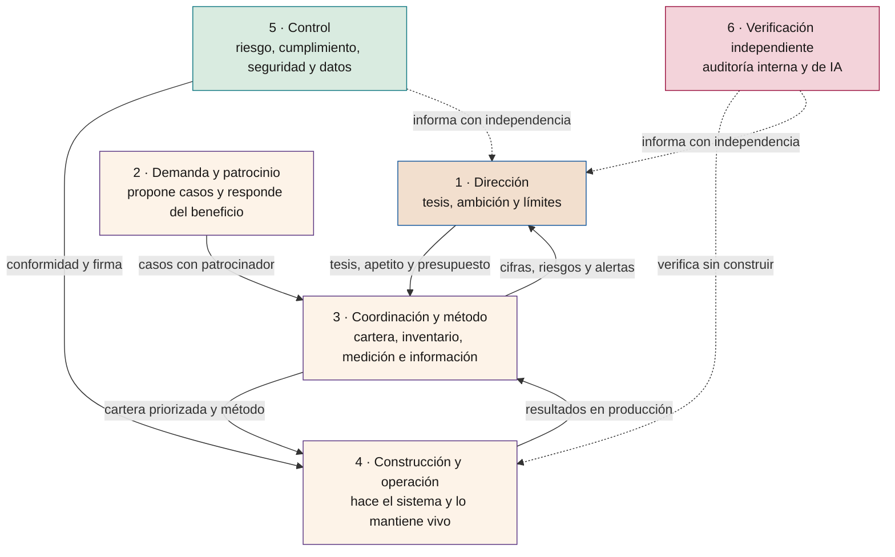
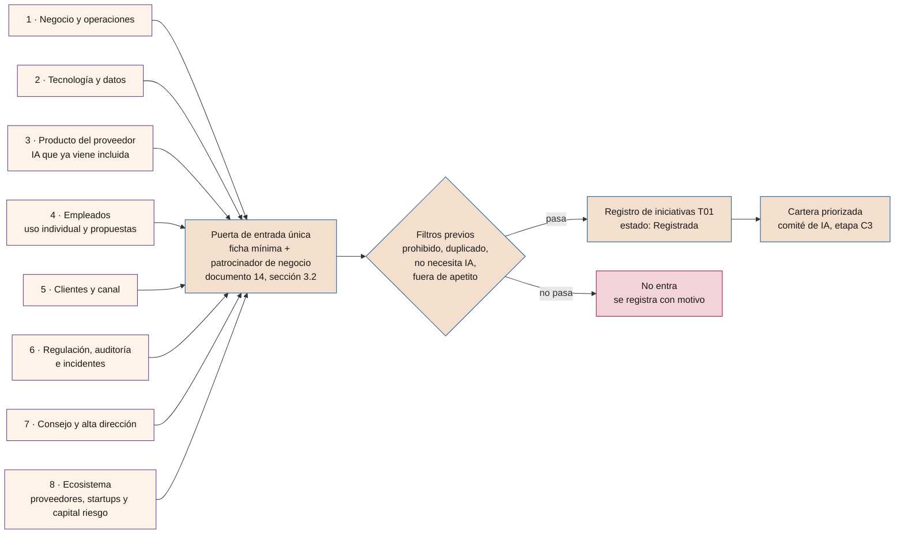
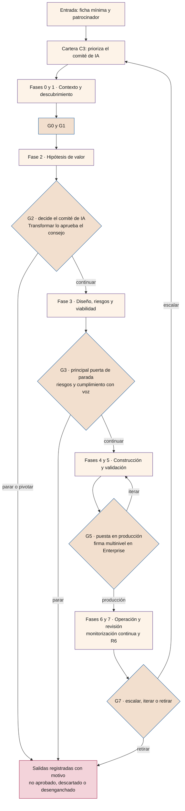
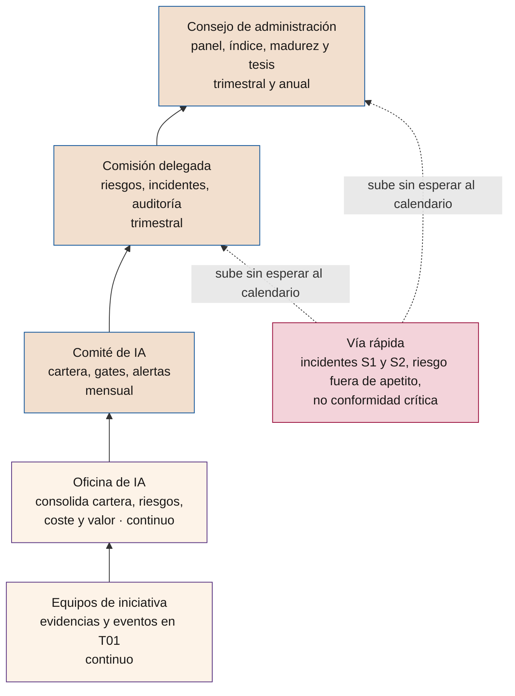

# Cómo se organiza una compañía para la IA

**Quién hace qué en las organizaciones reales, dónde debe colgar el gobierno de la IA, de dónde nacen los casos de uso, cómo se gobiernan hasta producción y cómo llega la información al consejo; y qué organización se anticipa cuando la IA esté implantada**

| | |
|---|---|
| Documento | Documento 54 · Organización de la compañía para la IA |
| Versión | 0.1 (borrador de trabajo) |
| Fecha | 22-09-2026 |
| Autor | Fernando García Varela |
| Estado | Borrador para revisión. Documento explicativo y de orientación: no añade reglas al marco. |

<!-- cifras: 6 | funciones que alguien tiene que ejercer ; 4 | patrones de organización observados ; 8 | fuentes de las que nacen los casos de uso ; 4 | escenarios de organización a cinco años -->

---

> **Aviso legal y exención de responsabilidad.** SEVEN-G es un marco metodológico de referencia que se ofrece «tal cual» y con fines exclusivamente informativos. No constituye asesoramiento jurídico, regulatorio, financiero ni profesional, ni garantiza el cumplimiento de ninguna norma. Las referencias a regulación general (como el Reglamento Europeo de IA, el RGPD, DORA o NIS2), a normas técnicas y a regulación específica de cada sector o jurisdicción pueden ser incompletas, no aplicar a un caso concreto o quedar desactualizadas por cambios normativos, interpretaciones o criterios de las autoridades posteriores a su fecha de consulta. **Cada organización que use SEVEN-G es la única responsable de identificar la normativa que le aplica, verificar su vigencia y certificar su propio cumplimiento regulatorio**, con el asesoramiento cualificado que corresponda. El autor no asume responsabilidad alguna por el uso que se haga de este contenido ni por las decisiones que se adopten con él. Los datos, cifras, compañías y casos de los ejemplos son ficticios o ilustrativos.

<!-- esencial: consulta | Documento explicativo. Sirve para situar el marco en el organigrama real de una compañía: qué funciones tiene que ejercer alguien, qué cargos suelen asumirlas hoy, dónde conviene colgar el gobierno de la IA, de dónde vienen los casos de uso y cómo se gobiernan y se informan hasta el consejo. La sección 8 es prospectiva y está marcada como hipótesis del autor. No crea reglas ni evidencias: si discrepa de los documentos 01, 14, 30 o 60, prevalecen estos. -->

## 1. Objeto y alcance

### 1.1 Qué responde este documento

Cuando una compañía decide usar la IA en serio aparece siempre la misma conversación: *¿de quién depende esto?* Sistemas tiene su dirección, seguridad la suya, datos la suya; hay una dirección de transformación, a veces una dirección de IA, y el consejo pide información que nadie sabe muy bien quién debe preparar. Este documento ordena esa conversación en cinco preguntas:

1. ¿Qué **funciones** tiene que ejercer alguien, se llame como se llame en el organigrama? (sección 2)
2. ¿Qué se ve **hoy en el mercado** y qué patrones de organización funcionan y cuáles fallan? (sección 3)
3. ¿Dónde debe colgar el **gobierno de la IA**: de la dirección de IA, de transformación, de riesgos, del consejo? (sección 3.4)
4. ¿De dónde vienen los **casos de uso**, cómo se gobiernan y cómo se **informa al consejo**? (secciones 5, 6 y 7)
5. ¿Qué organización viene después, cuando la IA esté implantada y los **silos funcionales** dejen de ser la forma natural de dividir el trabajo? (sección 8)

### 1.2 Qué no es

- **No es un organigrama obligatorio.** SEVEN-G no exige crear ninguna dirección nueva. Exige que las funciones de la sección 2 tengan nombre y titular, y que las que deben estar separadas lo estén (documento 01, sección 8.2; documento 30, sección 5).
- **No sustituye al documento 30**, que define los órganos, sus mandatos, la matriz de delegación y el escalado. Aquí se explica cómo encajan esos órganos en un organigrama que ya existe.
- **No es un estudio de mercado.** Lo que la sección 3 describe son patrones observados en la práctica profesional del autor, expresados de forma cualitativa. No lleva porcentajes ni cuotas porque no procederían de una fuente verificable (documento 04, sección 6).
- **La sección 8 es una hipótesis razonada**, no una previsión. Se marca como tal y se acompaña de las señales que permitirían comprobar si se cumple.

> **Por qué importa.** La mayoría de los bloqueos que se atribuyen a la tecnología son en realidad de asignación: dos áreas creen tener la misma competencia, o ninguna la tiene. Un marco de gobierno que no se traduce al organigrama real se queda en documento.

---

## 2. Las seis funciones que alguien tiene que ejercer

Con independencia del tamaño, del sector y de los cargos existentes, la IA obliga a que **seis funciones** tengan titular. Pueden concentrarse en pocas personas (en una compañía pequeña, una persona puede ejercer tres), pero ninguna puede quedar vacía y dos parejas no pueden recaer en el mismo titular.

<!-- grafico: Las seis funciones de la IA en una compañía | Quién fija la dirección, quién propone, quién coordina, quién construye, quién controla y quién verifica -->

| # | Función | Qué decide o firma | Quién suele ejercerla | Dónde está en SEVEN-G |
|---|---|---|---|---|
| 1 | **Dirección** | Tesis de IA, ambición por esfera, apetito de riesgo, presupuesto marco, aprobación de las apuestas de Transformar. | Consejo y alta dirección. | documento 13; documento 30, sección 3.1 |
| 2 | **Demanda y patrocinio** | Qué problema se resuelve, quién responde del beneficio y quién asume el cambio en su área. | Direcciones de negocio y de operaciones. | documento 01, sección 8; documento 43 |
| 3 | **Coordinación y método** | Cartera, inventario, aplicación del método, medición homogénea, preparación de la información a los órganos. | Oficina de IA (o la función que haga sus veces). | documento 30, sección 3.4; documento 14 |
| 4 | **Construcción y operación** | Arquitectura, datos, desarrollo, proveedores, puesta en producción y operación continuada. | Tecnología, datos y las áreas que operan el sistema. | documento 52; documento 53; documento 51 |
| 5 | **Control** | Evaluación de riesgos, conformidad regulatoria, seguridad, protección de datos y firma de la puesta en producción Enterprise. | Riesgos, cumplimiento, seguridad y protección de datos (segunda línea). | documento 30, sección 9; documento 33; documento 35 |
| 6 | **Verificación independiente** | Verificación de que el marco se cumple y de que las evidencias son reales. | Auditoría interna y auditores de IA (tercera línea). | documento 38 |

**Las tres separaciones que no se negocian** (documento 01, sección 8.2, y documento 30, sección 5):

- quien **construye** no verifica su propia evidencia;
- quien **propone y patrocina** no firma la conformidad de riesgo o de cumplimiento;
- quien **audita** no participa en la construcción ni en la decisión de *gate*.

> **Por qué importa.** Casi todas las organizaciones que «no consiguen pasar de los pilotos» tienen las funciones 1, 2 y 4 bien cubiertas y las 3, 5 y 6 sin titular. Sin coordinación no hay cartera; sin control no hay puesta en producción defendible; sin verificación, las cifras de valor no resisten una pregunta del consejo.

---

## 3. Lo que suele verse en el mercado

Esta sección describe **patrones observados** en la práctica. No es un estudio con muestra ni una estadística: es una ordenación cualitativa, útil para situarse y para que cada compañía reconozca su caso. Cuando se citan obligaciones regulatorias, se remite a la fuente oficial y al documento 34.

### 3.1 Qué trozo de IA se queda cada cargo existente

| Cargo habitual | Qué parte de la IA suele asumir | Dónde suele quedarse corto |
|---|---|---|
| **Dirección de sistemas o de tecnología** (CIO, CTO) | Plataformas, modelos, integración, seguridad técnica, proveedores, coste de infraestructura. Es quien más rápido puede construir. | La hipótesis de valor y la adopción: entrega sistemas que funcionan y nadie usa; mide actividad, no beneficio. |
| **Dirección de seguridad** (CISO, CSO) | Seguridad del modelo y del dato, identidades, accesos, ataques con IA y contra la IA, incidentes. | Se incorpora tarde, cuando la solución ya está elegida; sin criterios previos solo puede vetar. |
| **Dirección de datos** (CDO) | Calidad, linaje, permisos de uso, gobierno del dato, a veces analítica avanzada. | Confunde el gobierno del dato con el gobierno de la IA: son distintos y complementarios (documento 51). |
| **Dirección de transformación o de digital** | Cartera de iniciativas, gestión del cambio, relación con el negocio, medición de beneficios. | Rara vez tiene autoridad sobre tecnología ni sobre control; depende de convencer. |
| **Dirección de IA** (CAIO), cuando existe | Estrategia de IA, oficina de IA, casos de uso, relación con proveedores de modelos. | Si además construye y además controla, rompe la separación de funciones; si no tiene presupuesto, es un rol de evangelización. |
| **Dirección financiera** (CFO) | Presupuesto, inversión, medición del retorno, control de gestión, coste recurrente. | Aplica criterios de retorno de proyecto a apuestas de transformación y las bloquea (documento 14, sección 4.4). |
| **Asesoría jurídica, cumplimiento y protección de datos** | Clasificación regulatoria, evaluaciones de impacto, contratos con proveedores, transparencia. | Llega a la última fase; sin clasificación temprana, el rediseño es caro (documento 32). |
| **Dirección de personas** | Alfabetización, efecto sobre el trabajo, relaciones laborales, uso de IA en decisiones sobre personas. | Trata la IA como formación y no como rediseño del trabajo (documento 50). |
| **Operaciones y unidades de negocio** | El problema, el proceso, los datos reales, la adopción y el beneficio. | Proponen soluciones ya elegidas («queremos un copiloto») en lugar de problemas medibles. |
| **Auditoría interna** | Verificación del marco, planes anuales, seguimiento de recomendaciones. | Sin criterios publicados, audita percepciones; necesita que el marco exista antes (documento 38). |

### 3.2 Cuatro patrones de organización

| Patrón | Cómo se reconoce | Funciona cuando | Falla cuando |
|---|---|---|---|
| **A · Tecnología lidera** | La IA es un programa de la dirección de sistemas; el negocio aporta casos y valida. | La madurez técnica es baja y hay que construir la base: plataforma, datos, seguridad. | Se mide en modelos desplegados; el beneficio no tiene dueño y la adopción no ocurre. |
| **B · Transformación lidera** | La IA es una línea de la agenda de transformación, con cartera y gestión del cambio. | Hay una cartera transversal y el problema principal es priorizar y hacer que se adopte. | No hay autoridad técnica ni de control: la cartera avanza en papel y se atasca en producción. |
| **C · Oficina de IA, con o sin dirección de IA** | Existe una función central de método, inventario, medición y apoyo; el negocio patrocina y tecnología construye. | Hay suficientes iniciativas para que el método rinda y la función central tiene presupuesto y acceso a los órganos. | La oficina también construye y también controla: se queda sin independencia y se convierte en un cuello de botella. |
| **D · Federado de hecho** | Cada área compra y prueba por su cuenta; hay decenas de usos y ningún inventario. | Nunca de forma estable; sirve para descubrir demanda real durante unos meses. | Aparece el primer incidente, la primera auditoría o la primera factura de consumo: nadie sabe cuántos sistemas hay ni qué datos tocan. |

En la práctica, la mayoría de las compañías se reconocen en una mezcla: un patrón oficial y el patrón D como realidad de fondo. El primer trabajo de implantación suele ser **hacer visible lo que ya existe** (censo e inventario, documento 32 y documento 14, sección 11) antes de decidir estructura.

### 3.3 ¿Hace falta una dirección de IA?

Cuatro preguntas ayudan a decidirlo mejor que el debate sobre la moda del cargo:

1. ¿Hay **más iniciativas de las que un comité puede seguir** una vez al mes sin perder el detalle?
2. ¿Hay **más de una unidad** que compite por la misma capacidad técnica o por el mismo presupuesto?
3. ¿La compañía tiene o tendrá **sistemas de alto riesgo, agentes con autonomía o exposición directa** a clientes?
4. ¿Alguien puede hoy responder en una semana **cuántos sistemas de IA hay, qué datos usan y cuánto cuestan**?

Con dos o más respuestas incómodas, la función central (patrón C) se paga sola. Que se llame dirección de IA, oficina de IA o coordinación de IA es menos importante que tres condiciones:

- **presupuesto propio** para descubrimiento y método, aunque sea pequeño;
- **acceso directo** al comité de dirección y al órgano del consejo que supervisa la IA;
- **no ser quien construye** los sistemas cuya evidencia después verifica.

Una dirección de IA fracasa, casi siempre, de una de estas tres formas: se convierte en una fábrica de pilotos sin dueño de beneficio; se convierte en un comité de aprobación sin capacidad de ejecutar; o acumula las funciones 3, 4 y 5 de la sección 2 y deja a la compañía sin control independiente.

### 3.4 Dónde debe colgar el gobierno de la IA

Es la pregunta más frecuente y tiene una respuesta de principio: **el gobierno no puede depender de quien ejecuta**. La función 5 (control) y la función 6 (verificación) informan al consejo o a su comisión delegada, no al responsable de la cartera. Dicho eso, hay tres ubicaciones razonables y una que no lo es.

| Opción | En qué consiste | Ventaja | Riesgo | Condición para que funcione |
|---|---|---|---|---|
| **1 · Gobierno en la segunda línea** (riesgos o cumplimiento), con secretaría técnica en la oficina de IA | La política, el apetito y la conformidad viven en riesgos; el método y el inventario, en la oficina de IA. | Independencia clara; encaja con el modelo de tres líneas y con la supervisión del consejo. | Distancia con el negocio: el control llega tarde si no se integra en las fases. | Riesgos participa desde la fase 0, no en la puerta final. |
| **2 · Gobierno en la dirección de IA, con conformidad separada** | La dirección de IA lleva método, cartera e inventario; la firma de riesgo y cumplimiento la mantiene la segunda línea. | Un solo interlocutor para el negocio; rapidez. | Concentración: si además construye, se pierde la separación. | La dirección de IA no construye los sistemas o, si lo hace, no verifica su evidencia. |
| **3 · Comité de IA como órgano de gobierno**, sin dirección específica | Un comité con dirección, tecnología, riesgos, datos y personas decide; la secretaría la lleva quien coordine. | Barato y suficiente en compañías medianas; reparte la responsabilidad. | Sin secretaría con dedicación, el comité no prepara ni sigue nada. | Alguien tiene dedicación real a preparar decisiones y a seguir acuerdos. |
| **4 · Gobierno dentro de la dirección que construye** | La misma área propone, construye, aprueba y declara el valor. | Ninguna que resista una revisión. | Juez y parte: la evidencia no es defendible ante auditoría ni ante el consejo. | No es una opción aceptable en SEVEN-G. |

En las tres primeras opciones, el consejo conserva lo que no puede delegar: aprobar la tesis y el apetito de riesgo, aprobar las apuestas de Transformar y supervisar los resultados (documento 30, sección 3.1). La regulación refuerza esta idea en los sectores donde ya existe una responsabilidad expresa del órgano de administración sobre riesgos tecnológicos y de resiliencia, como en el Reglamento (UE) 2022/2554 (DORA) o en la Directiva (UE) 2022/2555 (NIS2), y en las expectativas supervisoras sobre gobierno de la IA, como el Dictamen de EIOPA sobre gobierno y gestión del riesgo de la IA (documento 34).

> **Por qué importa.** La ubicación del gobierno determina qué ocurre el día que una iniciativa importante no supera una puerta. Si el que decide parar depende del que tiene que entregar, no se para nunca.

### 3.5 Seis señales de que la organización está mal montada

1. Nadie puede decir en una semana cuántos sistemas de IA hay en producción.
2. Las cifras de ahorro que se presentan al comité no las ha comprobado nadie fuera del equipo que las produce.
3. La segunda línea solo aparece al final, y entonces solo puede aprobar o vetar.
4. Ninguna iniciativa se ha parado nunca por criterio; solo por falta de presupuesto o de gente.
5. El consejo ve demostraciones de producto y no ve cartera, riesgos ni valor validado.
6. La misma persona propone, aprueba y declara el beneficio.

---

## 4. Del organigrama real a los órganos de SEVEN-G

SEVEN-G no pide cambiar el organigrama: pide **asignar** sus órganos y roles a personas que ya existen y dejarlo escrito (P38, con el reglamento de los órganos y el nombramiento del responsable de IA).

| Órgano o rol de SEVEN-G | Quién lo ejerce normalmente | Qué se necesita para que valga |
|---|---|---|
| **Consejo de administración** | El propio consejo, con un punto monográfico anual y un punto trimestral. | Que reciba el paquete del documento 60, no una demostración. |
| **Comisión delegada** | Comisión de auditoría, de riesgos o de tecnología, la que ya exista. | Mandato escrito que incluya la IA (P38). |
| **Comité de IA** | Comité de dirección ampliado, o un comité propio con negocio, tecnología, riesgos, datos y personas. | Periodicidad mensual y capacidad real de decidir *gates* y retiradas. |
| **Oficina de IA** | Transformación, tecnología, la dirección de IA o control de gestión, según la compañía. | Dedicación, método y acceso a los órganos; no construir lo que verifica. |
| **Patrocinador de negocio** | Director de la unidad que se beneficia. | Responde del beneficio en la revisión de realización (documento 43). |
| **Responsable de producto** | Mando de la unidad usuaria o gestor de producto. | Autoridad sobre el alcance y sobre la adopción. |
| **Responsable técnico** | Tecnología, datos o el proveedor, con un interlocutor interno. | Nunca es también el verificador. |
| **Responsable de riesgos y de conformidad** | Riesgos, cumplimiento, seguridad y protección de datos. | Participa desde la fase 0 y firma en G5 en Enterprise. |
| **Auditor de IA** | Auditoría interna, con apoyo externo si hace falta. | Independencia declarada (P41). |
| **Supervisor humano designado** | Persona del área usuaria que valida o interrumpe el sistema. | Competencia, formación y **autoridad real para discrepar** (documento 50, sección 4.2). |

En compañías pequeñas, el documento 30, sección 11, y el documento 90, sección 2.4, explican cómo agrupar órganos sin perder las separaciones obligatorias.

---

## 5. De dónde vienen los casos de uso

### 5.1 Ocho fuentes

La demanda de IA no nace en un solo sitio. Reconocer la fuente ayuda a anticipar su sesgo y a pedir lo que le falta antes de que entre en la cartera.

| # | Fuente | Qué suele traer | Sesgo típico | Qué le falta casi siempre |
|---|---|---|---|---|
| 1 | **Unidades de negocio y operaciones** | Problemas reales, con proceso y datos propios. | Trae la solución ya elegida, no el problema. | Línea base y método de atribución (documento 40). |
| 2 | **Tecnología y datos** | Capacidades nuevas que ahora son posibles y baratas. | Busca dónde aplicar lo que ya sabe hacer. | Patrocinador de negocio que responda del beneficio. |
| 3 | **El mercado de producto** | Funciones de IA que aparecen dentro del software que la compañía ya usa. | Se activan solas, sin decisión ni inventario. | Alta en inventario, clasificación regulatoria y decisión consciente de activarlas. |
| 4 | **Empleados** | Uso individual de herramientas generales; los mejores casos pequeños salen de aquí. | Ocurre fuera de control (uso no autorizado). | Canal de propuesta, política de uso aceptable y alfabetización (documento 31). |
| 5 | **Clientes y canal** | Peticiones explícitas y fricciones observadas. | Se confunde una petición puntual con demanda agregada. | Tamaño del segmento y disposición a pagar. |
| 6 | **Regulación, auditoría e incidentes** | Obligaciones, hallazgos y no conformidades que exigen cambios. | Se tratan como coste y se hacen con mínimos. | Encaje con la cartera; a veces habilitan valor, no solo control. |
| 7 | **Consejo y alta dirección** | Retos de ambición, comparaciones con el sector, operaciones corporativas. | Llegan con nombre de tecnología y sin problema definido. | Traducción a hipótesis falsable y a esfera y ambición (documento 10). |
| 8 | **Ecosistema de innovación** | Propuestas de proveedores, startups, capital riesgo, universidades y programas de innovación. | Prueba de concepto gratuita sin dueño interno ni coste de salida. | Patrocinador interno, datos que se pueden ceder y plan de salida (documento 36). |

<!-- grafico: De dónde vienen los casos de uso y por dónde entran | Ocho fuentes, una sola puerta de entrada al registro y a la cartera -->

### 5.2 La puerta de entrada es una sola

Venga de donde venga, una iniciativa entra por el mismo sitio: la **ficha mínima de entrada** del documento 14, sección 3.2 (descripción comprensible, patrocinador y responsable de producto, esfera y ambición propuestas, orden de magnitud del valor, inversión hasta G3, encaje con la tesis y criterios Enterprise previsibles), los **filtros previos** de la sección 3.3 y las **ventanas de entrada** de la sección 3.4. Lo que no entra se registra con su motivo: un «no» sin registro se vuelve a proponer tres meses después.

**Regla del patrocinador.** Toda iniciativa necesita un patrocinador de negocio. Una propuesta de un proveedor, del ecosistema o del área técnica **sin patrocinador interno no entra**, por buena que parezca.

### 5.3 Las tres fuentes que más problemas dan

| Fuente | Problema | Cómo se trata |
|---|---|---|
| **La IA que ya viene incluida** en un producto contratado | Se activa por defecto, sin decisión, sin inventario y a veces con datos que no deberían salir del perímetro. | Revisión periódica de novedades de los proveedores; alta en inventario y clasificación antes de activar; cláusulas del documento 36. Es una decisión, no una actualización. |
| **Uso no autorizado** (IA en la sombra) | Ocurre igualmente; prohibirlo sin alternativa lo esconde. | Alternativa corporativa utilizable, política de uso aceptable y canal de amnistía para aflorar usos: regularización del documento 14, sección 11, y documento 31. |
| **La prueba de concepto regalada** | Sin coste aparente, consume datos, tiempo y credibilidad, y crea dependencia. | Patrocinador, criterios de éxito y de parada por escrito antes de empezar, datos acotados y coste de salida estimado desde el primer día. |

> **Por qué importa.** Las tres fuentes anteriores comparten una característica: **entran sin pasar por la puerta**. La mayor parte del riesgo regulatorio y de seguridad de una compañía no está en las iniciativas de su cartera, sino en lo que nunca llegó a ella.

---

## 6. Cómo se gobierna lo que ha entrado

El recorrido es el del marco: la cartera se gestiona como un embudo y cada iniciativa atraviesa fases con puertas de decisión. Lo que aquí se añade es **quién decide en cada punto** y con qué grado de delegación.

<!-- grafico: Circuito de gobierno de una iniciativa | De la propuesta a la operación, con quién decide en cada puerta -->

| Decisión | Quién decide (referencia) | Qué no puede delegarse |
|---|---|---|
| Entrada y prioridad en la cartera | Comité de IA, en su revisión mensual (documento 14, sección 7.1). | — |
| *Gates* de iniciativas Lite | Según la matriz de delegación del documento 30, sección 7. | La verificación la hace alguien distinto de quien construye. |
| *Gates* de iniciativas Enterprise | Comité de IA, con la segunda línea presente. | La conformidad de riesgo y cumplimiento. |
| Aprobación de Transformar en G2 y del escalado en G7 | Consejo (documento 30, sección 3.1). | No se delega. |
| Aceptación de riesgo residual | El órgano que corresponde al nivel del riesgo (documento 33). | Nunca quien construye la iniciativa. |
| Puesta en producción Enterprise | Firma multinivel en G5, con la segunda línea. | La firma de control. |
| Parada, pivote y retirada | Comité de IA; el consejo en las de Transformar (documento 14, sección 10). | El motivo se registra siempre. |
| Excepciones a la política | Órgano previsto en P40, con caducidad. | Una excepción sin fecha de fin no es una excepción. |

**El papel de la oficina de IA** en este circuito es el de motor, no el de decisor: prepara las decisiones, comprueba que la evidencia existe antes de convocar la puerta, mantiene el registro y avisa de lo que se ha quedado atascado (iniciativas estancadas, condiciones vencidas, documento 14, sección 8).

---

## 7. Cómo se monitoriza y cómo llega la información al consejo

### 7.1 La cadena de información

Cada nivel recibe menos detalle y más consecuencia. Lo que no cambia en ningún nivel es el **estado de cada cifra**: validada, declarada o estimada (documento 40).

<!-- grafico: Cómo llega al consejo la información de la IA | Qué ve cada nivel, con qué frecuencia y con qué herramienta -->

### 7.2 Qué ve cada nivel

| Nivel | Qué recibe | Cada cuánto | Con qué |
|---|---|---|---|
| **Equipo de iniciativa** | Sus evidencias, criterios de la puerta siguiente, riesgos abiertos y cifras propias. | Continuo | T01, T03, T06 |
| **Oficina de IA** | Cartera completa, tiempos por fase, evidencias que faltan, coste y consumo, alertas. | Continuo | T01, T11, T13 |
| **Comité de IA** | Cartera priorizada, decisiones de puerta pendientes, iniciativas estancadas, riesgos Altos, retiradas. | Mensual | T01, T06, P36 |
| **Comisión delegada** | Riesgos fuera de apetito, incidentes, no conformidades mayores y críticas, resultados de auditoría, excepciones vigentes. | Trimestral | P42, documento 37, documento 38 |
| **Consejo** | Embudo de la cartera, valor validado frente a declarado, madurez, índice de transformación, apuestas de Transformar y recomendaciones abiertas. | Trimestral y anual | Panel T17, T14, T15, T18, paquete P67 y documento 60 |

### 7.3 Tres reglas de la información al consejo

1. **Ninguna cifra sin estado ni fórmula.** Un ahorro declarado y uno validado no se suman en la misma línea (documento 40).
2. **El consejo ve el embudo completo, no solo lo que va bien**: las iniciativas que no superaron cada etapa y por qué, y las que se han desenganchado después de estar en uso. Es la parte que más enseña.
3. **Las alertas no esperan al calendario.** Los incidentes graves, los riesgos fuera de apetito y las no conformidades críticas suben cuando ocurren (documento 37).

> **Por qué importa.** Un consejo que solo ve demostraciones no puede ejercer su responsabilidad de supervisión: no sabe cuánto cuesta la cartera, qué riesgos ha aceptado la compañía ni qué parte del valor anunciado se ha materializado.

---

## 8. Qué organización viene después: hipótesis del autor

> **Esto es una hipótesis razonada, no una previsión.** Nada de esta sección está demostrado, ni procede de un estudio de mercado. Se ofrece para sostener una conversación de dirección y de consejo, y cada afirmación va acompañada de la señal que permitiría comprobar si se está cumpliendo. Las reglas del marco no dependen de que esta sección acierte.

### 8.1 Cinco fuerzas que empujan el cambio organizativo

| Fuerza | Qué cambia |
|---|---|
| **El coste del trabajo cognitivo rutinario baja** | La ventaja deja de estar en tener más manos y pasa a estar en definir bien el resultado y en controlar la calidad. |
| **La unidad de gestión pasa de la función al proceso** | Si una cadena extremo a extremo puede ejecutarse con pocas intervenciones humanas, dividirla entre cuatro direcciones deja de tener sentido. |
| **Aparecen trabajadores que no son personas** | Los agentes necesitan identidad, permisos, responsable, evaluación de desempeño y baja: es gestión, no solo tecnología (documento 35). |
| **El conocimiento se vuelve activo operativo** | Quien mantiene actualizado lo que la IA lee determina la calidad de las respuestas: el contenido interno pasa de archivo a infraestructura (documento 51). |
| **La regulación exige rastro humano** | Cuanto más automatiza una compañía, más explícita tiene que ser la responsabilidad humana: supervisión, trazabilidad y capacidad de intervenir (documento 34). |

### 8.2 Qué le pasa a cada silo

| Área | Hipótesis a tres o cinco años | Señal temprana de que está ocurriendo |
|---|---|---|
| **Unidades de negocio** | Dejan de pedir sistemas y pasan a responder de resultados de proceso; el patrocinio se profesionaliza. | Objetivos de la dirección ligados al beneficio de la cartera de IA, no al número de pilotos. |
| **Finanzas** | Del cierre periódico al control continuo; el controller diseña controles automáticos y vigila el coste por unidad de servicio. | Aparece el coste de consumo de IA como línea de gestión, repartida por caso (documento 42). |
| **Personas** | Gestiona una plantilla mixta: dotación por capacidad, no por puestos; rediseño del trabajo y supervisión como competencia. | El plan de plantilla incluye capacidad liberada y su destino (documento 50, sección 6). |
| **Servicios generales y *back office*** | Se contraen como ejecutores y se convierten en operadores de plataformas y de excepciones. | El volumen de tareas rutinarias cae y sube el de casos excepcionales atendidos por personas expertas. |
| **Tecnología** | De construir aplicaciones a operar plataformas, datos, agentes y control de calidad del comportamiento. | Existe un catálogo interno de componentes y agentes reutilizables con dueño. |
| **Compras** | Contrata capacidades y resultados, no licencias; la dependencia de proveedor se gestiona como riesgo de concentración. | Las cláusulas del documento 36 y el plan de salida son condición de compra. |
| **Riesgos y auditoría** | Auditan comportamiento de sistemas, no solo procesos y controles documentales. | Existe un plan anual de auditoría de IA con pruebas sobre sistemas reales (documento 38). |
| **Atención al cliente y marketing** | Primer punto de contacto mayoritariamente automatizado, con personas en la excepción y en la relación de valor. | Se mide la deriva de uso y el sesgo por segmento, no solo el tiempo de respuesta (documento 52). |

### 8.3 Roles que anticipo que se consolidarán

| Rol | Qué haría | De dónde saldría |
|---|---|---|
| **Dueño de proceso extremo a extremo** | Responde del resultado completo de una cadena, con personas y sistemas a su cargo. | Direcciones de operaciones y de negocio. |
| **Ingeniero o gestor de agentes** | Diseña, prueba, despliega y retira agentes; mantiene su catálogo y sus límites. | Tecnología y automatización. |
| **Gestor de identidades no humanas** | Alta, permisos, rotación de credenciales y baja de cada agente y servicio. | Seguridad e identidades. |
| **Controller de consumo y de coste por caso** | Presupuesto de consumo, conciliación y coste por unidad de servicio. | Control de gestión. |
| **Curador de conocimiento** | Calidad, vigencia y permisos de las fuentes que la IA usa. | Documentación, calidad y las propias áreas. |
| **Supervisor humano profesionalizado** | Valida, corrige e interrumpe decisiones del sistema, con autoridad y sin incentivos a aceptarlas. | Áreas usuarias, con formación específica. |
| **Auditor de IA** | Verifica evidencias, comportamiento y cumplimiento del marco. | Auditoría interna, con apoyo externo. |

### 8.4 Cuatro escenarios a cinco años

| Escenario | En qué consiste | Cuándo es probable | Señal de que va por ahí |
|---|---|---|---|
| **1 · Silos reforzados** | Cada función usa IA dentro de su perímetro y las fronteras no se mueven. | Sectores muy regulados o con procesos muy separados. | Muchas iniciativas, ninguna entre áreas. |
| **2 · Capa central de IA** | Una plataforma y un equipo centrales sirven a todas las áreas; el organigrama no cambia. | Compañías con fuerte cultura corporativa y necesidad de control. | El catálogo de componentes compartidos crece y las áreas dejan de contratar por su cuenta. |
| **3 · Organización por procesos con equipos mixtos** | El trabajo se organiza en cadenas extremo a extremo, con personas y agentes, y dueños de resultado. | Cuando el coste de coordinación entre silos supera al de reorganizar. | Aparecen dueños de proceso con presupuesto y con objetivos de resultado. |
| **4 · Red gobernada de agentes** | Buena parte de la ejecución la realizan agentes coordinados; las personas fijan objetivos, excepciones y control. | Solo tras madurez alta en datos, seguridad y control. | Existe inventario de agentes con responsable, límites y baja, igual que un registro de empleados. |

La hipótesis del autor es que la mayoría de las grandes compañías europeas recorrerán el **escenario 2** y que el **3** llegará por procesos concretos, no por reorganizaciones generales: primero una cadena (siniestros, admisión, soporte, facturación), después otra.

### 8.5 Lo que no va a cambiar

1. La **responsabilidad jurídica** sigue siendo de personas y de órganos, no de sistemas.
2. La **separación entre construir y controlar** se vuelve más importante, no menos.
3. Seguirá haciendo falta **poder parar**: cuanto más automatizada la cadena, más valor tiene el interruptor.
4. El valor solo se demuestra **en producción y con línea base**; ninguna organización nueva ahorra esa prueba.
5. Alguien tendrá que **explicárselo al consejo** en lenguaje de negocio.

### 8.6 Qué haría hoy una compañía que crea en esta hipótesis

Cuatro movimientos que no se lamentan aunque el futuro sea otro: **inventario vivo** de sistemas y agentes; **medición homogénea** del valor y del coste por caso; **supervisión humana con autoridad** en lo que decide sobre personas o dinero; y **un dueño de proceso** designado en la cadena donde más duele la coordinación entre áreas.

---

## 9. Preguntas para una conversación útil

Para el consejo, el comité de dirección o una sesión de trabajo. No tienen respuesta correcta; tienen respuesta o no la tienen, y eso ya es información.

**Sobre quién hace qué**

1. ¿Quién ejerce hoy cada una de las seis funciones de la sección 2 y cuáles están vacías?
2. ¿Hay alguien que ejerza a la vez construcción y control? ¿Desde cuándo?
3. Si mañana hay que parar una iniciativa importante, ¿quién firma esa decisión?

**Sobre la demanda**

4. ¿De cuál de las ocho fuentes vienen las iniciativas que tenemos en curso? ¿Hay alguna fuente que no aparezca nunca?
5. ¿Cuántos sistemas de IA se han activado en productos que ya teníamos contratados, sin decisión expresa?
6. ¿Qué hacemos hoy con el uso de IA que los empleados ya practican por su cuenta?

**Sobre el gobierno**

7. ¿Cuántas iniciativas se han parado por criterio en los últimos doce meses? Si ninguna, ¿por qué?
8. ¿La segunda línea participa desde la fase 0 o aparece en la puerta final?
9. ¿Qué excepciones a la política están vigentes y cuándo caducan?

**Sobre la información**

10. ¿Qué parte del valor que presentamos está validado, qué parte declarado y qué parte estimado?
11. ¿El consejo ve las iniciativas que no salieron y por qué?
12. ¿Cuánto cuesta al año la cartera de IA, incluido el consumo y el coste recurrente?

**Sobre el futuro**

13. ¿En cuál de los cuatro escenarios de la sección 8.4 estamos y en cuál queremos estar?
14. ¿Qué cadena de trabajo extremo a extremo sufre más por la separación entre áreas?
15. Si dentro de tres años una parte del trabajo la hacen agentes, ¿quién los da de alta, quién responde de ellos y quién los da de baja?

---

## 10. Cómo se monta en la práctica

La secuencia de implantación está en el documento 90. En términos de organización, el orden que evita la mayor parte de los bloqueos es:

1. **Censo e inventario** de lo que ya existe, incluido lo que entró sin pasar por la puerta (documento 32; documento 14, sección 11).
2. **Asignar las seis funciones** con nombre y apellidos, aunque se concentren en pocas personas (P38).
3. **Abrir la puerta de entrada única** y publicar la ficha mínima, para que la demanda deje de entrar por los lados (documento 14, sección 3).
4. **Fijar la información al consejo** antes de tener muchas iniciativas: es más fácil empezar a medir con cinco que con cincuenta (documento 60).
5. **Revisar la estructura a los seis meses** con datos propios: cuántas iniciativas, de qué fuentes, cuántas paradas, cuánto coste. La estructura se decide mejor con esa información que con una comparación de organigramas ajenos.

---

## 11. Herramientas y plantillas asociadas

| Código | Nombre | Uso en este documento |
|---|---|---|
| **T01** | Registro de iniciativas | Puerta de entrada única, estado de cada iniciativa y origen de toda la información posterior. |
| **T02** | Inventario de sistemas de IA | Censo de lo que ya existe, incluida la IA incorporada a productos contratados. |
| **T06** | Matriz y registro de riesgos | Riesgos por iniciativa y su aceptación por el órgano que corresponde. |
| **T14 · T15** | Índice de transformación y diagnóstico de madurez | Lectura de conjunto para el consejo y para la revisión anual. |
| **T17 · T18** | Panel del consejo y registro de recomendaciones | Información periódica al consejo y seguimiento de sus acuerdos. |
| **P38** | Reglamento de los órganos y nombramiento del responsable de IA | Asignación escrita de órganos y funciones. |
| **P39** | Orden del día y acta | Funcionamiento del comité de IA y de la comisión delegada. |
| **P40** | Excepciones | Excepciones con órgano, motivo y caducidad. |
| **P41** | Declaraciones de independencia y conflictos | Separación de funciones y auditoría. |
| **P42** | Informe trimestral de segunda línea | Información de riesgo y cumplimiento a la comisión delegada. |
| **P36** | Plan de cartera | Priorización, semáforo y regularización. |
| **P67** | Paquete trimestral para el consejo | Contenido de la sesión trimestral. |

---

## 12. Documentos relacionados

| Documento | Relación |
|---|---|
| **01 · Metodología fundacional** | Roles de la iniciativa, separación de funciones, fases, puertas e intensidad. |
| **13 · Tesis de IA, ambición y apetito de riesgo** | Lo que el consejo aprueba y que da contenido a la función de dirección. |
| **14 · Gestión de cartera** | Canales de entrada, ficha mínima, filtros, priorización y retirada. |
| **20 y 21 · Fases y criterios de *gate*** | Qué se hace en cada fase y qué se verifica en cada puerta. |
| **30 · Modelo de gobierno** | Órganos, mandatos, matriz de delegación, escalado y tres líneas. Documento de referencia de este. |
| **32, 33 y 34 · Inventario, riesgos y regulación** | Clasificación, riesgos y obligaciones que determinan el control. |
| **38 · Marco de auditoría de IA** | Función de verificación independiente. |
| **40 y 42 · Medición del valor y costes** | Estado de las cifras y coste por caso que se informan al consejo. |
| **50 · Personas y organización** | Efecto sobre el trabajo, roles nuevos, supervisión humana y capacidad liberada. |
| **60, 61 y 62 · Consejo** | Paquete, conversación y registro de decisiones y recomendaciones. |
| **90 · Guía de implantación** | Secuencia de puesta en marcha y ruta mínima en alcance Lite. |
| **94 · Matriz de obligatoriedad** | Nivel de cada documento y lectura por capas. |

---

## 13. Control de versiones

| Versión | Fecha | Cambios |
|---|---|---|
| 0.1 | 22-09-2026 | Primera versión. Seis funciones que alguien debe ejercer y sus separaciones; patrones de organización observados en el mercado y dónde colgar el gobierno de la IA; correspondencia entre el organigrama real y los órganos del documento 30; ocho fuentes de casos de uso con su sesgo y su puerta de entrada única; circuito de gobierno con quién decide en cada puerta; cadena de información al consejo; sección prospectiva marcada como hipótesis, con cuatro escenarios y sus señales; quince preguntas para una conversación de dirección o de consejo. Documento explicativo: no añade reglas ni evidencias. |
