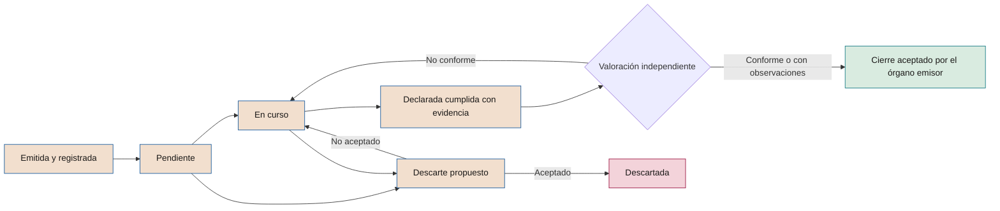

# Registro de recomendaciones y decisiones

**Seguimiento con identificadores persistentes de lo que el consejo recomienda, encarga y decide**

| | |
|---|---|
| Documento | Documento 62 · Registro de recomendaciones y decisiones |
| Versión | 0.1 (borrador de trabajo) |
| Fecha | 16-09-2026 |
| Autor | Fernando García Varela |
| Estado | Borrador para revisión. Define el registro que implementa la herramienta T18, pendiente de adaptación. |

<!-- cifras: 2 | tipos de registro con identificador propio ; 4 | estados declarados por el destinatario ; 4 | valoraciones independientes ; 0 | identificadores reutilizados -->

---

> **Aviso legal y exención de responsabilidad.** SEVEN-G es un marco metodológico de referencia que se ofrece «tal cual» y con fines exclusivamente informativos. No constituye asesoramiento jurídico, regulatorio, financiero ni profesional, ni garantiza el cumplimiento de ninguna norma. Las referencias a regulación general (como el Reglamento Europeo de IA, el RGPD, DORA o NIS2), a normas técnicas y a regulación específica de cada sector o jurisdicción pueden ser incompletas, no aplicar a un caso concreto o quedar desactualizadas por cambios normativos, interpretaciones o criterios de las autoridades posteriores a su fecha de consulta. **Cada organización que use SEVEN-G es la única responsable de identificar la normativa que le aplica, verificar su vigencia y certificar su propio cumplimiento regulatorio**, con el asesoramiento cualificado que corresponda. El autor no asume responsabilidad alguna por el uso que se haga de este contenido ni por las decisiones que se adopten con él. Los datos, cifras, compañías y casos de los ejemplos son ficticios o ilustrativos.

<!-- esencial: siempre | Las decisiones y recomendaciones del consejo sobre IA se registran con identificador, responsable, plazo y estado, y se siguen hasta su cierre. Puede llevarse en la vista «Consejo» del registro T01 o con la plantilla P69. -->

## 1. Objeto y alcance

El registro de recomendaciones y decisiones conserva, con identificadores que no se reinician, **lo que el consejo y sus comisiones recomiendan, encargan y deciden sobre IA**, quién debe ejecutarlo, en qué plazo, qué evidencia se ha aportado y si alguien independiente considera que se ha cumplido.

Sirve para que el seguimiento no dependa de la memoria de las reuniones ni de las actas, y para distinguir **lo que el destinatario declara** de **lo que se ha verificado**.

Se aplica a:

- **Recomendaciones** formuladas por el consejo de administración, sus comisiones delegadas o el consejero o asesor con experiencia en IA cuando el consejo las hace suyas.
- **Encargos** del consejo a la dirección (trabajos con responsable y fecha), que se registran como recomendaciones.
- **Decisiones** del consejo o de su comisión delegada sobre IA: aprobaciones, autorizaciones con límites, aceptaciones de riesgo y tomas de conocimiento relevantes.

No sustituye al acta, que es el documento societario, ni al registro de decisiones de *gate* del ciclo de vida (plantilla P29, herramienta T03). El registro enlaza con ambos.

---

## 2. Principios

| # | Principio | Qué implica |
|---|---|---|
| 1 | **Identificador persistente** | Cada recomendación y cada decisión reciben un código que no cambia, no se reutiliza y no se reinicia. |
| 2 | **Declarado no es verificado** | El destinatario declara el estado; una persona independiente valora el cumplimiento. Ambas cosas se muestran por separado. |
| 3 | **Sin evidencia no hay cumplimiento** | Una recomendación solo puede valorarse como conforme si hay evidencia enlazada, fechada y versionada. |
| 4 | **Nada se cierra en silencio** | El cierre y el descarte los acepta el órgano que emitió la recomendación, con registro. |
| 5 | **Todo cambio es un evento** | Cambios de estado, fecha, destinatario o texto quedan registrados con fecha, autor y motivo. |
| 6 | **Vinculado a la medición** | Cada recomendación indica el bloque del panel del consejo o el dato del registro de iniciativas donde se comprueba su efecto. |
| 7 | **Un único modelo de datos** | El registro es la entidad *Recomendación* del modelo común (03 §4); se alimenta y alimenta al resto de herramientas. |

---

## 3. Identificadores

### 3.1 Formato

El esquema de datos del panel del consejo (`motor/ESQUEMA.md` del repositorio de demostraciones) no define un formato de identificador para las recomendaciones. La herramienta de demostración T18 usa códigos correlativos por organización (`R-01`, `R-02`…) agrupados por sesión. SEVEN-G adopta el formato de la especificación común:

| Tipo | Formato | Ejemplo | Estado del formato |
|---|---|---|---|
| **Recomendación o encargo** | `REC-AAAA-NNN` | REC-2026-007 | Especificación común §5.9 |
| **Decisión del consejo o de la comisión** | `DEC-AAAA-NNN` | DEC-2026-014 | **Propuesto** en este documento; pendiente de incorporar a la especificación común §5.9 y al glosario (documento 02) |

### 3.2 Reglas

1. **AAAA** es el año en que se emite la recomendación o se adopta (o se solicita) la decisión.
2. **NNN** es un número correlativo con tres dígitos como mínimo que **no se reinicia al cambiar de año ni de sesión**. Si se superan 999, se usan cuatro dígitos.
3. **Un identificador no se reutiliza nunca**, tampoco cuando la recomendación se descarta, se anula por error de registro o se fusiona con otra.
4. **Una recomendación que se divide** conserva su identificador en la parte principal; las partes nuevas reciben identificadores nuevos y se enlazan a la original.
5. **Una recomendación reformulada de forma sustancial** se cierra como *Sustituida* y se registra una nueva enlazada. Los cambios menores de redacción se registran como evento sin cambiar el código.
6. **La correspondencia con identificadores anteriores** (por ejemplo, `R-NN` de una herramienta previa) se conserva en el campo *identificador anterior*.
7. **Las iniciativas** mantienen su propio código `IA-AAAA-NNN` (documento 03); los incidentes y no conformidades, `INC-AAAA-NNN` y `NC-AAAA-NNN`.

---

## 4. Campos de una recomendación

| Bloque | Campo | Contenido | Obligatorio | Lo rellena |
|---|---|---|---|---|
| **Identificación** | Código | REC-AAAA-NNN | Sí | Secretaría del consejo |
| | Identificador anterior | Código en una herramienta previa, si existe. | No | Oficina de IA |
| | Órgano emisor | Pleno, comisión delegada (cuál) o consejero o asesor con experiencia en IA, con aceptación del consejo. | Sí | Secretaría del consejo |
| | Sesión de origen | Órgano y fecha de la sesión; referencia al acta. | Sí | Secretaría del consejo |
| | Tipo | Recomendación · Encargo. | Sí | Secretaría del consejo |
| **Contenido** | Texto | Qué se recomienda, redactado de forma que se pueda comprobar si se ha cumplido. | Sí | Órgano emisor |
| | Motivo | Por qué se recomienda, en una o dos frases. | Sí | Órgano emisor |
| | Criterio de cumplimiento | Qué evidencia demostrará que se ha cumplido. | Sí | Órgano emisor, con la oficina de IA |
| | Ámbito | Valor · Riesgo · Cumplimiento · Seguridad · Datos · Personas · Gobierno · Proveedores. | Sí | Oficina de IA |
| | Esfera | 01 a 09 (taxonomía controlada, 03 §3.3). | Sí | Oficina de IA |
| | Prioridad | Alta · Media · Baja, con el criterio aprobado por el órgano emisor. | Sí | Órgano emisor |
| **Responsabilidad** | Destinatario | Persona responsable y área. Una sola persona responde, aunque colaboren varias áreas. | Sí | Órgano emisor |
| | Fecha comprometida original | Fecha acordada al emitir la recomendación. No se sobrescribe. | Sí | Destinatario, aceptada por el órgano |
| | Fecha comprometida vigente | Fecha actual tras reprogramaciones. | Sí | Sistema |
| | Reprogramaciones | Número, fechas, motivo y quién las aceptó. | Si existen | Destinatario y órgano emisor |
| **Seguimiento** | Estado declarado | Sección 5. | Sí | Destinatario |
| | Fecha del estado | Fecha de la última declaración. | Sí | Sistema |
| | Evidencia aportada | Enlaces, con tipo, autor, fecha y versión (sección 7). | Para declarar *Cumplida* | Destinatario |
| | Valoración independiente | Sección 6. | Para cerrar | Valorador independiente |
| | Valorador y fecha | Persona y fecha de la valoración. | Para cerrar | Sistema |
| | Comentario de valoración | Motivo de la valoración, especialmente si no es conforme. | Si no es conforme | Valorador independiente |
| **Cierre** | Situación | Abierta · Cerrada · Descartada · Sustituida. | Sí | Sistema, con aceptación del órgano |
| | Fecha y órgano de cierre | Quién aceptó el cierre o el descarte y cuándo. | Al cerrar | Secretaría del consejo |
| **Vínculos** | Iniciativas | Códigos IA-AAAA-NNN afectados. | Si existen | Oficina de IA |
| | Sistemas, incidentes y no conformidades | INC-AAAA-NNN, NC-AAAA-NNN, sistemas del inventario. | Si existen | Oficina de IA |
| | Decisiones | DEC-AAAA-NNN relacionadas. | Si existen | Secretaría del consejo |
| | Bloque del panel | Bloque del panel del consejo donde se mide el efecto (sección 11). | Recomendado | Oficina de IA |
| **Historial** | Eventos | Alta, cambios de estado, reprogramaciones, valoraciones, cierre, con fecha, autor y comentario. | Sí | Sistema |

**Cómo redactar una recomendación comprobable**

| Poco comprobable | Comprobable |
|---|---|
| "Mejorar la medición del valor." | "Desagregar el valor de cada caso en producción en eficiencias, retorno y coste recurrente, con método de atribución y validación de control de gestión, antes del cierre del ejercicio." |
| "Reforzar la seguridad de los agentes." | "Disponer, para cada agente con capacidad de actuar, de identidad propia, permisos mínimos, registro de acciones e interruptor de parada probado, antes de ampliar su uso." |
| "Tener en cuenta la regulación." | "Clasificar con criterio jurídico firmado todos los sistemas del inventario según el Reglamento Europeo de IA, empezando por los que afectan a decisiones sobre personas." |

---

## 5. Estados declarados por el destinatario

| Estado | Significado | Requisitos |
|---|---|---|
| **Pendiente** | No se ha iniciado el trabajo. | Fecha comprometida vigente. |
| **En curso** | El trabajo ha empezado y no se ha completado. | Descripción breve del avance y fecha comprometida vigente. |
| **Cumplida** | El destinatario considera que la recomendación está cumplida. | Evidencia aportada que cubre el criterio de cumplimiento. Pasa automáticamente a *pendiente de valoración*. |
| **Descartada** | El destinatario propone no ejecutarla. | Motivo y alternativa, si la hay. Requiere aceptación del órgano emisor; hasta entonces la recomendación sigue abierta. |

Alertas que calcula el registro y no son estados:

| Alerta | Cuándo se activa |
|---|---|
| **Vencida** | La fecha comprometida vigente ha pasado y el estado no es *Cumplida* ni *Descartada* aceptada. |
| **Sin actualizar** | El estado no se ha actualizado desde la sesión anterior del órgano emisor. |
| **Pendiente de valoración** | Declarada *Cumplida* y sin valoración independiente en el plazo fijado (por defecto, antes de la siguiente sesión). |
| **Discrepancia** | Declarada *Cumplida* y valorada *No conforme*. |
| **Reprogramación reiterada** | Dos reprogramaciones o más (sección 9.3). |

---

## 6. Valoración independiente

### 6.1 Quién valora

La valoración la realiza una persona **independiente del destinatario y de quien ejecuta el trabajo**: auditoría interna, el auditor de IA, la segunda línea cuando la recomendación no afecta a su propio trabajo, o el consejero o asesor con experiencia en IA cuando el consejo se lo encarga y no tiene intereses en la ejecución. El órgano emisor designa el valorador por tipo de recomendación.

### 6.2 Escala

| Valoración | Significado | Consecuencia |
|---|---|---|
| **Conforme** | La evidencia demuestra que se cumple el criterio de cumplimiento. | Se propone el cierre al órgano emisor. |
| **Conforme con observaciones** | Se cumple lo esencial; quedan aspectos no críticos que se indican. | Se propone el cierre con las observaciones registradas; si alguna observación exige trabajo, se registra como recomendación nueva enlazada. |
| **No conforme** | La evidencia no demuestra el cumplimiento o es insuficiente. | La recomendación vuelve a *En curso* con nueva fecha comprometida; se registra la discrepancia. |
| **Sin valorar** | Todavía no se ha valorado. | Estado inicial de la valoración. |

### 6.3 Reglas

1. **La valoración se basa solo en la evidencia enlazada.** Lo que no está en el registro no se considera.
2. **El valorador no reescribe la recomendación.** Si considera que el criterio de cumplimiento es inadecuado, lo propone al órgano emisor.
3. **Las discrepancias se informan al consejo** en el paquete trimestral (60 §4.7).
4. **La valoración se muestra junto al estado declarado**, nunca en su lugar.

---

## 7. Evidencia aportada

| Requisito | Descripción |
|---|---|
| **Enlace** | Ubicación del documento o dato en el repositorio de la compañía. La evidencia se enlaza, no se copia (03 §2). |
| **Tipo** | Documento aprobado · Registro o dato de un sistema · Resultado de prueba · Acta o decisión · Informe de auditoría · Configuración verificable. |
| **Autor, fecha y versión** | Obligatorios. |
| **Relación con el criterio** | Qué parte del criterio de cumplimiento cubre. |
| **Verificación previa** | Si la evidencia ya ha sido verificada en un *gate* o una auditoría, se indica quién y cuándo. |

No son evidencia suficiente por sí solos:

- Una declaración del destinatario sin documento o dato que la respalde.
- Un plan, cuando la recomendación pide un resultado.
- Una presentación elaborada para la sesión sin datos de origen enlazados.
- Documentación elaborada a posteriori para aparentar un cumplimiento anterior (01 §7.4, regla 3).

---

## 8. Ciclo de vida

<!-- grafico: Ciclo de vida de una recomendación | El destinatario declara; alguien independiente valora; el órgano emisor cierra -->

| Paso | Qué ocurre | Quién | Plazo de referencia |
|---|---|---|---|
| **1. Emisión** | El órgano formula la recomendación en la sesión. | Órgano emisor | En la sesión |
| **2. Registro** | Se asigna código, destinatario, criterio de cumplimiento y fecha comprometida. | Secretaría del consejo con la oficina de IA | 5 días hábiles tras la sesión |
| **3. Aceptación del destinatario** | El destinatario confirma que la entiende y acepta la fecha, o propone otra al órgano emisor. | Destinatario | 10 días hábiles tras el registro |
| **4. Ejecución** | El destinatario actualiza el estado antes de cada sesión del órgano emisor. | Destinatario | Antes de la fecha de corte del paquete |
| **5. Declaración de cumplimiento** | Estado *Cumplida* con evidencia enlazada. | Destinatario | Antes de la fecha comprometida |
| **6. Valoración** | Conforme, conforme con observaciones o no conforme. | Valorador independiente | Antes de la siguiente sesión |
| **7. Cierre** | El órgano emisor acepta el cierre en sesión o por el procedimiento que haya delegado. | Órgano emisor | En la siguiente sesión |

---

## 9. Cierre, descarte, reprogramación y reapertura

### 9.1 Cierre

Una recomendación se cierra cuando se cumplen a la vez tres condiciones: estado declarado *Cumplida*, valoración *Conforme* o *Conforme con observaciones*, y aceptación del órgano emisor. El cierre registra fecha, órgano y referencia al acta.

### 9.2 Descarte

El descarte es legítimo cuando la recomendación ha perdido sentido (cambio de estrategia, iniciativa retirada, solución alternativa) o cuando su coste supera claramente su beneficio. Requiere motivo, alternativa si existe y aceptación expresa del órgano emisor. Una recomendación descartada no desaparece del registro ni de los indicadores.

### 9.3 Reprogramación

- Toda nueva fecha registra motivo y quién la acepta; la fecha original se conserva.
- La primera reprogramación la acepta la oficina de IA o la secretaría del consejo si el órgano emisor lo ha delegado.
- **A partir de la segunda reprogramación, la decisión la toma el órgano emisor**, en coherencia con el límite de dos iteraciones del ciclo de vida (01 §7.4, regla 5).

### 9.4 Reapertura

Una recomendación cerrada se reabre, conservando su código, si se descubre que la evidencia era incorrecta o que el cumplimiento no se ha mantenido (por ejemplo, un control que se desactivó después). La reapertura se registra como evento con motivo y se informa al órgano emisor. Si el problema es distinto del original, se registra una recomendación nueva enlazada.

### 9.5 Sustitución

Cuando el órgano emisor reformula una recomendación de forma sustancial, la original se cierra como *Sustituida* con referencia a la nueva, que recibe su propio código.

---

## 10. Decisiones del consejo registradas

### 10.1 Qué decisiones se registran

| Decisión | Registro |
|---|---|
| Aprobación de la tesis de IA, la ambición por esfera, el apetito de riesgo, la política corporativa y el presupuesto marco (C2). | Obligatorio |
| Aprobación de iniciativas de Transformar en G2 y de su escalado en G7. | Obligatorio |
| Aceptación excepcional de riesgos residuales Crítico. | Obligatorio |
| Decisiones de la revisión anual (C5): ajustes de tesis, umbrales y plazos. | Obligatorio |
| Tomas de conocimiento de paradas, retiradas, incidentes S1 y no conformidades críticas. | Obligatorio |
| Encargos a la dirección. | Se registran como recomendaciones de tipo *Encargo* (REC). |
| Otras decisiones sobre IA del consejo o de la comisión delegada. | Recomendado |

### 10.2 Campos de una decisión

| Campo | Contenido |
|---|---|
| **Código** | DEC-AAAA-NNN (propuesto). |
| **Órgano y sesión** | Pleno o comisión delegada; fecha; referencia al acta. |
| **Tipo** | Aprobar · Autorizar con límites · Aceptar un riesgo · Tomar conocimiento (60 §4.3). |
| **Texto de la decisión** | Tal como consta en el acta. |
| **Ficha de decisión** | Enlace a la ficha presentada (60 §5). |
| **Resultado** | Aprobada · Aprobada con condiciones · Aplazada · Rechazada. |
| **Condiciones y límites** | Cada condición con responsable y plazo; límites de inversión, etapa y vigencia. |
| **Vigencia** | Fecha hasta la que es válida, si procede (por ejemplo, la aceptación de un riesgo). |
| **Responsable de ejecución** | Persona responsable. |
| **Vínculos** | IA-AAAA-NNN, REC-AAAA-NNN, INC-AAAA-NNN, NC-AAAA-NNN, decisión de *gate* (P29). |
| **Seguimiento** | Estado de ejecución de las condiciones (pendiente, en curso, cumplida, vencida) y fecha de revisión. |
| **Historial** | Eventos con fecha, autor y motivo. |

### 10.3 Reglas

1. **Una decisión aplazada conserva su código** y se vuelve a presentar con él.
2. **Las condiciones de una decisión se siguen como las de un *gate***: una condición vencida sin cumplir se informa al órgano, que decide si la decisión sigue vigente.
3. **Una aceptación de riesgo caduca en su fecha de vigencia**; a partir de entonces el riesgo vuelve a bloquear el *gate* correspondiente hasta nueva decisión.
4. **La decisión del consejo en G2 o G7 y el registro de decisión de *gate* se enlazan** en ambos sentidos, para que la trazabilidad del ciclo de vida sea completa.

---

## 11. Vínculos con las iniciativas y con el panel

### 11.1 Con el registro de iniciativas

- Toda recomendación o decisión que afecta a iniciativas concretas enlaza sus códigos IA-AAAA-NNN.
- En la ficha de cada iniciativa del registro (T01) aparecen las recomendaciones y decisiones que la afectan, con su estado y valoración.
- Una iniciativa **no puede superar un *gate*** si tiene vinculada una decisión del consejo con condiciones vencidas que afectan a ese *gate*.
- Cuando una iniciativa se para o se retira, las recomendaciones que dependen solo de ella se proponen para descarte o cierre.

### 11.2 Con el panel del consejo

Cada recomendación indica el bloque del panel (T17) en el que el consejo puede comprobar su efecto:

| Ámbito de la recomendación | Bloque del panel |
|---|---|
| Valor, coste, validación, neto adicional por euro | Valor frente a potencial |
| Nivel de ambición y distribución de la inversión | Dónde invierte la compañía |
| Tiempos de decisión y de paso a producción | Agilidad |
| Clasificación regulatoria, controles, evaluaciones de impacto | Riesgo y cumplimiento |
| Asistentes y agentes: guardarraíles, pruebas, identidad y permisos | Asistentes en producción; agentes |
| Retiradas, altas e incidentes | Movimientos e incidentes |
| Licencias, uso, uso no autorizado, formación | Tendencia y adopción |
| Exposición a ataques con IA | Exposición a ataques con IA |
| Inventario y tipología | Inventario |

### 11.3 Indicadores del registro

Se informan en el paquete trimestral (documento 60) y en la revisión anual:

| Indicador | Definición |
|---|---|
| **Abiertas** | Recomendaciones no cerradas, descartadas ni sustituidas, por órgano emisor y ámbito. |
| **Vencidas** | Abiertas con fecha comprometida vigente superada. |
| **Cerradas en el periodo** | Con valoración conforme o conforme con observaciones. |
| **Discrepancias** | Declaradas cumplidas y valoradas no conformes en el periodo. |
| **Tiempo hasta el cierre** | Mediana de días desde el registro hasta el cierre, por prioridad. |
| **Reprogramaciones** | Porcentaje de recomendaciones con al menos una reprogramación y con dos o más. |
| **Condiciones de decisiones vencidas** | Condiciones de decisiones DEC fuera de plazo. |
| **Pendientes de valoración** | Declaradas cumplidas sin valoración independiente. |

---

## 12. Herramienta T18: situación actual y adaptación pendiente

### 12.1 Situación actual

La herramienta **T18 · Registro de recomendaciones del consejo** existe (03 §5.4) como parte del repositorio público de demostraciones del panel del consejo, con **datos ficticios** en once sectores. Muestra, por sesión, cada recomendación con identificador que no se reinicia, ámbito, destinatario, fecha comprometida, estado declarado, evidencia presentada, valoración en texto libre y enlace al bloque del panel donde se mide.

Los ficheros del motor publicados en ese repositorio son **copia de su proyecto privado de origen**: no se editan en el repositorio de demostraciones, sino en origen, y se vuelven a publicar con su procedimiento, que incluye la verificación de términos antes de publicar.

### 12.2 Adaptación necesaria

| Aspecto | T18 actual (demostración) | Requisito SEVEN-G | Adaptación |
|---|---|---|---|
| **Identificador** | `R-NN` correlativo por organización | `REC-AAAA-NNN` sin reinicio | Nuevo formato; conservar el anterior en *identificador anterior*. |
| **Decisiones** | No se registran | `DEC-AAAA-NNN` con condiciones y vigencia | Nueva entidad y vista. |
| **Origen** | Sesiones numeradas de un órgano | Órgano emisor (pleno, comisión, asesor) y sesión | Campo de órgano emisor y filtro. |
| **Estados declarados** | Pendiente, en curso, cumplida, descartada | Los mismos cuatro | Sin cambio de valores; añadir fecha del estado. |
| **Valoración** | Texto libre | Escala Conforme · Conforme con observaciones · No conforme · Sin valorar, con valorador, fecha y comentario | Campos estructurados. |
| **Criterio de cumplimiento** | No existe | Obligatorio | Nuevo campo. |
| **Fechas** | Una fecha comprometida | Fecha original, fecha vigente y reprogramaciones | Nuevos campos e historial. |
| **Evidencia** | Texto libre | Enlaces con tipo, autor, fecha y versión | Estructura de evidencia del modelo común (03 §4). |
| **Cierre** | No explícito | Situación (abierta, cerrada, descartada, sustituida) con órgano y fecha | Nuevo bloque. |
| **Vínculos** | Bloque del panel | Bloque del panel, IA, INC, NC, DEC | Ampliar. |
| **Historial** | No existe | Eventos con fecha, autor y motivo | Nuevo. |
| **Alertas** | Recuento por estado | Vencida, sin actualizar, pendiente de valoración, discrepancia, reprogramación reiterada | Nuevo cálculo. |
| **Fuente de datos** | Datos de demostración generados con el panel | Entidad *Recomendación* del modelo común, integrada con T01 | Integración de la ola 1 de herramientas (03 §6). |
| **Terminología** | Pensada para el seguimiento de recomendaciones de un órgano asesor | Genérica para cualquier órgano emisor | Textos configurables. |

Prioridad: ola 1 de herramientas (03 §6), junto con la conexión del panel T17 al registro de iniciativas. Hasta que la adaptación esté disponible, el registro puede llevarse con la plantilla P69, preparada como hoja de cálculo con los campos de las secciones 4 y 10.

### 12.3 Estado de la adaptación (versión 0.1)

Desde el esquema 0.5 del registro de iniciativas, **T18 es un módulo de T01** (vista «Consejo (T18)»), con un único modelo de datos (03 §4):

| Aspecto | Disponible | Pendiente |
|---|---|---|
| **Identificadores** | `REC-AAAA-NNN` y `DEC-AAAA-NNN`, correlativos por año y sin reinicio. | Identificador anterior de registros migrados. |
| **Decisiones** | Órgano, referencia del acta, tipo, asunto, texto, resultado, iniciativas y recomendaciones vinculadas, límite de inversión y etapa, decisión de etapa, vigencia, responsable y esferas con Transformar como objetivo (sección 10.2). | Condiciones con responsable y plazo, y su seguimiento. |
| **Recomendaciones** | Texto, destinatario, situación (abierta, en curso, cerrada, descartada), evidencia e iniciativas vinculadas. | Criterio de cumplimiento, fechas original y vigente, reprogramaciones, valoración independiente, historial y alertas de la sección 5. |
| **Índice de transformación** | Las decisiones alimentan la señal 8 y la condición IT-D1 del documento 12 en la calculadora T14. | — |
| **Panel del consejo** | El conector de T17 genera la página del registro a partir de las recomendaciones de T01. | Decisiones en el panel. |

**Por qué importa.** Las decisiones del consejo dejan de vivir solo en las actas: quedan enlazadas a las iniciativas y a las recomendaciones, y el índice de transformación puede comprobar con datos si el consejo decide, financia y supervisa las apuestas de Transformar. Lo pendiente sigue llevándose con la plantilla P69.

---

## 13. Ejemplo ilustrativo

*Registros ficticios, sin relación con ninguna compañía.*

| Campo | REC-2026-003 | REC-2026-009 | DEC-2026-014 |
|---|---|---|---|
| Órgano y sesión | Comisión delegada · sesión de marzo | Pleno · sesión de junio | Pleno · sesión de septiembre |
| Tipo | Recomendación | Encargo | Autorizar con límites |
| Texto | Desagregar el valor de cada caso en producción en eficiencias, retorno y coste recurrente, con validación de control de gestión. | Presentar la posición de la compañía sobre el efecto de la IA en el empleo. | Autorizar la etapa 1 de IA-2026-018 con límite de 400.000 € y decisión de continuidad en nueve meses. |
| Criterio de cumplimiento | Todos los casos en producción con los tres componentes y estado; informe de control de gestión. | Documento aprobado por la alta dirección y presentado al pleno. | Condición: contrato piloto aprobado por asesoría jurídica en 60 días. |
| Destinatario o responsable | Dirección de control de gestión | Dirección de personas | Dirección comercial |
| Fecha original · vigente | 30-06 · 30-09 (1 reprogramación) | 30-11 · 30-11 | Condición: 60 días desde la decisión |
| Estado declarado | Cumplida | En curso | Condición en curso |
| Evidencia | Informe de validación de control de gestión (versión 2); tabla de valor por caso en el registro de iniciativas. | Borrador de posición (versión 1). | — |
| Valoración | Conforme con observaciones: dos casos de IA generativa mantienen el valor como declarado. | Sin valorar | — |
| Situación | Propuesta de cierre en la sesión de diciembre; observación registrada como REC-2026-017. | Abierta | Vigente |
| Vínculos | Bloque del panel: Valor frente a potencial | Bloque del panel: Tendencia y adopción | IA-2026-018 · REC-2026-006 |

---

## 14. Herramientas y plantillas asociadas

| Código | Nombre | Uso en este documento |
|---|---|---|
| T01 | Registro de iniciativas | Vínculos IA-AAAA-NNN y eventos. |
| T03 | Gestor de *gates* | Enlace entre decisiones del consejo y decisiones de *gate*. |
| T08 | Registro de no conformidades e incidentes | Vínculos INC y NC. |
| T17 | Panel de IA para el consejo | Bloques donde se comprueba el efecto de cada recomendación. |
| T18 | Registro de recomendaciones del consejo | Implementación del registro (sección 12). |
| P29 | Registro de decisión de *gate* | Decisiones de G2 y G7 de Transformar. |
| P30 | Decisión de escalado o retirada | Decisiones de G7 elevadas al consejo. |
| P69 | Registro de decisiones del consejo | Registro de recomendaciones, encargos y decisiones mientras T18 no esté adaptada (secciones 4, 10 y 12.2). |

---

## 15. Documentos relacionados

| Documento | Relación |
|---|---|
| **00 · Qué es SEVEN-G y para qué sirve** | Registro de recomendaciones como componente de medición y herramienta. |
| **01 · Metodología fundacional** | Reglas de decisión, límite de iteraciones, órganos. |
| **02 · Glosario y convenciones** | Incorporación del código DEC-AAAA-NNN y de los estados. |
| **03 · Herramientas y registro de iniciativas** | Modelo de datos (entidad *Recomendación*), T17, T18 y orden de construcción. |
| **38 · Marco de auditoría de IA** | Valoración independiente y escala de conformidad. |
| **60 · Paquete para el consejo** | Extracto del registro en cada paquete y formato de decisión. |
| **61 · Guía de conversación con el consejo** | Registro tras cada sesión. |

---

## 16. Control de versiones

| Versión | Fecha | Cambios |
|---|---|---|
| 0.1 | 16-09-2026 | Primera versión. Define identificadores persistentes REC-AAAA-NNN y, como propuesta, DEC-AAAA-NNN; campos, estados declarados, valoración independiente, evidencia, ciclo de vida, cierre, decisiones del consejo, vínculos con iniciativas y panel, indicadores y adaptación pendiente de la herramienta T18. |
