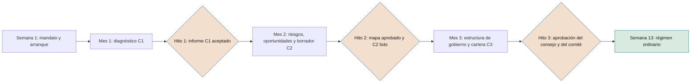

# Guía de implantación de SEVEN-G

**Cómo adoptar el marco: alcance, requisitos, plan de 90 días y hoja de ruta hasta poder declarar que se aplica**

| | |
|---|---|
| Documento | Documento 90 · Guía de implantación |
| Versión | 0.1 (borrador de trabajo) |
| Fecha | 16-09-2026 |
| Autor | Fernando García · SEACHAD |
| Estado | Borrador para revisión. Los plazos y objetivos son orientativos y se ajustarán con la aplicación práctica. |

<!-- cifras: 2 | alcances de implantación ; 13 | semanas de plan inicial ; 7 | condiciones para declarar que se aplica ; 18 | meses como horizonte máximo de la hoja de ruta -->

---

> **Aviso legal y exención de responsabilidad.** SEVEN-G es un marco metodológico de referencia que se ofrece «tal cual» y con fines exclusivamente informativos. No constituye asesoramiento jurídico, regulatorio, financiero ni profesional, ni garantiza el cumplimiento de ninguna norma. Las referencias a regulación general (como el Reglamento Europeo de IA, el RGPD, DORA o NIS2), a normas técnicas y a regulación específica de cada sector o jurisdicción pueden ser incompletas, no aplicar a un caso concreto o quedar desactualizadas por cambios normativos, interpretaciones o criterios de las autoridades posteriores a su fecha de consulta. **Cada organización que use SEVEN-G es la única responsable de identificar la normativa que le aplica, verificar su vigencia y certificar su propio cumplimiento regulatorio**, con el asesoramiento cualificado que corresponda. El autor y SEACHAD no asumen responsabilidad alguna por el uso que se haga de este contenido ni por las decisiones que se adopten con él. Los datos, cifras, compañías y casos de los ejemplos son ficticios o ilustrativos.

## 1. Objeto y alcance

Esta guía explica cómo una organización adopta SEVEN-G por primera vez. Desarrolla la primera implantación prevista en 01 §5.3 —concentrar C1 a C3 en noventa días— y la hoja de ruta posterior hasta cumplir las condiciones de la declaración de aplicación (01 §14).

Se dirige a quien dirige la implantación (normalmente el responsable de la futura oficina de IA), al patrocinador en la alta dirección y a las funciones de riesgos, cumplimiento y auditoría interna. Algunos documentos citados están en redacción; mientras no estén publicados, se aplican las reglas correspondientes de los documentos 01 y 03.

Este documento no constituye asesoramiento jurídico.

### 1.1 Qué significa implantar SEVEN-G

| Hito | Qué se ha conseguido |
|---|---|
| **Día 90** | Diagnóstico con evidencia (C1), dirección propuesta o aprobada (C2), primera cartera (C3), órganos, roles, *gates*, métricas y ritmo de reporte en marcha. |
| **Meses 4–18** | El marco funciona en régimen: las iniciativas nuevas recorren el ciclo de vida, las existentes se regularizan, el consejo supervisa con el panel. |
| **Declaración de aplicación** | Se cumplen las siete condiciones de 01 §14, acreditadas con las preguntas **(§14)** del documento 11 en una evaluación verificada. |

---

## 2. Elegir el alcance de implantación

### 2.1 Lite o Enterprise de compañía

El **alcance de implantación** es una decisión de la compañía sobre cómo organiza su gobierno. **No sustituye a la intensidad de cada iniciativa**: en una compañía con alcance Lite, toda iniciativa que cumple un criterio de 01 §9.2 se gestiona con intensidad Enterprise.

| Aspecto | Alcance Lite | Alcance Enterprise |
|---|---|---|
| **Organizaciones típicas** | Medianas, no reguladas o con regulación sectorial ligera, cartera reducida. | Grupos regulados (financieros, seguros, energía, sanidad, sector público), varias filiales o países, cartera amplia. |
| **Comité de IA** | Comité de dirección existente con el mandato ampliado. | Comité específico o comité existente con sesión propia y composición de 01 §8.3. |
| **Comisión delegada** | La que ya supervise riesgos o auditoría, con la IA como punto recurrente. | Comisión de riesgos, auditoría o tecnología con mandato expreso sobre IA. |
| **Oficina de IA** | Una persona con dedicación parcial y apoyo puntual. | Equipo de metodología, cartera y medición. |
| **Auditor de IA** | Auditoría interna o auditor externo, por muestreo en Lite y en cada *gate* Enterprise. | Tercera línea con auditores de IA asignados. |
| **Madurez** | Evaluación verificada. | Evaluación verificada y, al menos cada dos años, independiente (documento 11). |
| **Panel del consejo** | Agregado. | Por iniciativa para las Enterprise. |
| **Horizonte orientativo hasta 01 §14** | 6 a 12 meses. | 12 a 18 meses. |

### 2.2 Criterios de elección

Se elige **alcance Enterprise** si se cumple al menos uno de estos criterios; en otro caso, Lite:

1. La compañía está sujeta a supervisión prudencial o sectorial que exige gobierno formal de riesgos tecnológicos o de modelos (por ejemplo, entidades financieras sujetas a DORA).
2. Tiene o prevé sistemas de IA de alto riesgo según el Reglamento Europeo de IA.
3. Tiene o prevé agentes con autonomía A2 o A3 sobre clientes, dinero, datos personales o sistemas de producción.
4. Opera como grupo con varias sociedades o países que deben seguir un marco común.
5. El consejo ha aprobado o prevé apuestas de Transformar.

### 2.3 Perímetro

El perímetro puede ser toda la compañía o una parte (una filial, un país, una unidad de negocio). Implantar primero en un perímetro reducido es válido, pero **la declaración de aplicación solo cubre el perímetro implantado** y debe decirlo. El inventario de sistemas de IA sí debería abarcar desde el principio toda la compañía, porque el riesgo no respeta perímetros.

---

## 3. Requisitos previos

| Requisito | Criterio de cumplimiento |
|---|---|
| **Patrocinio de la alta dirección** | Mandato de implantación firmado por la presidencia ejecutiva o el consejero delegado, con objetivo, perímetro, alcance y plazo. |
| **Conocimiento del consejo** | El consejo o su comisión delegada conoce el plan y tiene reservada una sesión en las semanas 12–13 para aprobar C2. |
| **Responsable de implantación** | Persona nombrada con dedicación suficiente (orientativamente, la mayor parte de su jornada durante los 90 días en Enterprise). |
| **Equipo núcleo** | Representantes de negocio, tecnología, datos, riesgos, cumplimiento, seguridad, protección de datos, recursos humanos y control de gestión, con tiempo asignado. |
| **Tercera línea informada** | Auditoría interna conoce el plan y designa quién verificará la madurez. |
| **Asesoría jurídica** | Disponible para la clasificación regulatoria de los sistemas prioritarios. |
| **Acceso a información** | Compras, licencias, contratos con proveedores, arquitectura, registro de riesgos y presupuestos. |
| **Soporte de registro** | T01 y T02 o, mientras no estén disponibles, una hoja de cálculo con los campos de 03 §3.3. |
| **Sin moratoria general** | La actividad de IA continúa durante la implantación; solo se detiene lo que el diagnóstico identifique como riesgo inaceptable. |

---

## 4. Plan de 90 días

### 4.1 Visión de conjunto

<!-- grafico: Plan de 90 días | Tres meses, tres resultados y una decisión del consejo -->

Cada hito lo acepta el patrocinador de la implantación con el comité de IA (o el comité de dirección mientras aquel no esté constituido). Si un hito no se cumple, se replanifica el mes siguiente; no se avanza con entregables vacíos.

### 4.2 Mes 1 · Diagnóstico (C1)

| Semana | Actividades y entregables | Responsable | Documentos, plantillas y herramientas | Criterio de finalización |
|---|---|---|---|---|
| **1 · Arranque** | Mandato de implantación; alcance Lite o Enterprise y perímetro; equipo núcleo; calendario de órganos con la sesión del consejo reservada; comunicación interna; solicitud de evidencias de madurez; fecha de corte. | Patrocinador y responsable de implantación | 00, 01, 90; lista de evidencias del documento 11 | Mandato firmado; sesión del consejo reservada; solicitud de evidencias enviada. |
| **2 · Inventario** | Censo de sistemas de IA: propios, de terceros, uso corporativo y uso no autorizado (a partir de compras, licencias, contratos y controles de seguridad). Alta con estado real. Cribado inicial de criterios Enterprise y de posibles prácticas prohibidas. | Oficina de IA con tecnología, compras y seguridad | 03; P05; T02, T01; T04 | Cada dirección de área firma una declaración de completitud del inventario. Posibles prácticas prohibidas escaladas de inmediato. |
| **3 · Evidencias y entrevistas** | Entrevistas de madurez por dimensión; revisión de evidencias y muestreo; recogida de valor y coste actuales con su estado; datos de las ocho señales del índice. | Equipo evaluador | 11; 12; 40; T15, T14, T12 | Siete dimensiones con al menos dos entrevistas cada una; muestras seleccionadas. |
| **4 · Informe C1** | Puntuación, calibración y verificación independiente de la madurez; perfil del índice de transformación; mapa de esferas actual; valor y coste de la cartera; informe C1. | Evaluador principal; verificador independiente | 10, 11, 12; T15, T14, T16 | **Hito 1:** informe C1 verificado y aceptado. Riesgos urgentes tratados como no conformidad (01 §12). |

### 4.3 Mes 2 · Riesgos y oportunidades

| Semana | Actividades y entregables | Responsable | Documentos, plantillas y herramientas | Criterio de finalización |
|---|---|---|---|---|
| **5 · Riesgos** | Talleres por esfera sobre los sistemas existentes; matriz de riesgos principales con la escala del documento 33; clasificación regulatoria de los sistemas prioritarios; orden de regularización. | Responsable de riesgos con asesoría jurídica | 33, 34, 32; P11, P12; T06, T07 | Sistemas con criterios Enterprise clasificados o con fecha de clasificación; riesgos Altos y Críticos con responsable. |
| **6 · Oportunidades** | Talleres por esfera con las preguntas de referencia; cartera de oportunidades con ficha comprensible; ambición propuesta; valor con fórmula marcado como estimado. | Oficina de IA con las áreas | 10, 61; P06, P07, P31; T05 | Oportunidades de todas las esferas con valor en la ambición prevista, o constancia de que no las hay. |
| **7 · Consolidación y borrador de C2** | Riesgos y oportunidades por esfera con responsable, impacto económico y plazo; borrador de tesis de IA, ambición por esfera y apetito de riesgo; borrador de umbrales (inversión Enterprise, horizonte, plazos de referencia, plazos de no conformidades, límites de concentración, pesos de madurez). | Responsable de implantación con la alta dirección | 13, 14; T19 | Borrador completo con todas las secciones de C2 (01 §5.1). |
| **8 · Contraste** | Revisión con la alta dirección y con la segunda línea; propuesta de presupuesto marco y sobres por carril de ambición; plazos de regularización. | Patrocinador | 13, 14 | **Hito 2:** mapa de riesgos y oportunidades aprobado; propuesta de C2 lista para el consejo. |

### 4.4 Mes 3 · Estructura de gobierno (C2 y C3)

| Semana | Actividades y entregables | Responsable | Documentos, plantillas y herramientas | Criterio de finalización |
|---|---|---|---|---|
| **9 · Órganos y roles** | Mandatos del comité de IA, la oficina de IA y la comisión delegada; roles de 01 §8 en las iniciativas existentes con comprobación de incompatibilidades; auditor de IA designado. | Patrocinador; secretaría del consejo | 01 §8, 30; P03; T01 | Mandatos redactados; roles asignados sin incompatibilidades. |
| **10 · Gates y políticas** | Criterios de *gate* y listas de verificación adoptados (versión inicial de 01 §7 si 21 y 22 no están publicados); plazos de referencia; política corporativa y de uso aceptable; proceso de no conformidades. | Oficina de IA; cumplimiento | 21, 22, 31, 37; P04, P29; T03, T08 | Gestor de *gates* configurado; políticas en borrador final. |
| **11 · Métricas, reporte y cartera** | Reglas de medición adoptadas; primera versión del panel del consejo; registro de recomendaciones; calendario de reporte (01 §5.2); primera cartera priorizada con sobres, tramos y plan de regularización. | Oficina de IA; control de gestión; comité | 40, 60, 62, 14; P28; T17, T18, T01, T16 | Panel generado con datos del inventario; cartera con puntuación y responsables. |
| **12 · Aprobaciones** | El consejo aprueba tesis, ambición por esfera, apetito de riesgo, umbrales y política corporativa (C2). El comité aprueba cartera, *gates*, métricas y plan de regularización (C3). | Patrocinador; comité de IA; consejo | 13, 14, 31 | Actas con las aprobaciones. |
| **13 · Régimen ordinario** | Primera reunión ordinaria del comité; primeros *gates* con el nuevo modelo; hoja de ruta de 6–18 meses aprobada; lecciones de la implantación; comunicación a la organización. | Responsable de implantación | 90; T01, T03 | **Hito 3:** criterios de la sección 4.5 cumplidos. |

Si el consejo no puede aprobar C2 en la semana 12, la cartera funciona con criterios provisionales aprobados por el comité, **no se aprueban iniciativas de Transformar** y la aprobación se lleva a la siguiente sesión del consejo.

### 4.5 Criterios de finalización de los 90 días

| # | Criterio | Evidencia |
|---|---|---|
| 1 | Inventario con declaración de completitud de todas las áreas del perímetro. | T02; declaraciones firmadas. |
| 2 | Evaluación de madurez verificada e índice de transformación calculado. | Informe C1; T15; T14. |
| 3 | Riesgos y oportunidades por esfera con responsable, impacto económico y plazo. | Mapa aprobado. |
| 4 | Tesis, ambición por esfera, apetito de riesgo y umbrales aprobados por el consejo, o fecha de aprobación fijada con criterios provisionales. | Acta. |
| 5 | Órganos con mandato, roles asignados sin incompatibilidades y auditor de IA designado. | Mandatos; P03. |
| 6 | *Gates*, plazos de referencia y proceso de no conformidades operativos. | T03; T08. |
| 7 | Panel del consejo y registro de recomendaciones con datos reales. | T17; T18. |
| 8 | Primera cartera priorizada y plan de regularización con plazos. | Acta del comité; T01. |
| 9 | Toda iniciativa nueva pasa por G0 antes de consumir presupuesto desde la semana 13. | T01. |

---

## 5. Regularización de iniciativas y sistemas existentes

El procedimiento completo está en el documento 14, sección 11. En la implantación se aplica así:

| Tipo | Cuándo | Tratamiento |
|---|---|---|
| **Sistemas en producción con criterios Enterprise** | Clasificación en el mes 2; revisión equivalente a G7 en los seis meses siguientes a C2. | Primero los de alto riesgo, decisiones sobre personas, exposición directa y agentes que actúan. |
| **Resto de sistemas en producción** | En los 12 meses siguientes a C2. | Revisión equivalente a G7 con evidencias simplificadas. |
| **Iniciativas en construcción o piloto** | Desde la semana 13. | Se sitúan en la fase que corresponde a sus evidencias reales y superan el siguiente *gate*. |
| **Uso corporativo de IA de propósito general** | Inventario en el mes 1; política de uso aceptable en el mes 3. | Autorizar, sustituir o bloquear; formación y controles técnicos. |
| **Uso no autorizado detectado** | Desde el mes 1. | No conformidad con contención proporcional al riesgo; autorizar, sustituir o bloquear (01 §1.2). |

La documentación de regularización se identifica como tal y con su fecha real. No acredita *gates* pasados.

---

## 6. Hoja de ruta de 6 a 18 meses

### 6.1 Etapas

| Periodo | Objetivo | Resultados |
|---|---|---|
| **Meses 4–6 · Consolidación** | Que el ciclo de vida funcione con todas las iniciativas nuevas. | Registro completo; primeros *gates* verificados; regularización de los sistemas prioritarios; primera revisión trimestral del consejo con el panel; formación de roles SEVEN-G; programa de alfabetización en marcha. |
| **Meses 7–12 · Extensión** | Que todo lo existente esté dentro del marco. | Regularización completa; R6 vigente en todas las iniciativas en producción; no conformidades gestionadas con plazos; costes por caso; primera auditoría del marco por la tercera línea en alcance Enterprise. |
| **Meses 13–18 · Primera revisión (C5)** | Comprobar el avance y ajustar la dirección. | Madurez verificada con el mismo cuestionario; índice de transformación recalculado; tesis revisada; recalibración de plazos y umbrales; declaración de aplicación si procede. |

En alcance Lite, las etapas pueden comprimirse para alcanzar la declaración entre los meses 6 y 12.

### 6.2 Camino hasta las condiciones de 01 §14

| Condición de 01 §14 | Preguntas del documento 11 | Momento orientativo (Lite / Enterprise) | Responsable |
|---|---|---|---|
| 1. C1 y C2 completados con aprobación del consejo | D1.05 | Mes 3 / mes 3–4 | Patrocinador |
| 2. Inventario con clasificación, intensidad y responsable; registro con trazabilidad | D6.05, D2.05 | Mes 6 / mes 9 | Oficina de IA; responsable de riesgos |
| 3. Roles y órganos con incompatibilidades | D1.07, D1.08 | Mes 3 / mes 4 | Comité de IA |
| 4. Iniciativas nuevas con *gates* registrados | D2.06 | Mes 4 / mes 6 | Oficina de IA |
| 5. Revisión de continuidad vigente en producción | D4.07 | Mes 9 / mes 12–15 | Responsables de operación |
| 6. Reglas de medición y panel del consejo | D7.05, D7.06 | Mes 6 / mes 9–12 | Control de gestión; oficina de IA |
| 7. No conformidades con el proceso de 01 §12 | D6.07 | Mes 6 / mes 9 | Responsable de riesgos; auditoría |

La declaración se apoya en una evaluación verificada con todas esas preguntas en "Sí" y con la regularización dentro de plazo (documento 11, sección 7.3).

---

## 7. Roles mínimos en una organización pequeña

SEVEN-G no exige crear estructuras nuevas. En una organización pequeña, con alcance Lite, basta con esta asignación, siempre que se respeten las incompatibilidades de 01 §8.2:

| Rol u órgano | Quién puede asumirlo | Condición |
|---|---|---|
| **Consejo o comisión delegada** | El consejo o su comisión de auditoría o riesgos. | La IA como punto recurrente, al menos trimestral. |
| **Comité de IA** | Comité de dirección con el mandato ampliado. | Sesión mensual con orden del día propio de IA. |
| **Oficina de IA** | Una persona con dedicación parcial (por ejemplo, de estrategia, transformación o control de gestión). | No puede verificar iniciativas en las que participa. |
| **Patrocinador** | Director del área que obtiene el valor. | En Lite puede acumular producto, técnico y operación. |
| **Responsable de producto, técnico y de operación** | Personas del área o del proveedor, con un responsable interno. | Compatibles entre sí. |
| **Responsable de riesgos de IA** | Responsable de cumplimiento, riesgos o seguridad que no participe en la construcción. | Incompatible con el patrocinador y con quien construye. |
| **Auditor de IA** | Auditoría interna o auditor externo. En Lite puede coincidir con el responsable de riesgos. | En iniciativas Enterprise debe ser distinto del responsable de riesgos: si no hay otra persona, auditor externo. |

**Mínimo práctico: tres personas distintas** —quien impulsa y construye, quien controla los riesgos y verifica en Lite, y la oficina de IA—, más un auditor externo para las iniciativas Enterprise.

---

## 8. Errores frecuentes

| Error | Consecuencia | Cómo evitarlo |
|---|---|---|
| Empezar por comprar o construir herramientas. | Registros vacíos y discusión técnica en lugar de decisiones. | Hoja de cálculo con el modelo de 03 hasta tener el proceso funcionando. |
| Diagnóstico por autoevaluación. | Madurez inflada que no resiste la primera auditoría. | Evaluación verificada con muestreo (documento 11). |
| Crear un gobierno paralelo. | Duplicidad de comités y rechazo interno. | Ampliar el mandato de los órganos existentes (01 §8.3). |
| Aplicar Enterprise a todo. | Lentitud y huida hacia el uso no autorizado. | Intensidad por iniciativa con los criterios de 01 §9. |
| Moratoria general de la IA durante la implantación. | Pérdida de apoyo y de oportunidades. | Parar solo lo que el diagnóstico señale como riesgo inaceptable. |
| No reservar la sesión del consejo desde el inicio. | C2 sin aprobar y cartera sin dirección. | Reserva en la semana 1. |
| Olvidar el uso corporativo y el uso no autorizado. | Inventario parcial y riesgo invisible. | Censo desde compras, licencias y seguridad en la semana 2. |
| Documentar a posteriori para "cumplir". | No conformidad mayor y pérdida de credibilidad. | Documentación de regularización identificada y fechada. |
| Sumar la capacidad liberada como ahorro. | Valor inflado ante el consejo. | Reglas de medición desde el mes 1 (regla 3). |
| Priorizar todo por retorno inmediato. | Ninguna apuesta de Transformar llega a producción. | Carriles de ambición con sobres propios (documento 14). |
| Auditor de IA dependiente del patrocinador. | Verificación sin independencia. | Tercera línea o auditor externo. |
| Plazos de regularización abiertos. | Sistemas antiguos fuera del marco indefinidamente. | Plazos aprobados en C2 y seguidos por el comité. |
| Presentar la implantación como certificación. | Expectativas erróneas del consejo y de terceros. | Declaración de aplicación con su perímetro; auditoría del marco aparte. |

---

## 9. Indicadores de implantación

Los objetivos son orientativos y los fija la compañía en su plan.

| Indicador | Definición | Objetivo a 90 días | Objetivo a 12 meses | Fuente |
|---|---|---|---|---|
| Cobertura del inventario | Áreas del perímetro con declaración de completitud ÷ total. | 100 % | 100 % revisado en el año | T02 |
| Iniciativas nuevas con G0 previo al gasto | Iniciativas nuevas con G0 anterior al primer gasto ÷ iniciativas nuevas. | 100 % desde la semana 13 | 100 % | T01 |
| Sistemas con criterios Enterprise clasificados | Clasificados ÷ sistemas con criterios Enterprise. | Todos con clasificación o fecha | 100 % | T02 |
| Regularización | Iniciativas en producción regularizadas ÷ total previo al marco. | Plan aprobado | 100 % | T01 |
| Roles sin incompatibilidades | Iniciativas activas sin incompatibilidades ÷ total. | 100 % | 100 % | T01 |
| Tiempo de decisión de *gates* | Mediana frente al plazo de referencia (03 §3.6). | — | Dentro del plazo | T01 |
| R6 vigentes | Iniciativas en producción con R6 vigente ÷ total. | — | 100 % | T01 |
| Importes con estado | Importes con fórmula y estado ÷ importes informados. | 100 % en el informe C1 | 100 % | T12 |
| Proporción de valor validado | Valor validado ÷ valor total informado. | Línea base | Objetivo fijado en C2 | T12, T17 |
| No conformidades fuera de plazo | Abiertas con plazo vencido. | Línea base | 0 críticas; mayores en descenso | T08 |
| Alfabetización | Personal que usa o supervisa IA formado ÷ total. | Programa aprobado | Objetivo fijado en C2 | Registro de formación |
| Condiciones de 01 §14 | Condiciones acreditadas ÷ 7. | Al menos 2 | 7 en Lite; progreso según hoja de ruta en Enterprise | T15 |

---

## 10. Herramientas y plantillas asociadas

| Periodo | Herramientas | Plantillas |
|---|---|---|
| **Mes 1** | T01, T02, T04 (inventario y registro); T15 (madurez); T14 (índice); T16 (mapa de esferas); T12 (valor actual). | P05 |
| **Mes 2** | T06 (riesgos); T07 (clasificación regulatoria); T05 (ambición); T19 (tesis y apetito). | P06, P07, P11, P12, P31 |
| **Mes 3** | T03 (*gates*); T08 (no conformidades); T17 (panel); T18 (recomendaciones); T01 y T16 (cartera). | P03, P04, P28, P29 |
| **Meses 4–18** | Todas las anteriores; T09, T10, T11, T13, T20, T21, T22 según avance la cartera. | P01–P31 según la fase de cada iniciativa |

Mientras una herramienta no esté construida, se usa una hoja de cálculo con los campos del modelo de datos de 03 §4.

---

## 11. Documentos relacionados

| Documento | Relación |
|---|---|
| **00 · Qué es SEVEN-G** | Presentación, primera implantación y reglas de medición. |
| **01 · Metodología fundacional** | Ciclo corporativo (§5), primera implantación (§5.3), roles (§8), intensidad (§9), no conformidades (§12) y declaración de aplicación (§14). |
| **03 · Herramientas y registro de iniciativas** | Registro, modelo de datos, plazos de referencia y catálogo de herramientas. |
| **10, 12 y 13** | Mapa de esferas, índice de transformación, tesis y apetito de riesgo. |
| **11 · Modelo de madurez** | Diagnóstico del mes 1 y acreditación de 01 §14. |
| **14 · Gestión de cartera** | Primera cartera y regularización. |
| **21, 22, 30, 31, 33, 34, 37, 40, 60, 62** | Contenido de la estructura de gobierno del mes 3. |
| **91 · Guía para consultores** | Acompañamiento externo de la implantación. |

---

## 12. Control de versiones

| Versión | Fecha | Cambios |
|---|---|---|
| 0.1 | 16-09-2026 | Primera versión. Define el alcance de implantación Lite o Enterprise de compañía, los requisitos previos, el plan de 90 días semana a semana, la regularización, la hoja de ruta de 6 a 18 meses hasta 01 §14, los roles mínimos, los errores frecuentes y los indicadores de implantación. |
