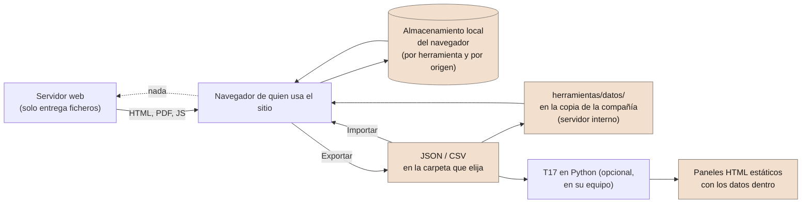

# Dónde están sus datos y cómo instalar SEVEN-G en un servidor propio

**Cómo funciona el sitio, por qué lo que introduce nunca llega a un servidor y cómo descargar el proyecto para alojarlo usted mismo, con una instalación por cliente**

| | |
|---|---|
| Documento | Documento 95 · Datos en local e instalación propia |
| Versión | 0.1 (borrador de trabajo) |
| Fecha | 22-09-2026 |
| Autor | Fernando García Varela |
| Estado | Borrador para revisión. Describe el sitio y las herramientas tal como están publicados en la fecha del documento. |

<!-- cifras: 0 | datos guardados en el servidor ; 1 | fichero HTML por herramienta ; 2 | formas de instalarlo ; 1 | origen web por cliente -->

---

> **Aviso legal y exención de responsabilidad.** SEVEN-G es un marco metodológico de referencia que se ofrece «tal cual» y con fines exclusivamente informativos. No constituye asesoramiento jurídico, regulatorio, financiero ni profesional, ni garantiza el cumplimiento de ninguna norma. Las referencias a regulación general (como el Reglamento Europeo de IA, el RGPD, DORA o NIS2), a normas técnicas y a regulación específica de cada sector o jurisdicción pueden ser incompletas, no aplicar a un caso concreto o quedar desactualizadas por cambios normativos, interpretaciones o criterios de las autoridades posteriores a su fecha de consulta. **Cada organización que use SEVEN-G es la única responsable de identificar la normativa que le aplica, verificar su vigencia y certificar su propio cumplimiento regulatorio**, con el asesoramiento cualificado que corresponda. El autor no asume responsabilidad alguna por el uso que se haga de este contenido ni por las decisiones que se adopten con él. Los datos, cifras, compañías y casos de los ejemplos son ficticios o ilustrativos.

> **Este documento describe el funcionamiento técnico del sitio, no sustituye la evaluación de la organización.** Quien vaya a introducir datos reales de una compañía en las herramientas, o a alojar el sitio en un servidor propio, debe valorar con sus responsables de seguridad y protección de datos si ese uso cumple sus políticas. Lo que aquí se afirma sobre dónde se guardan los datos se puede comprobar en el código del repositorio, que es público.

---

<!-- esencial: condicional | Disparador: se van a introducir datos reales de una compañía en las herramientas, o se va a instalar el sitio en un servidor propio (una consultora, un partner o un consultor independiente que trabaja para varios clientes). Regla que no se omite: los datos introducidos en las herramientas viven solo en el navegador de quien los introduce; la copia de seguridad es exportar el JSON; cada cliente necesita su propio origen web. -->

## 1. Objeto y alcance

Este documento responde a tres preguntas que se hacen quienes empiezan a usar SEVEN-G con datos reales:

1. **Cómo funciona el sitio**: qué es cada pieza (documentos, plantillas, herramientas, generador del panel, comunidad) y dónde se ejecuta.
2. **Dónde están los datos que se introducen**: por qué nunca llegan a un servidor, dónde se guardan, qué sí sale del navegador y hacia dónde, y cómo se hace una copia de seguridad.
3. **Cómo descargar el proyecto e instalarlo en un servidor propio**: de dónde se descarga, qué se copia, qué hace falta para regenerarlo y cómo montar una instalación separada para cada cliente, que es lo que necesita una consultora, un *partner* o un consultor independiente.

Se aplica al sitio publicado en <https://seachad.github.io/AI_CONSULTING/> y al repositorio público del que sale, <https://github.com/seachad/AI_CONSULTING>. Las licencias (contenidos CC BY 4.0, código MIT) y las condiciones de uso por terceros están en el documento 93; las reglas para consultores, en el 91.

---

## 2. Cómo funciona el sitio

El sitio es un **conjunto de ficheros estáticos**: páginas HTML, PDF, plantillas en Word y presentaciones, más las herramientas. No hay ninguna aplicación en el servidor, ninguna base de datos y ningún formulario que envíe datos al autor. El servidor solo entrega ficheros; todo lo que se calcula, se guarda o se dibuja ocurre en el navegador de quien lo usa.

| Pieza | Qué es | Dónde se ejecuta | Qué guarda y dónde |
|---|---|---|---|
| Documentos, plantillas y curso | Páginas HTML generadas desde Markdown, con su PDF; plantillas también en Word. | En el navegador; los PDF y los Word se descargan. | Nada. Solo preferencias de lectura (tema, tamaño de texto, historial de páginas visitadas) en el almacenamiento local del navegador. |
| Herramientas T01, T11, T14 y T15 | **Un solo fichero HTML** cada una, con la aplicación completa y unos datos de demostración ficticios incrustados. | Íntegramente en el navegador. No necesitan servidor: funcionan también abriendo el fichero desde el disco. | **Los datos que introduce, donde usted elija con el botón «Datos: …» de su barra**: solo en su navegador (por defecto), en un fichero JSON de su equipo o, en una copia del sitio en el servidor de la compañía, en la carpeta `herramientas/datos/` (sección 3). Exportan e importan JSON y CSV. |
| Panel del consejo (T17) | El panel completo, el panel móvil y el registro de recomendaciones, generados a partir del registro T01. Llevan incrustado el conector en JavaScript y **se regeneran solos en el navegador** con el registro guardado en él o con `herramientas/datos/T01_registro.json` de la copia de la compañía. El generador en Python (`t01_a_panel.py`) es opcional: produce los mismos paneles como ficheros estáticos para enviarlos. | En el navegador; el generador en Python, en el ordenador de quien lo ejecuta. | Nada nuevo en el navegador. Los ficheros generados con Python **contienen los datos**. |
| Página de comunidad | Incidencias y peticiones de mejora del marco, con votos. | En el navegador; **es la única página que envía algo**: el texto que usted escribe, a un repositorio público de GitHub a través de un intermediario. | El identificador que elige, en su navegador. Lo enviado queda público en GitHub (sección 3.3). |
| Índice de códigos («Ir a código», «Citados aquí») | Un fichero JavaScript generado con los destinos de todos los códigos del marco. | En el navegador. | Nada. |

<!-- grafico: Flujo de los datos | Todo lo que se introduce se queda en el navegador o en ficheros que controla la organización -->

> **Por qué importa.** Una herramienta que funciona sin servidor no puede perder datos en el servidor, no exige contratar nada y no obliga a la compañía a fiarse de un tercero para custodiar su cartera de iniciativas. A cambio, la custodia es suya: si los datos solo están en un navegador, la copia de seguridad la hace quien los introduce (sección 3.4).

---

## 3. Dónde están los datos que se introducen

### 3.1 En el navegador, no en el servidor

Cuando abre una herramienta por primera vez, el navegador copia los datos de demostración a su **almacenamiento local** (*localStorage*), una zona que cada navegador reserva por sitio en el propio equipo. Desde ese momento, cada cambio que hace —una iniciativa nueva, una decisión de puerta, un riesgo, un cálculo— se guarda ahí, al instante y sin que nada viaje por la red.

Ese es el primero de los tres lugares posibles. El botón **«Datos: …»** de la barra de cada herramienta dice cuál está en uso y abre el diálogo **«Dónde están mis datos»** para cambiarlo (documento 03 §2.1):

| Dónde | Para qué | Qué hay que saber |
|---|---|---|
| **Solo en el navegador** (por defecto) | Probar con datos propios sin instalar nada. | Es lo que describe esta sección: un navegador, un equipo; se pierde al limpiar el navegador. |
| **Un fichero JSON del equipo** | Trabajar en serio una persona o un equipo pequeño. | La herramienta reescribe el fichero con cada cambio y lo vuelve a leer al abrirla (Microsoft Edge o Google Chrome). Es el mismo formato que «Exportar»; puede estar en una carpeta sincronizada de la compañía. |
| **La copia del sitio en el servidor de la compañía** | Que toda la compañía vea la misma versión de la cartera. | La copia lleva la carpeta `herramientas/datos/` con el fichero de cada herramienta, que se carga en lugar de los datos de ejemplo (sección 4.3). Los cambios se siguen guardando en cada navegador o en un fichero; publicar una versión nueva es sustituir el fichero. |

En el navegador, cada herramienta usa su propia clave:

| Herramienta | Clave del almacenamiento local |
|---|---|
| T01 · Registro de iniciativas | `seveng-t01-datos-v1` |
| T11 · Calculadora de hipótesis de valor (con T13) | `seveng-t11-datos-v1` |
| T14 · Calculadora del índice de transformación | `seveng-t14-datos-v1` |
| T15 · Diagnóstico de madurez | `seveng-t15-datos-v1` |

T11, T14 y T15 leen además el registro T01 guardado en el mismo navegador cuando se abren desde él (`?desde=t01`), y devuelven sus resultados al registro por importación: el registro es la fuente de verdad de las demás herramientas (documento 03 §4.1). Todo ello ocurre dentro del navegador.

El servidor que aloja el sitio no tiene forma de recibir esos datos: no existe ningún punto de entrada que los acepte. Esto se puede comprobar en el código de cada herramienta, que es un único fichero HTML legible, y en la ausencia de cualquier programa en el servidor.

### 3.2 Qué significa en la práctica

| Consecuencia | Explicación |
|---|---|
| **Los datos son de un navegador y de un equipo.** | Lo que introduce en Edge no lo ve Chrome, y lo que introduce en su portátil no aparece en otro ordenador. No hay sincronización, porque no hay servidor que sincronice. Para llevar el registro a otro equipo, expórtelo e impórtelo (sección 3.4), guárdelo en un fichero del equipo o use la copia de la compañía (sección 3.1). |
| **Dependen del origen web.** | El almacenamiento local se separa por *origen* (protocolo, dominio y puerto). El registro guardado en `https://seachad.github.io` es distinto del guardado en su propia instalación, y un fichero abierto desde el disco (`file://`) tiene su propio almacenamiento, aislado. Es la razón por la que cada cliente necesita su propio origen (sección 4.5). |
| **Borrar los datos del navegador los borra.** | Si limpia el historial y los datos de sitios, o usa una ventana privada, los datos desaparecen. La única copia duradera es el JSON exportado. |
| **Varias personas, varios navegadores.** | Las herramientas son de un solo usuario por navegador. Un equipo que trabaja sobre el mismo registro lo hace por turnos con el JSON: una persona exporta, otra importa; T01 admite importar varios ficheros y **fusionarlos por código** (por ejemplo, un registro por área). |
| **Los ficheros generados llevan los datos.** | Un JSON exportado, un CSV o un panel del consejo generado con T17 contienen la información de la compañía. Trátelos como cualquier documento confidencial: quien envía un panel por correo o mensajería envía sus datos. |
| **El autor de SEVEN-G no puede ver sus datos.** | Ni el sitio ni las herramientas se los mandan, y no hay ninguna cuenta con la que asociarlos. |

### 3.3 Qué sí sale del navegador, y hacia dónde

Para que la afirmación anterior sea verificable, esta es la lista completa de lo que el sitio envía o carga desde fuera:

| Qué | Cuándo | Adónde | Qué contiene |
|---|---|---|---|
| **Una incidencia, una petición o un voto** | Solo si usted los envía desde la página de comunidad. | A un intermediario del autor y de ahí a un repositorio **público** de GitHub, como *issue*. | El título y el texto que escribe, y el identificador que eligió. **Queda público**: no escriba en él datos de clientes ni información interna. El intermediario no guarda registros de las peticiones. |
| **Medición agregada de visitas** | Solo en el sitio público `seachad.github.io`; nunca en `localhost`, en ficheros abiertos desde el disco ni en una instalación propia. | A Umami, herramienta de código abierto. | Página visitada, país y tipo de dispositivo, de forma agregada; sin *cookies*, sin dirección IP, sin datos personales; respeta la señal «No rastrear». No se mide la página de comunidad ni los paneles del consejo. Documento 04 §6.2. |
| **Tipografías** | Al abrir los documentos, la portada y la entrada del sitio. Las herramientas y los paneles **no cargan ningún recurso externo**. | A los servidores de Google Fonts. | La petición de la fuente tipográfica, que como toda petición web incluye la dirección IP de quien la hace. Ningún dato de las herramientas. En una instalación propia se puede quitar (sección 4.4). |
| **Las peticiones de páginas** | Siempre, como en cualquier sitio web. | Al servidor que aloja el sitio (GitHub Pages en el sitio público; el suyo en una instalación propia). | La página pedida y la dirección IP, en los registros del servidor, según la política de quien lo aloja. Nunca el contenido de las herramientas. |

Nada más. No hay cuentas, formularios de contacto, boletines ni píxeles de seguimiento, y el sitio no contacta a nadie por iniciativa propia (documento 04 §6.2).

### 3.4 Copia de seguridad y traslado entre equipos

La forma más cómoda, en Microsoft Edge o Google Chrome, es elegir **«Un fichero JSON del equipo»** en el diálogo «Dónde están mis datos»: la herramienta guarda cada cambio en ese fichero y lo vuelve a leer al abrirla, de modo que la copia de seguridad se hace sola y el fichero puede vivir en una carpeta sincronizada de la compañía. En cualquier navegador, y para llevar los datos a otro equipo:

1. En la herramienta, vaya a **Datos → Exportar → JSON completo** (en T01) o al botón equivalente de exportación (T11, T14, T15). Se descarga un fichero JSON con todo el contenido.
2. Guárdelo donde la compañía guarda sus documentos: es la copia de seguridad, el medio para compartirlo y la entrada del generador del panel (T17).
3. En otro equipo o navegador, **Datos → Importar JSON**. T01 valida el fichero antes de cargarlo y permite **sustituir** el registro actual o **fusionar** varios ficheros por código.
4. **Restaurar datos de demostración** y **Borrar los datos guardados en este navegador** (vista Datos de T01) piden confirmación y avisan de que exporte antes.

Recomendación: exporte al final de cada sesión de trabajo relevante y antes de cualquier limpieza del navegador, y guarde los JSON con fecha.

### 3.5 Antes de introducir datos reales

- Decida con seguridad y protección de datos si el navegador y el equipo cumplen las políticas de la compañía (cifrado del disco, bloqueo de sesión, perfiles de navegador separados).
- Evite introducir datos personales innecesarios: el registro necesita responsables por rol, no datos privados de personas.
- Si trabaja para varios clientes, use un origen web distinto por cliente (sección 4.5) o, como mínimo, exporte y borre los datos locales al cambiar de cliente.
- No pegue datos de un cliente en la página de comunidad.

> **Por qué importa.** La mayor parte de los incidentes con herramientas de este tipo no vienen de un ataque al servidor —aquí no hay servidor que atacar—, sino de un JSON compartido con quien no debía, un panel reenviado o un portátil compartido sin perfiles separados. Saber exactamente dónde están los datos permite aplicar las políticas de siempre de la compañía, sin inventar nada nuevo.

---

## 4. Instalar SEVEN-G en un servidor propio

### 4.1 Para quién y por qué

Cualquiera puede usar el sitio público tal cual. Una instalación propia tiene sentido cuando:

- una **consultora, un *partner* o un consultor independiente** trabaja con varios clientes y quiere una instalación separada por cliente, con sus datos y su panel;
- una **compañía** prefiere servir el marco desde su intranet, con su marca añadida y sin dependencias externas;
- se quiere **adaptar** documentos, plantillas o herramientas (obra derivada) y publicar la versión adaptada.

En todos los casos aplican las licencias del documento 93: reconocer la autoría, indicar los cambios, conservar el aviso legal y no presentar la instalación como certificada ni respaldada por el autor (documento 91 §6).

### 4.2 Qué se descarga y de dónde

El proyecto completo está en el repositorio público **<https://github.com/seachad/AI_CONSULTING>** (código MIT, contenidos CC BY 4.0). Dos formas de obtenerlo:

| Forma | Cómo | Cuándo conviene |
|---|---|---|
| **Descarga en ZIP** | Botón *Code → Download ZIP* del repositorio, o directamente <https://github.com/seachad/AI_CONSULTING/archive/refs/heads/main.zip>. | Para instalar una vez, sin herramientas de desarrollo. |
| **Clonar con Git** | `git clone https://github.com/seachad/AI_CONSULTING.git` | Para actualizarse con `git pull`, hacer un *fork* con cambios propios o publicar con GitHub Pages. |

Lo que contiene el repositorio:

| Carpeta | Contenido | Hace falta en una instalación |
|---|---|---|
| `index.html`, `en/index.html`, `LICENSE`, `LICENCIA_CONTENIDOS.md` | Portada del sitio en los dos idiomas y licencias. | Sí. |
| `SEVEN-G/html`, `SEVEN-G/pdf`, `SEVEN-G/docx`, `SEVEN-G/pptx` | Documentos, plantillas y curso ya generados, en los dos idiomas, con el índice de códigos (`codigos.js`). | Sí. |
| `SEVEN-G/herramientas` | Las herramientas T01, T11, T14 y T15 (un HTML cada una, más sus fuentes y datos de demostración), el generador T17 con su motor, la página de comunidad y el mapa de datos. | Sí. |
| `SPHERES/html`, `SPHERES/pdf`, `SPAD/html`, `SPAD/pdf` | Las metodologías de apoyo, ya generadas. | Sí, si se quieren servir. |
| `SEVEN-G/mds`, `SPHERES/mds`, `SPAD/mds` | Las fuentes Markdown de todo lo anterior. | Solo si se va a adaptar y regenerar. |
| `SEVEN-G/build` | El generador (`build.ps1`), la plantilla, los estilos, los componentes gráficos, el índice de códigos, el servidor local de revisión y las pruebas de coherencia. | Solo si se va a regenerar. |
| Carpetas cuyo nombre empieza por `_` o por `.` | Material de trabajo del autor, versiones no vigentes y configuración del repositorio. | No; no se publican. |

El repositorio **no contiene datos de nadie**: las herramientas llevan datos ficticios de demostración (documento 93 §9) y los datos reales nunca entran en él.

### 4.3 Opción A · Servir el sitio tal cual

Es la opción para quien quiere el sitio en su servidor sin cambiar nada. No hace falta generar: los HTML, PDF y demás salidas ya están en el repositorio.

1. Descargue o clone el repositorio (sección 4.2).
2. Copie a la raíz del servidor **solo lo publicable**, que es exactamente lo que publica el flujo de GitHub Pages del repositorio (`.github/workflows/pages.yml`): `index.html`, `en/`, `LICENSE`, `LICENCIA_CONTENIDOS.md`, `SEVEN-G/html`, `SEVEN-G/pdf`, `SEVEN-G/docx`, `SEVEN-G/pptx`, `SEVEN-G/herramientas`, `SPHERES/html`, `SPHERES/pdf`, `SPAD/html` y `SPAD/pdf`, excluyendo cualquier carpeta cuyo nombre empiece por `_`. Con PowerShell 7, `pwsh -File SEVEN-G/build/publicar.ps1 -SinGenerar -Destino <carpeta>` prepara esa copia (avisa si no encuentra la lista privada de términos prohibidos del autor; en una instalación propia ese aviso puede ignorarse o sustituirse por su propia lista).
3. Sírvalo con cualquier servidor de ficheros estáticos: IIS, nginx, Apache, un almacenamiento estático en la nube, la intranet corporativa o GitHub Pages de un *fork* (sección 4.7). No requiere ningún módulo, base de datos ni configuración especial; conviene que los ficheros `.html`, `.js`, `.json`, `.pdf`, `.docx` y `.pptx` se sirvan con su tipo de contenido habitual.
4. **Sírvalo por `http` o `https`, no como ficheros sueltos.** Abrir los HTML con doble clic funciona, pero el navegador aísla el almacenamiento local de cada fichero: el tema no se comparte, T11/T14/T15 no ven el registro de T01, el panel completo no cede el paso al móvil y el índice de códigos no se carga. Para probar en local basta `pwsh -File SEVEN-G/build/servidor.ps1` y abrir `http://localhost:8765/`.
5. Compruebe la portada, un documento, el registro T01 y el panel de ejemplo. Los enlaces son relativos: el sitio puede vivir en la raíz del dominio o en una subcarpeta.
6. Para que toda la compañía vea la misma cartera, cree en la copia la carpeta `SEVEN-G/herramientas/datos/` con los JSON exportados por las herramientas que use: `T01_registro.json`, `T11_calculadora.json`, `T14_indice.json` y `T15_madurez.json`. Servidas por http, las herramientas los cargan en lugar de los datos de ejemplo y **el panel del consejo se regenera solo en el navegador** con `T01_registro.json` (clave `datos_t01` de `config_panel.json`, ya puesta en el ejemplo). Publicar una versión nueva de la cartera es sustituir el fichero (documento 03 §2.1).

Lo que ocurre con la instalación propia respecto al sitio público:

- **No se mide nada.** La medición de visitas solo se activa en los dominios indicados en `SEVEN-G/build/analitica.json` (hoy, solo `seachad.github.io`); en cualquier otro dominio el índice de códigos no carga el script de Umami. Si quiere medir su propia instalación, ponga su propio identificador y dominio en ese fichero y regenere (sección 4.4).
- **La página de comunidad sigue apuntando al repositorio público del autor.** Es lo deseable si quiere que sus usuarios puedan proponer mejoras del marco; si no, ponga `endpoint: ''` en el bloque `config` de `SEVEN-G/herramientas/comunidad/index.html` (queda en solo lectura) o retire la página y su botón de la portada.
- **Los documentos cargan las tipografías de Google Fonts.** Si su política lo exige, quite el enlace `fonts.googleapis.com` de `SEVEN-G/build/plantilla.html` y de las portadas y regenere: el estilo tiene definidas tipografías de reserva.

### 4.4 Opción B · Adaptar y regenerar

Para cambiar textos, añadir la marca de la consultora, traducir o adaptar plantillas, se edita el Markdown y se regenera todo. Requisitos y comandos (Windows; el generador está escrito en PowerShell 7 y usa Microsoft Edge para los PDF, sin Node, Python ni pandoc):

| Qué | Requisito | Comando |
|---|---|---|
| Documentos, plantillas, curso, índice de la biblioteca e índice de códigos (HTML, PDF, Word) | PowerShell 7 y Microsoft Edge. | `pwsh -File SEVEN-G/build/build.ps1` (todo) · `-Metodologias SEVEN-G` · `-Filter '03_*.md'` (un documento) · `-SinPdf` |
| Cursos en presentación (PPTX) y su PDF | PowerShell 7; PowerPoint solo para exportar el PDF (opcional). | Lo ejecuta `build.ps1`. |
| Herramientas T01, T11, T14 y T15 | PowerShell 7 (Edge para los cálculos desde T01 de T14 y T15). | `pwsh -File SEVEN-G/herramientas/T01_registro_iniciativas/build_registro.ps1` y los `build_*.ps1` equivalentes. |
| Generador del panel (T17), solo para publicar el panel como ficheros estáticos (por ejemplo, para enviarlos): en el sitio, el panel se regenera solo en el navegador. | Python 3.11 o superior con `uv` (opcional). | `uv run python t01_a_panel.py --t01 <registro.json> --salida <carpeta>` desde `SEVEN-G/herramientas/T17_panel_consejo`. |
| Pruebas de coherencia antes de publicar | PowerShell 7, Edge; `uv` para comprobar el panel. | `pwsh -File SEVEN-G/build/verificar_coherencia.ps1` |

Reglas del generador que conviene conocer: el Markdown es la fuente de verdad y los HTML, PDF y Word nunca se editan a mano; cada documento existe en español e inglés; las convenciones del Markdown (portada, cifras, figuras, Mermaid, recuadro «Lo esencial») están en la cabecera de `build.ps1`; y toda obra derivada debe indicar los cambios y conservar el aviso legal (documento 93 §8 y §11.9).

### 4.5 Una instalación por cliente

Es el caso de una consultora, un *partner* o un consultor independiente. La regla central es sencilla: **cada cliente necesita su propio origen web**, porque el almacenamiento local del navegador se separa por origen y no por carpeta. Dos clientes servidos desde `https://consultora.example/cliente-a/` y `https://consultora.example/cliente-b/` **compartirían** el registro guardado en el navegador del consultor; servidos desde `https://cliente-a.consultora.example/` y `https://cliente-b.consultora.example/` (o desde puertos distintos en local), no.

Lista de comprobación por cliente:

| Paso | Qué hacer | Dónde |
|---|---|---|
| 1 | Un origen por cliente: subdominio, dominio o puerto propio. | Servidor web. |
| 2 | Un registro que arranque con los datos del cliente y no con la demostración: en la copia del cliente, la carpeta `SEVEN-G/herramientas/datos/` con su `T01_registro.json` exportado (y, si los usa, `T11_calculadora.json`, `T14_indice.json` y `T15_madurez.json`); las herramientas los cargan en lugar de la demostración. Alternativa sin carpeta de datos: construir `registro.html` a partir del JSON del cliente; con `meta.datos_ilustrativos` ausente o `false` desaparece la banda de «iniciativas de ejemplo». | Carpeta `datos/` de la copia, o `pwsh -File build_registro.ps1 -Datos <cliente.json> -Salida <registro.html>` en `SEVEN-G/herramientas/T01_registro_iniciativas`. |
| 3 | El panel del consejo del cliente se regenera solo en el navegador desde ese `T01_registro.json` (clave `datos_t01` de `config_panel.json`) o desde el registro guardado en el navegador. Solo si quiere publicarlo como ficheros estáticos para enviarlos, genérelo con T17 en Python, con el nombre y las siglas del cliente y una copia propia de `config_panel.json` (umbrales, ciclo de vida, enlaces de vuelta al sitio, `codigos`). | `uv run python t01_a_panel.py --t01 <cliente.json> --salida <carpeta> --organizacion "<Cliente>" --sigla <CA>` |
| 4 | Los datos del cliente, fuera del repositorio y de la carpeta publicada: los JSON exportados y los paneles generados se guardan en el repositorio documental del cliente o de la consultora, con su control de acceso. | Gestión documental. |
| 5 | Comunidad y medición: decidir si la página de comunidad sigue apuntando al proyecto público (recomendado) y no activar ninguna medición sobre los usuarios del cliente sin su consentimiento (sección 4.3). | `comunidad/index.html`, `analitica.json`. |
| 6 | Marca y reconocimiento: puede añadir la marca de la consultora y su adaptación, indicando los cambios y conservando la autoría y el aviso legal (documento 93 §4 y §8); no puede presentar la instalación como certificada ni como «*partner* oficial» (documento 91 §6.2). | Portada y documentos adaptados. |
| 7 | Al cambiar de cliente en el mismo equipo, exportar y **Borrar los datos guardados en este navegador** en cada herramienta, o usar perfiles de navegador separados. | Vista Datos de cada herramienta. |

Con esto, cada cliente tiene su sitio, su registro, su panel y sus datos, sin que nada de un cliente pueda mezclarse con lo de otro y sin que nada llegue al autor de SEVEN-G.

### 4.6 Actualizarse a una versión nueva

El marco es un proyecto vivo. Para incorporar una versión nueva:

1. Si clonó el repositorio, `git pull`; si lo descargó, descargue el ZIP de nuevo. Los datos no se pierden porque nunca están en el repositorio.
2. Vuelva a copiar lo publicable (sección 4.3) o regenere (sección 4.4).
3. Los registros exportados con una versión anterior del esquema de T01 **siguen siendo válidos**: las herramientas actualizan el esquema al importar y las versiones nuevas solo añaden campos opcionales (decisión D53 del proyecto).
4. Revise el historial de versiones del documento 04 §2.3 y el control de versiones de cada documento para saber qué ha cambiado.

### 4.7 Fork en GitHub con Pages

Un *partner* que quiera publicar su versión adaptada puede hacer un *fork* del repositorio en GitHub: el flujo `.github/workflows/pages.yml` ya está preparado y publica solo lo publicable en cada *push* a `main`. Basta activar en el *fork* *Settings → Pages → Source: GitHub Actions*. El sitio resultante es público; para una instalación privada por cliente, use la opción A en un servidor propio.

> **Por qué importa.** Para una consultora, poder ofrecer a cada cliente una instalación separada, alojada donde el cliente decida y sin dependencia del autor, elimina la objeción más habitual —«¿dónde van mis datos?»— y convierte el marco en una herramienta de trabajo propia. Que el procedimiento esté documentado y sea repetible es lo que permite hacerlo para el segundo cliente igual que para el primero.

---

## 5. Preguntas frecuentes

| Pregunta | Respuesta |
|---|---|
| ¿Puede el autor de SEVEN-G ver lo que introduzco en las herramientas? | No. Los datos se quedan en su navegador y no hay ningún servidor del autor que los reciba. |
| ¿Y GitHub, que aloja el sitio público? | GitHub entrega los ficheros del sitio y registra las peticiones como cualquier servidor web; no recibe el contenido de las herramientas, que nunca sale del navegador. |
| ¿Se cifran los datos en el navegador? | El almacenamiento local se guarda en el perfil del navegador, con las protecciones del sistema operativo (cifrado del disco, sesión de usuario). No añade cifrado propio; por eso la copia de seguridad y el control de acceso al equipo son suyos. |
| ¿Puedo usar las herramientas sin conexión? | Sí. Una vez descargado el fichero HTML funciona sin red. Servido desde un servidor local (`servidor.ps1`) también. |
| ¿Cómo trabaja un equipo sobre el mismo registro? | Con el JSON: un fichero del equipo en una carpeta sincronizada (cada cambio se guarda en él), la carpeta `herramientas/datos/` de la copia de la compañía, que todos ven, o exportar e importar (sustituir o fusionar por código). No hay edición simultánea. |
| ¿Puedo poner el sitio en la intranet sin conexión a internet? | Sí, con la opción A. Solo dejarán de cargarse las tipografías externas (hay tipografías de reserva) y la página de comunidad no podrá enviar ni leer incidencias. |
| ¿Qué pasa si el autor deja de publicar el sitio? | Lo descargado sigue funcionando y sigue bajo las mismas licencias: las versiones publicadas no se pueden revocar (documento 93 §10). |

---

## 6. Herramientas y plantillas asociadas

| Código | Nombre | Relación con este documento |
|---|---|---|
| T01 | Registro de iniciativas | Guarda los datos en el navegador; exporta e importa el JSON completo; construcción con datos propios (`build_registro.ps1 -Datos`). |
| T11, T14, T15 | Calculadora de valor, índice de transformación y diagnóstico de madurez | Mismo funcionamiento; leen el registro T01 del mismo navegador. |
| T17 | Panel de IA para el consejo | Se regenera en el navegador desde el registro T01; el generador en Python es opcional y sus ficheros contienen los datos. |
| P70 | Propuesta y carta de encargo | Donde una consultora deja constancia de dónde se alojan la instalación y los datos del cliente. |

---

## 7. Documentos relacionados

| Documento | Relación |
|---|---|
| **03 · Herramientas y registro de iniciativas** | Principios de diseño de las herramientas (§2: sin servidor, datos de la compañía, códigos navegables), dónde viven los datos de las herramientas y cómo montar la copia de la compañía (§2.1) y mapa de datos entre herramientas (§4.1). |
| **04 · De dónde viene SEVEN-G y por qué es abierto** | Qué hace y qué no hace el sitio con quien lo visita (§6.2) y historial de versiones del marco (§2.3). |
| **90 · Guía de implantación** | Requisitos previos y plan de 90 días de una compañía. |
| **91 · Guía para consultores** | Uso del marco por terceros, independencia y uso del nombre. |
| **93 · Licencia, uso por terceros y citación** | Licencias, obras derivadas, aviso que deben conservar, datos ficticios y permanencia de las versiones publicadas. |

---

## 8. Control de versiones

| Versión | Fecha | Cambios |
|---|---|---|
| 0.1 | 22-09-2026 | Primera versión: cómo funciona el sitio, dónde se guardan los datos introducidos (solo en el navegador), qué sale del navegador y hacia dónde, copia de seguridad, e instalación en un servidor propio desde el repositorio público, con una instalación por cliente para consultoras, *partners* y consultores independientes. |
