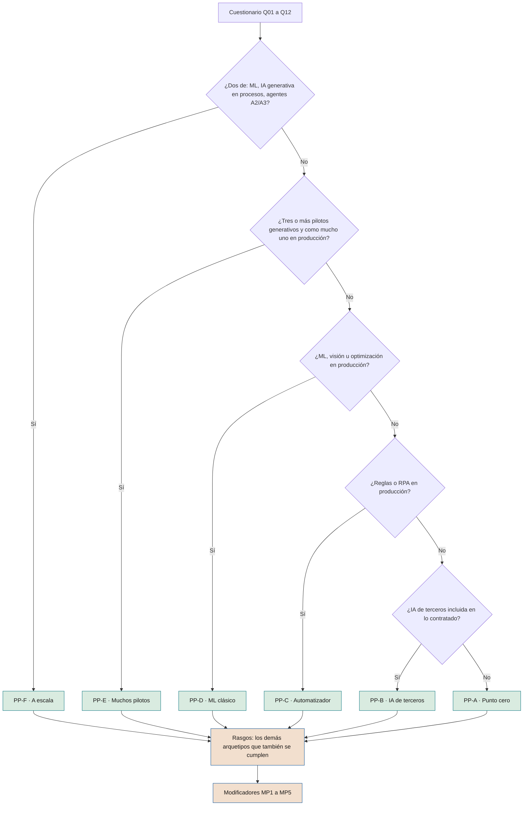
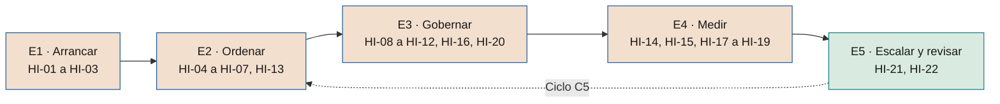

# Puntos de partida y recorrido de implantación

**Por dónde empieza cada compañía según la IA y el gobierno que ya tiene, qué hace en cada etapa, quién lo hace y con qué evidencia, sin rebajar lo que el marco exige al final**

| | |
|---|---|
| Documento | Documento 96 · Puntos de partida y recorrido de implantación |
| Versión | 0.1 (borrador de trabajo) |
| Fecha | 28-09-2026 |
| Autor | Fernando García Varela |
| Estado | Borrador para revisión. Documento de orientación: ordena las reglas de los documentos 01, 11, 90 y 94, que prevalecen; no crea reglas nuevas. |

<!-- cifras: 6 | puntos de partida tipo ; 5 | modificadores ; 22 | hitos del recorrido ; 5 | etapas hasta la declaración de aplicación -->

---

> **Aviso legal y exención de responsabilidad.** SEVEN-G es un marco metodológico de referencia que se ofrece «tal cual» y con fines exclusivamente informativos. No constituye asesoramiento jurídico, regulatorio, financiero ni profesional, ni garantiza el cumplimiento de ninguna norma. Las referencias a regulación general (como el Reglamento Europeo de IA, el RGPD, DORA o NIS2), a normas técnicas y a regulación específica de cada sector o jurisdicción pueden ser incompletas, no aplicar a un caso concreto o quedar desactualizadas por cambios normativos, interpretaciones o criterios de las autoridades posteriores a su fecha de consulta. **Cada organización que use SEVEN-G es la única responsable de identificar la normativa que le aplica, verificar su vigencia y certificar su propio cumplimiento regulatorio**, con el asesoramiento cualificado que corresponda. Esta metodología es una ayuda genérica y gratuita, compartida con la comunidad para que nadie tenga que empezar desde cero; cada persona u organización puede y debe adaptarla a su propio uso. No debe entenderse que sus partes jurídicamente sensibles hayan sido revisadas por una asesoría jurídica: esas revisiones, para cada empresa o sector, son responsabilidad última de la empresa, el consultor o la organización que la use. Aunque se procura mantenerla al día, alguna norma puede haber cambiado sin que se recoja aquí. En la máxima medida permitida por la ley, el autor no asume responsabilidad alguna por los efectos de su aplicación en ninguna organización ni por su aplicabilidad completa. La metodología no otorga certificación de ningún tipo. El autor no asume responsabilidad alguna por el uso que se haga de este contenido ni por las decisiones que se adopten con él. Los datos, cifras, compañías y casos de los ejemplos son ficticios o ilustrativos.

---

<!-- esencial: recomendado | Sirve para elegir el orden de la implantación según el punto de partida de la compañía (sin IA, con IA de terceros, con automatización, con ML, con muchos pilotos o a escala). Regla que no se omite: el punto de partida cambia el orden, el énfasis y el calendario, nunca lo que se exige al final; las siete condiciones de la declaración de aplicación (01 §14) son las mismas para todos. La herramienta T23 hace el cuestionario y el plan. -->

## 1. Objeto y alcance

La guía de implantación (documento 90) describe **qué** hay que tener y en qué plazo máximo: alcance Lite o Enterprise, requisitos previos, plan de 90 días, regularización de lo existente y hoja de ruta hasta la declaración de aplicación. Pero las compañías no parten del mismo sitio. Una que no tiene ninguna IA en producción y otra que tiene cuarenta modelos predictivos y dos agentes que actúan necesitan **empezar por cosas distintas**, aunque tengan que llegar al mismo lugar.

Este documento responde a tres preguntas:

1. **¿Desde dónde parte la compañía?** Seis puntos de partida tipo (arquetipos), cinco modificadores y un cuestionario de doce preguntas para asignarlos (sección 2).
2. **¿Qué hace primero, qué después y quién lo hace?** Cinco etapas y veintidós hitos, cada uno con su evidencia, la pregunta del documento 11 que lo acredita y su prioridad según el punto de partida (secciones 3 y 4), más lo que le toca a cada rol (sección 5).
3. **¿Cómo se ve en la práctica?** Tres recorridos ficticios (sección 6).

La herramienta **T23 · Recorrido de implantación** aplica este documento: hace el cuestionario, asigna el punto de partida y muestra el recorrido priorizado por etapas y por rol.

> **Por qué importa.** Si una compañía sin IA empieza por constituir todos los órganos, se queda en burocracia sin casos. Si una compañía con agentes en producción empieza por la ficha de caso, deja sin control lo que ya actúa sobre clientes o dinero. El punto de partida decide **qué se hace primero**, no qué se exige al final.

**Qué no hace este documento.** No crea reglas: las fases, puertas, roles, plazos y condiciones están en los documentos 01, 20, 21, 30 y 90, y la obligatoriedad de cada pieza en el 94. Si este documento discrepa de ellos, prevalecen ellos. Tampoco sustituye el diagnóstico de madurez (documento 11): lo usa.

---

## 2. Puntos de partida

### 2.1 Los seis arquetipos

| Código | Arquetipo | Cómo se reconoce | Riesgo típico | Por dónde empieza | Qué puede esperar |
|---|---|---|---|---|---|
| **PP-A** | Punto cero | No hay IA propia en producción ni contratada de forma consciente. Suele haber uso no autorizado de asistentes generativos. | Uso no autorizado con datos de la compañía; ideas sin dueño. | Mandato y patrocinador; inventario del uso no autorizado; política de uso aceptable y alfabetización básica; ficha de caso (P01) y registro T01 para las primeras ideas. | Regularización (no hay nada que regularizar); seguridad de agentes y operación, hasta que un caso llegue a la fase 4. |
| **PP-B** | Usuario de IA de terceros | Asistentes en la suite ofimática, SaaS con IA incluida o IA contratada; no desarrolla. | IA que entra sin pasar por ninguna puerta (54 §5); coste de licencias sin adopción medida. | Inventario de la IA incluida en lo contratado (36 §8, P55); exigencia a proveedores N1–N3 (36, P14); política de uso aceptable; medir el asistente como iniciativa transversal con escalera por unidad (40 §7.2). | Construcción propia (53) y parte del ciclo técnico, hasta que construya algo. |
| **PP-C** | Automatizador | Automatización con reglas o RPA en producción, con un centro de excelencia o equipo de automatización; poca o ninguna IA que aprenda. | Confundir automatización con IA; paso de bots a agentes (A2/A3) sin los controles del documento 35. | Convertir el centro de excelencia en el embrión de la oficina de IA (30); inventario que separa lo que es IA de lo que no lo es (32); cartera de casos que sustituyen reglas por IA, cada uno con su ficha. | Su disciplina de procesos es un activo: el rediseño del proceso de extremo a extremo (IT-P2) le resulta más fácil. |
| **PP-D** | Analítica y ML clásico | Modelos predictivos en producción, equipo de datos y, a veces, validación de modelos. | Modelos en producción sin revisión de continuidad; IA generativa que entra por fuera del gobierno de modelos. | Regularización de lo que está en producción (90 §5, revisión equivalente a G7); llevar la validación de modelos existente a G5 y R6; deriva y monitorización (52); inventario con clasificación regulatoria. | El hueco es la IA generativa: fuentes de conocimiento (51; D3.08), evaluación con conjuntos de prueba (D4.08) y sesgo en las respuestas (52 §4.2.7). |
| **PP-E** | Muchos pilotos | Varias pruebas de concepto de IA generativa (orientativamente, tres o más) y ninguna o una en producción. | «Purgatorio de pilotos»: coste sin valor y sin decisión de parar. | Registrar todos los pilotos en T01 en su fase real; G3 como puerta de parada y el embudo para parar o escalar; hipótesis de valor y línea base (40, P08, P09) antes de más presupuesto. | La estructura completa de órganos: primero la decisión sobre la cartera, después el resto. |
| **PP-F** | A escala | Al menos dos de estas tres cosas en producción: ML predictivo, IA generativa integrada en procesos y agentes que actúan (A2/A3). | Exposición regulatoria y de seguridad ya real; gobierno por detrás del uso. | Roles separados y auditor de IA de inmediato; inventario completo con clasificación; seguridad de agentes (35) y proveedores (36); regularización priorizada por riesgo; panel del consejo e índice de transformación. | Nada: todo es obligatorio y urgente. |

> **Por qué importa.** Poner nombre al punto de partida evita dos errores opuestos: copiar el plan de otra compañía que partía de otro sitio y creer que, como ya se tiene algo (un comité de datos, un centro de automatización), no hay que adaptarlo.

### 2.2 Regla de asignación

Se aplica en este orden y se asigna el **primer arquetipo** cuyas condiciones se cumplen. Los arquetipos posteriores cuya condición positiva también se cumple (sin sus exclusiones: por ejemplo, «reglas o RPA en producción» basta para el rasgo PP-C aunque haya también ML) se añaden como **rasgos**: sus hitos prioritarios se suman al recorrido (sección 4.3, regla 5).

| Orden | Arquetipo | Condición |
|---|---|---|
| 1 | PP-F | Al menos dos de {ML predictivo, IA generativa integrada en procesos, agentes A2 o A3} en producción. |
| 2 | PP-E | Tres o más pilotos de IA en curso, en su mayoría de IA generativa, y como mucho uno de IA generativa en producción. |
| 3 | PP-D | ML predictivo, visión u optimización con aprendizaje en producción. |
| 4 | PP-C | Reglas o RPA en producción, sin IA que aprenda en producción. |
| 5 | PP-B | IA de terceros incluida en productos o asistentes corporativos, sin construcción propia en producción. |
| 6 | PP-A | Ninguna de las anteriores. |

<!-- grafico: Cómo se asigna el punto de partida | Se asigna el primer arquetipo que se cumple; los siguientes que también se cumplen son rasgos -->

Ejemplo: una compañía con ML en producción, cuatro pilotos generativos sin producción y RPA recibe **PP-E con rasgos PP-D y PP-C**. Empieza por parar o escalar los pilotos, pero también regulariza sus modelos y aprovecha su centro de automatización.

### 2.3 Modificadores

| Código | Modificador | Efecto en el recorrido |
|---|---|---|
| **MP1** | Sector regulado (financiero, seguros, sanidad, energía, sector público…) | Adelanta el inventario con clasificación (HI-05), el mapeo regulatorio (34) y la resiliencia (DORA o NIS2, si aplican). |
| **MP2** | Decisiones sobre personas, alto riesgo o exposición directa a clientes | Adelanta las evaluaciones de impacto (P11, P47, P48), la supervisión humana (P17) y el responsable de riesgos independiente (HI-10). |
| **MP3** | Alcance Enterprise de compañía (90 §2.2) | Calendario Enterprise de 90 §6.2. Sin MP3, calendario Lite y ruta mínima de 90 §2.4. |
| **MP4** | Gobierno previo reutilizable (validación de modelos, comité de datos, centro de excelencia, sistema de gestión certificado) | Los hitos correspondientes se **convalidan**: se adapta lo existente y se documenta la correspondencia, en lugar de crearlo de nuevo (sección 4.3, regla 3). |
| **MP5** | Sin patrocinador en la alta dirección | **Bloquea**: antes de cualquier otro hito hay que cumplir los requisitos previos de 90 §3. No es un hito más: es una condición previa. |

> **Por qué importa.** Dos compañías del mismo arquetipo no tienen el mismo recorrido si una está supervisada por un regulador sectorial o decide sobre personas. Los modificadores recogen esas diferencias sin multiplicar los arquetipos.

### 2.4 Cuestionario de clasificación

Doce preguntas. Las respuestas se refieren a lo que está **en producción** (en uso real), salvo que la pregunta diga otra cosa. La herramienta T23 las propone desde el registro T01 cuando lo hay.

| Código | Pregunta | Respuestas | Alimenta |
|---|---|---|---|
| **Q01** | ¿Qué tipos de sistemas hay en producción hoy? (varias respuestas; si hay IA generativa, cuántos casos: uno o más de uno) | Ninguno · reglas o RPA · IA de terceros incluida en productos o asistentes · ML predictivo, visión u optimización · IA generativa integrada en procesos · agentes que ejecutan acciones (A2/A3) | Arquetipos; huella tecnológica (11 §7.6) |
| **Q02** | ¿Cuántos pilotos o pruebas de concepto de IA hay en curso? | 0 · 1–2 · 3–5 · más de 5 | PP-E |
| **Q03** | ¿Cuántos de esos pilotos son de IA generativa? | Ninguno · alguno · la mayoría | PP-E |
| **Q04** | ¿Hay constancia de uso no autorizado de asistentes de IA con datos de la compañía? | Sí · No · No se sabe | Prioridad de HI-02 y HI-03 |
| **Q05** | ¿Qué gobierno existe hoy sobre modelos, automatización o datos? | Ninguno · parcial (validación de modelos, centro de excelencia, comité de datos) · sistema formal | MP4 |
| **Q06** | ¿Existe un inventario de los sistemas de IA? | No · parcial · completo con responsable | Prioridad de HI-05 |
| **Q07** | ¿Está la compañía en un sector regulado? | Sí · No | MP1 |
| **Q08** | ¿Toma o apoya la IA decisiones sobre personas, está expuesta a clientes o puede ser de alto riesgo? | Sí · No · No se sabe | MP2 |
| **Q09** | ¿Se cumple algún criterio de alcance Enterprise de 90 §2.2? | Sí · No | MP3 |
| **Q10** | ¿Hay un miembro de la alta dirección con responsabilidad escrita sobre la IA? | Sí · No | MP5 (si no); D1.01 |
| **Q11** | ¿Recibe la dirección o el consejo un informe o panel periódico sobre la IA? | Ninguno · la dirección · el consejo | HI-15; D7.04 y D7.06 |
| **Q12** | ¿Tiene la compañía equipo propio de datos o de desarrollo de IA? | Sí · No · a través de terceros | PP-B y PP-D; HI-20 |

«No se sabe» se trata como «sí» a efectos de prioridad: si nadie sabe si hay uso no autorizado o decisiones sobre personas, averiguarlo es lo primero.

---

## 3. Las cinco etapas

| Etapa | Objetivo | Referencia en el documento 90 |
|---|---|---|
| **E1 · Arrancar** | Hay patrocinador y mandato, y se sabe qué IA hay. | Semana 1 y mes 1 (90 §4.2) |
| **E2 · Ordenar** | Todo está en el registro y en el inventario, y se decide sobre la cartera. | Meses 1–3 (90 §4.2–§4.3) |
| **E3 · Gobernar** | Órganos, roles separados, riesgos y ciclo de vida funcionando. | Meses 3–6 (90 §4.4, §6.1) |
| **E4 · Medir** | Valor medido, panel en la dirección y en el consejo, operación bajo control. | Meses 4–12 (90 §6.1) |
| **E5 · Escalar y revisar** | Auditoría, revisión anual C5, índice recalculado y declaración de aplicación. | Meses 12–18 (90 §6.1–§6.2) |

<!-- grafico: Las cinco etapas del recorrido | Cada etapa agrupa hitos; el punto de partida cambia el orden dentro de ellas, no las etapas -->

Las etapas se solapan: una compañía puede estar midiendo el valor de sus primeros casos (E4) mientras termina de regularizar lo antiguo (E3). Lo que no se hace es saltarse una etapa.

---

## 4. Los hitos del recorrido

### 4.1 Qué es cada hito, quién lo hace y cómo se acredita

Cada hito indica qué hay que tener, quién lo lidera, con qué plantilla o herramienta, **qué pregunta del documento 11 lo acredita** y el mes base del documento 90 (Lite / Enterprise).

| Hito | Etapa | Qué hay que tener | Quién | Evidencia | Pregunta 11 | Mes base (Lite / Enterprise) |
|---|---|---|---|---|---|---|
| **HI-01** | E1 | Patrocinador en la alta dirección y mandato de implantación con perímetro | Consejo o consejero delegado; patrocinador | P32 | D1.01 | Semana 1 |
| **HI-02** | E1 | Inventario del uso corporativo y del uso no autorizado de IA | Oficina de IA; seguridad | P05; T01 (T02); T21 | D6.03 | 1 / 1 |
| **HI-03** | E1 | Política de uso aceptable y alfabetización básica | Oficina de IA; personas | 31; P43; P45 | D1.04; D5.03 | 3 / 3 |
| **HI-04** | E2 | Ficha de caso y registro de iniciativas con todas las ideas y pilotos en su fase real | Oficina de IA; responsables de producto | P01; T01 | D2.01; D2.03 | 1–3 / 1–3 |
| **HI-05** | E2 | Inventario completo con clasificación regulatoria, intensidad y responsable, incluida la IA de terceros | Oficina de IA; riesgos; jurídico | P04; P05; P07; 32; 36 §8 | D6.05 | 6 / 9 |
| **HI-06** | E2 | Diagnóstico C1: madurez verificada, índice de transformación y huella tecnológica | Oficina de IA; evaluador independiente | P33; P34; T15; T14 | D7.08 | 1–2 / 1–2 |
| **HI-07** | E2 | Tesis, ambición por esfera y apetito de riesgo aprobados por el consejo (C2) | Patrocinador; consejo | P35; 13 | D1.05 | 3 / 3–4 |
| **HI-08** | E3 | Comité de IA, oficina de IA y comisión delegada constituidos | Comité de dirección; consejo | P38; 30 | D1.07 | 3 / 4 |
| **HI-09** | E3 | Roles separados en cada iniciativa: responsable de producto, técnico y de operación, responsable de riesgos independiente y auditor de IA (en Enterprise, en todos los *gates*) | Comité de IA | P03; P41; 01 §8 | D1.08 | 3 / 4 |
| **HI-10** | E3 | Responsable de riesgos de IA independiente y registro de riesgos con la escala del documento 33 desde la fase 3 | Comité de IA; riesgos | 33; P12; P13; T06 | D6.04; D6.06 | 6 / 9 |
| **HI-11** | E3 | Ciclo de vida con *gates* registrados para toda iniciativa nueva | Oficina de IA; decisores de *gate* | 20; 21; 22; P29; T03 | D2.06 | 4 / 6 |
| **HI-12** | E3 | Regularización de lo que está en producción (revisión equivalente a G7, primero lo de más riesgo) | Responsables de operación; auditor de IA | 90 §5; 14 §11; P30 | D4.07 | 6–12 / 6–12 |
| **HI-13** | E2 | Decisión de parar o escalar cada piloto, con G3 como puerta de parada y el embudo de T01 | Comité de IA | 21 §6.4; T01 | D2.04; D2.09 | 4 / 6 |
| **HI-14** | E4 | Reglas de medición del valor, línea base e hipótesis falsable en cada iniciativa desde G2 | Control de gestión; responsables de negocio del beneficio | 40; P08; P09; T11 | D2.08; D7.03; D7.05 | 6 / 9 |
| **HI-15** | E4 | Informe periódico a la dirección y panel del consejo | Oficina de IA; comisión delegada | 60; P67; T17 | D7.04; D7.06; D1.09 | 3 (dirección) · 6 / 9–12 (consejo) |
| **HI-16** | E3 | Seguridad de agentes y exigencia a proveedores N1–N3 | Seguridad; compras; riesgos | 35; 36; P14; P18; P55 | D6.08 | Antes de G5 |
| **HI-17** | E4 | Operación bajo control: manual, monitorización y deriva, reversión probada y R6 vigente | Responsables de operación | 52; P24; P25; P65 | D4.05; D4.06; D4.07 | 9 / 12–15 |
| **HI-18** | E4 | No conformidades e incidentes con el proceso de 01 §12 | Riesgos; auditoría interna | 37; P50; P26 | D6.07 | 6 / 9 |
| **HI-19** | E4 | Adopción y personas: plan de adopción, capacidad liberada separada del ahorro e información a la representación de los trabajadores | Personas; responsables de negocio del beneficio | 23; 50; P20; T20 | D5.07; D5.08; D5.09 | Antes de G4 |
| **HI-20** | E3 | Datos y conocimiento con propietario, base legal y vigencia, también las fuentes de la IA generativa | Propietarios de datos; protección de datos | 51; P64 | D3.03; D3.05; D3.08 | 6 / 9 |
| **HI-21** | E5 | Primera auditoría del marco por la tercera línea o por un externo | Auditoría interna | 38; P58–P61 | D6.10 | 12 / 12 |
| **HI-22** | E5 | Revisión C5: madurez recalculada con el mismo cuestionario, índice, tesis revisada y declaración de aplicación | Comité de IA; consejo | P37; P61; 01 §14 | D1.11 | 6–12 / 13–18 |

### 4.2 Prioridad de cada hito según el punto de partida

Claves: **1**, arrancar ya (meses 1–2); **2**, en su etapa (meses 3–6); **3**, más adelante (meses 7–18); **C**, convalidar lo que ya existe; **D**, cuando aparezca el disparador (primera iniciativa en esa fase, primer agente, primer proveedor…); **·**, no aplica todavía.

| Hito | PP-A | PP-B | PP-C | PP-D | PP-E | PP-F |
|---|---|---|---|---|---|---|
| **HI-01** | 1 | 1 | 1 | 1 | 1 | 1 |
| **HI-02** | 1 | 1 | 1 | 1 | 1 | 1 |
| **HI-03** | 1 | 1 | 2 | 2 | 1 | 1 |
| **HI-04** | 1 | 2 | 1 | 1 | 1 | 1 |
| **HI-05** | 2 | 1 | 2 | 1 | 2 | 1 |
| **HI-06** | 1 | 1 | 1 | 1 | 1 | 1 |
| **HI-07** | 2 | 2 | 2 | 2 | 2 | 2 |
| **HI-08** | 2 | 2 | C | C | 2 | 1 |
| **HI-09** | 2 | 2 | 2 | 1 | 2 | 1 |
| **HI-10** | D | 2 | 2 | 1 | 1 | 1 |
| **HI-11** | 2 | 2 | 2 | 2 | 1 | 1 |
| **HI-12** | · | 2 | 2 | 1 | 2 | 1 |
| **HI-13** | D | D | 2 | 2 | 1 | 2 |
| **HI-14** | 2 | 2 | 2 | 2 | 1 | 2 |
| **HI-15** | 2 | 2 | 2 | 2 | 2 | 1 |
| **HI-16** | D | 1 | D | 2 | D | 1 |
| **HI-17** | D | · | D | 1 | D | 1 |
| **HI-18** | 3 | 2 | 2 | 2 | 2 | 1 |
| **HI-19** | D | 1 | 2 | 2 | 2 | 1 |
| **HI-20** | D | · | 2 | C | 2 | 1 |
| **HI-21** | 3 | 3 | 3 | 3 | 3 | 3 |
| **HI-22** | 3 | 3 | 3 | 3 | 3 | 3 |

El mes base del documento 90 es el límite; la prioridad solo lo adelanta o lo retrasa dentro de ese límite. Los modificadores ajustan la prioridad así:

- **Q04** en «sí» o «no se sabe» pasa a **1** HI-02 y HI-03.
- **MP1** y **MP2** pasan a **1** HI-05 y HI-10 (y, con MP2, HI-19 cuando haya una iniciativa que cambie el trabajo de las personas).
- **MP4** cambia a **C** los hitos que cubre el gobierno existente, siempre que se documente la correspondencia.
- **MP5** bloquea todo el recorrido hasta cumplir HI-01.

### 4.3 Reglas del recorrido

1. **HI-01 va antes que todo.** Con MP5, el recorrido no empieza.
2. **Ningún hito exigible desaparece.** «·» solo significa «todavía no aplica»: el hito aparece cuando se activa su disparador (01 §9; disparadores del documento 94).
3. **Convalidar exige correspondencia verificada.** «C» significa adaptar lo que ya existe y documentar su correspondencia con lo que pide SEVEN-G, verificada por quien verifica los *gates* (D31). Un «ya lo tenemos» declarado no convalida.
4. **Un hito está cumplido cuando su pregunta del documento 11 está en «Sí» en una evaluación verificada.** Hasta entonces puede estar «en curso». Así, avanzar en el recorrido **es** subir de madurez con evidencia, no cumplir una lista paralela.
5. **Rasgos.** Con rasgos, cada hito toma la prioridad más urgente entre el arquetipo principal y sus rasgos, en este orden: 1, 2, C, D, 3, ·.
6. **El destino es el mismo.** La declaración de aplicación (01 §14) exige lo mismo a todos los arquetipos, en los plazos de 90 §6.2.

> **Por qué importa.** El recorrido responde a «qué hago el lunes» sin rebajar lo que se exige. Como cada hito se acredita con una pregunta del documento 11, el comité puede seguir el avance con el mismo diagnóstico que usará el consejo.

---

## 5. Qué le toca a cada rol

La tabla se deriva de la columna «Quién» de la sección 4.1: no añade responsabilidades.

| Rol | E1 · Arrancar | E2 · Ordenar | E3 · Gobernar | E4 · Medir | E5 · Escalar y revisar |
|---|---|---|---|---|---|
| **Consejo** | HI-01 | HI-07 | HI-08 | HI-15 (panel) | HI-22 |
| **Patrocinador** | HI-01 | HI-07 | — | — | — |
| **Comité de dirección** | — | — | HI-08 | — | — |
| **Comité de IA** | — | HI-13 | HI-09, HI-10 | — | HI-22 |
| **Oficina de IA** | HI-02, HI-03 | HI-04, HI-05, HI-06 | HI-11 | HI-15 | — |
| **Responsable de riesgos de IA** | — | HI-05 | HI-10, HI-16 | HI-18 | — |
| **Auditor de IA** | — | — | HI-12 | — | — |
| **Auditoría interna** | — | — | — | HI-18 | HI-21 |
| **Seguridad y compras** | HI-02 | — | HI-16 | — | — |
| **Jurídico y protección de datos** | — | HI-05 | HI-20 | — | — |
| **Responsables de producto** | — | HI-04 | — | — | — |
| **Responsables de operación** | — | — | HI-12 | HI-17 | — |
| **Control de gestión** | — | — | — | HI-14 | — |
| **Responsables de negocio del beneficio** | — | — | — | HI-14, HI-19 | — |
| **Personas** | HI-03 | — | — | HI-19 | — |
| **Propietarios de datos** | — | — | HI-20 | — | — |
| **Evaluador independiente** | — | HI-06 | — | — | — |

En una organización pequeña varias de estas funciones las ejerce la misma persona, con los límites de 90 §7 y 30 §11: quien construye no verifica ni decide su propio trabajo, y la conformidad de riesgos la emite alguien independiente del equipo.

---

## 6. Tres recorridos de ejemplo

Los tres casos son **ficticios** y solo ilustran cómo cambia el orden.

### 6.1 Empresa industrial mediana, PP-A

Una empresa industrial de unos mil empleados no tiene IA en producción. El cuestionario revela uso no autorizado de asistentes generativos en ingeniería y compras (Q04 = sí) y que nadie en la alta dirección tiene la IA asignada por escrito (Q10 = no: **MP5**).

- **Semana 1.** El consejero delegado asigna la IA a la directora de operaciones y firma el mandato (HI-01). Solo entonces empieza el recorrido.
- **Meses 1–2.** Inventario del uso no autorizado (HI-02), política de uso aceptable y sesión de alfabetización para ingeniería y compras (HI-03), registro T01 con las siete ideas que circulaban (HI-04) y diagnóstico C1 (HI-06).
- **Meses 3–6.** Tesis y apetito aprobados por el consejo (HI-07), comité y oficina de IA de una persona a tiempo parcial (HI-08) y ciclo de vida para las dos ideas que pasan G0 (HI-11). El registro de riesgos (HI-10) llega cuando la primera iniciativa entra en la fase 3.

### 6.2 Aseguradora, PP-D con rasgo PP-E, MP1, MP2 y MP4

Una aseguradora tiene doce modelos predictivos en producción (tarificación, fraude, abandono), una función de validación de modelos y cinco pilotos de IA generativa sin producción. Es un sector regulado (**MP1**), decide sobre personas (**MP2**) y tiene gobierno previo (**MP4**).

- **Meses 1–2.** Mandato (HI-01) e inventario completo con clasificación regulatoria, en el que la tarificación queda identificada como potencial alto riesgo (HI-05, adelantado por MP1). Roles separados en los doce modelos (HI-09). Registro de riesgos con la escala del 33 (HI-10). El comité de modelos existente **se convalida** como parte del comité de IA, con su correspondencia documentada (HI-08 en C).
- **Meses 2–4.** Los cinco pilotos pasan por G3 (HI-13): dos continúan, tres se paran con su motivo registrado. La regularización de los modelos empieza por la tarificación (HI-12).
- **Meses 4–9.** Deriva y monitorización del 52 en producción (HI-17), fuentes de conocimiento para los dos casos generativos que continúan (HI-20) y panel del consejo (HI-15).

### 6.3 Empresa de servicios, PP-B

Una empresa de servicios profesionales ha desplegado un asistente generativo en la suite ofimática para 1.800 personas y usa tres SaaS con IA incluida. No desarrolla.

- **Meses 1–2.** Inventario de la IA incluida en lo contratado (HI-05, con 36 §8), exigencia N1–N3 a los tres proveedores y al del asistente (HI-16), política de uso aceptable (HI-03) y plan de adopción (HI-19).
- **Meses 2–6.** El asistente se registra como **una sola iniciativa transversal** y se mide por unidad con la escalera de 40 §7.2: coste completo, adopción, capacidad liberada declarada y valor materializado. Dos unidades por debajo del umbral de adopción revisan el despliegue.
- **Más adelante.** Cuando aparezca el primer caso propio, se activan el ciclo técnico y la operación (HI-17, en D).

---

## 7. Relación con otros documentos

| Documento | Relación |
|---|---|
| **90 · Guía de implantación** | Define qué hay que tener y en qué plazo máximo. Este documento ordena esos elementos según el punto de partida. |
| **11 · Modelo de madurez** | Cada hito se acredita con una pregunta del cuestionario. La lectura en tres lentes (§7.6) añade la huella tecnológica, que se obtiene de las mismas respuestas de Q01 o del registro T01, y el gobierno mínimo que exige. |
| **12 · Índice de transformación** | El alcance del impacto (§3.7) dice si la IA toca tareas, procesos, personas o el modelo de negocio. |
| **94 · Matriz de obligatoriedad** | Nivel de cada documento, plantilla y herramienta y disparadores que activan los hitos marcados «D». |
| **01 · Metodología fundacional** | Condiciones de la declaración de aplicación (§14), iguales para todos los arquetipos. |

---

## 8. Herramientas y plantillas asociadas

| Código | Herramienta o plantilla | Uso en el recorrido |
|---|---|---|
| **T23** | Recorrido de implantación | Cuestionario, arquetipo, rasgos y modificadores; recorrido priorizado por etapas y por rol; hitos cumplidos según T15; plan imprimible y CSV. |
| **T01** | Registro de iniciativas | Propone las respuestas de Q01 a Q03 desde las iniciativas en uso y los pilotos. |
| **T15** | Diagnóstico de madurez | Marca los hitos cumplidos cuando sus preguntas están en «Sí»; vista de las tres lentes. |
| **P32** | Mandato de implantación | HI-01. |
| **P33** · **P34** | Informe C1 · cuestionario e informe de madurez | HI-06. |
| **P35** | Tesis y apetito | HI-07. |

---

## 9. Documentos relacionados

| Documento | Relación |
|---|---|
| **90 · Guía de implantación** | Alcance, requisitos previos, plan de 90 días, regularización y hoja de ruta. |
| **11 · Modelo de madurez** | Preguntas que acreditan cada hito y lectura en tres lentes. |
| **12 · Índice de transformación** | Alcance del impacto. |
| **14 · Gestión de cartera** | Regularización de iniciativas previas al marco (§11). |
| **30 · Modelo de gobierno** | Órganos, roles e incompatibilidades; adaptación a organizaciones pequeñas (§11). |
| **54 · Organización de la compañía para la IA** | De dónde vienen los casos de uso y qué entra sin pasar por la puerta. |
| **94 · Matriz de obligatoriedad** | Obligatoriedad y disparadores. |

---

## 10. Control de versiones

| Versión | Fecha | Cambios |
|---|---|---|
| 0.1 | 28-09-2026 | Primera versión: seis puntos de partida, regla de asignación, cinco modificadores, cuestionario de doce preguntas, cinco etapas, veintidós hitos con su evidencia, la pregunta del documento 11 que los acredita y su prioridad por arquetipo, roles por etapa y tres recorridos ficticios. Umbrales de asignación y prioridades, a validar. |
