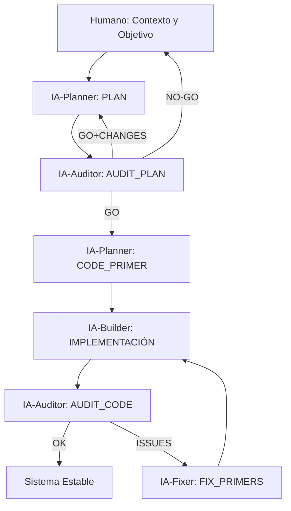

# SPAD – Structured Prompt‑Driven Engineering
## Metodología Operativa Oficial (Seachad)

---

## 1. Objetivo del documento

Este documento describe **cómo se usa SPAD en la práctica**, su **orden estricto de aplicación**,
las **reglas de interacción entre IAs**, y el **flujo completo de trabajo** desde el problema inicial
hasta un sistema estable.

SPAD no es una colección de prompts, sino una **metodología secuencial, bloqueante y auditable**.

---

## 2. Principio clave: ejecución bloqueante por fases

**Regla fundamental:**  
> Ninguna fase puede comenzar hasta que la IA responsable de la fase anterior haya respondido
y su salida haya sido evaluada.

Cada fase produce un **artefacto explícito** que sirve como input obligatorio de la siguiente.

---

## 3. Roles lógicos (humanos + IA)

- **Humano / Orquestador**
  - Define objetivo y valida decisiones
- **IA‑Planner**
  - Diseña arquitectura y lógica
- **IA‑Auditor**
  - Audita planes y código
- **IA‑Builder**
  - Genera código siguiendo primores
- **IA‑Fixer**
  - Aplica correcciones mínimas

> Una misma IA puede asumir varios roles, pero **nunca dos roles simultáneos en la misma fase**.

---

## 4. Fases de la metodología

### Fase 0 — Contexto y objetivo
**Responsable:** Humano  
**Salida:** descripción clara del problema, alcance y restricciones.

---

### Fase 1 — PLAN
**Responsable:** IA‑Planner  
**Input:** contexto validado  

**Output obligatorio:**
- arquitectura lógica
- componentes y responsabilidades
- flujos de datos
- decisiones explícitas
- riesgos conocidos

❌ No se permite código.

---

### Fase 2 — AUDIT_PLAN
**Responsable:** IA‑Auditor  
**Input:** documento PLAN  

**Evalúa:**
- acoplamiento
- cohesión
- escalabilidad
- concurrencia
- seguridad
- observabilidad

**Salida obligatoria:**
- issues detectados
- recomendaciones
- veredicto: GO / GO+CHANGES / NO‑GO

⚠️ Si no es GO, se vuelve a PLAN.

---

### Fase 3 — CODE_PRIMER
**Responsable:** IA‑Planner  
**Input:** PLAN aprobado  

Define:
- estructura del proyecto
- convenciones
- contratos
- reglas estrictas
- anti‑patrones

---

### Fase 4 — IMPLEMENTACIÓN
**Responsable:** IA‑Builder  
**Input:** CODE_PRIMER  
**Salida:** código generado.

La IA **no puede tomar decisiones de diseño**.

---

### Fase 5 — AUDIT_CODE
**Responsable:** IA‑Auditor  

Evalúa:
- fidelidad al PLAN
- cumplimiento del PRIMER
- riesgos técnicos
- deuda futura

**Salida:**
- OK → sistema estable
- ISSUES → FIX_PRIMERS

---

### Fase 6 — FIX_PRIMERS
**Responsable:** IA‑Fixer  

Cada corrección debe incluir:
- problema detectado
- cambio mínimo
- justificación técnica
- impacto esperado

Itera hasta aprobación.

---

## 5. Diagrama oficial de flujo

---

## 6. Reglas operativas no negociables

1. Ninguna fase se salta.
2. Toda salida es auditable.
3. Toda decisión es explícita.
4. El código ejecuta, no decide.
5. Auditorías independientes.
6. Correcciones mínimas.

---

## 7. Uso en Seachad

SPAD es la **metodología por defecto** para proyectos con:
- IA
- agentes
- automatización crítica
- riesgo financiero o legal

---

**Owner:** Seachad (FGV)  
**Estado:** Metodología oficial  
**Generado con asistencia de ChatGPT**