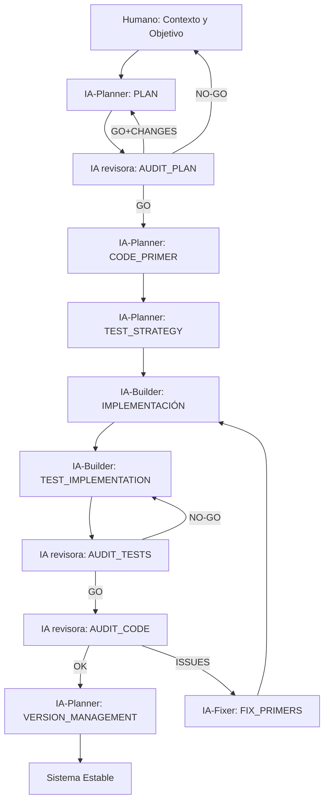
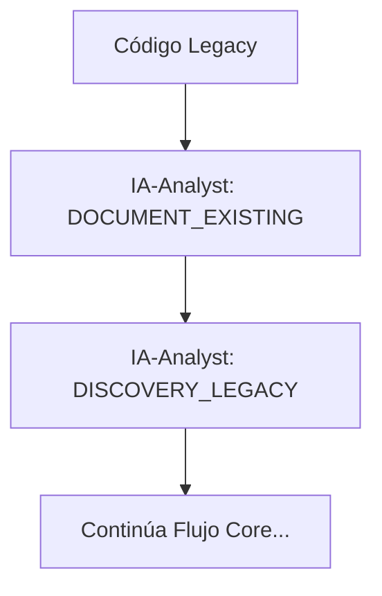
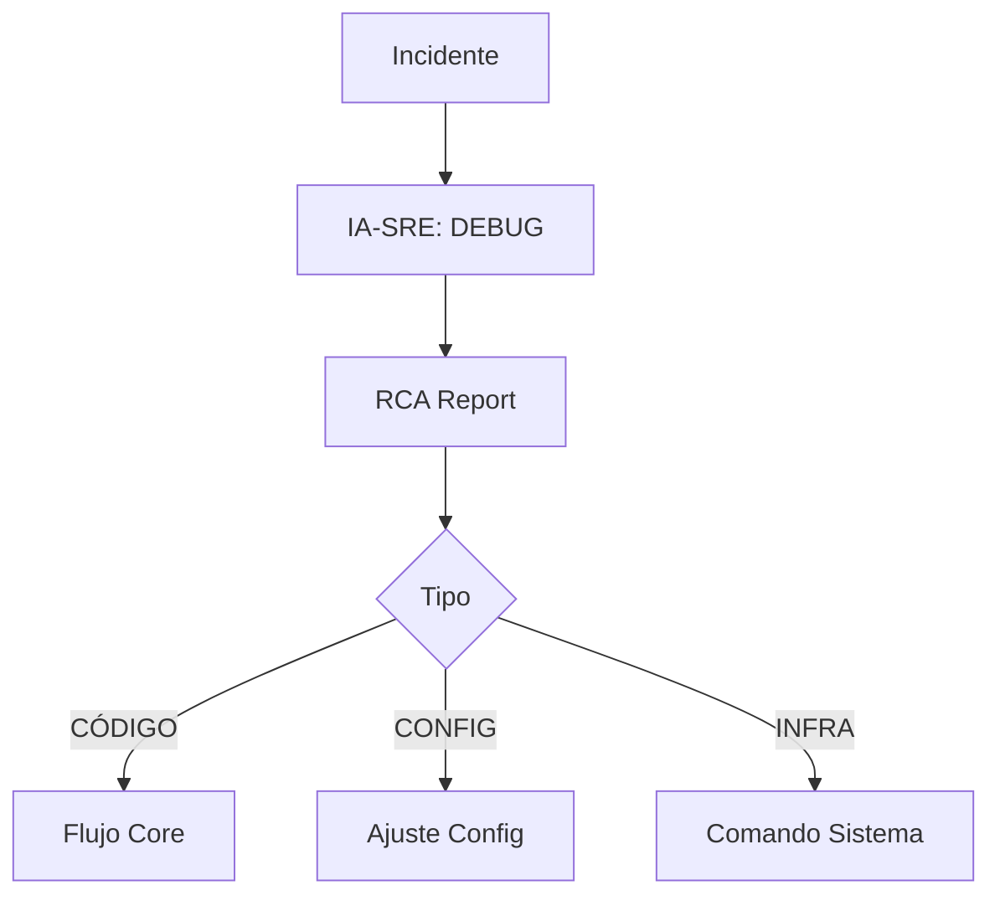
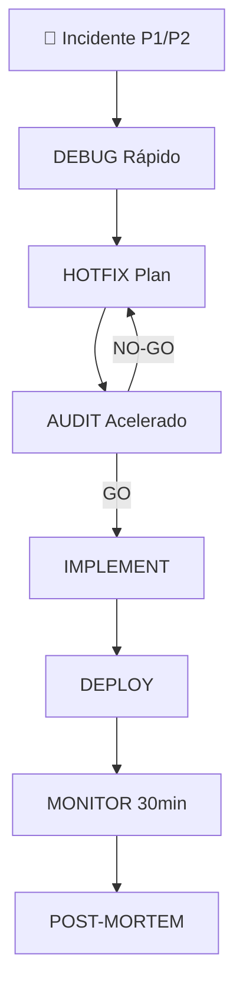

# SPAD – Structured Prompt‑Driven Engineering
## Metodología Operativa Oficial (Seachad)

> **Aviso legal y exención de responsabilidad.** SPAD es una metodología de referencia que se ofrece «tal cual» y con fines informativos. No constituye asesoramiento jurídico, regulatorio ni profesional, no garantiza resultados ni el cumplimiento de ninguna norma y no es una certificación. Cada organización que la use es la única responsable de validar sus resultados, verificar la normativa que le aplica y certificar su propio cumplimiento regulatorio. El autor y SEACHAD no asumen responsabilidad alguna por su uso.

---

## 1. Objetivo del documento

Este documento describe **cómo se usa SPAD en la práctica**, su **orden estricto de aplicación**,
las **reglas de interacción entre IAs**, y el **flujo completo de trabajo** desde el problema inicial
hasta un sistema estable.

SPAD no es una colección de prompts, sino una **metodología secuencial, bloqueante y auditable**.

---

## 2. Principio clave: ejecución bloqueante por fases

**Regla fundamental:**  
> Ninguna fase puede comenzar hasta que la IA responsable de la fase anterior haya respondido
y su salida haya sido evaluada.

Cada fase produce un **artefacto explícito** que sirve como input obligatorio de la siguiente.

---

## 3. Roles lógicos (humanos + IA)

- **Humano / Orquestador**
  - Define objetivo y valida decisiones
- **IA‑Planner**
  - Diseña arquitectura y lógica
- **IA revisora**
  - Audita planes y código
- **IA‑Builder**
  - Genera código siguiendo primores
- **IA‑Fixer**
  - Aplica correcciones mínimas

> Una misma IA puede asumir varios roles, pero **nunca dos roles simultáneos en la misma fase**.

---

## 4. Fases de la metodología

### 4.1 Ciclo Core (Funcionalidad Nueva)

#### Fase 0 — Contexto y objetivo
**Responsable:** Humano  
**Salida:** descripción clara del problema, alcance y restricciones.

---

#### Fase 1 — PLAN
**Responsable:** IA‑Planner  
**Input:** contexto validado  

**Output obligatorio:**
- arquitectura lógica
- componentes y responsabilidades
- flujos de datos
- decisiones explícitas
- riesgos conocidos

❌ No se permite código.

---

#### Fase 2 — AUDIT_PLAN
**Responsable:** IA revisora  
**Input:** documento PLAN  

**Evalúa:**
- acoplamiento
- cohesión
- escalabilidad
- concurrencia
- seguridad
- observabilidad

**Salida obligatoria:**
- issues detectados
- recomendaciones
- veredicto: GO / GO+CHANGES / NO‑GO

⚠️ Si no es GO, se vuelve a PLAN.

---

#### Fase 3 — CODE_PRIMER
**Responsable:** IA‑Planner  
**Input:** PLAN aprobado  

Define:
- estructura del proyecto
- convenciones
- contratos
- reglas estrictas
- anti‑patrones

---

#### Fase 4 — TEST_STRATEGY
**Responsable:** IA‑Planner  
**Input:** PLAN aprobado

**Output obligatorio:**
- casos de test a implementar
- cobertura mínima esperada
- estrategia de test (unitario, integración, e2e)
- mocks y fixtures necesarios

---

#### Fase 5 — IMPLEMENTACIÓN
**Responsable:** IA‑Builder  
**Input:** CODE_PRIMER + TEST_STRATEGY  
**Salida:** código generado.

La IA **no puede tomar decisiones de diseño**.

---

#### Fase 6 — TEST_IMPLEMENTATION
**Responsable:** IA‑Builder  
**Input:** TEST_STRATEGY + Código implementado

**Output obligatorio:**
- tests implementados
- fixtures y mocks
- instrucciones de ejecución

---

#### Fase 7 — AUDIT_TESTS
**Responsable:** IA revisora

**Evalúa:**
- cobertura real vs esperada
- calidad de los tests
- casos edge cubiertos

**Salida:**
- GO → continúa a AUDIT_CODE
- NO-GO → vuelve a TEST_IMPLEMENTATION

---

#### Fase 8 — AUDIT_CODE
**Responsable:** IA revisora  

Evalúa:
- fidelidad al PLAN
- cumplimiento del PRIMER
- riesgos técnicos
- deuda futura

**Salida:**
- OK → VERSION_MANAGEMENT
- ISSUES → FIX_PRIMERS

---

#### Fase 9 — FIX_PRIMERS
**Responsable:** IA‑Fixer  

Cada corrección debe incluir:
- problema detectado
- cambio mínimo
- justificación técnica
- impacto esperado

Itera hasta aprobación.

---

#### Fase 10 — VERSION_MANAGEMENT
**Responsable:** IA‑Planner

**Output obligatorio:**
- número de versión (semantic versioning)
- changelog
- breaking changes (si aplica)
- instrucciones de migración (si aplica)

---

### 4.2 Ciclo Legacy (Código Existente)

Cuando se trabaja con código sin documentación o legacy:

#### Fase 0A — DOCUMENT_EXISTING
**Responsable:** IA‑Analyst  
**Input:** código existente

**Output obligatorio:**
- documentación de comportamiento actual
- diagramas de flujo (Mermaid)
- componentes identificados
- dependencias

---

#### Fase 0B — DISCOVERY_LEGACY
**Responsable:** IA‑Analyst  
**Input:** código documentado + objetivo de cambio

**Output obligatorio:**
- áreas afectadas por el cambio
- riesgos de modificación
- tests existentes relacionados
- casos edge identificados

➡️ Después continúa con Fase 1 (PLAN) del ciclo core.

---

### 4.3 Ciclo Debug (Incidentes)

Cuando existe un problema en producción o desarrollo:

#### Fase DEBUG
**Responsable:** IA‑SRE  
**Input:** descripción del incidente

**Modos de operación:**
- **STATIC AUTOPSY:** análisis de código sin ejecución
- **RUNTIME ORCHESTRATION:** análisis con ejecución y trazas

**Output obligatorio:**
- RCA Report (Root Cause Analysis)
- veredicto: CÓDIGO / CONFIGURACIÓN / INFRAESTRUCTURA

➡️ Si es CÓDIGO → va a Fase 1 (PLAN)  
➡️ Si es CONFIGURACIÓN → ajuste directo  
➡️ Si es INFRAESTRUCTURA → comando de sistema

---

### 4.4 Ciclo Hotfix (Emergencias P1/P2)

Para incidentes críticos que requieren solución inmediata:

#### Fase HOTFIX
**Responsable:** IA‑Builder (modo acelerado)  
**Input:** RCA Report + aprobación de emergencia

**Características:**
- PLANs simplificados (15-30 min)
- AUDIT acelerado pero obligatorio
- tests mínimos pero obligatorios
- despliegue inmediato
- monitoreo post-deploy (30 min)

**Output obligatorio:**
- solución desplegada
- post-mortem document
- PLAN definitivo pendiente (si el fix es temporal)

---

### 4.5 Ciclo Security (Código Sensible)

Para código que maneja datos sensibles, autenticación, pagos, etc:

#### Fase SECURITY_AUDIT
**Responsable:** IA revisora de seguridad  
**Input:** código implementado + contexto de seguridad

**Evalúa:**
- vulnerabilidades (CRÍTICO/ALTO/MEDIO/BAJO)
- cumplimiento de estándares (OWASP)
- gestión de secretos
- validación de inputs
- protección contra ataques comunes

**Salida obligatoria:**
- hallazgos clasificados
- CRÍTICO/ALTO → bloquean deployment
- MEDIO/BAJO → decisión de riesgo aceptado

➡️ Vulnerabilidades críticas vuelven a FIX_PRIMERS

---

## 5. Gestión de Contextos

SPAD requiere dos tipos de contexto que deben cargarse antes de cualquier fase:

### 5.1 GLOBAL_CONTEXT
Reglas universales aplicables a TODOS los proyectos que usan SPAD:
- ubicación y formato de artefactos
- reglas de naming
- requisitos de testing
- gestión de versiones
- prohibiciones globales

### 5.2 PROJECT_CONTEXT  
Reglas específicas del proyecto:
- lenguaje y frameworks
- arquitectura específica
- requisitos de compliance
- restricciones de negocio
- overrides de reglas SPAD (si están justificados)

**Regla fundamental:** Si hay conflicto entre GLOBAL y PROJECT, prevalece PROJECT (con justificación).

---

## 6. Gestión de TOPICs (Organización de Artefactos)

Cada flujo SPAD debe asociarse a un TOPIC que agrupa todos sus artefactos:

### 6.1 Definición de TOPIC
- Nombre corto y descriptivo (max 20 caracteres)
- snake_case obligatorio
- Representa una feature, bug, o iniciativa

### 6.2 Establecimiento del TOPIC
- **Explícito:** El humano lo proporciona
- **Inferido:** La IA lo deduce de la descripción
- **Persistente:** Se mantiene durante todo el flujo

### 6.3 Organización de Artefactos
```
documentation/
  ├── {{TOPIC_1}}/
  │   ├── SPAD_01_PLAN.md
  │   ├── SPAD_01_AUDIT_PLAN.md
  │   ├── SPAD_01_IMPLEMENT.md
  │   └── SPAD_01_VERSION.md
  └── {{TOPIC_2}}/
      └── ...
```

**Beneficios:**
- Trazabilidad completa
- Fácil auditoría
- Separación de concerns
- Búsqueda eficiente

---

## 7. Validation Policy (Reglas de Invalidación)

SPAD define cuándo una respuesta de IA es **INVÁLIDA** y debe descartarse:

### 7.1 Phase Violation
Ejecutar acciones que no corresponden a la fase activa:
- PLAN que genera código
- AUDIT que corrige código
- IMPLEMENT que toma decisiones de diseño

**Acción:** Descartar respuesta y reejecutar fase.

### 7.2 Missing Artifacts
Omitir secciones obligatorias del output.

**Acción:** Descartar respuesta y reejecutar fase.

### 7.3 Off-Plan Decisions
Introducir decisiones no documentadas en PLAN aprobado.

**Acción:** Volver a PLAN o FIX_PLAN.

### 7.4 Self-Approval
IA que se autoaprueba o justifica incumplimientos.

**Acción:** Descarte inmediato.

**Principio fundamental:**  
> En SPAD, el cumplimiento del flujo es más importante que la calidad aparente del resultado.

---

## 8. Skills System (Composición de Fases)

Una "Skill" es una secuencia predefinida de fases SPAD para casos de uso comunes:

### 8.1 Skill: new_feature
```
PLAN → AUDIT_PLAN → TEST_STRATEGY → IMPLEMENT → 
TEST_IMPL → AUDIT_TESTS → AUDIT_CODE → VERSION
```

### 8.2 Skill: hotfix
```
DEBUG → HOTFIX_PLAN → HOTFIX_AUDIT → HOTFIX_IMPL → 
DEPLOY → MONITOR → POST_MORTEM
```

### 8.3 Skill: document_legacy
```
DOCUMENT_EXISTING → [DISCOVERY] → [continúa con new_feature]
```

### 8.4 Skill: security_review
```
SECURITY_AUDIT → FIX_CRITICAL → FIX_HIGH → DOCUMENT_RISKS
```

**Beneficios:**
- Automatización de flujos completos
- Consistencia entre equipos
- Velocidad de ejecución
- Composición de flows complejos

---

## 9. Diagrama oficial de flujo

### 9.1 Flujo Core (Nueva Funcionalidad)



### 9.2 Flujo Legacy



### 9.3 Flujo Debug



### 9.4 Flujo Hotfix



---

## 10. Reglas operativas no negociables

1. **Ninguna fase se salta** - Todas las fases son obligatorias
2. **Toda salida es auditable** - Artefactos explícitos y trazables
3. **Toda decisión es explícita** - No hay decisiones implícitas
4. **El código ejecuta, no decide** - Builder no toma decisiones de diseño
5. **Auditorías independientes** - La IA revisora no es la implementadora
6. **Correcciones mínimas** - Fixes quirúrgicos, no refactors
7. **Testing obligatorio** - Cobertura mínima definida en TEST_STRATEGY
8. **Security by design** - Código sensible requiere SECURITY_AUDIT
9. **Contextos cargados** - GLOBAL + PROJECT antes de cualquier fase
10. **TOPICs organizados** - Un TOPIC por flujo/feature/bug

---

## 11. Uso en proyectos

SPAD es la **metodología por defecto** para proyectos con:
- IA
- agentes
- automatización crítica
- riesgo financiero o legal

---

**Owner:** Seachad (FGV)  
**Estado:** Metodología oficial  
**Generado con asistencia de ChatGPT**