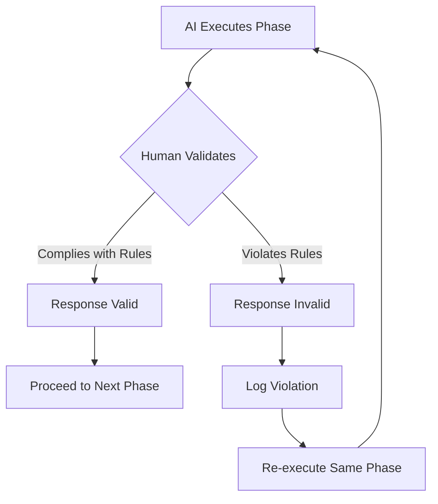

# 05 — SEVEN-G SPAD Validation Policy

---

## 1. Purpose

This document establishes the human policy for validating and invalidating AI-generated responses within SPAD workflows. It defines when a response must be considered **INVALID** and discarded, regardless of its apparent quality.

**Critical distinction:**
- This is a **human governance policy**, not an AI prompt
- It is **not executed by the AI**, but **enforced by humans**
- It is **not interpreted by the LLM**, but **applied by the orchestrator**

---

## 2. Fundamental Principle

> **In SPAD, workflow compliance is more important than result quality.**

A technically correct response that violates a phase:
- ❌ is not acceptable
- ❌ should not be reused
- ❌ should not be corrected
- ✅ must be discarded

The AI must **re-execute the same phase** from scratch.

---

## 3. Definition of "Invalid Response"

A response is considered **INVALID** when any of the situations described in this policy occur, regardless of:
- ✓ whether the code works
- ✓ whether the analysis is correct
- ✓ whether the result seems reasonable

**Validation priority:**
```
Process Compliance > Technical Correctness > Efficiency
```

---

## 4. Invalidation Causes

### 4.1 Phase Violation

**Definition:**  
The response executes actions that **do not correspond** to the active SPAD phase.

**Examples:**

| Phase | Violation | Why Invalid |
|-------|-----------|-------------|
| PLAN | Generates or modifies code | PLAN must stay at design level |
| PLAN | Proposes concrete fixes or refactors | PLAN defines, doesn't implement |
| AUDIT_PLAN | Corrects or rewrites the plan | Auditor evaluates, doesn't fix |
| AUDIT_CODE | Corrects or rewrites code | Auditor evaluates, doesn't fix |
| IMPLEMENT | Makes new design decisions | Builder follows decisions, doesn't make them |
| FIX_PRIMERS | Redesigns or expands functionality | Fixer applies minimal corrections only |
| DEBUG | Generates solution code | DEBUG produces RCA, not solutions |
| DEBUG | Modifies production code | Only temporary prints/flags allowed |

**Action:**
```
❌ Response invalid
🔁 Re-execute the same phase
📝 Document the violation if it repeats
```

---

### 4.2 Missing or Altered Mandatory Artifacts

**Definition:**  
The response:
- Omits required sections demanded by the prompt
- Does not include mandatory sentinels or markers
- Alters the contractual output format

**Examples:**
- PLAN without "Identified Risks" section
- AUDIT without explicit GO/NO-GO verdict
- TEST_STRATEGY without minimum coverage threshold
- VERSION without semantic version number
- RCA Report without verdict (CODE/CONFIG/INFRA)

**Action:**
```
❌ Response invalid
🔁 Re-execute the phase with emphasis on mandatory sections
```

---

### 4.3 Off-Plan Decisions

**Definition:**  
The response introduces:
- New technical decisions not documented in approved PLAN
- Scope changes not authorized
- Undocumented assumptions

...even if they are well-reasoned.

**Examples:**
- IMPLEMENT adds a caching layer not mentioned in PLAN
- IMPLEMENT changes database schema without PLAN approval
- TEST_IMPLEMENTATION creates integration tests when only unit tests were planned
- FIX_PRIMERS refactors entire module instead of surgical fix

**Action:**
```
❌ Response invalid
🔁 Return to PLAN or FIX_PLAN depending on context
📝 Document the unauthorized decision
```

---

### 4.4 Implementation Without Prior Audit

**Definition:**  
Code is generated or modified when:
- No approved PLAN exists
- No AUDIT_PLAN or AUDIT_CODE has been executed
- Previous audit returned NO-GO but implementation proceeds anyway

**Examples:**
- User asks for implementation, AI proceeds without asking for PLAN
- AUDIT_PLAN returns NO-GO, but AI generates code anyway
- CODE_PRIMER executed before AUDIT_PLAN approval

**Action:**
```
❌ Response invalid
🔁 Return to the correct phase (usually PLAN or AUDIT)
🚫 Discard any generated code
```

---

### 4.5 Self-Approval by the Model

**Definition:**  
The response:
- Self-approves without proper audit
- Minimizes violations ("only a small issue...")
- Justifies non-compliance ("although you asked X, I did Y because...")

**Examples:**
- "I made these small changes to the plan, but they're minor"
- "I know you said no code, but I included a small example"
- "The audit found issues, but I'll mark it as GO anyway"
- "I implemented X instead of Y because it's better this way"

**Action:**
```
❌ Response invalid IMMEDIATELY
🔁 Re-execute with strengthened constraints
🚨 Consider this a critical violation
```

---

## 5. What Does NOT Invalidate a Response

The following are **not** causes for invalidation:

### 5.1 Critical Findings
- AUDIT returns NO-GO ✓ (this is valid auditing)
- SECURITY_AUDIT finds CRITICAL vulnerabilities ✓ (this is valid security work)
- Tests fail on first implementation ✓ (this is expected iteration)

### 5.2 Quality Issues (Within Phase Boundaries)
- Code that works but isn't elegant ✓ (can be improved in FIX_PRIMERS)
- Minor style inconsistencies ✓ (can be addressed if important)
- Reasonable technical opinions ✓ (as long as within phase scope)
- Conservative risk assessment ✓ (better safe than sorry)

### 5.3 Negative Outcomes
- NO-GO verdict ✓ (this is the audit working correctly)
- Identified risks in PLAN ✓ (transparency is good)
- Failed tests ✓ (better to find issues early)
- Security vulnerabilities found ✓ (that's why we audit)

**SPAD principle:**
> A valid NO-GO is better than an invalid GO.

---

## 6. Procedure When Response is Invalid

### Step 1: Immediate Recognition
Identify that the response violated SPAD rules.

### Step 2: Do Not Correct
- Do **not** edit the response
- Do **not** reuse parts of it
- Do **not** ask AI to "fix" the response

### Step 3: Discard Completely
Treat the entire response as if it never happened.

### Step 4: Re-execute Phase
Run the **same phase** again with the **same prompt**.

### Step 5: Strengthen Constraints (If Recurring)
If the same violation repeats:
- Make the prompt more explicit about prohibitions
- Add specific examples of violations
- Increase audit rigor
- Document the pattern

### Step 6: Escalate (If Persistent)
If violations continue after 3 attempts:
- Consider the AI model may not be suitable for this phase
- Switch to more capable model
- Consider human intervention
- Document as methodology limitation

---

## 7. Violation Registry (Optional but Recommended)

For critical projects, maintain a violation log:

```markdown
## SPAD Violation Log

### 2026-02-11 | TOPIC: payment_gateway
**Phase:** PLAN  
**Violation:** Generated implementation code  
**Action:** Discarded, re-executed PLAN  
**Model:** GPT-4  
**Outcome:** Second attempt successful  

### 2026-02-11 | TOPIC: user_auth
**Phase:** AUDIT_CODE  
**Violation:** Self-approved with known issues  
**Action:** Discarded, strengthened audit prompt  
**Model:** Claude Sonnet 3.5  
**Outcome:** Third attempt successful after prompt enhancement  
```

**Benefits:**
- Pattern recognition (which phases have most issues?)
- Model comparison (which models follow SPAD best?)
- Process improvement (which prompts need strengthening?)
- Compliance evidence (we enforce our own rules)

---

## 8. Examples of Validation Decisions

### Example 1: Valid Response with NO-GO
```
Phase: AUDIT_PLAN
Output: "The plan has significant scalability issues. 
         Current design won't handle > 100 concurrent users.
         Verdict: NO-GO"

Decision: ✅ VALID
Reason: Audit is working correctly, NO-GO is appropriate.
Action: Return to PLAN phase with feedback.
```

### Example 2: Invalid Response with Good Code
```
Phase: PLAN
Output: "Here's the architecture... [detailed plan]
         Here's a sample implementation to illustrate:
         [500 lines of code]"

Decision: ❌ INVALID
Reason: PLAN phase generated code (phase violation).
Action: Discard entire response, re-execute PLAN.
Note: Code quality is irrelevant; rule was violated.
```

### Example 3: Valid Response with Issues
```
Phase: IMPLEMENT
Output: [Code with minor style inconsistencies but follows PLAN]

Decision: ✅ VALID
Reason: Implementation follows PLAN and CODE_PRIMER.
Action: Proceed to AUDIT_CODE, style issues can be addressed in FIX_PRIMERS if auditor flags them.
```

### Example 4: Invalid Self-Approval
```
Phase: AUDIT_CODE
Output: "Found 3 issues: missing error handling, no input validation,
         hardcoded secret. These are minor, so I'll mark this as GO."

Decision: ❌ INVALID
Reason: Auditor self-approved despite identifying issues.
Action: Discard, re-execute AUDIT_CODE with stricter guidelines.
```

---

## 9. Governance Rules

### 9.1 Authority
- Validation decisions are **final**
- Human orchestrator has ultimate authority
- When in doubt, invalidate (conservative approach)

### 9.2 Independence
- Auditor responses are validated by humans, not by the Builder AI
- No AI can self-validate its own output
- Cross-phase validation is required

### 9.3 Documentation
- All invalidations should be documented (at least for critical projects)
- Patterns should be analyzed periodically
- Methodology should be updated based on learnings

### 9.4 Continuous Improvement
- If a phase has >30% invalidation rate, the prompt needs improvement
- If a model consistently violates rules, consider switching models
- Validation policy itself should evolve based on experience

---

## 10. Integration with SPAD Phases

### How Validation Policy Interacts with Workflow:



---

## 11. Summary Quick Reference

| Situation | Valid? | Action |
|-----------|--------|--------|
| PLAN with code | ❌ | Discard, re-execute PLAN |
| AUDIT with NO-GO | ✅ | Return to previous phase |
| IMPLEMENT with new decisions | ❌ | Discard, return to PLAN |
| DEBUG that fixes code | ❌ | Discard, re-execute DEBUG |
| Missing mandatory sections | ❌ | Discard, re-execute same phase |
| Self-approval with issues | ❌ | Discard, re-execute with stricter prompt |
| Good code but off-plan | ❌ | Discard, return to PLAN |
| Working code with minor style issues | ✅ | Proceed, can fix in FIX_PRIMERS |
| Security audit finds CRITICAL issues | ✅ | Expected outcome, proceed to FIX |

---

**Owner:** Seachad (FGV)  
**Framework:** SEVEN-G  
**Status:** Official SPAD Policy  
**Generated with assistance from GitHub Copilot**
