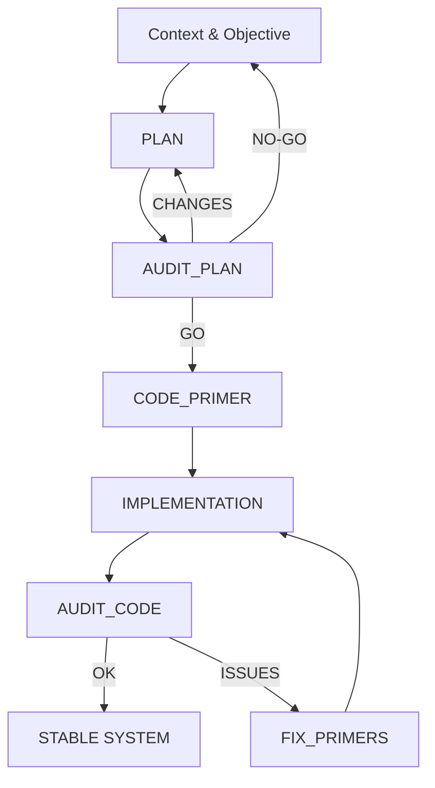

# SPAD – Methodology Flow

```mermaid
flowchart TD
    A[Context & Objective]
    B[PLAN]
    C[AUDIT_PLAN]
    D[CODE_PRIMER]
    E[IMPLEMENTATION]
    F[AUDIT_CODE]
    G[FIX_PRIMERS]
    H[STABLE SYSTEM]

    A --> B
    B --> C
    C -->|GO| D
    C -->|CHANGES| B
    C -->|NO-GO| A
    D --> E
    E --> F
    F -->|OK| H
    F -->|ISSUES| G
    G --> E
```