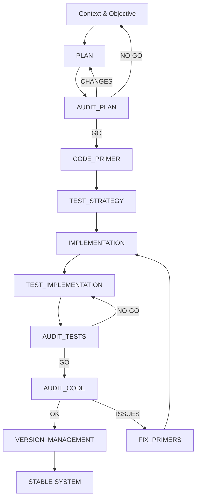
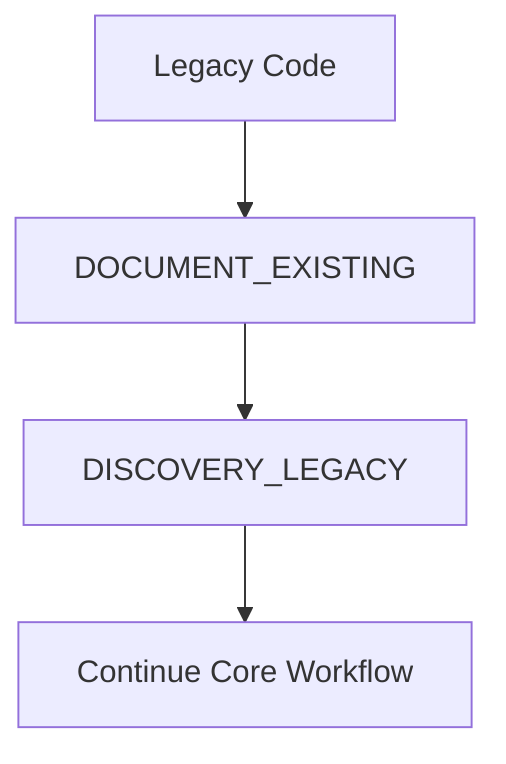
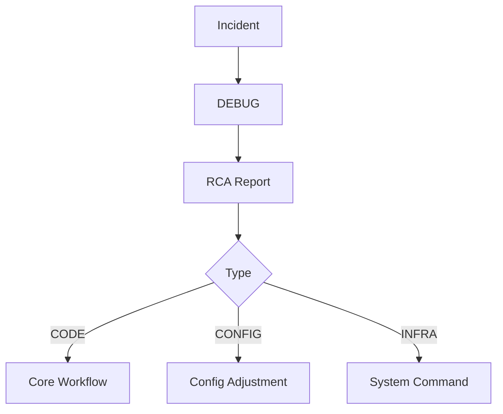
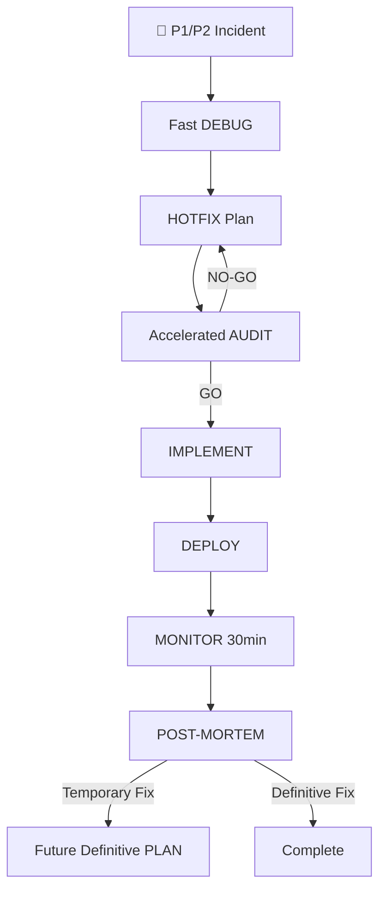
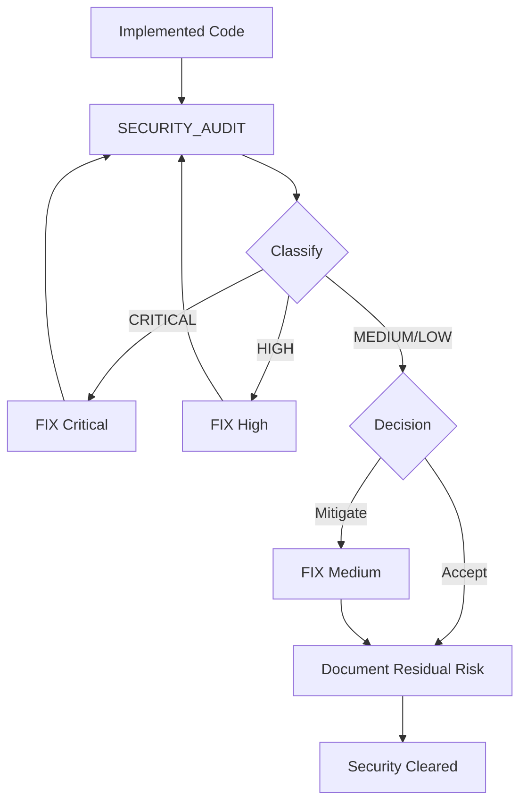

# SPAD – Methodology Flows

> **Legal notice and disclaimer.** SPAD is a reference methodology provided "as is" and for information purposes only. It does not constitute legal, regulatory or professional advice, does not guarantee results or compliance with any law or standard, and is not a certification. Each organisation that uses it is solely responsible for validating its results, verifying the regulation that applies to it and certifying its own regulatory compliance. The author and SEACHAD accept no liability for its use.

## Core Workflow (New Functionality)

## Legacy Workflow

## Debug Workflow

## Hotfix Workflow (P1/P2 Emergencies)

## Security Review Workflow

