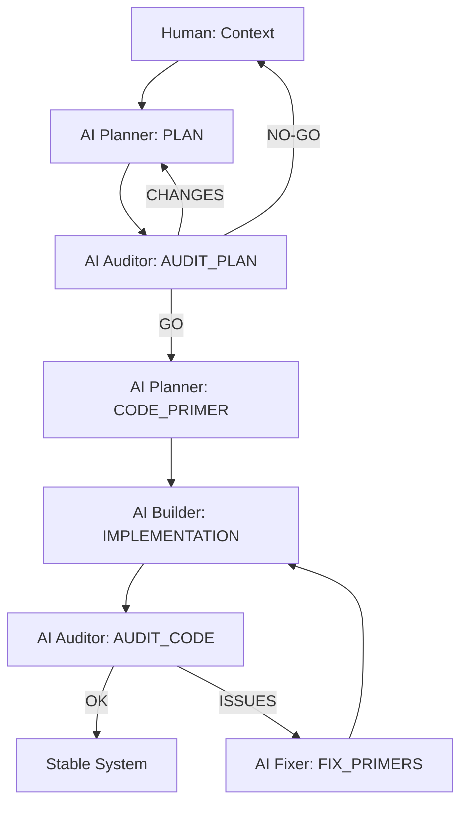

# SEVEN-G Official Skill — SPAD
## Structured Prompt-Driven Engineering

---

## Prologue — Why this skill exists

In complex systems (software platforms, AI systems, autonomous agents, critical automation),
the primary source of failure is rarely poor coding.
It is **poor thinking before execution**.

Most severe technical failures share common root causes:
- implicit decisions that were never documented,
- reasoning mixed with execution,
- absence of intermediate validation,
- reactive fixes that silently introduce technical debt.

SPAD exists to **enforce a strict separation between thinking, deciding, executing, and correcting**,
while using AI in a controlled, auditable, and repeatable way.

This is not a collection of prompts.  
This is not creative experimentation.  
This is **AI-assisted engineering with explicit risk control**.

### Expected outcomes

When SPAD is applied correctly, the expected outcomes are:

- Early detection of architectural and logical flaws  
- Drastic reduction of late-stage refactors  
- Lower technical debt accumulation  
- Clear traceability of decisions and changes  
- Safer use of LLMs in high-risk systems  
- Higher system stability under concurrency and scale  
- Repeatable results across teams and AI models  

SPAD is designed to convert AI usage from **ad-hoc assistance** into **governed engineering practice**.

---

## 1. Skill definition (SEVEN-G)

**Skill name:**  
SPAD — Structured Prompt-Driven Engineering

**SEVEN-G family:**  
Core Engineering & AI Governance

**Purpose:**  
To design, implement, and validate complex systems using structured prompts,
mandatory audits, and blocking execution phases.

---

## 2. Non-negotiable principles

1. No code is written without an approved PLAN.
2. No PLAN exists without an explicit audit.
3. Every phase produces an auditable artifact.
4. No AI proceeds without validated output from the previous phase.
5. Code executes; it does not decide.
6. Corrections must be minimal and technically justified.

---

## 3. When SPAD must be used

SPAD is **mandatory** within SEVEN-G when:

- AI or autonomous agents are involved
- financial, legal, or reputational risk exists
- systems are concurrent or distributed
- refactoring cost is high
- reasoning is delegated to LLMs

---

## 4. Roles defined by the skill

- **Human Orchestrator**
  - Defines objectives and validates critical decisions

- **AI Planner**
  - Designs architecture and logic (no code)

- **AI Auditor**
  - Independently audits plans and code

- **AI Builder**
  - Implements strictly according to primers

- **AI Fixer**
  - Applies minimal, justified corrections

⚠️ A single agent may assume multiple roles,
but **never more than one role within the same phase**.

---

## 5. Official skill phases

### Phase 0 — Context
Human-provided input:
- problem statement
- scope
- constraints
- success criteria

---

### Phase 1 — PLAN
Mandatory output:
- logical architecture
- components and responsibilities
- data flows
- explicit decisions
- identified risks

❌ Code is forbidden.

---

### Phase 2 — AUDIT_PLAN
Mandatory output:
- identified issues
- concrete recommendations
- verdict: GO / GO WITH CHANGES / NO-GO

No GO → no progress.

---

### Phase 3 — CODE_PRIMER
Defines:
- project structure
- conventions
- contracts
- strict rules
- anti-patterns

No new design decisions allowed.

---

### Phase 4 — IMPLEMENTATION
Code generation strictly following the approved primer.

---

### Phase 5 — AUDIT_CODE
Validates:
- fidelity to the PLAN
- compliance with the PRIMER
- technical and systemic risks

---

### Phase 6 — FIX_PRIMERS
Corrections must include:
- detected problem
- minimal change
- technical justification
- expected impact

Iterate until stable.

---

## 6. Official blocking workflow

---

## 7. Usage rules within SEVEN-G

1. SPAD must be explicitly declared as an active skill.
2. Each phase must be executed using its dedicated prompt.
3. Phases may not be merged into a single interaction.
4. All outputs must be preserved as evidence.
5. The auditor role must remain independent from the builder role.
6. The process only ends when AUDIT_CODE returns OK.

---

## 8. Skill result

SPAD establishes a controlled, auditable, and repeatable way to build systems with AI,
transforming LLMs from informal helpers into **reliable engineering collaborators**.

---

**Skill owner:** Seachad (FGV)  
**Framework:** SEVEN-G  
**Status:** Official Skill  
**Generated with assistance from ChatGPT**