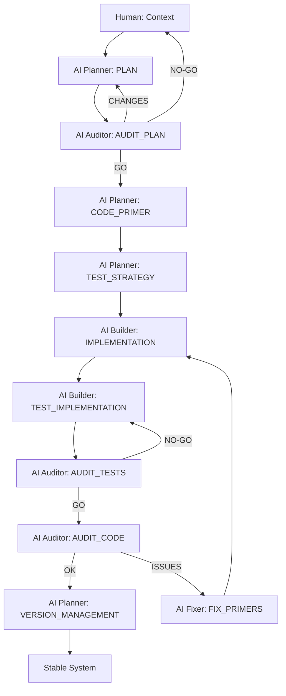
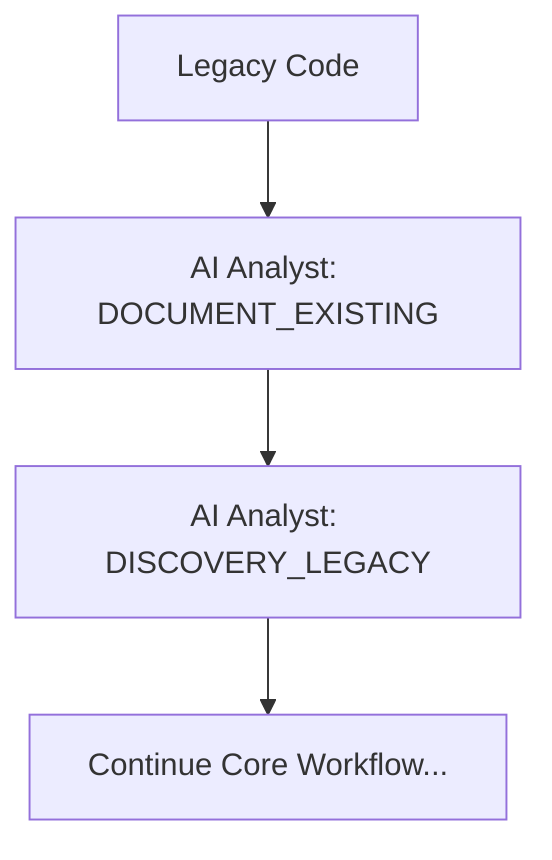
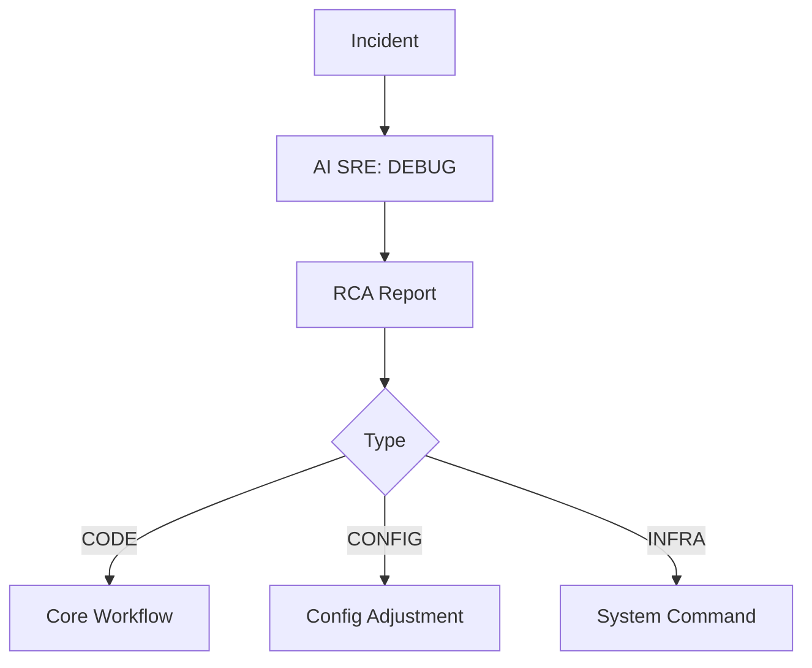
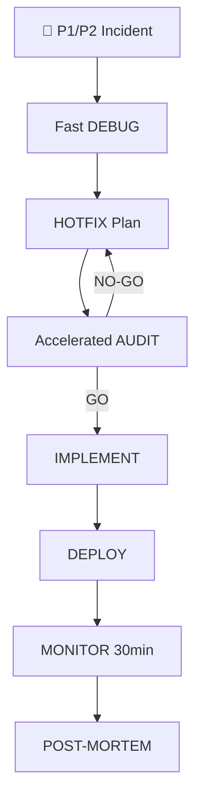

# SEVEN-G Official Skill — SPAD
## Structured Prompt-Driven Engineering

---

## Prologue — Why this skill exists

In complex systems (software platforms, AI systems, autonomous agents, critical automation),
the primary source of failure is rarely poor coding.
It is **poor thinking before execution**.

Most severe technical failures share common root causes:
- implicit decisions that were never documented,
- reasoning mixed with execution,
- absence of intermediate validation,
- reactive fixes that silently introduce technical debt.

SPAD exists to **enforce a strict separation between thinking, deciding, executing, and correcting**,
while using AI in a controlled, auditable, and repeatable way.

This is not a collection of prompts.  
This is not creative experimentation.  
This is **AI-assisted engineering with explicit risk control**.

### Expected outcomes

When SPAD is applied correctly, the expected outcomes are:

- Early detection of architectural and logical flaws  
- Drastic reduction of late-stage refactors  
- Lower technical debt accumulation  
- Clear traceability of decisions and changes  
- Safer use of LLMs in high-risk systems  
- Higher system stability under concurrency and scale  
- Repeatable results across teams and AI models  

SPAD is designed to convert AI usage from **ad-hoc assistance** into **governed engineering practice**.

---

## 1. Skill definition (SEVEN-G)

**Skill name:**  
SPAD — Structured Prompt-Driven Engineering

**SEVEN-G family:**  
Core Engineering & AI Governance

**Purpose:**  
To design, implement, and validate complex systems using structured prompts,
mandatory audits, and blocking execution phases.

---

## 2. Non-negotiable principles

1. No code is written without an approved PLAN.
2. No PLAN exists without an explicit audit.
3. Every phase produces an auditable artifact.
4. No AI proceeds without validated output from the previous phase.
5. Code executes; it does not decide.
6. Corrections must be minimal and technically justified.

---

## 3. When SPAD must be used

SPAD is **mandatory** within SEVEN-G when:

- AI or autonomous agents are involved
- financial, legal, or reputational risk exists
- systems are concurrent or distributed
- refactoring cost is high
- reasoning is delegated to LLMs

---

## 4. Roles defined by the skill

- **Human Orchestrator**
  - Defines objectives and validates critical decisions

- **AI Planner**
  - Designs architecture and logic (no code)

- **AI Auditor**
  - Independently audits plans and code

- **AI Builder**
  - Implements strictly according to primers

- **AI Fixer**
  - Applies minimal, justified corrections

⚠️ A single agent may assume multiple roles,
but **never more than one role within the same phase**.

---

## 5. Official skill phases

### Phase 0 — Context
Human-provided input:
- problem statement
- scope
- constraints
- success criteria

---

### Phase 1 — PLAN
Mandatory output:
- logical architecture
- components and responsibilities
- data flows
- explicit decisions
- identified risks

❌ Code is forbidden.

---

### Phase 2 — AUDIT_PLAN
Mandatory output:
- identified issues
- concrete recommendations
- verdict: GO / GO WITH CHANGES / NO-GO

No GO → no progress.

---

### Phase 3 — CODE_PRIMER
Defines:
- project structure
- conventions
- contracts
- strict rules
- anti-patterns

No new design decisions allowed.

---

### Phase 4 — IMPLEMENTATION
Code generation strictly following the approved primer.

---

### Phase 5 — TEST_STRATEGY
Defines:
- test cases to implement
- minimum coverage threshold
- testing approach (unit, integration, e2e)
- required mocks and fixtures

---

### Phase 6 — IMPLEMENTATION
Code generation strictly following the approved primer and test strategy.

---

### Phase 7 — TEST_IMPLEMENTATION
Generated output:
- implemented tests
- fixtures and mocks
- execution instructions

---

### Phase 8 — AUDIT_TESTS
Validates:
- actual vs expected coverage
- test quality
- edge cases covered

---

### Phase 9 — AUDIT_CODE
Validates:
- fidelity to the PLAN
- compliance with the PRIMER
- technical and systemic risks

---

### Phase 10 — FIX_PRIMERS
Corrections must include:
- detected problem
- minimal change
- technical justification
- expected impact

Iterate until stable.

---

### Phase 11 — VERSION_MANAGEMENT
Final output:
- version number (semantic versioning)
- changelog
- breaking changes (if applicable)
- migration instructions (if applicable)

---

## 5A. Extended phases (additional workflows)

### Phase DEBUG (Incident Resolution)
**Responsible:** AI SRE Engineer

**Operating modes:**
- **STATIC AUTOPSY:** analysis without execution
- **RUNTIME ORCHESTRATION:** analysis with execution and traces

**Mandatory output:**
- RCA Report (Root Cause Analysis)
- verdict: CODE / CONFIGURATION / INFRASTRUCTURE

---

### Phase DOCUMENT_EXISTING (Legacy Code)
**Responsible:** AI Analyst

**Mandatory output:**
- documentation of current behavior
- flow diagrams (Mermaid)
- identified components
- dependencies

---

### Phase DISCOVERY_LEGACY (Impact Analysis)
**Responsible:** AI Analyst

**Mandatory output:**
- areas affected by change
- modification risks
- related existing tests
- identified edge cases

---

### Phase SECURITY_AUDIT (Sensitive Code)
**Responsible:** AI Security Auditor

**Evaluates:**
- vulnerabilities (CRITICAL/HIGH/MEDIUM/LOW)
- standards compliance (OWASP)
- secrets management
- input validation
- protection against common attacks

**Mandatory output:**
- classified findings
- CRITICAL/HIGH → block deployment
- MEDIUM/LOW → risk acceptance decision

---

### Phase HOTFIX (P1/P2 Emergencies)
**Responsible:** AI Builder (accelerated mode)

**Characteristics:**
- simplified PLANs (15-30 min)
- accelerated but mandatory AUDIT
- minimal but mandatory tests
- immediate deployment
- post-deploy monitoring (30 min)

**Mandatory output:**
- deployed solution
- post-mortem document
- pending definitive PLAN (if fix is temporary)

---

## 6. Official workflows

### 6.1 Core Workflow (New Functionality)



### 6.2 Legacy Workflow



### 6.3 Debug Workflow



### 6.4 Hotfix Workflow



---

## 7. Universal concepts

### 7.1 Context Management

SPAD requires two types of context to be loaded before any phase:

**GLOBAL_CONTEXT**  
Universal rules applicable to ALL projects:
- artifact location and format
- naming rules
- testing requirements
- version management
- global prohibitions

**PROJECT_CONTEXT**  
Project-specific rules:
- language and frameworks
- specific architecture
- compliance requirements
- business constraints
- SPAD rule overrides (if justified)

---

### 7.2 TOPIC Management

Each SPAD workflow must be associated with a TOPIC that groups all its artifacts:

- Short and descriptive name (max 20 characters)
- snake_case mandatory
- Represents a feature, bug, or initiative
- Persistent throughout the entire flow

**Benefits:** Complete traceability, easy auditing, separation of concerns

---

### 7.3 Validation Policy

SPAD defines when an AI response is **INVALID** and must be discarded:

**Phase Violation:** Executing actions that don't correspond to the active phase  
**Missing Artifacts:** Omitting mandatory output sections  
**Off-Plan Decisions:** Introducing undocumented decisions  
**Self-Approval:** AI that self-approves or justifies non-compliance

**Fundamental principle:**  
> In SPAD, workflow compliance is more important than the apparent quality of the result.

---

### 7.4 Skills System

A "skill" is a predefined sequence of SPAD phases for common use cases:

**Skill: new_feature**
```
PLAN → AUDIT_PLAN → TEST_STRATEGY → IMPLEMENT → 
TEST_IMPL → AUDIT_TESTS → AUDIT_CODE → VERSION
```

**Skill: hotfix**
```
DEBUG → HOTFIX_PLAN → HOTFIX_AUDIT → HOTFIX_IMPL → 
DEPLOY → MONITOR → POST_MORTEM
```

**Skill: document_legacy**
```
DOCUMENT_EXISTING → [DISCOVERY] → [continues with new_feature]
```

**Skill: security_review**
```
SECURITY_AUDIT → FIX_CRITICAL → FIX_HIGH → DOCUMENT_RISKS
```

---

## 8. Usage rules within SEVEN-G

1. SPAD must be explicitly declared as an active skill.
2. Each phase must be executed using its dedicated prompt.
3. Phases may not be merged into a single interaction.
4. All outputs must be preserved as evidence.
5. The auditor role must remain independent from the builder role.
6. The process only ends when AUDIT_CODE returns OK and VERSION is complete.
7. **Context loading is mandatory:** GLOBAL_CONTEXT + PROJECT_CONTEXT before any phase.
8. **TOPIC must be established:** At the beginning of any workflow.
9. **Testing is mandatory:** Minimum coverage defined in TEST_STRATEGY.
10. **Sensitive code requires SECURITY_AUDIT:** Authentication, payments, PII, etc.
11. **Emergency incidents use HOTFIX workflow:** With mandatory post-mortem.
12. **Legacy code requires DOCUMENT + DISCOVERY:** Before modifications.

---

## 9. Non-negotiable operational rules

1. **No phase is skipped** - All phases are mandatory
2. **All output is auditable** - Explicit and traceable artifacts
3. **All decisions are explicit** - No implicit decisions
4. **Code executes, doesn't decide** - Builder doesn't make design decisions
5. **Independent audits** - Auditor is not the implementer
6. **Minimal corrections** - Surgical fixes, not refactors
7. **Mandatory testing** - Minimum coverage defined in TEST_STRATEGY
8. **Security by design** - Sensitive code requires SECURITY_AUDIT
9. **Loaded contexts** - GLOBAL + PROJECT before any phase
10. **Organized TOPICs** - One TOPIC per workflow/feature/bug

---

## 10. Skill result

SPAD establishes a controlled, auditable, and repeatable way to build systems with AI,
transforming LLMs from informal helpers into **reliable engineering collaborators**.

---

**Skill owner:** Seachad (FGV)  
**Framework:** SEVEN-G  
**Status:** Official Skill  
**Generated with assistance from ChatGPT**