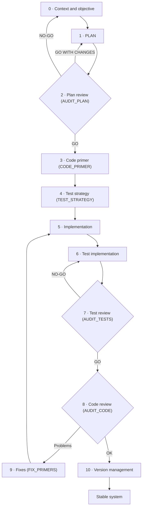
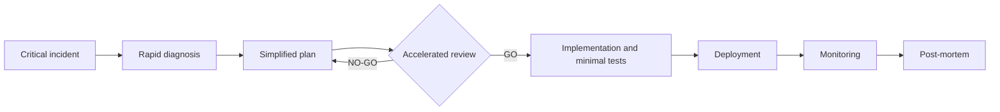

# What SPAD is and how it helps

**A framework for managing software development with artificial intelligence in a sequential, blocking and auditable way: each phase produces an artefact, none starts without reviewing the previous one and no AI approves itself**

| | |
|---|---|
| Document | Document 00 · What SPAD is and how it helps |
| Version | 0.2 |
| Date | 19-09-2026 |
| Author | Fernando García Varela |
| Status | Under construction. Supporting methodology, independent of SEVEN-G and referenced from its document 53; not released commercially. |
| Type | Methodology overview |

<!-- cifras: 11 | phases in the main cycle ; 5 | work cycles ; 3 | review verdicts ; 0 | approvals an AI can give itself -->

---

> **Version under review: please do not circulate.** The current state of SPAD (version 0.x) is not meant to be shared widely. It is public so that a small number of people can review it, give feedback and help improve it. Documents and tools are being adapted to make them reusable; this notice will disappear when the framework reaches version 1.x.

> **Legal notice and disclaimer.** SPAD is a reference methodology provided "as is" and for information purposes only. It does not constitute legal, regulatory or professional advice, does not guarantee results or compliance with any law or standard and is not a certification. **Each organisation that uses SPAD is solely responsible for validating its results, identifying the regulation that applies to it, verifying that it is current and certifying its own regulatory compliance**, with the appropriate qualified advice. The author accepts no liability for any use made of this content or for any decisions taken on the basis of it. The data, figures, companies and cases in the examples are fictitious or illustrative.

## 1. What SPAD is

**SPAD** (*Structured Prompt-Driven Engineering*) is Fernando García Varela's framework for **managing software development by means of artificial intelligence** in a controlled way. It turns AI from an informal programming assistant into a governed engineering tool whose work can be reviewed, reproduced and audited.

SPAD is not a collection of instructions (*prompts*) for requesting code. It is a **way of working** with three properties:

| Property | What it means | What it prevents |
|---|---|---|
| **Sequential** | Work advances through phases in a fixed order: first the problem is understood, then the solution is designed, the design is reviewed, the tests are defined, the solution is built, what has been built is reviewed and it is versioned. | The AI writing code before an approved design exists. |
| **Blocking** | No phase can begin until the output of the previous one has been produced and evaluated. If a review says no, work goes back. | A detected problem being carried into the following phases "to be fixed later". |
| **Auditable** | Each phase produces an **explicit artefact** (plan, review report, test strategy, release record) that is the mandatory input to the next one and is kept. | Hidden decisions, unjustified changes and systems that nobody can explain. |

<figure class="grafico ilustracion">

Think, validate, execute

Three pillars on foundations of documentation, security and traceability

Source: SPAD. Illustration in Spanish

</figure>

> **Why it matters.** AI generates plausible code at great speed. Without structure, that speed turns into design decisions that nobody has taken consciously, insufficient tests, vulnerabilities introduced silently and technical debt that is hard to see. SPAD keeps the speed where it adds value and puts control where it is needed: in decisions, in reviews and in evidence.

SPAD is a **supporting methodology, independent of SEVEN-G**. SEVEN-G governs the AI initiative as a whole (value, risk, decision gates); SPAD governs **how the software is built** when it is built with AI assistance (section 9).

---

## 2. The problem it solves

| Symptom | What usually lies behind it | How SPAD addresses it |
|---|---|---|
| The generated code works in the demonstration and fails in production. | Nobody designed the solution: code was requested until it "worked". | The design (PLAN) is mandatory, explicit and reviewed before any code is written. |
| Nobody knows why the system is built the way it is. | The design decisions were taken by the AI inside the code. | Every decision is documented in the plan; the AI that builds cannot take design decisions. |
| Tests are scarce or only test the easy case. | Tests are written at the end, if there is time left. | The test strategy and its minimum coverage are set before building, and a review checks that they are met. |
| Vulnerabilities appear in code that nobody reviewed. | The review was done by the same AI that wrote the code, or was not done at all. | Independent review: the AI that reviews is never the one that builds; sensitive code undergoes a security review. |
| A small change breaks another part of the system. | Fixes are made by rewriting entire modules. | Fixes are minimal, justified and traceable. |
| An audit asks for evidence of the development and none exists. | The work remained in conversations with the AI. | Each phase leaves an artefact with a name, topic and version in a common structure. |

<figure class="grafico ilustracion">

The illusion of speed

Without structure, perceived speed falls while technical debt and risk grow. Conceptual chart, no data

Source: SPAD. Illustration in Spanish

</figure>

<figure class="grafico ilustracion">

AI without method versus SPAD

Planning, design review, testing, security, traceability and execution

Source: SPAD. Illustration in Spanish

</figure>

> **Why it matters.** None of these problems is caused by AI: they are problems of method that AI amplifies. With SPAD, quality does not depend on the skill of whoever writes the instructions or on the model of the moment, but on a process that any team can repeat.

---

## 3. The principle that orders everything

> In SPAD, **compliance with the flow is more important than the apparent quality of the result**.

A technically correct AI response that breaks the rules of its phase —for example, a plan that includes code or a review that fixes instead of evaluating— **is not used**: it is discarded in its entirety and the phase is repeated. The validation priority is:

| Priority | Criterion |
|---|---|
| 1 | Process compliance |
| 2 | Technical correctness |
| 3 | Efficiency |

<figure class="grafico ilustracion">

Six non-negotiable rules

No phase is skipped, everything is auditable, every decision is explicit, code does not decide, reviews are independent and fixes are minimal

Source: SPAD. Illustration in Spanish

</figure>

> **Why it matters.** If a response that breaks the rules is accepted "because the code works", the process ceases to exist by the second time. The discipline of discarding and repeating is what makes the artefacts reliable and the traceability real. A valid "no" from a review is worth more than an invalid "yes".

---

## 4. Roles

SPAD separates the logical roles from the people and AIs involved. The same AI may take on several roles over the course of a piece of work, but **never two roles in the same phase**.

| Role | Who | What it does | What it cannot do |
|---|---|---|---|
| **Orchestrator** | Person | Defines the objective and the context, validates each output and decides whether to advance. Has the final say. | Delegate validation to the AI that produced the output. |
| **AI Planner** | AI | Designs the architecture and the logic, sets the conventions, the test strategy and the version. | Write code. |
| **AI Reviewer** | AI other than the builder | Reviews plans, tests and code, and issues a verdict. | Fix what it reviews or approve with known problems. |
| **AI Builder** | AI | Implements the code and the tests following the approved plan. | Take design decisions. |
| **AI Fixer** | AI | Applies minimal, justified fixes to the problems detected. | Redesign or extend functionality. |
| **AI Analyst** and **Diagnostic AI** | AI | Document legacy code and analyse incidents (legacy and debugging cycles). | Propose the solution instead of the diagnosis. |

The reviewing role is called **AI Reviewer** so that it is not confused with the SEVEN-G **AI Auditor**, who is a person.

<figure class="grafico ilustracion">

Segregation of roles

In the illustration, «IA-Auditor» is the AI Reviewer; the SEVEN-G AI Auditor is a person

Source: SPAD. Illustration in Spanish

</figure>

> **Why it matters.** Segregation of duties is a classic control in any serious process: whoever does the work does not approve it. SPAD applies it between artificial intelligences as well and always leaves a person accountable for validation.

---

## 5. The main cycle

The main cycle is used to build a new feature. Each phase has an owner, an input and a mandatory output.

| Phase | Owner | Mandatory output |
|---|---|---|
| **0 · Context and objective** | Orchestrator | Description of the problem, scope and constraints. |
| **1 · PLAN** | AI Planner | Logical architecture, components and responsibilities, data flows, explicit decisions and known risks. No code. |
| **2 · Plan review (AUDIT_PLAN)** | AI Reviewer | Problems detected, recommendations and verdict. Assesses coupling, cohesion, scalability, concurrency, security and observability. |
| **3 · Code primer (CODE_PRIMER)** | AI Planner | Project structure, conventions, contracts, strict rules and prohibited anti-patterns. |
| **4 · Test strategy (TEST_STRATEGY)** | AI Planner | Test cases, minimum coverage, test types and required test data. |
| **5 · Implementation** | AI Builder | Code generated in accordance with the plan and the code primer. |
| **6 · Test implementation** | AI Builder | Tests, test data and execution instructions. |
| **7 · Test review (AUDIT_TESTS)** | AI Reviewer | Actual versus expected coverage, quality of the tests and edge cases covered. |
| **8 · Code review (AUDIT_CODE)** | AI Reviewer | Fidelity to the plan, compliance with the code primer, technical risks and future debt. |
| **9 · Fixes (FIX_PRIMERS)** | AI Fixer | For each fix: problem, minimal change, justification and expected impact. |
| **10 · Version management** | AI Planner | Version number, change log, breaking changes and migration instructions. |

<figure class="grafico ilustracion">

The blocking flow

A NO-GO verdict stops the flow and sends it back to the corresponding phase

Source: SPAD. Illustration in Spanish

</figure>

<!-- grafico: SPAD main cycle | Each phase blocks the next; negative verdicts send the work back to the corresponding phase -->

There are three review verdicts:

| Verdict | Meaning | What happens |
|---|---|---|
| **GO** | The output complies and work can advance. | Work moves on to the next phase. |
| **GO WITH CHANGES** | The output is essentially valid but requires adjustments. | Work goes back to the previous phase to incorporate them and is reviewed again. |
| **NO-GO** | The output has problems that prevent advancing. | Work goes back to the corresponding phase; in the case of the plan, to the context and objective. |

> **Why it matters.** Detecting an architecture error in the plan review costs a conversation; detecting it in production costs an incident, an urgent fix (hotfix) and sometimes a customer's trust. The cycle brings expensive decisions forward to the moment when they are still cheap.

---

## 6. Other work cycles

Not all work is a new feature. SPAD defines specific cycles that reuse the same rules:

| Cycle | When it is used | Sequence | Outcome |
|---|---|---|---|
| **Legacy** | Existing code without sufficient documentation needs to be modified. | Document what exists → analyse the impact of the change → continue with the main cycle. | Current behaviour documented and risks of the change identified before anything is touched. |
| **Debugging** | A problem appears in production or in development. | Incident analysis → root cause report with a verdict (code, configuration or infrastructure). | If the cause is the code, the main cycle is entered; if not, a configuration or system adjustment. |
| **Urgent fix** | Critical incident that requires an immediate solution. | Rapid diagnosis → simplified plan → accelerated but mandatory review → implementation with minimal tests → deployment → monitoring → post-mortem. | Solution deployed, post-mortem and, if the fix is provisional, a definitive plan pending. |
| **Security** | Code that handles sensitive data, authentication or payments. | Security review → classification of findings → fixing of critical and high findings → decision on medium and low ones. | Critical and high findings block deployment; accepted risks are documented. The review takes recognised guides such as the OWASP Top 10 as its reference. |

<!-- grafico: Urgent fix | Accelerated, but without skipping the review or the tests -->

<figure class="grafico ilustracion">

Testing and security by design

Tests are defined before building and sensitive code goes through a security review that can block deployment

Source: SPAD. Illustration in Spanish

</figure>

> **Why it matters.** Haste is when controls are most relaxed and when errors do the most damage. SPAD speeds up the phases in an emergency but does not eliminate them: the review and the tests remain mandatory, and the post-mortem turns the incident into learning.

---

## 7. Contexts, topics and validation policy

### Contexts

Two contexts are loaded before any phase:

| Context | Content | Illustrative example |
|---|---|---|
| **Global** | Rules common to all the organisation's projects: where and how artefacts are stored, naming, testing requirements, versioning and general prohibitions. | "No secret is written in the code; every new feature has unit tests." |
| **Project** | Rules of the specific project: language and technologies, architecture, compliance requirements, business constraints and justified exceptions to the global rules. | "Customer data does not leave the European region; the existing corporate database is used." |

If the global context (GLOBAL_CONTEXT) and the project context (PROJECT_CONTEXT) conflict, the project context prevails, always with a written justification.

### Topics

Each piece of work is associated with a **topic** (*TOPIC*): a short name that groups all its artefacts (plan, reviews, tests, version) in the same folder. In this way, any feature or fix can be reconstructed from start to finish.

<figure class="grafico ilustracion">

Contexts and topic: the common thread

The global and project contexts frame the work; the topic groups all the artefacts

Source: SPAD. Illustration in Spanish

</figure>

### Validation policy

The person orchestrating applies an explicit policy that defines when an AI response is **invalid** and must be discarded, even if it looks good:

| Cause of invalidation | Example | What is done |
|---|---|---|
| **Phase violation** | The plan includes code; the review fixes instead of evaluating. | Discard and repeat the phase. |
| **Incomplete artefacts** | A review without an explicit verdict; a test strategy without minimum coverage. | Discard and repeat the phase. |
| **Decisions outside the plan** | The implementation adds a component that the plan did not provide for. | Go back to the plan. |
| **Implementation without review** | Code is generated without an approved plan or after a NO-GO. | Go back to the correct phase and discard the code. |
| **Self-approval** | "There are three problems, but they are minor: GO." | Immediate discard; it is considered a critical violation. |

A well-founded NO-GO, a detected vulnerability or a failing test do not invalidate a response: they are the process working. If the same violation recurs, the instructions are reinforced; if it persists after several attempts, the model is changed or a person intervenes.

<figure class="grafico ilustracion">

Validation policy

A valid NO-GO is always better than an invalid GO

Source: SPAD. Illustration in Spanish

</figure>

> **Why it matters.** The validation policy is applied by a person, not by the AI. It is the point at which the organisation exercises real control over what is built, and the one that turns a set of good practices into a verifiable method.

---

## 8. Self-assessment of conformity

An organisation can check whether a system, a project or a team has worked in accordance with SPAD by means of a **self-assessment of conformity**:

| Aspect | Description |
|---|---|
| **What it checks** | That decisions were taken before code was written, that each phase left its artefact, that the reviews were independent, that no phase was skipped or merged and that fixes were minimal and traceable. |
| **Who carries it out** | A person designated by the organisation itself, independent of those who built. |
| **Possible outcomes** | Approved · Approved with conditions · Rejected. The absence of a mandatory artefact makes it negative. |
| **Validity** | Twelve months, or until there are significant changes in architecture, scope or decision logic. |

**It is not a certification.** It is neither issued nor endorsed by its author or any third party, does not attest compliance with any standard and cannot be presented as a certification or as a marketing claim.

> **Why it matters.** The self-assessment gives the organisation a shared definition of "done" and a set of evidence ready for internal or external audits, without creating the false appearance of a seal that nobody has granted.

---

## 9. Relationship with SEVEN-G

SPAD and SEVEN-G work at different scales and complement each other:

| Aspect | SEVEN-G | SPAD |
|---|---|---|
| **Subject** | The complete AI initiative and the company's portfolio. | The development of a solution's software. |
| **Question** | Is it worth it, with what risk and with what measured value? | Is it well built, tested and documented? |
| **Decisions** | Decision gates taken by accountable people. | Technical review verdicts validated by the orchestrator. |
| **Where it applies** | Throughout the lifecycle, from idea to retirement. | Mainly in the SEVEN-G design and delivery phases. |

Rules for working together:

- SPAD verdicts **do not replace** any SEVEN-G decision gate or the AI Auditor's verification.
- SPAD artefacts are **inputs** to SEVEN-G evidence; they become evidence in full when they are referenced in the corresponding template with author, date and version.
- SEVEN-G can be applied with SPAD or with another documented engineering method that meets its minimum requirements for AI-generated code.

The detailed mapping of phases, roles, evidence and requirements is in [SEVEN-G 53 · Building solutions with AI](../../../SEVEN-G/html/en/53_SEVEN-G_Construccion_de_soluciones_con_IA.html).

> **Why it matters.** A board does not need to know how an architecture plan is reviewed, but it does need to know that there is a method that does so and that leaves evidence. SPAD is that method within the build; SEVEN-G is the one that decides whether the initiative goes ahead.

---

## 10. When to use SPAD

| Situation | Recommendation |
|---|---|
| Systems in production with customers, sensitive data, money or decisions about people. | **Highly recommended**, with the complete main cycle and a security review. |
| Sectors with audit or compliance requirements (finance, insurance, health, public sector). | **Highly recommended**. |
| Projects with several developers, significant technical debt or a need for traceability. | **Recommended**. |
| Internal tools with business impact or prototypes that aspire to production. | **Useful**, in a reduced version. |
| Throwaway prototypes, programs for personal use or pure research. | **Unnecessary**: the cost of the process exceeds its benefit. |

At first, SPAD makes work slower while the team learns the phases. The hypothesis is that, with practice, it reduces rework, incidents and technical debt; **no improvement figure is claimed**: each organisation must measure it against its own starting position.

---

## 11. Status, licence and next steps

SPAD is **under construction** as a public methodology: the library exists in full in Spanish and English, and it will grow with tools and application cases. This page is its entry point.

| Document | Content | When to read it |
|---|---|---|
| **document 00 · What SPAD is and how it helps** | Presentation of the method. | First. |
| **document 01 · Operating guide** | Phases 0–10, roles, verdicts and reduced version. | Before applying SPAD for the first time. |
| **document 02 · Contexts, topics and artefact register** | What is loaded before working and what is recorded for each artefact. | When preparing the organisation. |
| **document 03 · Validation policy** | When an AI response is discarded. | Whoever orchestrates, always. |
| **document 04 · Complementary cycles** | Legacy, debugging, urgent fixes and security. | When the work is not a new feature. |
| **document 05 · Systems that include AI** | Behaviour evaluation and agents. | When the solution has AI in production. |
| **document 06 · Instructions by phase** | Reference text of each instruction. | When configuring the tools. |
| **document 07 · Input and output contracts** | Mandatory structure of each artefact. | When automating validation. |
| **document 08 · Self-assessment and metrics** | How to check conformity and measure the process. | When closing a piece of work and when reviewing the method. |

SPAD is published under the same conditions as SEVEN-G: the content under a **Creative Commons Attribution 4.0 International (CC BY 4.0)** licence and the code under the MIT licence. It may be used, adapted and extended, including for commercial purposes, provided that authorship is visibly credited: *SPAD · Fernando García Varela*. The full conditions of use and citation are those of [SEVEN-G 93 · Licence, use by third parties and citation](../../../SEVEN-G/html/en/93_SEVEN-G_Licencia_uso_y_citacion.html).

There is no SPAD certification and use of the name does not imply endorsement by the author. A public declaration of conformity with SPAD may only be presented as a self-assessment (section 8).

---

## 12. Version control

| Version | Date | Changes |
|---|---|---|
| 0.2 | 19-09-2026 | Complete library (documents 01–08) linked from section 11; the diagnostic role is named "Diagnostic AI". |
| 0.1 | 18-09-2026 | First version of the entry page, based on the SPAD working documents: properties of the framework, problem it solves, validation principle, roles, main cycle and verdicts, legacy, debugging, urgent fix and security cycles, contexts, topics, validation policy, self-assessment of conformity, relationship with SEVEN-G and when to use it. |
