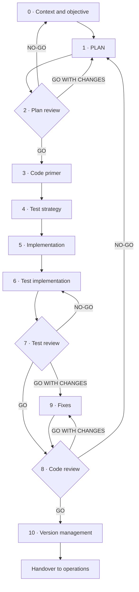

# Operating guide: phases, roles and verdicts

**How SPAD is applied in practice: the strict order of the phases, what each one produces, who carries it out, how it is decided whether to advance and what is cut in the reduced version**

| | |
|---|---|
| Document | Document 01 · Operating guide: phases, roles and verdicts |
| Version | 0.1 |
| Date | 19-09-2026 |
| Author | Fernando García Varela |
| Status | Under construction. Replaces the previous operating guide and official skill definition, which used different numbering. |
| Type | Operating guide |

<!-- cifras: 11 | phases in the main cycle ; 8 | roles ; 3 | verdicts ; 2 | versions: complete and reduced -->

---

> **Version under review: please do not circulate.** The current state of SPAD (version 0.x) is not meant to be shared widely. It is public so that a small number of people can review it, give feedback and help improve it. Documents and tools are being adapted to make them reusable; this notice will disappear when the framework reaches version 1.x.

> **Legal notice and disclaimer.** SPAD is a reference methodology provided "as is" and for information purposes only. It does not constitute legal, regulatory or professional advice, does not guarantee results or compliance with any law or standard and is not a certification. **Each organisation that uses SPAD is solely responsible for validating its results, identifying the regulation that applies to it, verifying that it is current and certifying its own regulatory compliance**, with the appropriate qualified advice. This methodology is a generic, free aid shared with the community so that nobody has to start from scratch; each person or organisation can and should adapt it to its own use. It must not be inferred that its legally sensitive parts have been reviewed by legal counsel: those reviews, for each company or sector, are the ultimate responsibility of the company, consultant or organisation that uses it. Although every effort is made to keep it up to date, some regulation may have changed without being reflected here. To the fullest extent permitted by law, the author accepts no responsibility whatsoever for the effects of its application in any organisation or for its full applicability. The methodology does not grant certification of any kind. The author accepts no liability for any use made of this content or for any decisions taken on the basis of it. The data, figures, companies and cases in the examples are fictitious or illustrative.

## 1. Purpose

This document describes **how SPAD is used in practice**: the order in which the phases are applied, what goes into and comes out of each one, the roles involved, the rules of interaction between artificial intelligences and the verdicts that allow work to advance or send it back. It is the canonical reference for numbering and vocabulary for the rest of the library.

SPAD is not a collection of instructions: it is a **sequential, blocking and auditable methodology** (document 00). This guide makes it operational.

---

## 2. The blocking execution principle

> No phase can begin until the previous phase has produced its artefact and a person has validated it.

Each phase produces an **explicit artefact** that is the mandatory input to the next one. If validation fails, work goes back to the corresponding phase and the rejected artefact is kept in the topic register (document 02), numbered as an iteration.

> **Why it matters.** Blocking is what makes SPAD a method rather than a recommendation. Without it, deadline pressure leads to "starting the code while the plan is being finished", and at that moment the plan ceases to govern anything.

---

## 3. Roles

SPAD distinguishes logical roles from people and artificial intelligences. The same AI may take on several roles over the course of a piece of work, but **never two roles in the same phase**, and the AI that reviews an artefact **is never the one that produced it**.

| Role | Nature | Responsibility | Prohibited |
|---|---|---|---|
| **Orchestrator** | Person | Defines the objective and the context, loads the contexts, sets the topic, validates each output, applies the validation policy and decides whether to advance. Has the final say in everything. | Delegating validation to the AI that produced the output. |
| **AI Planner** | AI | Designs the architecture and the logic (PLAN), sets the code primer, the test strategy and version management. | Writing code. |
| **AI Reviewer** | AI other than the one that produced the artefact | Reviews plans, tests and code; issues findings and a verdict. | Fixing what it reviews; approving with known problems. |
| **AI Builder** | AI | Implements code and tests following the plan, the code primer and the test strategy. | Taking design decisions. |
| **AI Fixer** | AI | Applies minimal, justified fixes to the findings. | Redesigning, refactoring entire modules or extending functionality. |
| **AI Analyst** | AI | Documents existing code and analyses the impact of a change (legacy cycle, document 04). | Proposing the solution. |
| **Diagnostic AI** | AI | Analyses incidents and produces the root cause report (debugging cycle, document 04). | Generating solution code; modifying production code. |
| **AI Security Reviewer** | AI other than the builder | Security review of sensitive code (document 04). | Fixing what it reviews. |

The reviewing role is called **AI Reviewer** and not "auditor": in SEVEN-G, the **AI Auditor** is a person independent of the team that builds ([SEVEN-G 53 · Building solutions with AI](../../../SEVEN-G/html/en/53_SEVEN-G_Construccion_de_soluciones_con_IA.html), section 5).

### 3.1 Human code review

The AI Reviewer reduces the risk, but two artificial intelligences can coincide in the same error. For that reason, in addition to the AI Reviewer, **a competent person reviews the code** before it is merged into the main branch:

| Situation | Human review |
|---|---|
| All SPAD work | At least one person reviews and leaves a record (reviewer, date, outcome), normally in version control. |
| Sensitive code (authentication, authorisation, payments, personal data), limits on agent actions, decisions about people or critical production systems | **Second human review** by a person who did not orchestrate the generation. |
| SEVEN-G initiative with Enterprise intensity | The requirements of SEVEN-G 53 §7 also apply. |

> **Why it matters.** Segregation of duties between artificial intelligences is necessary but not sufficient: the one who answers to the organisation for the code being correct is a person, and that responsibility cannot be delegated to a tool.

---

## 4. Main cycle: phases 0 to 10

The main cycle is used to build a new feature. The numbering in this table is the **canonical** SPAD numbering.

| Phase | Name | Owner | Input | Mandatory output |
|---|---|---|---|---|
| **0** | Context and objective | Orchestrator | Business need; global and project contexts; topic. | Description of the problem, scope, constraints and success criteria. |
| **1** | PLAN | AI Planner | Validated phase 0. | Logical architecture; components and responsibilities; data flows; explicit decisions with alternatives; identified risks. **No code.** |
| **2** | Plan review (AUDIT_PLAN) | AI Reviewer | PLAN. | Problems by category (coupling, cohesion, scalability, concurrency, security, observability); recommendations; **verdict**. |
| **3** | Code primer (CODE_PRIMER) | AI Planner | PLAN with GO. | Project structure, conventions, contracts, strict rules and anti-patterns. No new design decisions. |
| **4** | Test strategy (TEST_STRATEGY) | AI Planner | PLAN with GO. | Test cases, minimum coverage, layers (unit, integration, end-to-end, performance, security), test data and test doubles, edge cases. |
| **5** | Implementation | AI Builder | Code primer and test strategy. | Generated code; list of files created and modified; dependencies added; declaration of conformity with the plan and the primer, with justified deviations. |
| **6** | Test implementation | AI Builder | Test strategy and code. | Tests, test data and test doubles, execution instructions, coverage obtained. |
| **7** | Test review (AUDIT_TESTS) | AI Reviewer | Strategy and tests. | Actual versus expected coverage; quality of the assertions; edge cases and error paths; **verdict**. |
| **8** | Code review (AUDIT_CODE) | AI Reviewer | PLAN, code primer and code. | Fidelity to the plan; compliance with the primer; technical risks; future debt; dependencies and licences; **verdict**. |
| **9** | Fixes (FIX_PRIMERS) | AI Fixer | Findings from phases 7 or 8. | For each fix: problem, minimal change, justification, impact and regression risk; updated tests. |
| **10** | Version management | AI Planner | Code with GO. | Version number (semantic versioning), change log, breaking changes, migration instructions, deployment and rollback plan, monitoring requirements. |

<!-- grafico: Main cycle | The canonical numbering and the returns of each verdict -->

### 4.1 The design phases in detail

**Phase 0 · Context and objective.** The person orchestrating writes down what problem is being solved, for whom, what is within and outside the scope, what constraints exist (technological, legal, deadline) and how it will be known that the result is correct. Without success criteria there is no phase 1.

**Phase 1 · PLAN.** The AI Planner designs without writing code. Each design decision is recorded with the alternatives considered and their trade-offs. Risks are classified by severity and probability. If the solution includes AI components in production, the plan also incorporates what document 05 requires (autonomy level, limits, evaluation of behaviour).

**Phase 2 · Plan review.** The AI Reviewer evaluates and does not fix. A plan reviewed with GO WITH CHANGES goes back to phase 1 with the recommendations; with NO-GO, work goes back to phase 0 because the problem is badly framed or the scope is unfeasible.

**Phase 3 · Code primer.** Translates the plan into verifiable rules for whoever builds: folder structure, naming, interface and data contracts, error handling, concurrency, logging and prohibited anti-patterns. It cannot introduce decisions that the plan does not contain.

**Phase 4 · Test strategy.** It is set **before building** what will be tested and with what minimum coverage, taken from the global context unless there is a justified exception. Critical paths require full coverage.

### 4.2 The build and review phases in detail

**Phase 5 · Implementation.** The AI Builder executes the plan. If it encounters a situation that the plan does not provide for, **it does not decide**: it flags it as a deviation and the person orchestrating sends the work back to phase 1 or accepts a documented minor deviation.

**Phase 6 · Test implementation.** The tests in the strategy are implemented, not those that happen to be convenient. Tests that merely reproduce the code without verifying the expected behaviour do not count.

**Phases 7 and 8 · Reviews.** Independent of the AI Builder. The code review also checks the dependencies added (existence, provenance, known vulnerabilities and licence) and records the technical debt being taken on.

**Phase 9 · Fixes.** Surgical. Each fix goes back to the **code review** (and to the test review if the tests change), not to a complete reimplementation.

**Phase 10 · Version management.** Closes the cycle with what is needed to operate: version, changes, migration, deployment plan with tested rollback and what to monitor after deployment. It is the **handover to operations**: without it, the code is stable but the system is not operated.

> **Why it matters.** Phases 3 and 4 are the ones most often skipped and the ones that protect the most value: the code primer prevents the AI Builder from deciding, and the test strategy prevents the tests from being written at the end to confirm what already exists.

---

## 5. Verdicts

All reviews (phases 2, 7 and 8 and the security review) use the **same vocabulary**:

| Verdict | Meaning | Phase 2 returns to | Phase 7 returns to | Phase 8 returns to |
|---|---|---|---|---|
| **GO** | The artefact complies. Work advances. | Phase 3 | Phase 8 | Phase 10 |
| **GO WITH CHANGES** | Essentially valid; requires specific adjustments and a new review. | Phase 1 | Phase 9 | Phase 9 |
| **NO-GO** | Not acceptable; it must be redone. | Phase 0 | Phase 6 | Phase 1 |

Rules:

1. A verdict without a written justification is an **incomplete artefact** and is discarded (document 03).
2. A GO with open critical or high findings is a **self-approval** and is discarded.
3. A well-founded NO-GO **is not a failure of the process**: it is the process working.
4. The verdict is issued by the AI Reviewer; **it is accepted or rejected by the person orchestrating**, who records it (document 02).

> **Why it matters.** Three different vocabularies for saying the same thing (GO/NO-GO, OK/ISSUES, approved/rejected) make it impossible to compare phases, measure the process (document 08) and automate the validation of the contracts (document 07). A single vocabulary is a condition of auditability.

---

## 6. Reduced version (SPAD Lite)

Not all work needs eleven separate artefacts. The reduced version groups phases together without losing the independent review or the human validation.

| Criterion for using the reduced version | Criterion that requires the complete version |
|---|---|
| Bounded change in one component, with no personal data or money and no effect on decisions about people. | Sensitive code, agents with A2 or A3 autonomy, critical production systems, SEVEN-G Enterprise initiative. |
| Team of one or two people and a single model. | Several teams or model providers. |
| No external audit obligations on the development. | Regulated sector with development traceability requirements. |

| Artefact of the reduced version | Phases it groups | Minimum content |
|---|---|---|
| **Reviewed plan** | 0, 1, 2, 3 and 4 | Objective and scope; architecture and decisions; risks; build rules; test cases and minimum coverage; findings and verdict of a different AI Reviewer. |
| **Reviewed delivery** | 5, 6, 7, 8 and 9 | Code and tests; coverage obtained; findings and verdict of the AI Reviewer; fixes applied; recorded human review. |
| **Version** | 10 | Version number, changes and rollback plan. |

What is **not cut** in any version: the separation between the AI that builds and the one that reviews, the human validation of each artefact, the validation policy and the topic register.

> **Why it matters.** Without a reduced version, teams apply SPAD to large projects and avoid it in small ones, which are the majority and where silent debt accumulates.

---

## 7. Non-negotiable operating rules

| # | Rule | What it protects |
|---|---|---|
| 1 | **No phase is skipped.** All are mandatory in the complete version; in the reduced version they are grouped but do not disappear. | Blocking. |
| 2 | **Every output is auditable.** Explicit, numbered artefacts, traceable in the topic register. | Traceability. |
| 3 | **Every decision is explicit.** There are no implicit design decisions in the code. | Explainability. |
| 4 | **Code executes, it does not decide.** The AI Builder does not take design decisions. | The plan. |
| 5 | **Independent reviews.** The AI Reviewer is never the builder; a person reviews the code as well. | Quality. |
| 6 | **Minimal fixes.** Surgical and justified, never disguised refactoring. | Stability. |
| 7 | **Mandatory tests.** Minimum coverage set before building. | Expected behaviour. |
| 8 | **Security by design.** Sensitive code undergoes the security review; critical and high findings block. | Data and people. |
| 9 | **Contexts loaded.** Global and project contexts before any phase. | Consistency between pieces of work. |
| 10 | **One topic per piece of work.** Each feature, fix or incident has its own topic and folder. | The organisation's memory. |
| 11 | **Model recorded.** Each artefact states which model, version and instructions produced it. | Reproducibility. |
| 12 | **No AI approves.** Every acceptance is signed by an identified person. | Accountability. |

---

## 8. Related documents

| Document | Relationship |
|---|---|
| **document 00 · What SPAD is and how it helps** | Overview of the method. |
| **document 02 · Contexts, topics and artefact register** | What is loaded before phase 0 and how each output is stored. |
| **document 03 · Validation policy** | When a response is discarded. |
| **document 04 · Complementary cycles** | Legacy, debugging, urgent fix and security. |
| **document 05 · Systems that include AI** | Additional requirements when the solution has AI in production. |
| **document 06 · Instructions by phase** | Reference text of each instruction. |
| **document 07 · Input and output contracts** | Mandatory structure of each artefact. |
| [SEVEN-G 53 · Building solutions with AI](../../../SEVEN-G/html/en/53_SEVEN-G_Construccion_de_soluciones_con_IA.html) | Mapping of each phase to SEVEN-G evidence and *gates*; minimum requirements for AI-generated code. |

---

## 9. Version control

| Version | Date | Changes |
|---|---|---|
| 0.1 | 19-09-2026 | First version. Unifies the previous operating guide and official skill with canonical numbering 0–10, complete table of roles (including analyst, diagnostic and security reviewer), human code review, a single vocabulary of verdicts with the return phases, fix loop back to the review, handover to operations in phase 10, reduced version and the model recorded rule. |
