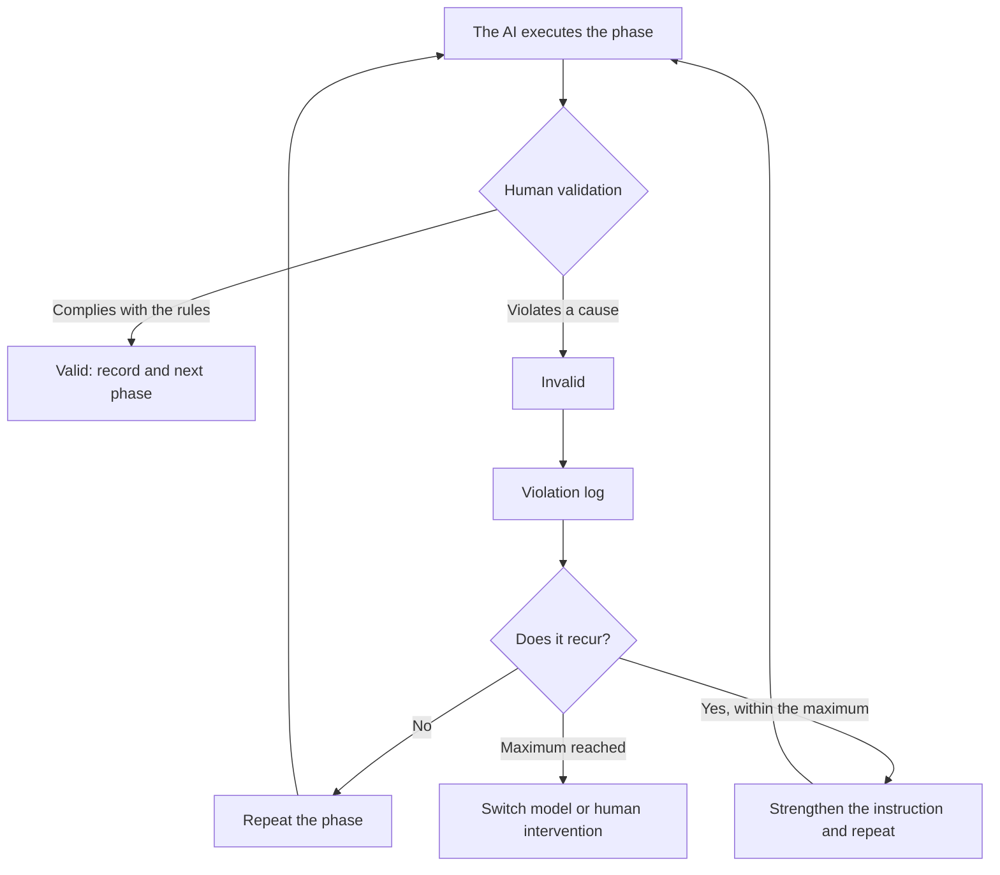

# Validation policy

**When an AI response is invalid and must be discarded even if it looks good: the five causes, what does not invalidate, the procedure and the record that each decision leaves**

| | |
|---|---|
| Document | Document 03 · Validation policy |
| Version | 0.1 |
| Date | 19-09-2026 |
| Author | Fernando García · SEACHAD |
| Status | Under construction. Rewrites the previous validation policy with the validation record and its fit within SEVEN-G. |
| Type | Policy |

<!-- cifras: 5 | invalidation causes ; 3 | validation priorities ; 6 | steps in the procedure ; 0 | invalid responses that are reused -->

---

> **Version under review: please do not circulate.** The current state of SPAD (version 0.x) is not meant to be shared widely. It is public so that a small number of people can review it, give feedback and help improve it. Documents and tools are being adapted to make them reusable; this notice will disappear when the framework reaches version 1.x.

> **Legal notice and disclaimer.** SPAD is a reference methodology provided "as is" and for information purposes only. It does not constitute legal, regulatory or professional advice, does not guarantee results or compliance with any law or standard and is not a certification. **Each organisation that uses SPAD is solely responsible for validating its results, identifying the regulation that applies to it, verifying that it is current and certifying its own regulatory compliance**, with the appropriate qualified advice. The author and SEACHAD accept no liability for any use made of this content or for any decisions taken on the basis of it. The data, figures, companies and cases in the examples are fictitious or illustrative.

## 1. Purpose and nature

This policy establishes when an AI response, in any SPAD phase, is considered **invalid** and must be discarded, regardless of its apparent quality.

It is a **human governance policy**, not an instruction for the AI:

| It is | It is not |
|---|---|
| A set of rules applied by the person orchestrating. | A text that the AI interprets or executes. |
| The process control over the AI's work. | A technical review of the result (that is done by the AI Reviewer and by the human code review). |
| Mandatory in all SPAD work, complete or reduced. | Optional or proportional. |

---

## 2. Fundamental principle

> In SPAD, **workflow compliance is more important than result quality**.

A technically correct response that violates its phase **is not accepted, is not partially reused and is not corrected**: it is discarded in its entirety and the phase is executed again from scratch.

| Priority | Criterion |
|---|---|
| 1 | Process compliance |
| 2 | Technical correctness |
| 3 | Efficiency |

> **Why it matters.** Accepting "just this once" a response that breaks the rules because the code works destroys the process in two steps: the AI learns that it can skip the phase and the person loses the reference of what is valid. The discipline of discarding and repeating is what makes the artefacts reliable and the traceability real. A valid NO-GO is always better than an invalid GO.

---

## 3. Invalidation causes

### 3.1 Phase violation

The response executes actions that do not correspond to the active phase.

| Phase | Violation | Why it is invalid |
|---|---|---|
| PLAN | Generates or modifies code; proposes concrete fixes. | The plan defines, it does not implement. |
| Plan review | Corrects or rewrites the plan. | The AI Reviewer evaluates, it does not fix. |
| Code primer | Introduces new design decisions. | The primer translates the plan, it does not change it. |
| Implementation | Takes design decisions. | The AI Builder follows decisions, it does not take them. |
| Code review | Corrects or rewrites code. | The AI Reviewer evaluates, it does not fix. |
| Fixes | Redesigns, refactors or extends functionality. | Minimal fixes only. |
| Diagnosis | Generates solution code; modifies production code. | It produces a root cause report, not solutions. |

**Action:** discard the response and execute the same phase again. If it recurs, record the violation.

### 3.2 Missing or altered artefacts

The response omits mandatory sections, does not include the required markers or alters the contractual format (document 07).

*Examples:* a plan without the risks section; a review without an explicit verdict; a test strategy without minimum coverage; a version without a semantic number; a root cause report without a verdict; any artefact without the model record.

**Action:** discard and execute the phase again, insisting on the mandatory sections.

### 3.3 Off-plan decisions

The response introduces technical decisions not documented in the approved plan, unauthorised scope changes or undeclared assumptions, **even if they are well reasoned**.

*Examples:* the implementation adds a caching layer that the plan does not provide for; it changes the data schema; integration tests appear where only unit tests were planned; a fix refactors an entire module.

**Action:** discard; return to the plan (or to the fix plan, if the change is minor and the person accepts it as an iteration); record the unauthorised decision.

### 3.4 Implementation without prior review

Code is generated or modified when no approved plan exists, the plan review or the code review has not been executed, or a previous review returned NO-GO and implementation proceeds anyway.

**Action:** discard all the generated code and return to the correct phase. If that code were to reach production within a SEVEN-G initiative, it is a **major nonconformity** ([SEVEN-G 53](../../../SEVEN-G/html/en/53_SEVEN-G_Construccion_de_soluciones_con_IA.html), section 6).

### 3.5 Self-approval

The response approves itself, minimises violations or justifies non-compliance.

*Examples:* "I made some changes to the plan, but they are minor"; "I know I was not supposed to include code, but I am adding an example"; "the review found three issues, but I am marking them as GO"; "I implemented X instead of Y because it is better".

**Action:** **immediate** discard; execute again with strengthened constraints; consider it a **critical violation** in the log.

> **Why it matters.** Self-approval is the most serious cause because it directly attacks the segregation of duties: if it is tolerated, the AI Reviewer ceases to be a review and becomes a formality.

---

## 4. What does not invalidate a response

| Situation | Valid | Reason |
|---|---|---|
| The review returns NO-GO. | Yes | The review is working. |
| The security review finds critical vulnerabilities. | Yes | That is why we review. |
| Tests fail on the first implementation. | Yes | Expected iteration. |
| Code that works but is not elegant, within its phase. | Yes | It is improved in fixes if the review flags it. |
| Minor style inconsistencies. | Yes | Likewise. |
| A reasonable technical opinion within the scope of the phase. | Yes | It is part of the work. |
| A conservative assessment of a risk. | Yes | Better safe than sorry. |
| The AI declares a deviation and **does not execute it**, asking for a decision. | Yes | It is the correct behaviour when the plan has a gap. |

---

## 5. Procedure when a response is invalid

| Step | Action |
|---|---|
| 1 · Recognise | Identify that the response violates one of the five causes. |
| 2 · Do not correct | Do not edit the response, do not reuse parts of it, do not ask the AI to "fix" it. |
| 3 · Discard | Treat the entire response as if it did not exist. It is kept in the topic's register as a rejected iteration, marked as invalid. |
| 4 · Repeat | Execute the same phase with the same instruction. |
| 5 · Strengthen | If the violation recurs: make the prohibitions explicit in the instruction, add examples of what is not admitted, tighten the review, record the pattern. |
| 6 · Escalate | After the maximum number of attempts set in the global context (starting value: three), switch model, have a person intervene or document the limitation of the methodology for that case. |

<!-- grafico: Validation of each phase | The person validates; what is invalid is recorded and repeated -->

---

## 6. Validation record and violation log

Every validation leaves a record (document 02, section 4.2), and every invalidation, in addition, an entry in the violation log:

| Field | Content |
|---|---|
| Date and topic | When and in which piece of work. |
| Phase | The active phase. |
| Cause | One of the five (3.1 to 3.5). |
| Model | Provider, model and version that produced the response. |
| Action | Repeated · Strengthened · Escalated. |
| Outcome | On which attempt a valid response was obtained, or whether it was escalated. |

*Illustrative example of a log.*

| Date | Topic | Phase | Cause | Model | Action | Outcome |
|---|---|---|---|---|---|---|
| 11-02-2026 | `payment_gateway` | PLAN | Phase violation (code in the plan) | Provider A, model 4, v2026-01 | Repeated | Valid on the second attempt |
| 11-02-2026 | `user_auth` | Code review | Self-approval with open findings | Provider B, model 3.5 | Strengthened | Valid on the third attempt after tightening the instruction |

> **Why it matters.** The log turns the policy into learning: it shows which phases fail most, which models follow the rules worst and which instructions need strengthening. It is the basis of the process metrics (document 08) and, in organisations that apply SEVEN-G, it feeds the lessons learned and the assessment of the AI provider.

---

## 7. Governance rules

| Rule | Detail |
|---|---|
| **Authority** | Validation decisions are final and are taken by the person orchestrating. When in doubt, invalidate. |
| **Independence** | No AI validates its own output; the AI Reviewer's outputs are validated by a person, not by the AI Builder. |
| **Documentation** | Every invalidation is recorded. In work under the reduced version, at least cause, phase and date. |
| **Continuous improvement** | If a phase exceeds the invalidation rate set in the global context (starting value: 30 %), the instruction is reviewed. If a model violates the rules systematically, it is switched. The policy is reviewed in the light of experience. |

---

## 8. Examples of decisions

| Phase | Output | Decision | Reason |
|---|---|---|---|
| Plan review | "The design does not handle more than one hundred concurrent users. Verdict: NO-GO." | **Valid** | The review is working; work returns to the plan with the observation. |
| PLAN | Detailed architecture followed by "a sample implementation" of five hundred lines. | **Invalid** | Phase violation. Code quality is irrelevant. |
| Implementation | Code that follows the plan and the primer, with style inconsistencies. | **Valid** | Within the phase; style is addressed in fixes if the review flags it. |
| Code review | "Three issues: no error handling, no input validation, a secret in the code. They are minor: GO." | **Invalid** | Self-approval with open findings. Critical violation. |
| Implementation | "The plan does not say how to handle the retry; I have not implemented it and I am asking for a decision." | **Valid** | Correct behaviour when the plan has a gap: the person decides to return to the plan. |

---

## 9. Related documents

| Document | Relationship |
|---|---|
| **document 01 · Operating guide** | Phases, roles and verdicts to which the policy applies. |
| **document 02 · Contexts, topics and artefact register** | Validation record and violation log. |
| **document 07 · Input and output contracts** | Mandatory sections whose absence invalidates (3.2). |
| **document 08 · Self-assessment and metrics** | Invalidation rate and other process metrics. |
| [SEVEN-G 53 · Building solutions with AI](../../../SEVEN-G/html/en/53_SEVEN-G_Construccion_de_soluciones_con_IA.html) | Additional treatment of each cause within SEVEN-G (nonconformities, evidence). |

---

## 10. Version control

| Version | Date | Changes |
|---|---|---|
| 0.1 | 19-09-2026 | First version. Rewrites the previous policy within the library: human nature of the policy, five causes with actions, what does not invalidate, procedure with maximum number of attempts and invalidation rate as parameters of the global context, validation record and violation log, governance and examples. |
