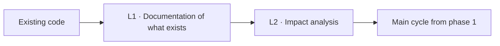
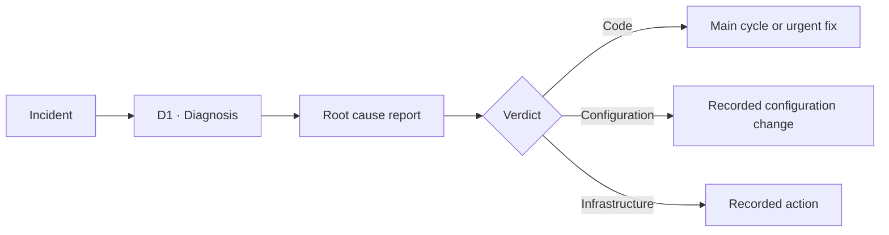
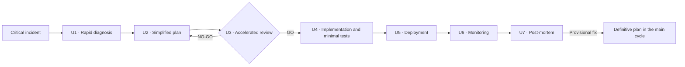
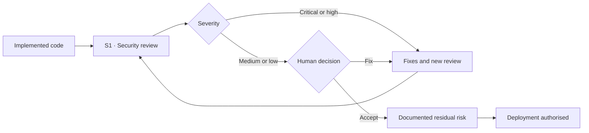

# Complementary cycles: legacy, debugging, urgent fixes and security

**How SPAD applies the same rules when the work is not a new feature: undocumented code, incidents, emergencies and sensitive code**

| | |
|---|---|
| Document | Document 04 · Complementary cycles |
| Version | 0.1 |
| Date | 19-09-2026 |
| Author | Fernando García Varela |
| Status | Under construction. Develops the legacy, debugging, urgent fix and security cycles of the previous guide with the severity scale, risk acceptance and handover to operations. |
| Type | Operating guide |

<!-- cifras: 4 | complementary cycles ; 3 | root cause verdicts ; 4 | severity levels ; 0 | emergencies without review -->

---

> **Version under review: please do not circulate.** The current state of SPAD (version 0.x) is not meant to be shared widely. It is public so that a small number of people can review it, give feedback and help improve it. Documents and tools are being adapted to make them reusable; this notice will disappear when the framework reaches version 1.x.

> **Legal notice and disclaimer.** SPAD is a reference methodology provided "as is" and for information purposes only. It does not constitute legal, regulatory or professional advice, does not guarantee results or compliance with any law or standard and is not a certification. **Each organisation that uses SPAD is solely responsible for validating its results, identifying the regulation that applies to it, verifying that it is current and certifying its own regulatory compliance**, with the appropriate qualified advice. This methodology is a generic, free aid shared with the community so that nobody has to start from scratch; each person or organisation can and should adapt it to its own use. It must not be inferred that its legally sensitive parts have been reviewed by legal counsel: those reviews, for each company or sector, are the ultimate responsibility of the company, consultant or organisation that uses it. Although every effort is made to keep it up to date, some regulation may have changed without being reflected here. To the fullest extent permitted by law, the author accepts no responsibility whatsoever for the effects of its application in any organisation or for its full applicability. The methodology does not grant certification of any kind. The author accepts no liability for any use made of this content or for any decisions taken on the basis of it. The data, figures, companies and cases in the examples are fictitious or illustrative.

## 1. Purpose

The main cycle (document 01) builds new functionality. This document defines the four cycles that cover the rest of a team's real work, with the same rules: blocking phases, artefacts, an independent AI Reviewer, human validation and a record.

| Cycle | Used when | Leads to |
|---|---|---|
| **Legacy** | Existing code without sufficient documentation needs to be modified. | The main cycle, from phase 1. |
| **Debugging** | A problem appears in production or in development. | Main cycle (code), configuration adjustment or action on infrastructure. |
| **Urgent fix** | A critical incident requires an immediate solution. | Solution deployed, post-mortem and, where applicable, a definitive plan. |
| **Security** | The code handles sensitive data, authentication, authorisation or payments, or the context requires it. | Classified findings; critical and high findings block deployment. |

---

## 2. Legacy cycle

### 2.1 Phases

| Phase | Owner | Input | Mandatory output |
|---|---|---|---|
| **L1 · Documentation of what exists** | AI Analyst | Existing code and its location. | Current behaviour (purpose, functions, inputs, outputs, side effects); components and internal and external dependencies; flow and architecture diagrams; identified risks. |
| **L2 · Impact analysis** | AI Analyst | Documented code and objective of the change. | Affected areas with impact level; risks of the modification and mitigation; related existing tests and coverage gaps; edge cases and whether they have a test; recommendations. |

Afterwards, the work continues in **phase 1 (PLAN)** of the main cycle, which takes L1 and L2 as input.

<!-- grafico: Legacy cycle | Understand before changing -->

### 2.2 Rules

- The AI Analyst **describes**; it does not propose solutions or fix anything.
- The L1 documentation is validated by checking it against the observable behaviour (existing tests, logs, execution samples); documentation that is plausible but unverified is a risk, not evidence.
- If L2 reveals that there are no tests of the behaviour that is going to be changed, the test strategy (phase 4) includes **characterisation tests** of the current behaviour before modifying it.

> **Why it matters.** Most changes in production are changes to legacy code. Modifying what is not understood is the usual cause of regressions; the legacy cycle forces understanding first and leaves in writing what was understood.

---

## 3. Debugging cycle

### 3.1 Phase

| Phase | Owner | Input | Mandatory output |
|---|---|---|---|
| **D1 · Diagnosis** | Diagnostic AI | Description of the incident, environment, available evidence (logs, traces, configuration). | **Root cause report**: analysis mode; evidence examined; technical explanation; category (logic error, configuration, race condition, resource exhaustion, dependency, other); **verdict**: code · configuration · infrastructure; prioritised actions. |

Analysis modes:

| Mode | What it does | When |
|---|---|---|
| **Static analysis** | Examines code, configuration and logs without executing anything. | Always as the first step; the only mode if there is no safe execution environment. |
| **Analysis with execution** | Reproduces the problem with traces in a controlled environment. | When static analysis is inconclusive and a test environment exists. Only temporary traces or flags are admitted; no functional change. |

### 3.2 Outputs according to the verdict

| Verdict | Next step |
|---|---|
| **Code** | Main cycle from phase 1 (or urgent fix if the incident is critical). |
| **Configuration** | Configuration adjustment recorded as a change, with rollback. |
| **Infrastructure** | Action on infrastructure recorded as a change, with rollback. |

<!-- grafico: Debugging cycle | Diagnosis first; the solution depends on the verdict -->

### 3.3 Rules

- The diagnostic AI **does not generate solution code** and does not modify production code: it produces a diagnosis. Doing so is a phase violation (document 03).
- A report without a verdict is an incomplete artefact.
- The report is kept in the incident's topic, even if the cause turns out to be configuration: it is organisational learning.

> **Why it matters.** Under the pressure of an incident, the temptation is to ask the AI to "fix it". Separating diagnosis from solution avoids fixing symptoms and produces a report that explains what happened, which is what management, the customer or the auditor ask for afterwards.

---

## 4. Urgent fix cycle

For critical incidents (priorities P1 and P2 according to the organisation's scale) that require an immediate solution. **It speeds up the phases; it does not eliminate them.**

### 4.1 Phases

| Phase | Owner | Mandatory output | Global context parameter |
|---|---|---|---|
| **U1 · Rapid diagnosis** | Diagnostic AI | Abbreviated root cause report with verdict. | — |
| **U2 · Simplified plan** | AI Planner | Proposed minimal change, scope, risk, rollback plan. | Maximum time for the plan (starting value to be set by each organisation). |
| **U3 · Accelerated review** | AI Reviewer | Verdict on the simplified plan. **Mandatory.** | — |
| **U4 · Implementation with minimal tests** | AI Builder | Change and minimal tests covering the fixed path. **Mandatory.** | — |
| **U5 · Deployment** | Authorised person | Recorded deployment with method and rollback available. | Emergency approval: who may give it. |
| **U6 · Monitoring** | Operations | Monitored indicators and status (stable · unstable · rolled back). | Minimum duration of monitoring. |
| **U7 · Post-mortem** | Person orchestrating, with diagnostic AI | Timeline, root cause, effectiveness of the fix, lessons, actions with owner and date; if the fix is provisional, **topic of the definitive plan**. | Maximum time for the post-mortem. |

<!-- grafico: Urgent fix | Faster, with the same guarantees -->

### 4.2 Rules

- Emergency approval is given by a person with authority defined in the global context; it is recorded.
- A provisional fix **must open** a topic for the definitive plan; it cannot remain in production without a replacement date.
- The post-mortem is mandatory even if the fix has worked.
- The time limits (simplified plan, monitoring, post-mortem) are parameters of the global context, not fixed figures of the methodology.

> **Why it matters.** Emergencies are the moment when controls are most relaxed and errors do the most damage: a hasty fix without review or tests frequently produces the second incident. SPAD speeds up the review and reduces the tests to the minimum, but does not remove them, and turns every emergency into learning.

---

## 5. Security cycle

### 5.1 When it is mandatory

| Situation | Security review |
|---|---|
| Authentication, authorisation, session or secret management. | Mandatory. |
| Payments, monetary operations, financial data. | Mandatory. |
| Personal data or confidential information. | Mandatory. |
| Untrusted user inputs, exposed interfaces. | Mandatory. |
| AI components in production (instructions, agents, information retrieval). | Mandatory, with the requirements of document 05. |
| The rest of the code. | Recommended; according to the project context. |

### 5.2 Phase

| Phase | Owner | Input | Mandatory output |
|---|---|---|---|
| **S1 · Security review** | AI Security Reviewer (other than the builder) | Implemented code, security context, dependencies. | Scope reviewed; vulnerabilities with identifier, severity, category, reference to the reference list (OWASP Top 10 and, for AI components, OWASP Top 10 for Large Language Model Applications), location, exploitation scenario and remediation; secret management; dependencies with known vulnerabilities; deployment decision; residual risks. |

### 5.3 Severities, blocking and risk acceptance

| Severity | Effect | Who decides |
|---|---|---|
| **Critical** | Blocks deployment. Returns to fixes (phase 9) and a new security review. | Nobody can accept it as residual risk. |
| **High** | Blocks deployment. Returns to fixes and a new review. | Only exceptionally, acceptance by the risk authority of the global context, in writing and with a fix date. |
| **Medium** | Does not block. It is fixed or accepted as residual risk. | Person with acceptance authority according to the global context. |
| **Low** | Does not block. It is fixed or accepted. | Person orchestrating. |

The scale corresponds to that of SEVEN-G for organisations that apply it ([SEVEN-G 33 · AI risk methodology](../../../SEVEN-G/html/en/33_SEVEN-G_Metodologia_de_riesgos_de_IA.html)); in those organisations, residual risk is accepted by the body corresponding to its level and critical and high findings block decision gate G5.

**No AI accepts a residual risk.** The AI Security Reviewer classifies and recommends; a person accepts.

<!-- grafico: Security cycle | Classify, fix what blocks, accept what is residual in writing -->

### 5.4 Supply chain and licences

The security review and the code review (phase 8) also check:

- that each added dependency **exists**, has known provenance and maintenance and has no known unmitigated vulnerabilities (the AI may suggest non-existent or malicious packages);
- that the licences of the dependencies and of the fragments identified as coming from third parties are compatible with the organisation's licensing policy;
- that a software bill of materials for the delivery exists when the context requires it.

> **Why it matters.** Code generated with AI inherits the vulnerabilities and the licences of whatever the AI proposes to incorporate. Reviewing one's own code and not its dependencies leaves the most used door open.

---

## 6. Handover to operations

All cycles that end in a deployable change go through **version management** (phase 10 of the main cycle or U5–U6 in the urgent fix), which includes the deployment plan, a tested rollback plan, monitoring requirements and the operations owner. In organisations that apply SEVEN-G, this links to the operations manual and the rollback plan ([SEVEN-G 52 · AI operations manual](../../../SEVEN-G/html/en/52_SEVEN-G_Manual_de_operacion_de_IA.html)).

---

## 7. Related documents

| Document | Relationship |
|---|---|
| **document 01 · Operating guide** | Main cycle into which these cycles lead; phase 9 of fixes; phase 10 of versions. |
| **document 02 · Contexts, topics and artefact register** | Parameters for time limits, severities and acceptance in the global context. |
| **document 03 · Validation policy** | Phase violations specific to these cycles. |
| **document 05 · Systems that include AI** | Additional security requirements for AI components. |
| **document 07 · Input and output contracts** | Structure of the root cause, security and urgent fix reports. |
| [SEVEN-G 33 · AI risk methodology](../../../SEVEN-G/html/en/33_SEVEN-G_Metodologia_de_riesgos_de_IA.html) | Risk scale and acceptance in SEVEN-G. |
| [SEVEN-G 53 · Building solutions with AI](../../../SEVEN-G/html/en/53_SEVEN-G_Construccion_de_soluciones_con_IA.html) | SEVEN-G evidence into which these cycles lead. |

---

## 8. Version control

| Version | Date | Changes |
|---|---|---|
| 0.1 | 19-09-2026 | First version. Develops the four cycles with numbered phases, rules and diagrams; characterisation tests in legacy; time limits as parameters of the global context; severities with blocking and human acceptance of risk; supply chain and licences; handover to operations. |
