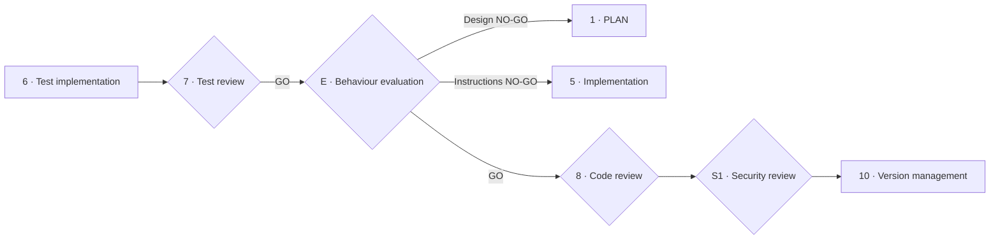

# Systems that include AI: behaviour evaluation and agents

**What SPAD adds when the system built is not only written with AI but has AI inside it: instructions in production, information retrieval, agents that act and models that change without the code changing**

| | |
|---|---|
| Document | Document 05 · Systems that include AI |
| Version | 0.1 |
| Date | 19-09-2026 |
| Author | Fernando García · SEACHAD |
| Status | Under construction. New document; replaces the derived agent design skill, which was a list of topics without a method. |
| Type | Operating guide |

<!-- cifras: 2 | distinct objects: code with AI and system with AI ; 4 | autonomy levels A0–A3 ; 5 | requirements added to the plan ; 1 | new evaluation phase -->

---

> **Version under review: please do not circulate.** The current state of SPAD (version 0.x) is not meant to be shared widely. It is public so that a small number of people can review it, give feedback and help improve it. Documents and tools are being adapted to make them reusable; this notice will disappear when the framework reaches version 1.x.

> **Legal notice and disclaimer.** SPAD is a reference methodology provided "as is" and for information purposes only. It does not constitute legal, regulatory or professional advice, does not guarantee results or compliance with any law or standard and is not a certification. References to general regulation (such as the EU AI Act or the GDPR) may be incomplete, may not apply to a particular case or may become out of date. **Each organisation that uses SPAD is solely responsible for validating its results, identifying the regulation that applies to it, verifying that it is current and certifying its own regulatory compliance**, with the appropriate qualified advice. The author and SEACHAD accept no liability for any use made of this content or for any decisions taken on the basis of it. The data, figures, companies and cases in the examples are fictitious or illustrative.

## 1. Two distinct objects

SPAD was created to govern **code written with the help of AI**. Increasingly, what is built is a **system that includes AI**: an application whose behaviour depends, in production, on a model, on a set of instructions, on a knowledge base or on an agent that executes actions.

| Aspect | Code written with AI | System that includes AI |
|---|---|---|
| What the AI produces | Code, tests and documentation, reviewed before deployment. | Responses, decisions or actions **in production**, in response to inputs that nobody has seen before. |
| When behaviour is checked | Before deployment, with deterministic tests. | Before and **during** use, with evaluations on sets of cases and continuous monitoring. |
| What changes without the code changing | Nothing. | The provider's model, the instructions, the retrieved data, the available tools. |
| Specific risks | Those of software: defects, debt, vulnerabilities. | In addition: confidently incorrect responses, prompt injection, data leakage, unauthorised actions, bias, drift. |

This document defines what SPAD **adds** to the main cycle when the object is a system that includes AI. Everything else (phases, roles, verdicts, validation, registers) applies in the same way.

> **Why it matters.** It is the highest-risk case and the one least covered by classic engineering methods. A system with AI can pass every code test and still give unacceptable responses, execute actions that nobody authorised or change its behaviour when the provider updates the model.

---

## 2. Autonomy level

Every AI component that decides or acts is classified from the plan onwards using the SEVEN-G autonomy scale:

| Level | Name | What the system does | What the person does | Illustrative example |
|---|---|---|---|---|
| **A0** | Assistance | Informs, summarises or generates content. | Decides and executes. | Summary of a case file for an analyst. |
| **A1** | Recommendation | Proposes a specific decision or action. | Validates each action before executing it. | Proposed reply to a customer that a human agent approves. |
| **A2** | Supervised action | Executes actions within defined limits. | Supervises, can interrupt and reviews afterwards. | Stock replenishment with daily review of exceptions. |
| **A3** | Autonomous action | Executes sequences of actions without individual review, within strict limits. | Sets limits, monitors aggregates and has a kill switch. | Continuous price adjustment within an approved band. |

The level determines the intensity of the requirements in this document: A0 and A1 require behaviour evaluation; A2 and A3 additionally require action limits, an action log, a tested kill switch and, in organisations that apply SEVEN-G, Enterprise intensity and the controls of [SEVEN-G 35 · AI and agent security](../../../SEVEN-G/html/en/35_SEVEN-G_Seguridad_de_IA_y_agentes.html).

---

## 3. What it adds to each phase

| Phase | Added requirement |
|---|---|
| **0 · Context and objective** | Success criteria **measurable on behaviour** (accuracy, correct refusal rate, latency, cost per interaction) and what the system **must never do**. |
| **1 · PLAN** | Autonomy level; AI components (model, instructions, information retrieval, agent tools, memory); action limits; what data the model receives and which provider; failure modes and safe behaviour in the face of them; strategy for changes to the provider's model. |
| **2 · Plan review** | The AI Reviewer also evaluates: suitability of the autonomy level for the risk; sufficiency of the limits; exposure of data to the provider; existence of a kill switch and of an alternative without AI. |
| **3 · Code primer** | Rules for the instructions (versioned as code, with no personal data), for the agent tool contracts (minimum permissions, validated parameters) and for logging each interaction. |
| **4 · Test strategy** | The **behaviour evaluation strategy** is added (section 4): sets of cases, acceptance criteria, adversarial tests, bias tests and their threshold. |
| **5 and 6 · Implementation** | The instructions, the evaluation sets and the agent tools are artefacts of the topic, versioned with the code. |
| **7 · Test review** | Checks that the behaviour evaluation covers the criteria of phase 0 and the failure modes of the plan. |
| **E · Behaviour evaluation** (new, after phase 7) | Section 4. |
| **8 · Code review** | Also reviews the interaction log, the management of memory and data, and the separation between the system instructions and the user inputs. |
| **S1 · Security review** | **Mandatory**, with the OWASP Top 10 for Large Language Model Applications as reference: prompt injection, leakage of system or user data, insecure outputs, data poisoning, excessive tool permissions, over-reliance on the model. |
| **10 · Version management** | The version includes the model and its parameters, the instructions and the evaluation sets; the monitoring plan includes drift and cost; the rollback plan includes the **fallback model** or the alternative without AI. |

---

## 4. Phase E · Behaviour evaluation

### 4.1 What it is

An additional phase, between the test review and the code review, in which the system with AI is run on **representative sets of cases** and its outputs are compared with acceptance criteria set in advance. Code tests verify that the program does what the code says; the evaluation verifies that the **system** does what the objective says.

| Element | Content |
|---|---|
| **Evaluation set** | Cases representative of real use, with the expected output or the criteria for judging it, including edge cases and cases that the system **must refuse**. Versioned; no real personal data without a legal basis and safeguards. |
| **Acceptance criteria** | Thresholds per metric (accuracy, refusal coverage, hallucinations detected, latency, cost), set in phase 0 or in the plan. |
| **Adversarial tests** | Direct and indirect prompt injection (through retrieved documents), attempts to extract the system instructions or data, out-of-scope inputs, requests for unauthorised actions. |
| **Bias tests** | Counterfactual pairs (same input with a protected attribute changed) and quality by segment, mandatory when the system decides, recommends or communicates with people. |
| **Evaluator** | Automatic when a reference response exists; with judges (model or person) when there is none; in every case, a **sample reviewed by people**. |
| **Fallback model** | If the plan provides for degradation to another model, that model is evaluated with the same set before deployment. |

### 4.2 Owner, input and output

| Phase | Owner | Input | Mandatory output |
|---|---|---|---|
| **E · Behaviour evaluation** | The AI Builder runs it; the AI Reviewer evaluates the results; a person reviews the sample | Implemented system, evaluation set, criteria. | Evaluation report: results per metric against threshold; failures by category with examples; adversarial and bias results; sample reviewed by people; **verdict** (GO · GO WITH CHANGES · NO-GO). |

A NO-GO sends the work back to phase 1 if the failure is one of design (limits, tools, architecture) or to phase 5 if it is one of instructions or implementation.

<!-- grafico: Main cycle with behaviour evaluation | Phase E sits between the test review and the code review -->

> **Why it matters.** Without behaviour evaluation, the only proof that an assistant responds well is the demonstration somebody gave with the questions that occurred to them. The versioned evaluation set also makes it possible to repeat the test every time the model, the instructions or the data change, which is exactly when behaviour changes without anybody having touched the code.

---

## 5. Agents

An agent is an AI component that **executes actions** by means of tools (queries, writes, calls to other systems). An agent's plan includes:

| Element | Content |
|---|---|
| **Roles and responsibilities** | What the agent does and does not do; if there are several agents, who coordinates and with what authority. |
| **Tool contracts** | Each tool with validated parameters, minimum permissions, effects (read or write) and limits (amount, volume, scope). |
| **Action limits** | Which actions it may execute without validation (A2/A3), which require human approval and which are prohibited. |
| **Memory** | What it remembers in the short and long term, where it is stored, with what retention and without which data. |
| **Failure modes and safe stop** | What happens if a tool fails, if the model does not respond or if an action outside the limits is detected: safe state, escalation to a person, **kill switch** with an owner and periodic testing. |
| **Log** | Each action with input, decision, tool invoked, result and supervising person, reconstructible afterwards. |
| **Identity** | The agent acts with its own credentials, not those of a person, with no production credentials in development. |

Rules:

1. No agent with A2 or A3 autonomy is deployed without a behaviour evaluation that includes attempts to exceed its limits.
2. The human override rate of its actions is monitored: close to zero for months indicates nominal supervision; very high, a badly calibrated system.
3. Build agents (those that SPAD uses to write code) are subject to the same rules: least privilege, no production credentials and an action log.

---

## 6. Operation: what changes without the code changing

| Change | Treatment in SPAD |
|---|---|
| **The provider updates the model** | The evaluation set is run again before the new version is accepted; if the version cannot be pinned, drift monitoring is mandatory. |
| **The instructions change** | They are code: they go through a reduced plan, review and evaluation. |
| **The knowledge base changes** | Retrieval is evaluated (relevance, current sources) and the adversarial cases of indirect injection are repeated. |
| **Usage drift** | The distribution of topics and the queries outside the evaluated scope are monitored; a significant change opens a topic. |
| **Cost** | Consumption budget per interaction and period; cost-driven degradation only to evaluated models. |

In organisations that apply SEVEN-G, this monitoring is integrated into the operations manual ([SEVEN-G 52 · AI operations manual](../../../SEVEN-G/html/en/52_SEVEN-G_Manual_de_operacion_de_IA.html)).

---

## 7. Data and model provider

| Rule | Detail |
|---|---|
| Classification of what is sent | Only the classes of information authorised in the global context for that provider and environment (document 02). |
| Personal data | Never in instructions or in evaluation sets without a documented legal basis and safeguards; synthetic data by default. |
| Retention and use by the provider | Verified contractually before use; no use of the inputs for training unless expressly agreed. |
| Secrets | Never in instructions or in code; the agent tools obtain them from a secrets store. |
| Separation | The system instructions and the inputs from the user or from retrieved documents are kept separate and marked; retrieved content is treated as **data, not as instructions**. |

---

## 8. Relationship with regulation

Systems that include AI may be subject to specific obligations (for example, those of the EU AI Act on transparency, human oversight, technical documentation or risk classification, and those of data protection on automated decisions). SPAD **does not determine** those obligations: it produces artefacts that serve as evidence (plan, evaluation, action log, version). Identifying and verifying the applicable regulation is the responsibility of each organisation, with legal advice; in SEVEN-G, through [SEVEN-G 32 · AI system inventory and regulatory classification](../../../SEVEN-G/html/en/32_SEVEN-G_Inventario_y_clasificacion_regulatoria.html) and [SEVEN-G 34 · Regulatory mapping](../../../SEVEN-G/html/en/34_SEVEN-G_Mapeo_regulatorio.html).

---

## 9. Related documents

| Document | Relationship |
|---|---|
| **document 01 · Operating guide** | Main cycle to which these requirements are added. |
| **document 02 · Contexts, topics and artefact register** | Data and provider rules of the global context. |
| **document 04 · Complementary cycles** | Security review. |
| **document 07 · Input and output contracts** | Contract of the behaviour evaluation report. |
| [SEVEN-G 35 · AI and agent security](../../../SEVEN-G/html/en/35_SEVEN-G_Seguridad_de_IA_y_agentes.html) | Autonomy levels, agent controls and kill switch. |
| [SEVEN-G 52 · AI operations manual](../../../SEVEN-G/html/en/52_SEVEN-G_Manual_de_operacion_de_IA.html) | Monitoring of drift, bias and cost in operation. |
| [SEVEN-G 53 · Building solutions with AI](../../../SEVEN-G/html/en/53_SEVEN-G_Construccion_de_soluciones_con_IA.html) | Tests required of AI systems before decision gate G5. |

---

## 10. Version control

| Version | Date | Changes |
|---|---|---|
| 0.1 | 19-09-2026 | First version. Distinguishes code written with AI from a system that includes AI; autonomy levels A0–A3; requirements added to each phase; phase E of behaviour evaluation with sets, criteria, adversarial and bias tests; agent plan; changes without a code change; data and provider; relationship with regulation. Replaces the derived agent design skill. |
