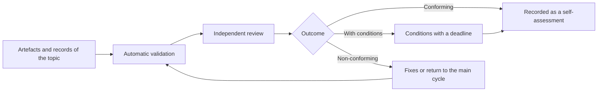

# Self-assessment of conformity and process metrics

**How an organisation checks that it has worked in accordance with SPAD, what evidence it needs and with which indicators it knows whether the method works, without certifications or promised figures**

| | |
|---|---|
| Document | Document 08 · Self-assessment of conformity and process metrics |
| Version | 0.1 |
| Date | 19-09-2026 |
| Author | Fernando García Varela |
| Status | Under construction. Rewrites the previous self-assessment with the artefacts of the canonical cycle and adds the process metrics. |
| Type | Application guide |

<!-- cifras: 6 | conformity conditions ; 3 | possible outcomes ; 8 | process metrics ; 0 | certifications -->

---

> **Version under review: please do not circulate.** The current state of SPAD (version 0.x) is not meant to be shared widely. It is public so that a small number of people can review it, give feedback and help improve it. Documents and tools are being adapted to make them reusable; this notice will disappear when the framework reaches version 1.x.

> **Legal notice and disclaimer.** SPAD is a reference methodology provided "as is" and for information purposes only. It does not constitute legal, regulatory or professional advice, does not guarantee results or compliance with any law or standard and is not a certification. **Each organisation that uses SPAD is solely responsible for validating its results, identifying the regulation that applies to it, verifying that it is current and certifying its own regulatory compliance**, with the appropriate qualified advice. This methodology is a generic, free aid shared with the community so that nobody has to start from scratch; each person or organisation can and should adapt it to its own use. It must not be inferred that its legally sensitive parts have been reviewed by legal counsel: those reviews, for each company or sector, are the ultimate responsibility of the company, consultant or organisation that uses it. Although every effort is made to keep it up to date, some regulation may have changed without being reflected here. To the fullest extent permitted by law, the author accepts no responsibility whatsoever for the effects of its application in any organisation or for its full applicability. The methodology does not grant certification of any kind. The author accepts no liability for any use made of this content or for any decisions taken on the basis of it. The data, figures, companies and cases in the examples are fictitious or illustrative.

## 1. What the self-assessment is

The **self-assessment of conformity** is a structured review, carried out by the organisation itself, to check whether a system, a project, an agent or a team has worked **in accordance with SPAD**.

| It is | It is not |
|---|---|
| An internal review tool. | A certification. |
| Carried out by a person independent of those who built. | Issued or endorsed by its author or by any third party. |
| Evidence of methodological rigour for internal or external audits. | Accreditation of compliance with any law or standard. |
| Referenceable in internal documentation and, with approval, in communications with customers, always as a self-assessment. | A public claim or a seal. |

Presenting the self-assessment as a certification is a breach of the organisation's governance and of the permitted use of the SPAD name (document 00, section 11).

> **Why it matters.** An honest self-assessment gives the organisation a shared definition of "done" and a set of evidence ready for whoever asks for it. A seal that nobody has granted would give false assurance and would expose the organisation if anyone put it to the test.

---

## 2. Conformity conditions

A piece of work conforms to SPAD when the person assessing checks the six conditions:

| # | Condition | Evidence |
|---|---|---|
| 1 | **Decisions were taken before code was written.** | PLAN validated and reviewed with GO before the first implementation; no code in the plan. |
| 2 | **Each phase produced its artefact**, complete in accordance with its contract. | Numbered artefacts in the topic folder; automatic validation without errors. |
| 3 | **The reviews were independent.** | Model record: the AI Reviewer is not the same as the builder in any phase; human code review recorded; second human review for sensitive code. |
| 4 | **No phase was skipped or merged** (except for the groupings of the reduced version, where applicable). | Complete sequence of artefacts; validation record per phase. |
| 5 | **Fixes were minimal, justified and traceable.** | Each fix links to a finding; no refactoring outside the findings. |
| 6 | **No AI approved anything.** | Complete human validation record; verdicts accepted by an identified person; residual risks accepted by the appropriate authority. |

If the system includes AI (document 05), a seventh is added: **the behaviour evaluation was executed before deployment and is repeated with each change of model, instructions or data**.

---

## 3. Mandatory artefacts

| Work | Artefacts that must exist |
|---|---|
| **Main cycle (complete version)** | Phase 0 (context and objective); PLAN; plan review; code primer; test strategy; implementation; test implementation; test review; code review; fixes (if there were findings); version; validation record; model record in each artefact. |
| **Reduced version** | Reviewed plan; reviewed delivery; version; validation record; model record. |
| **Legacy** | L1 and L2 in addition to the main cycle. |
| **Debugging** | Root cause report with verdict. |
| **Urgent fix** | Rapid diagnosis; simplified plan; accelerated review; implementation with tests; deployment with emergency approval; monitoring; post-mortem; topic of the definitive plan if the fix was provisional. |
| **Security** | Security review report; acceptance of residual risks by a person. |
| **System that includes AI** | Behaviour evaluation report; versioned evaluation sets. |

The absence of a mandatory artefact automatically produces a **negative** self-assessment.

---

## 4. Procedure

| Step | Who | What |
|---|---|---|
| 1 · Collection | Owner of the work | Gathers the artefacts of the topic and the records. |
| 2 · Automatic validation | Artefact validator (document 07) | Checks completeness, scales and consistency of verdicts. |
| 3 · Independent review | Person designated by the organisation, **independent of those who built and orchestrated** | Checks the conditions of section 2 against the evidence. |
| 4 · Outcome | Reviewing person | **Conforming** · **Conforming with conditions** (with the conditions and their deadline) · **Non-conforming** (with the reasons). |
| 5 · Correction | Team | Only through the fixes phase; no redesign is admitted at this stage. If a redesign is needed, the work goes back to the main cycle and the self-assessment is repeated. |
| 6 · Record | Organisation | Notes the outcome, the reviewing person, the date and the scope, always as "conforming with SPAD (self-assessment)". |

<!-- grafico: Self-assessment of conformity | From the evidence to the outcome, without certification -->

### 4.1 Scope and validity

- Each self-assessment has a **scope** (system, project, agent, team or component) and a **date**.
- Validity: whatever the global context sets (starting value: twelve months), or less if there are significant changes in architecture or scope, agents or new decision logic are introduced, or the model of a system that includes AI changes without repeating the behaviour evaluation.

### 4.2 Governance

- The outcome is final within the organisation.
- The reviewing person is independent of those who built; in organisations that apply SEVEN-G, that fact alone does not make them the AI Auditor, who is also subject to the SEVEN-G incompatibilities.
- The evidence is kept in accordance with the organisation's retention policy.
- In SEVEN-G, the self-assessment **is not** decision gate evidence and does not exempt from any: it is an input ([SEVEN-G 53 · Building solutions with AI](../../../SEVEN-G/html/en/53_SEVEN-G_Construccion_de_soluciones_con_IA.html), section 2.2).

---

## 5. Process metrics

SPAD **does not claim improvement figures**. Each organisation measures whether the method works against its own baseline, with these indicators calculated from the records (document 02):

| # | Metric | Formula | What it indicates |
|---|---|---|---|
| 1 | **Invalidation rate per phase** | Invalid responses ÷ responses of the phase × 100 | Phases with weak instructions or unsuitable models. Above the threshold of the global context, the instruction is reviewed. |
| 2 | **Invalidation rate per model** | Invalid responses of the model ÷ responses of the model × 100 | Which models follow the rules best; basis for switching models per role. |
| 3 | **NO-GO rate** | Reviews with NO-GO ÷ reviews × 100, per type of review | Quality of the design and the build before review. A sustained zero rate indicates a nominal review. |
| 4 | **Iterations to GO** | Mean and maximum iterations per reviewed phase | Cost of rework within the cycle. |
| 5 | **Time per phase** | Median time between entry into and validation of each phase | Where the bottleneck is; basis for calibrating the reduced version. |
| 6 | **Escaped defects** | Defects detected in production attributable to a topic ÷ topics delivered | Effectiveness of the set of reviews. The figure that really matters. |
| 7 | **Actual versus required coverage** | Coverage obtained − minimum coverage, per topic | Compliance with the test strategy. |
| 8 | **Fixes outside a finding** | Fixes without an associated finding ÷ fixes × 100 | Disguised refactoring. It should tend to zero. |

For systems that include AI, the metrics of the behaviour evaluation are added (accuracy, correct refusal, adversarial tests passed, difference per segment) and, in operation, drift and cost per interaction (document 05).

| Outcome metric (against the baseline) | How to measure it |
|---|---|
| Rework after delivery | Hours of fixes after the version ÷ hours of build, before and after SPAD. |
| Incidents in production | Incidents per topic delivered, before and after. |
| Audit preparation time | Hours to gather the evidence of a topic, before and after. |
| Time to production | Median days from phase 0 to the version, per type of work. |

> **Why it matters.** The original SPAD materials promised specific reductions in rework and incidents. SEVEN-G does not use unsupported figures and neither does SPAD: the metrics in this section are the way for each organisation to obtain its own figures, and for the methodology to be calibrated with data rather than with expectations.

---

## 6. When SPAD is worth using, according to the metrics

| Signal in the metrics | Reading |
|---|---|
| High invalidation rate in one phase and low in the others | The instruction for that phase needs strengthening; it is not a problem of the method. |
| NO-GO rate close to zero for months | The AI Reviewer or the human validation have become a formality; review the independence. |
| Time per phase far above the build time in small pieces of work | Apply the reduced version to those pieces of work. |
| Escaped defects that do not fall after several cycles | Review the test strategy and the behaviour evaluation; consider additional human review. |
| Growing fixes outside a finding | The AI Fixer is refactoring; strengthen the prohibition and the review. |

---

## 7. Next steps of SPAD

| Step | Description | Status |
|---|---|---|
| Artefact validator | Serverless tool that checks the contracts (document 07, section 6) and generates the topic register. | Proposed. |
| Context templates | Example global and project contexts, with starting values marked as such. | Proposed. |
| Metrics calculator | From the validation records and the violation log, the metrics of section 5. | Proposed. |
| Application cases | Complete fictitious examples of a topic in the complete version and in the reduced version. | Proposed. |

---

## 8. Related documents

| Document | Relationship |
|---|---|
| **document 00 · What SPAD is and how it helps** | Permitted use of the name and absence of certification. |
| **document 01 · Operating guide** | Phases and artefacts whose existence is checked. |
| **document 02 · Contexts, topics and artefact register** | Records from which the evidence and the metrics come. |
| **document 03 · Validation policy** | Invalidation rate and violation log. |
| **document 07 · Input and output contracts** | Automatic validation prior to the independent review. |
| [SEVEN-G 53 · Building solutions with AI](../../../SEVEN-G/html/en/53_SEVEN-G_Construccion_de_soluciones_con_IA.html) | Treatment of the self-assessment within SEVEN-G. |

---

## 9. Version control

| Version | Date | Changes |
|---|---|---|
| 0.1 | 19-09-2026 | First version. Rewrites the previous self-assessment: nature, six conditions with evidence (seven for systems with AI), mandatory artefacts aligned with the canonical cycle and the complementary cycles, procedure with automatic validation, scope and validity as a parameter, governance; adds the process and outcome metrics and the next steps. |
