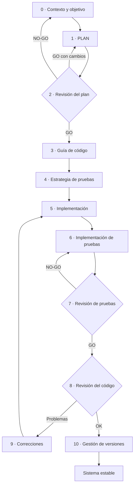
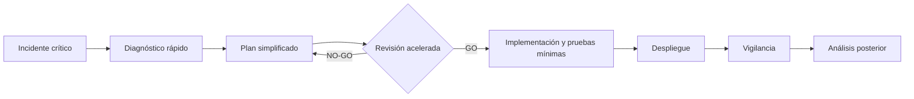

# Qué es SPAD y para qué sirve

**Un marco de trabajo para gestionar el desarrollo de software con inteligencia artificial de forma secuencial, bloqueante y auditable: cada fase produce un artefacto, ninguna empieza sin revisar la anterior y ninguna IA se aprueba a sí misma**

| | |
|---|---|
| Documento | Documento 00 · Qué es SPAD y para qué sirve |
| Versión | 0.2 |
| Fecha | 19-09-2026 |
| Autor | Fernando García · SEACHAD |
| Estado | En construcción. Metodología de apoyo, independiente de SEVEN-G y referenciada desde su documento 53; versión no liberada comercialmente. |
| Tipo | Presentación de la metodología |

<!-- cifras: 11 | fases del ciclo principal ; 5 | ciclos de trabajo ; 3 | veredictos de revisión ; 0 | aprobaciones que puede darse una IA -->

---

> **Versión en revisión: no difundir.** El estado actual de SPAD (versión 0.x) no está pensado para compartirse de forma general. Se mantiene en público para que un número reducido de personas pueda revisarlo, dar su opinión y ayudar a mejorarlo. Se está trabajando en la adecuación de los documentos y las herramientas para que sean reutilizables; este aviso desaparecerá cuando el marco pase a la versión 1.x.

> **Aviso legal y exención de responsabilidad.** SPAD es una metodología de referencia que se ofrece «tal cual» y con fines exclusivamente informativos. No constituye asesoramiento jurídico, regulatorio ni profesional, no garantiza resultados ni el cumplimiento de ninguna norma y no es una certificación. **Cada organización que use SPAD es la única responsable de validar sus resultados, identificar la normativa que le aplica, verificar su vigencia y certificar su propio cumplimiento regulatorio**, con el asesoramiento cualificado que corresponda. El autor y SEACHAD no asumen responsabilidad alguna por el uso que se haga de este contenido ni por las decisiones que se adopten con él. Los datos, cifras, compañías y casos de los ejemplos son ficticios o ilustrativos.

## 1. Qué es SPAD

**SPAD** (*Structured Prompt-Driven Engineering*, ingeniería estructurada guiada por instrucciones) es el marco de trabajo de SEACHAD para **gestionar el desarrollo de software mediante inteligencia artificial** de forma controlada. Convierte la IA de un asistente informal de programación en una herramienta de ingeniería gobernada, cuyo trabajo puede revisarse, reproducirse y auditarse.

SPAD no es una colección de instrucciones (*prompts*) para pedir código. Es una **forma de trabajar** con tres propiedades:

| Propiedad | Qué significa | Qué evita |
|---|---|---|
| **Secuencial** | El trabajo avanza por fases en un orden fijo: primero se entiende el problema, después se diseña, se revisa el diseño, se definen las pruebas, se construye, se revisa lo construido y se versiona. | Que la IA escriba código antes de que exista un diseño aprobado. |
| **Bloqueante** | Ninguna fase puede comenzar hasta que la salida de la anterior se ha producido y evaluado. Si una revisión dice que no, se vuelve atrás. | Que un problema detectado se arrastre a las fases siguientes "para arreglarlo después". |
| **Auditable** | Cada fase produce un **artefacto explícito** (plan, informe de revisión, estrategia de pruebas, registro de versión) que es la entrada obligatoria de la siguiente y queda guardado. | Decisiones ocultas, cambios sin justificar y sistemas que nadie sabe explicar. |

<figure class="grafico ilustracion">

Pensar, validar, ejecutar

Tres pilares sobre unos cimientos de documentación, seguridad y trazabilidad

Fuente: SPAD · SEACHAD

</figure>

> **Por qué importa.** La IA genera código plausible a gran velocidad. Sin estructura, esa velocidad se convierte en decisiones de diseño que nadie ha tomado de forma consciente, pruebas insuficientes, vulnerabilidades introducidas en silencio y deuda técnica difícil de ver. SPAD mantiene la velocidad donde aporta y pone control donde hace falta: en las decisiones, en las revisiones y en las evidencias.

SPAD es una **metodología de apoyo, independiente de SEVEN-G**. SEVEN-G gobierna la iniciativa de IA en su conjunto (valor, riesgo, puertas de decisión); SPAD gobierna **cómo se construye el software** cuando se hace con asistencia de IA (sección 9).

---

## 2. El problema que resuelve

| Síntoma | Qué suele haber detrás | Cómo lo aborda SPAD |
|---|---|---|
| El código generado funciona en la demostración y falla en producción. | Nadie diseñó la solución: se fue pidiendo código hasta que "funcionó". | El diseño (PLAN) es obligatorio, explícito y se revisa antes de escribir código. |
| Nadie sabe por qué el sistema está construido así. | Las decisiones de diseño las tomó la IA dentro del código. | Toda decisión se documenta en el plan; la IA que construye no puede tomar decisiones de diseño. |
| Las pruebas son escasas o solo prueban el caso fácil. | Las pruebas se escriben al final, si sobra tiempo. | La estrategia de pruebas y su cobertura mínima se fijan antes de construir, y una revisión comprueba que se cumplen. |
| Aparecen vulnerabilidades en código que nadie revisó. | La revisión la hizo la misma IA que escribió el código, o no se hizo. | Revisión independiente: la IA que revisa nunca es la que construye; el código sensible pasa una revisión de seguridad. |
| Un cambio pequeño rompe otra parte del sistema. | Las correcciones se hacen reescribiendo módulos enteros. | Las correcciones son mínimas, justificadas y trazables. |
| Una auditoría pide evidencias del desarrollo y no existen. | El trabajo quedó en conversaciones con la IA. | Cada fase deja un artefacto con nombre, tema y versión en una estructura común. |

<figure class="grafico ilustracion">

La ilusión de la velocidad

Sin estructura, la velocidad percibida cae mientras la deuda técnica y el riesgo crecen. Gráfica conceptual, sin datos

Fuente: SPAD · SEACHAD

</figure>

<figure class="grafico ilustracion">

IA sin método frente a SPAD

Planificación, revisión del diseño, pruebas, seguridad, trazabilidad y ejecución

Fuente: SPAD · SEACHAD

</figure>

> **Por qué importa.** Ninguno de estos problemas es de la IA: son problemas de método que la IA amplifica. Con SPAD, la calidad no depende de la destreza de quien escribe las instrucciones ni del modelo del momento, sino de un proceso que cualquier equipo puede repetir.

---

## 3. El principio que lo ordena todo

> En SPAD, **el cumplimiento del flujo es más importante que la calidad aparente del resultado**.

Una respuesta de la IA técnicamente correcta que se salta las reglas de su fase —por ejemplo, un plan que incluye código o una revisión que corrige en lugar de evaluar— **no se aprovecha**: se descarta entera y la fase se repite. La prioridad de validación es:

| Prioridad | Criterio |
|---|---|
| 1 | Cumplimiento del proceso |
| 2 | Corrección técnica |
| 3 | Eficiencia |

<figure class="grafico ilustracion">

Seis reglas no negociables

Ninguna fase se salta, todo es auditable, toda decisión es explícita, el código no decide, las revisiones son independientes y las correcciones son mínimas

Fuente: SPAD · SEACHAD

</figure>

> **Por qué importa.** Si una respuesta que rompe las reglas se acepta "porque el código funciona", el proceso deja de existir a la segunda ocasión. La disciplina de descartar y repetir es lo que hace que los artefactos sean fiables y que la trazabilidad sea real. Un «no» válido de una revisión vale más que un «sí» inválido.

---

## 4. Roles

SPAD separa los roles lógicos de las personas y de las IA que intervienen. Una misma IA puede asumir varios roles a lo largo de un trabajo, pero **nunca dos roles en la misma fase**.

| Rol | Quién | Qué hace | Qué no puede hacer |
|---|---|---|---|
| **Orquestador** | Persona | Define el objetivo y el contexto, valida cada salida y decide si se avanza. Tiene la última palabra. | Delegar la validación en la IA que ha producido la salida. |
| **IA planificadora** | IA | Diseña la arquitectura y la lógica, fija las convenciones, la estrategia de pruebas y la versión. | Escribir código. |
| **IA revisora** | IA distinta de la constructora | Revisa planes, pruebas y código, y emite un veredicto. | Corregir lo que revisa o aprobar con problemas conocidos. |
| **IA constructora** | IA | Implementa el código y las pruebas siguiendo el plan aprobado. | Tomar decisiones de diseño. |
| **IA correctora** | IA | Aplica correcciones mínimas y justificadas a los problemas detectados. | Rediseñar o ampliar funcionalidad. |
| **IA analista** e **IA de diagnóstico** | IA | Documentan código heredado y analizan incidentes (ciclos de legado y de depuración). | Proponer la solución en lugar del diagnóstico. |

El rol que revisa se denomina **IA revisora** para no confundirlo con el **Auditor de IA** de SEVEN-G, que es una persona.

<figure class="grafico ilustracion">

Separación de roles

En la ilustración, «IA-Auditor» es la IA revisora; el Auditor de IA de SEVEN-G es una persona

Fuente: SPAD · SEACHAD

</figure>

> **Por qué importa.** La separación de funciones es un control clásico de cualquier proceso serio: quien hace no se aprueba a sí mismo. SPAD la aplica también entre inteligencias artificiales y deja siempre a una persona como responsable de validar.

---

## 5. El ciclo principal

El ciclo principal se usa para construir una funcionalidad nueva. Cada fase tiene un responsable, una entrada y una salida obligatoria.

| Fase | Responsable | Salida obligatoria |
|---|---|---|
| **0 · Contexto y objetivo** | Orquestador | Descripción del problema, alcance y restricciones. |
| **1 · PLAN** | IA planificadora | Arquitectura lógica, componentes y responsabilidades, flujos de datos, decisiones explícitas y riesgos conocidos. Sin código. |
| **2 · Revisión del plan** | IA revisora | Problemas detectados, recomendaciones y veredicto. Evalúa acoplamiento, cohesión, escalabilidad, concurrencia, seguridad y observabilidad. |
| **3 · Guía de código** | IA planificadora | Estructura del proyecto, convenciones, contratos, reglas estrictas y antipatrones prohibidos. |
| **4 · Estrategia de pruebas** | IA planificadora | Casos de prueba, cobertura mínima, tipos de prueba y datos de prueba necesarios. |
| **5 · Implementación** | IA constructora | Código generado conforme al plan y a la guía de código. |
| **6 · Implementación de pruebas** | IA constructora | Pruebas, datos de prueba e instrucciones de ejecución. |
| **7 · Revisión de pruebas** | IA revisora | Cobertura real frente a la esperada, calidad de las pruebas y casos límite cubiertos. |
| **8 · Revisión del código** | IA revisora | Fidelidad al plan, cumplimiento de la guía, riesgos técnicos y deuda futura. |
| **9 · Correcciones** | IA correctora | Por cada corrección: problema, cambio mínimo, justificación e impacto esperado. |
| **10 · Gestión de versiones** | IA planificadora | Número de versión, registro de cambios, cambios incompatibles e instrucciones de migración. |

<figure class="grafico ilustracion">

El flujo bloqueante

Un veredicto NO-GO detiene el flujo y lo devuelve a la fase que corresponde

Fuente: SPAD · SEACHAD

</figure>

<!-- grafico: Ciclo principal de SPAD | Cada fase bloquea la siguiente; los veredictos negativos devuelven el trabajo a la fase que corresponde -->

Los veredictos de revisión son tres:

| Veredicto | Significado | Qué ocurre |
|---|---|---|
| **GO** | La salida cumple y puede avanzarse. | Se pasa a la fase siguiente. |
| **GO con cambios** | La salida es válida en lo esencial, pero requiere ajustes. | Se vuelve a la fase anterior para incorporarlos y se revisa de nuevo. |
| **NO-GO** | La salida tiene problemas que impiden avanzar. | Se vuelve a la fase que corresponde; en el caso del plan, al contexto y objetivo. |

> **Por qué importa.** Detectar un error de arquitectura en la revisión del plan cuesta una conversación; detectarlo en producción cuesta un incidente, una corrección urgente y a veces la confianza de un cliente. El ciclo lleva las decisiones caras al momento en que todavía son baratas.

---

## 6. Otros ciclos de trabajo

No todo el trabajo es una funcionalidad nueva. SPAD define ciclos específicos que reutilizan las mismas reglas:

| Ciclo | Cuándo se usa | Secuencia | Resultado |
|---|---|---|---|
| **Legado** | Hay que modificar código existente sin documentación suficiente. | Documentar lo existente → analizar el impacto del cambio → continuar con el ciclo principal. | Comportamiento actual documentado y riesgos del cambio identificados antes de tocar nada. |
| **Depuración** | Aparece un problema en producción o en desarrollo. | Análisis del incidente → informe de causa raíz con veredicto (código, configuración o infraestructura). | Si la causa es el código, se entra en el ciclo principal; si no, ajuste de configuración o de sistema. |
| **Corrección urgente** | Incidente crítico que exige una solución inmediata. | Diagnóstico rápido → plan simplificado → revisión acelerada pero obligatoria → implementación con pruebas mínimas → despliegue → vigilancia → análisis posterior. | Solución desplegada, análisis posterior y, si la corrección es provisional, plan definitivo pendiente. |
| **Seguridad** | Código que maneja datos sensibles, autenticación o pagos. | Revisión de seguridad → clasificación de hallazgos → corrección de críticos y altos → decisión sobre medios y bajos. | Los hallazgos críticos y altos bloquean el despliegue; los riesgos aceptados quedan documentados. La revisión toma como referencia guías reconocidas como el OWASP Top 10. |

<!-- grafico: Corrección urgente | Acelerada, pero sin saltarse la revisión ni las pruebas -->

<figure class="grafico ilustracion">

Pruebas y seguridad por diseño

Las pruebas se definen antes de construir y el código sensible pasa una revisión de seguridad que puede bloquear el despliegue

Fuente: SPAD · SEACHAD

</figure>

> **Por qué importa.** Las prisas son el momento en que más se relajan los controles y en el que más daño hacen los errores. SPAD acelera las fases en una urgencia, pero no las elimina: la revisión y las pruebas siguen siendo obligatorias y el análisis posterior convierte el incidente en aprendizaje.

---

## 7. Contextos, temas y política de validación

### Contextos

Antes de cualquier fase se cargan dos contextos:

| Contexto | Contenido | Ejemplo ilustrativo |
|---|---|---|
| **Global** | Reglas comunes a todos los proyectos de la organización: dónde y cómo se guardan los artefactos, nombres, requisitos de pruebas, versionado y prohibiciones generales. | "Ningún secreto se escribe en el código; toda funcionalidad nueva tiene pruebas unitarias." |
| **De proyecto** | Reglas del proyecto concreto: lenguaje y tecnologías, arquitectura, requisitos de cumplimiento, restricciones de negocio y excepciones justificadas a las reglas globales. | "Los datos de clientes no salen de la región europea; se usa la base de datos corporativa existente." |

Si ambos contextos entran en conflicto, prevalece el de proyecto, siempre con una justificación escrita.

### Temas

Cada trabajo se asocia a un **tema** (*TOPIC*): un nombre corto que agrupa todos sus artefactos (plan, revisiones, pruebas, versión) en una misma carpeta. Así, cualquier funcionalidad o corrección puede reconstruirse de principio a fin.

<figure class="grafico ilustracion">

Contextos y tema: el hilo conductor

El contexto global y el de proyecto enmarcan el trabajo; el tema agrupa todos los artefactos

Fuente: SPAD · SEACHAD

</figure>

### Política de validación

La persona que orquesta aplica una política explícita que define cuándo una respuesta de la IA es **inválida** y debe descartarse, aunque parezca buena:

| Causa de invalidación | Ejemplo | Qué se hace |
|---|---|---|
| **Violación de fase** | El plan incluye código; la revisión corrige en lugar de evaluar. | Descartar y repetir la fase. |
| **Artefactos incompletos** | Una revisión sin veredicto explícito; una estrategia de pruebas sin cobertura mínima. | Descartar y repetir la fase. |
| **Decisiones fuera del plan** | La implementación añade un componente que el plan no preveía. | Volver al plan. |
| **Implementación sin revisión** | Se genera código sin plan aprobado o tras un NO-GO. | Volver a la fase correcta y descartar el código. |
| **Autoaprobación** | "Hay tres problemas, pero son menores: GO." | Descarte inmediato; se considera una violación crítica. |

No invalidan una respuesta un NO-GO bien fundado, una vulnerabilidad detectada o una prueba que falla: son el proceso funcionando. Si una misma violación se repite, se refuerzan las instrucciones; si persiste tras varios intentos, se cambia de modelo o interviene una persona.

<figure class="grafico ilustracion">

Política de validación

Un NO-GO válido siempre es preferible a un GO inválido

Fuente: SPAD · SEACHAD

</figure>

> **Por qué importa.** La política de validación la aplica una persona, no la IA. Es el punto en el que la organización ejerce el control real sobre lo que se construye y el que convierte un conjunto de buenas prácticas en un método verificable.

---

## 8. Autoevaluación de conformidad

Una organización puede comprobar si un sistema, un proyecto o un equipo ha trabajado conforme a SPAD mediante una **autoevaluación de conformidad**:

| Aspecto | Descripción |
|---|---|
| **Qué comprueba** | Que las decisiones se tomaron antes de escribir código, que cada fase dejó su artefacto, que las revisiones fueron independientes, que no se saltó ni fusionó ninguna fase y que las correcciones fueron mínimas y trazables. |
| **Quién la hace** | Una persona designada por la propia organización, independiente de quienes construyeron. |
| **Resultados posibles** | Aprobada · Aprobada con condiciones · Rechazada. La falta de un artefacto obligatorio la hace negativa. |
| **Vigencia** | Doce meses, o hasta que haya cambios importantes de arquitectura, de alcance o de lógica de decisión. |

**No es una certificación.** No la emite ni la respalda SEACHAD ni ningún tercero, no acredita el cumplimiento de ninguna norma y no puede presentarse como certificación ni como reclamo comercial.

> **Por qué importa.** La autoevaluación da a la organización una definición compartida de "terminado" y un conjunto de evidencias preparado para auditorías internas o externas, sin crear la falsa apariencia de un sello que nadie ha concedido.

---

## 9. Relación con SEVEN-G

SPAD y SEVEN-G trabajan a escalas distintas y se complementan:

| Aspecto | SEVEN-G | SPAD |
|---|---|---|
| **Objeto** | La iniciativa de IA completa y la cartera de la compañía. | El desarrollo del software de una solución. |
| **Pregunta** | ¿Merece la pena, con qué riesgo y con qué valor medido? | ¿Está bien construido, probado y documentado? |
| **Decisiones** | Puertas de decisión tomadas por personas con responsabilidad. | Veredictos técnicos de revisión validados por el orquestador. |
| **Dónde se aplica** | En todo el ciclo de vida, de la idea a la retirada. | Principalmente en las fases de diseño y de entrega de SEVEN-G. |

Reglas de convivencia:

- Los veredictos de SPAD **no sustituyen** a ninguna puerta de decisión de SEVEN-G ni a la verificación del Auditor de IA.
- Los artefactos de SPAD son **insumos** de las evidencias de SEVEN-G; lo son del todo cuando se referencian en la plantilla correspondiente con autor, fecha y versión.
- SEVEN-G puede aplicarse con SPAD o con otro método de ingeniería documentado que cumpla sus requisitos mínimos para el código generado con IA.

La correspondencia detallada de fases, roles, evidencias y requisitos está en [SEVEN-G 53 · Construcción de soluciones con IA](../../../SEVEN-G/html/es/53_SEVEN-G_Construccion_de_soluciones_con_IA.html).

> **Por qué importa.** Un consejo no necesita saber cómo se revisa un plan de arquitectura, pero sí necesita saber que existe un método que lo hace y que deja evidencias. SPAD es ese método dentro de la construcción; SEVEN-G es el que decide si la iniciativa sigue adelante.

---

## 10. Cuándo usar SPAD

| Situación | Recomendación |
|---|---|
| Sistemas en producción con clientes, datos sensibles, dinero o decisiones sobre personas. | **Muy recomendable**, con el ciclo principal completo y revisión de seguridad. |
| Sectores con exigencias de auditoría o de cumplimiento (finanzas, seguros, salud, sector público). | **Muy recomendable**. |
| Proyectos con varios desarrolladores, mucha deuda técnica o necesidad de trazabilidad. | **Recomendable**. |
| Herramientas internas con impacto en el negocio o prototipos que aspiran a producción. | **Útil**, en una versión reducida. |
| Prototipos desechables, programas de uso personal o investigación pura. | **Innecesario**: el coste del proceso supera su beneficio. |

Al principio, SPAD hace el trabajo más lento mientras el equipo aprende las fases. La hipótesis es que, con práctica, reduce el retrabajo, los incidentes y la deuda técnica; **no se afirma ninguna cifra de mejora**: cada organización debe medirla frente a su propia situación de partida.

---

## 11. Estado, licencia y próximos pasos

SPAD está **en construcción** como metodología pública: la biblioteca existe completa en español e inglés, y crecerá con herramientas y casos de aplicación. Esta página es su puerta de entrada.

| Documento | Contenido | Cuándo leerlo |
|---|---|---|
| **documento 00 · Qué es SPAD y para qué sirve** | Presentación del método. | Primero. |
| **documento 01 · Guía operativa** | Fases 0–10, roles, veredictos y versión reducida. | Antes de aplicar SPAD por primera vez. |
| **documento 02 · Contextos, temas y registro de artefactos** | Qué se carga antes de trabajar y qué se registra de cada artefacto. | Al preparar la organización. |
| **documento 03 · Política de validación** | Cuándo se descarta una respuesta de la IA. | Quien orquesta, siempre. |
| **documento 04 · Ciclos complementarios** | Legado, depuración, corrección urgente y seguridad. | Cuando el trabajo no es una funcionalidad nueva. |
| **documento 05 · Sistemas que incluyen IA** | Evaluación del comportamiento y agentes. | Cuando la solución lleva IA en producción. |
| **documento 06 · Instrucciones por fase** | Texto de referencia de cada instrucción. | Al configurar las herramientas. |
| **documento 07 · Contratos de entrada y salida** | Estructura obligatoria de cada artefacto. | Al automatizar la validación. |
| **documento 08 · Autoevaluación y métricas** | Cómo comprobar la conformidad y medir el proceso. | Al cerrar un trabajo y al revisar el método. |

SPAD se publica con las mismas condiciones que SEVEN-G: los contenidos, bajo licencia **Creative Commons Atribución 4.0 Internacional (CC BY 4.0)**, y el código, bajo licencia MIT. Puede usarse, adaptarse y extenderse, también con fines comerciales, siempre que se cite de forma visible la autoría: *SPAD · Fernando García · SEACHAD*. Las condiciones completas de uso y citación son las de [SEVEN-G 93 · Licencia, uso y citación](../../../SEVEN-G/html/es/93_SEVEN-G_Licencia_uso_y_citacion.html).

No existe certificación de SPAD y el uso del nombre no implica respaldo del autor. Una declaración pública de conformidad con SPAD solo puede presentarse como autoevaluación (sección 8).

---

## 12. Control de versiones

| Versión | Fecha | Cambios |
|---|---|---|
| 0.2 | 19-09-2026 | Biblioteca completa (documentos 01–08) enlazada desde la sección 11; el rol de diagnóstico se denomina «IA de diagnóstico». |
| 0.1 | 18-09-2026 | Primera versión de la página de entrada, a partir de los documentos de trabajo de SPAD: propiedades del marco, problema que resuelve, principio de validación, roles, ciclo principal y veredictos, ciclos de legado, depuración, corrección urgente y seguridad, contextos, temas, política de validación, autoevaluación de conformidad, relación con SEVEN-G y cuándo usarlo. |
