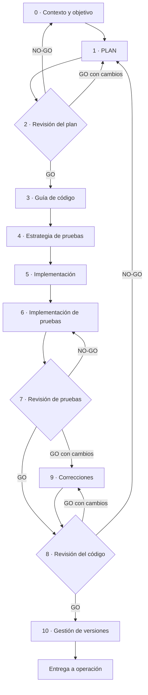

# Guía operativa: fases, roles y veredictos

**Cómo se aplica SPAD en la práctica: el orden estricto de las fases, lo que produce cada una, quién la ejecuta, cómo se decide si se avanza y qué se recorta en la versión reducida**

| | |
|---|---|
| Documento | Documento 01 · Guía operativa: fases, roles y veredictos |
| Versión | 0.1 |
| Fecha | 19-09-2026 |
| Autor | Fernando García Varela |
| Estado | En construcción. Sustituye a la guía operativa y a la definición de la habilidad oficial anteriores, que tenían numeraciones distintas. |
| Tipo | Guía operativa |

<!-- cifras: 11 | fases del ciclo principal ; 8 | roles ; 3 | veredictos ; 2 | versiones: completa y reducida -->

---

> **Versión en revisión: no difundir.** El estado actual de SPAD (versión 0.x) no está pensado para compartirse de forma general. Se mantiene en público para que un número reducido de personas pueda revisarlo, dar su opinión y ayudar a mejorarlo. Se está trabajando en la adecuación de los documentos y las herramientas para que sean reutilizables; este aviso desaparecerá cuando el marco pase a la versión 1.x.

> **Aviso legal y exención de responsabilidad.** SPAD es una metodología de referencia que se ofrece «tal cual» y con fines exclusivamente informativos. No constituye asesoramiento jurídico, regulatorio ni profesional, no garantiza resultados ni el cumplimiento de ninguna norma y no es una certificación. **Cada organización que use SPAD es la única responsable de validar sus resultados, identificar la normativa que le aplica, verificar su vigencia y certificar su propio cumplimiento regulatorio**, con el asesoramiento cualificado que corresponda. Esta metodología es una ayuda genérica y gratuita, compartida con la comunidad para que nadie tenga que empezar desde cero; cada persona u organización puede y debe adaptarla a su propio uso. No debe entenderse que sus partes jurídicamente sensibles hayan sido revisadas por una asesoría jurídica: esas revisiones, para cada empresa o sector, son responsabilidad última de la empresa, el consultor o la organización que la use. Aunque se procura mantenerla al día, alguna norma puede haber cambiado sin que se recoja aquí. En la máxima medida permitida por la ley, el autor no asume responsabilidad alguna por los efectos de su aplicación en ninguna organización ni por su aplicabilidad completa. La metodología no otorga certificación de ningún tipo. El autor no asume responsabilidad alguna por el uso que se haga de este contenido ni por las decisiones que se adopten con él. Los datos, cifras, compañías y casos de los ejemplos son ficticios o ilustrativos.

## 1. Objeto

Este documento describe **cómo se usa SPAD en la práctica**: el orden de aplicación de las fases, lo que entra y sale de cada una, los roles que intervienen, las reglas de interacción entre inteligencias artificiales y los veredictos que permiten avanzar o devuelven el trabajo. Es la referencia canónica de numeración y vocabulario para el resto de la biblioteca.

SPAD no es una colección de instrucciones: es una **metodología secuencial, bloqueante y auditable** (documento 00). Esta guía la hace operativa.

---

## 2. El principio de ejecución bloqueante

> Ninguna fase puede comenzar hasta que la fase anterior ha producido su artefacto y una persona lo ha validado.

Cada fase produce un **artefacto explícito** que es la entrada obligatoria de la siguiente. Si la validación falla, el trabajo vuelve a la fase que corresponde y el artefacto rechazado se conserva en el registro del tema (documento 02), numerado como iteración.

> **Por qué importa.** El bloqueo es lo que convierte a SPAD en un método y no en una recomendación. Sin él, la presión de plazos lleva a «empezar el código mientras se termina el plan», y en ese momento el plan deja de gobernar nada.

---

## 3. Roles

SPAD distingue roles lógicos de personas y de inteligencias artificiales. Una misma IA puede asumir varios roles a lo largo de un trabajo, pero **nunca dos roles en la misma fase**, y la IA que revisa un artefacto **nunca es la que lo produjo**.

| Rol | Naturaleza | Responsabilidad | Prohibido |
|---|---|---|---|
| **Orquestador** | Persona | Define objetivo y contexto, carga los contextos, fija el tema, valida cada salida, aplica la política de validación y decide si se avanza. Última palabra en todo. | Delegar la validación en la IA que produjo la salida. |
| **IA planificadora** | IA | Diseña arquitectura y lógica (PLAN), fija la guía de código, la estrategia de pruebas y la gestión de versiones. | Escribir código. |
| **IA revisora** | IA distinta de la que produjo el artefacto | Revisa planes, pruebas y código; emite hallazgos y veredicto. | Corregir lo que revisa; aprobar con problemas conocidos. |
| **IA constructora** | IA | Implementa código y pruebas siguiendo el plan, la guía de código y la estrategia de pruebas. | Tomar decisiones de diseño. |
| **IA correctora** | IA | Aplica correcciones mínimas y justificadas a los hallazgos. | Rediseñar, refactorizar módulos enteros o ampliar funcionalidad. |
| **IA analista** | IA | Documenta código existente y analiza el impacto de un cambio (ciclo de legado, documento 04). | Proponer la solución. |
| **IA de diagnóstico** | IA | Analiza incidentes y produce el informe de causa raíz (ciclo de depuración, documento 04). | Generar código de solución; modificar código de producción. |
| **IA revisora de seguridad** | IA distinta de la constructora | Revisión de seguridad del código sensible (documento 04). | Corregir lo que revisa. |

El rol que revisa se denomina **IA revisora** y no «auditor»: en SEVEN-G, el **Auditor de IA** es una persona independiente del equipo que construye ([SEVEN-G 53 · Construcción de soluciones con IA](../../../SEVEN-G/html/es/53_SEVEN-G_Construccion_de_soluciones_con_IA.html), sección 5).

### 3.1 Revisión humana del código

La IA revisora reduce el riesgo, pero dos inteligencias artificiales pueden coincidir en el mismo error. Por eso, además de la IA revisora, **una persona competente revisa el código** antes de incorporarlo a la rama principal:

| Situación | Revisión humana |
|---|---|
| Todo trabajo SPAD | Al menos una persona revisa y deja registro (revisor, fecha, resultado), normalmente en el control de versiones. |
| Código sensible (autenticación, autorización, pagos, datos personales), límites de actuación de agentes, decisiones sobre personas o sistemas de producción críticos | **Segunda revisión humana** por una persona que no orquestó la generación. |
| Iniciativa SEVEN-G con intensidad Enterprise | Se aplican además los requisitos de SEVEN-G 53 §7. |

> **Por qué importa.** La separación de funciones entre inteligencias artificiales es necesaria, pero no suficiente: quien responde ante la organización de que el código es correcto es una persona, y esa responsabilidad no se puede delegar en una herramienta.

---

## 4. Ciclo principal: fases 0 a 10

El ciclo principal se usa para construir una funcionalidad nueva. La numeración de esta tabla es la **canónica** de SPAD.

| Fase | Nombre | Responsable | Entrada | Salida obligatoria |
|---|---|---|---|---|
| **0** | Contexto y objetivo | Orquestador | Necesidad de negocio; contextos global y de proyecto; tema. | Descripción del problema, alcance, restricciones y criterios de éxito. |
| **1** | PLAN | IA planificadora | Fase 0 validada. | Arquitectura lógica; componentes y responsabilidades; flujos de datos; decisiones explícitas con alternativas; riesgos identificados. **Sin código.** |
| **2** | Revisión del plan (AUDIT_PLAN) | IA revisora | PLAN. | Problemas por categoría (acoplamiento, cohesión, escalabilidad, concurrencia, seguridad, observabilidad); recomendaciones; **veredicto**. |
| **3** | Guía de código (CODE_PRIMER) | IA planificadora | PLAN con GO. | Estructura del proyecto, convenciones, contratos, reglas estrictas y antipatrones. Sin decisiones de diseño nuevas. |
| **4** | Estrategia de pruebas (TEST_STRATEGY) | IA planificadora | PLAN con GO. | Casos de prueba, cobertura mínima, capas (unitaria, integración, extremo a extremo, rendimiento, seguridad), datos y dobles de prueba, casos límite. |
| **5** | Implementación | IA constructora | Guía de código y estrategia de pruebas. | Código generado; relación de ficheros creados y modificados; dependencias añadidas; declaración de conformidad con el plan y la guía, con desviaciones justificadas. |
| **6** | Implementación de pruebas | IA constructora | Estrategia de pruebas y código. | Pruebas, datos y dobles de prueba, instrucciones de ejecución, cobertura obtenida. |
| **7** | Revisión de pruebas (AUDIT_TESTS) | IA revisora | Estrategia y pruebas. | Cobertura real frente a esperada; calidad de las aserciones; casos límite y rutas de error; **veredicto**. |
| **8** | Revisión del código (AUDIT_CODE) | IA revisora | PLAN, guía de código y código. | Fidelidad al plan; cumplimiento de la guía; riesgos técnicos; deuda futura; dependencias y licencias; **veredicto**. |
| **9** | Correcciones (FIX_PRIMERS) | IA correctora | Hallazgos de las fases 7 u 8. | Por cada corrección: problema, cambio mínimo, justificación, impacto y riesgo de regresión; pruebas actualizadas. |
| **10** | Gestión de versiones | IA planificadora | Código con GO. | Número de versión (versionado semántico), registro de cambios, cambios incompatibles, instrucciones de migración, plan de despliegue y de reversión, requisitos de vigilancia. |

<!-- grafico: Ciclo principal | La numeración canónica y los retornos de cada veredicto -->

### 4.1 Detalle de las fases de diseño

**Fase 0 · Contexto y objetivo.** La persona que orquesta escribe qué problema se resuelve, para quién, qué queda dentro y fuera del alcance, qué restricciones existen (tecnológicas, legales, de plazo) y cómo se sabrá que el resultado es correcto. Sin criterios de éxito no hay fase 1.

**Fase 1 · PLAN.** La IA planificadora diseña sin escribir código. Cada decisión de diseño se registra con las alternativas consideradas y sus contrapartidas. Los riesgos se clasifican por severidad y probabilidad. Si la solución incluye componentes de IA en producción, el plan incorpora además lo que exige el documento 05 (nivel de autonomía, límites, evaluación del comportamiento).

**Fase 2 · Revisión del plan.** La IA revisora evalúa y no corrige. Un plan revisado con GO con cambios vuelve a la fase 1 con las recomendaciones; con NO-GO, se vuelve a la fase 0 porque el problema está mal planteado o el alcance es inviable.

**Fase 3 · Guía de código.** Traduce el plan en reglas verificables para quien construye: estructura de carpetas, nombres, contratos de interfaz y de datos, gestión de errores, concurrencia, registro y antipatrones prohibidos. No puede introducir decisiones que el plan no contenga.

**Fase 4 · Estrategia de pruebas.** Se fija **antes de construir** qué se probará y con qué cobertura mínima, tomada del contexto global salvo excepción justificada. Las rutas críticas exigen cobertura completa.

### 4.2 Detalle de las fases de construcción y revisión

**Fase 5 · Implementación.** La IA constructora ejecuta el plan. Si encuentra una situación que el plan no prevé, **no decide**: lo señala como desviación y la persona que orquesta devuelve el trabajo a la fase 1 o acepta una desviación menor documentada.

**Fase 6 · Implementación de pruebas.** Se implementan las pruebas de la estrategia, no las que resulten cómodas. Las pruebas que solo reproducen el código sin verificar el comportamiento esperado no cuentan.

**Fases 7 y 8 · Revisiones.** Independientes de la IA constructora. En la revisión del código se comprueban también las dependencias añadidas (existencia, procedencia, vulnerabilidades conocidas y licencia) y se deja constancia de la deuda técnica que se asume.

**Fase 9 · Correcciones.** Quirúrgicas. Cada corrección vuelve a la **revisión del código** (y a la de pruebas si las pruebas cambian), no a una reimplementación completa.

**Fase 10 · Gestión de versiones.** Cierra el ciclo con lo necesario para operar: versión, cambios, migración, plan de despliegue con reversión probada y qué vigilar tras el despliegue. Es la **entrega a operación**: sin ella, el código es estable pero el sistema no está operado.

> **Por qué importa.** Las fases 3 y 4 son las que más se saltan y las que más valor protegen: la guía de código impide que la IA constructora decida, y la estrategia de pruebas evita que las pruebas se escriban al final para confirmar lo que ya existe.

---

## 5. Veredictos

Todas las revisiones (fases 2, 7 y 8 y la revisión de seguridad) usan el **mismo vocabulario**:

| Veredicto | Significado | Fase 2 devuelve a | Fase 7 devuelve a | Fase 8 devuelve a |
|---|---|---|---|---|
| **GO** | El artefacto cumple. Se avanza. | Fase 3 | Fase 8 | Fase 10 |
| **GO con cambios** | Válido en lo esencial; requiere ajustes concretos y nueva revisión. | Fase 1 | Fase 9 | Fase 9 |
| **NO-GO** | No aceptable; hay que rehacer. | Fase 0 | Fase 6 | Fase 1 |

Reglas:

1. Un veredicto sin justificación escrita es un **artefacto incompleto** y se descarta (documento 03).
2. Un GO con hallazgos críticos o altos abiertos es una **autoaprobación** y se descarta.
3. Un NO-GO bien fundado **no es un fallo del proceso**: es el proceso funcionando.
4. El veredicto lo emite la IA revisora; **lo acepta o rechaza la persona que orquesta**, que lo registra (documento 02).

> **Por qué importa.** Tres vocabularios distintos para decir lo mismo (GO/NO-GO, OK/ISSUES, aprobado/rechazado) hacen imposible comparar fases, medir el proceso (documento 08) y automatizar la validación de los contratos (documento 07). Un solo vocabulario es una condición de auditabilidad.

---

## 6. Versión reducida (SPAD Lite)

No todo trabajo necesita once artefactos separados. La versión reducida agrupa fases sin perder la revisión independiente ni la validación humana.

| Criterio para usar la versión reducida | Criterio que obliga a la versión completa |
|---|---|
| Cambio acotado en un componente, sin datos personales ni dinero, sin efecto sobre decisiones sobre personas. | Código sensible, agentes con autonomía A2 o A3, sistemas de producción críticos, iniciativa SEVEN-G Enterprise. |
| Equipo de una o dos personas y un solo modelo. | Varios equipos o proveedores de modelos. |
| Sin obligaciones de auditoría externa sobre el desarrollo. | Sector regulado con exigencias de trazabilidad del desarrollo. |

| Artefacto de la versión reducida | Fases que agrupa | Contenido mínimo |
|---|---|---|
| **Plan revisado** | 0, 1, 2, 3 y 4 | Objetivo y alcance; arquitectura y decisiones; riesgos; reglas de construcción; casos de prueba y cobertura mínima; hallazgos y veredicto de una IA revisora distinta. |
| **Entrega revisada** | 5, 6, 7, 8 y 9 | Código y pruebas; cobertura obtenida; hallazgos y veredicto de la IA revisora; correcciones aplicadas; revisión humana registrada. |
| **Versión** | 10 | Número de versión, cambios y plan de reversión. |

Lo que **no se recorta** en ninguna versión: la separación entre la IA que construye y la que revisa, la validación humana de cada artefacto, la política de validación y el registro del tema.

> **Por qué importa.** Sin una versión reducida, los equipos aplican SPAD a los proyectos grandes y lo evitan en los pequeños, que son la mayoría y donde se acumula la deuda silenciosa.

---

## 7. Reglas operativas no negociables

| # | Regla | Qué protege |
|---|---|---|
| 1 | **Ninguna fase se salta.** Todas son obligatorias en la versión completa; en la reducida, se agrupan pero no desaparecen. | El bloqueo. |
| 2 | **Toda salida es auditable.** Artefactos explícitos, numerados y trazables en el registro del tema. | La trazabilidad. |
| 3 | **Toda decisión es explícita.** No existen decisiones de diseño implícitas en el código. | La explicabilidad. |
| 4 | **El código ejecuta, no decide.** La IA constructora no toma decisiones de diseño. | El plan. |
| 5 | **Revisiones independientes.** La IA revisora nunca es la constructora; una persona revisa el código además. | La calidad. |
| 6 | **Correcciones mínimas.** Quirúrgicas y justificadas, nunca refactorizaciones encubiertas. | La estabilidad. |
| 7 | **Pruebas obligatorias.** Cobertura mínima fijada antes de construir. | El comportamiento esperado. |
| 8 | **Seguridad por diseño.** El código sensible pasa la revisión de seguridad; los hallazgos críticos y altos bloquean. | Los datos y las personas. |
| 9 | **Contextos cargados.** Global y de proyecto antes de cualquier fase. | La coherencia entre trabajos. |
| 10 | **Un tema por trabajo.** Cada funcionalidad, corrección o incidente tiene su tema y su carpeta. | La memoria de la organización. |
| 11 | **Modelo registrado.** Cada artefacto indica qué modelo, versión e instrucciones lo produjeron. | La reproducibilidad. |
| 12 | **Ninguna IA aprueba.** Toda aceptación la firma una persona identificada. | La responsabilidad. |

---

## 8. Documentos relacionados

| Documento | Relación |
|---|---|
| **documento 00 · Qué es SPAD y para qué sirve** | Presentación del método. |
| **documento 02 · Contextos, temas y registro de artefactos** | Qué se carga antes de la fase 0 y cómo se guarda cada salida. |
| **documento 03 · Política de validación** | Cuándo se descarta una respuesta. |
| **documento 04 · Ciclos complementarios** | Legado, depuración, corrección urgente y seguridad. |
| **documento 05 · Sistemas que incluyen IA** | Requisitos adicionales cuando la solución lleva IA en producción. |
| **documento 06 · Instrucciones por fase** | Texto de referencia de cada instrucción. |
| **documento 07 · Contratos de entrada y salida** | Estructura obligatoria de cada artefacto. |
| [SEVEN-G 53 · Construcción de soluciones con IA](../../../SEVEN-G/html/es/53_SEVEN-G_Construccion_de_soluciones_con_IA.html) | Correspondencia de cada fase con las evidencias y los *gates* de SEVEN-G; requisitos mínimos para código generado con IA. |

---

## 9. Control de versiones

| Versión | Fecha | Cambios |
|---|---|---|
| 0.1 | 19-09-2026 | Primera versión. Unifica la guía operativa y la habilidad oficial anteriores con numeración canónica 0–10, tabla completa de roles (incluidos analista, diagnóstico y revisora de seguridad), revisión humana del código, un solo vocabulario de veredictos con las fases de retorno, bucle de corrección hacia la revisión, entrega a operación en la fase 10, versión reducida y regla del modelo registrado. |
