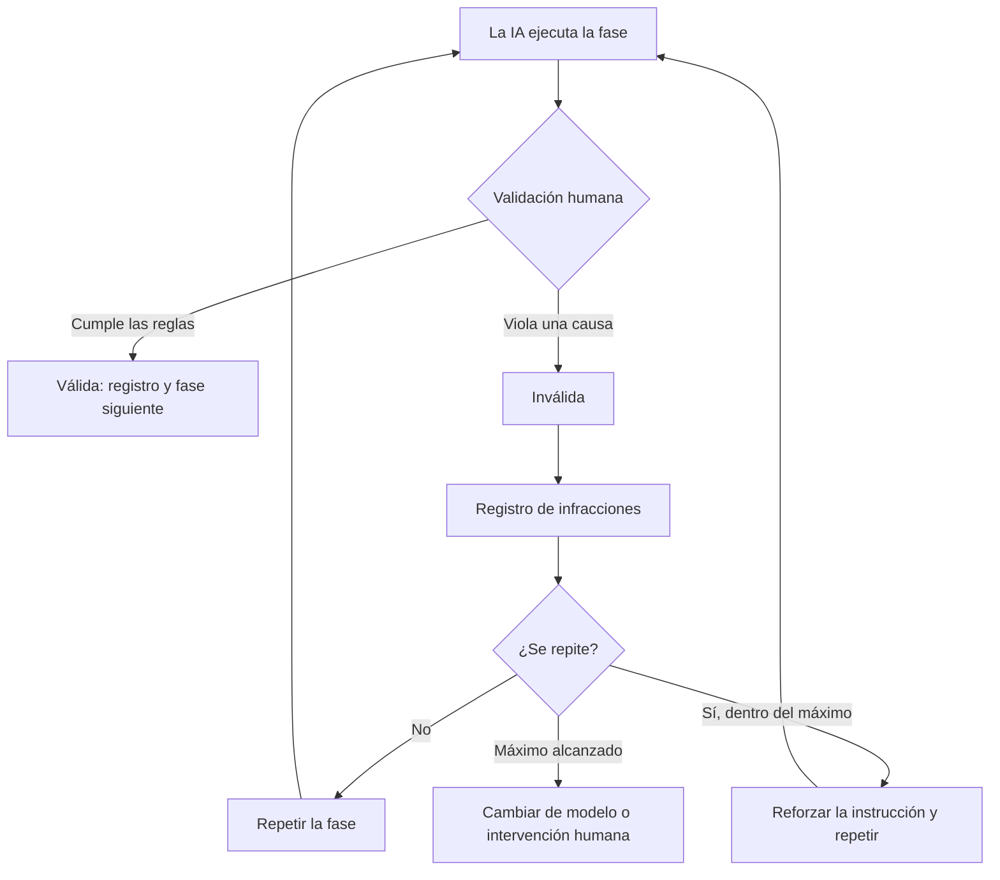

# Política de validación

**Cuándo una respuesta de la IA es inválida y debe descartarse aunque parezca buena: las cinco causas, lo que no invalida, el procedimiento y el registro que deja cada decisión**

| | |
|---|---|
| Documento | Documento 03 · Política de validación |
| Versión | 0.1 |
| Fecha | 19-09-2026 |
| Autor | Fernando García · SEACHAD |
| Estado | En construcción. Reescribe la política de validación anterior con el registro de validación y su encaje en SEVEN-G. |
| Tipo | Política |

<!-- cifras: 5 | causas de invalidación ; 3 | prioridades de validación ; 6 | pasos del procedimiento ; 0 | respuestas inválidas que se aprovechan -->

---

> **Versión en revisión: no difundir.** El estado actual de SPAD (versión 0.x) no está pensado para compartirse de forma general. Se mantiene en público para que un número reducido de personas pueda revisarlo, dar su opinión y ayudar a mejorarlo. Se está trabajando en la adecuación de los documentos y las herramientas para que sean reutilizables; este aviso desaparecerá cuando el marco pase a la versión 1.x.

> **Aviso legal y exención de responsabilidad.** SPAD es una metodología de referencia que se ofrece «tal cual» y con fines exclusivamente informativos. No constituye asesoramiento jurídico, regulatorio ni profesional, no garantiza resultados ni el cumplimiento de ninguna norma y no es una certificación. **Cada organización que use SPAD es la única responsable de validar sus resultados, identificar la normativa que le aplica, verificar su vigencia y certificar su propio cumplimiento regulatorio**, con el asesoramiento cualificado que corresponda. El autor y SEACHAD no asumen responsabilidad alguna por el uso que se haga de este contenido ni por las decisiones que se adopten con él. Los datos, cifras, compañías y casos de los ejemplos son ficticios o ilustrativos.

## 1. Objeto y naturaleza

Esta política establece cuándo una respuesta de la IA, en cualquier fase de SPAD, se considera **inválida** y debe descartarse, con independencia de su calidad aparente.

Es una **política humana de gobierno**, no una instrucción para la IA:

| Es | No es |
|---|---|
| Un conjunto de reglas que aplica la persona que orquesta. | Un texto que la IA interpreta o ejecuta. |
| El control de proceso sobre el trabajo de la IA. | Una revisión técnica del resultado (eso lo hace la IA revisora y la revisión humana del código). |
| Obligatoria en todo trabajo SPAD, completo o reducido. | Opcional o proporcional. |

---

## 2. Principio fundamental

> En SPAD, **el cumplimiento del flujo es más importante que la calidad del resultado**.

Una respuesta técnicamente correcta que viola su fase **no se acepta, no se reutiliza en parte y no se corrige**: se descarta entera y la fase se ejecuta de nuevo desde el principio.

| Prioridad | Criterio |
|---|---|
| 1 | Cumplimiento del proceso |
| 2 | Corrección técnica |
| 3 | Eficiencia |

> **Por qué importa.** Aceptar «solo esta vez» una respuesta que rompe las reglas porque el código funciona destruye el proceso en dos pasos: la IA aprende que puede saltarse la fase y la persona pierde la referencia de qué es válido. La disciplina de descartar y repetir es lo que hace fiables los artefactos y real la trazabilidad. Un NO-GO válido siempre es preferible a un GO inválido.

---

## 3. Causas de invalidación

### 3.1 Violación de fase

La respuesta ejecuta acciones que no corresponden a la fase activa.

| Fase | Violación | Por qué es inválida |
|---|---|---|
| PLAN | Genera o modifica código; propone correcciones concretas. | El plan define, no implementa. |
| Revisión del plan | Corrige o reescribe el plan. | La IA revisora evalúa, no corrige. |
| Guía de código | Introduce decisiones de diseño nuevas. | La guía traduce el plan, no lo cambia. |
| Implementación | Toma decisiones de diseño. | La IA constructora sigue decisiones, no las toma. |
| Revisión del código | Corrige o reescribe código. | La IA revisora evalúa, no corrige. |
| Correcciones | Rediseña, refactoriza o amplía funcionalidad. | Solo correcciones mínimas. |
| Diagnóstico | Genera código de solución; modifica código de producción. | Produce un informe de causa raíz, no soluciones. |

**Acción:** descartar la respuesta y ejecutar de nuevo la misma fase. Si se repite, anotar la infracción.

### 3.2 Artefactos ausentes o alterados

La respuesta omite secciones obligatorias, no incluye los marcadores exigidos o altera el formato contractual (documento 07).

*Ejemplos:* un plan sin la sección de riesgos; una revisión sin veredicto explícito; una estrategia de pruebas sin cobertura mínima; una versión sin número semántico; un informe de causa raíz sin veredicto; cualquier artefacto sin el registro del modelo.

**Acción:** descartar y ejecutar de nuevo la fase, insistiendo en las secciones obligatorias.

### 3.3 Decisiones fuera del plan

La respuesta introduce decisiones técnicas no documentadas en el plan aprobado, cambios de alcance no autorizados o supuestos no declarados, **aunque estén bien razonados**.

*Ejemplos:* la implementación añade una capa de caché que el plan no prevé; cambia el esquema de datos; las pruebas de integración aparecen donde solo se planificaron unitarias; una corrección refactoriza un módulo entero.

**Acción:** descartar; volver al plan (o a la corrección del plan, si el cambio es menor y la persona lo acepta como iteración); anotar la decisión no autorizada.

### 3.4 Implementación sin revisión previa

Se genera o modifica código cuando no existe un plan aprobado, no se ha ejecutado la revisión del plan o del código, o una revisión anterior devolvió NO-GO y aun así se implementa.

**Acción:** descartar todo el código generado y volver a la fase correcta. Si ese código llegara a producción dentro de una iniciativa SEVEN-G, es una **no conformidad mayor** ([SEVEN-G 53](../../../SEVEN-G/html/es/53_SEVEN-G_Construccion_de_soluciones_con_IA.html), sección 6).

### 3.5 Autoaprobación

La respuesta se aprueba a sí misma, minimiza infracciones o justifica incumplimientos.

*Ejemplos:* «he hecho cambios al plan, pero son menores»; «sé que no debía incluir código, pero añado un ejemplo»; «la revisión encontró tres problemas, pero los marco como GO»; «he implementado X en lugar de Y porque es mejor».

**Acción:** descarte **inmediato**; ejecutar de nuevo con restricciones reforzadas; considerarla una **infracción crítica** en el registro.

> **Por qué importa.** La autoaprobación es la causa más grave porque ataca directamente la separación de funciones: si se tolera, la IA revisora deja de ser una revisión y pasa a ser un trámite.

---

## 4. Lo que no invalida una respuesta

| Situación | Válida | Motivo |
|---|---|---|
| La revisión devuelve NO-GO. | Sí | La revisión funciona. |
| La revisión de seguridad encuentra vulnerabilidades críticas. | Sí | Para eso se revisa. |
| Las pruebas fallan en la primera implementación. | Sí | Iteración esperada. |
| Código correcto pero poco elegante, dentro de su fase. | Sí | Se mejora en correcciones si la revisión lo señala. |
| Inconsistencias menores de estilo. | Sí | Idem. |
| Opinión técnica razonable dentro del alcance de la fase. | Sí | Es parte del trabajo. |
| Valoración conservadora de un riesgo. | Sí | Mejor prudente que optimista. |
| La IA declara una desviación y **no la ejecuta**, pidiendo decisión. | Sí | Es el comportamiento correcto ante un vacío del plan. |

---

## 5. Procedimiento ante una respuesta inválida

| Paso | Acción |
|---|---|
| 1 · Reconocer | Identificar que la respuesta viola una de las cinco causas. |
| 2 · No corregir | No editar la respuesta, no reutilizar partes, no pedir a la IA que la «arregle». |
| 3 · Descartar | Tratar la respuesta entera como si no existiera. Se conserva en el registro del tema como iteración rechazada, marcada como inválida. |
| 4 · Repetir | Ejecutar la misma fase con la misma instrucción. |
| 5 · Reforzar | Si se repite la infracción: hacer explícitas las prohibiciones en la instrucción, añadir ejemplos de lo que no se admite, endurecer la revisión, anotar el patrón. |
| 6 · Escalar | Tras el número máximo de intentos fijado en el contexto global (valor de partida: tres), cambiar de modelo, intervenir una persona o documentar la limitación de la metodología para ese caso. |

<!-- grafico: Validación de cada fase | La persona valida; lo inválido se registra y se repite -->

---

## 6. Registro de validación e infracciones

Toda validación deja registro (documento 02, sección 4.2), y toda invalidación, además, una entrada en el registro de infracciones:

| Campo | Contenido |
|---|---|
| Fecha y tema | Cuándo y en qué trabajo. |
| Fase | La fase activa. |
| Causa | Una de las cinco (3.1 a 3.5). |
| Modelo | Proveedor, modelo y versión que produjo la respuesta. |
| Acción | Repetida · Reforzada · Escalada. |
| Resultado | En qué intento se obtuvo una respuesta válida, o si se escaló. |

*Ejemplo ilustrativo de registro.*

| Fecha | Tema | Fase | Causa | Modelo | Acción | Resultado |
|---|---|---|---|---|---|---|
| 11-02-2026 | `payment_gateway` | PLAN | Violación de fase (código en el plan) | Proveedor A, modelo 4, v2026-01 | Repetida | Válida al segundo intento |
| 11-02-2026 | `user_auth` | Revisión del código | Autoaprobación con hallazgos abiertos | Proveedor B, modelo 3.5 | Reforzada | Válida al tercer intento tras endurecer la instrucción |

> **Por qué importa.** El registro convierte la política en aprendizaje: muestra qué fases fallan más, qué modelos siguen peor las reglas y qué instrucciones hay que reforzar. Es la base de las métricas del proceso (documento 08) y, en organizaciones que aplican SEVEN-G, alimenta las lecciones aprendidas y la evaluación del proveedor de IA.

---

## 7. Reglas de gobierno

| Regla | Detalle |
|---|---|
| **Autoridad** | Las decisiones de validación son finales y las toma la persona que orquesta. En caso de duda, se invalida. |
| **Independencia** | Ninguna IA valida su propia salida; las salidas de la IA revisora las valida una persona, no la IA constructora. |
| **Documentación** | Toda invalidación se registra. En trabajos de la versión reducida, al menos causa, fase y fecha. |
| **Mejora continua** | Si una fase supera la tasa de invalidación fijada en el contexto global (valor de partida: 30 %), la instrucción se revisa. Si un modelo incumple de forma sistemática, se cambia. La política se revisa con la experiencia. |

---

## 8. Ejemplos de decisión

| Fase | Salida | Decisión | Motivo |
|---|---|---|---|
| Revisión del plan | «El diseño no soporta más de cien usuarios concurrentes. Veredicto: NO-GO.» | **Válida** | La revisión funciona; se vuelve al plan con la observación. |
| PLAN | Arquitectura detallada seguida de «una implementación de ejemplo» de quinientas líneas. | **Inválida** | Violación de fase. La calidad del código es irrelevante. |
| Implementación | Código conforme al plan y a la guía, con inconsistencias de estilo. | **Válida** | Dentro de la fase; el estilo se trata en correcciones si la revisión lo señala. |
| Revisión del código | «Tres problemas: sin gestión de errores, sin validación de entradas, secreto en el código. Son menores: GO.» | **Inválida** | Autoaprobación con hallazgos abiertos. Infracción crítica. |
| Implementación | «El plan no dice cómo manejar el reintento; no lo he implementado y pido decisión.» | **Válida** | Comportamiento correcto ante un vacío: la persona decide volver al plan. |

---

## 9. Documentos relacionados

| Documento | Relación |
|---|---|
| **documento 01 · Guía operativa** | Fases, roles y veredictos a los que se aplica la política. |
| **documento 02 · Contextos, temas y registro de artefactos** | Registro de validación y de infracciones. |
| **documento 07 · Contratos de entrada y salida** | Secciones obligatorias cuya ausencia invalida (3.2). |
| **documento 08 · Autoevaluación y métricas** | Tasa de invalidación y demás métricas del proceso. |
| [SEVEN-G 53 · Construcción de soluciones con IA](../../../SEVEN-G/html/es/53_SEVEN-G_Construccion_de_soluciones_con_IA.html) | Tratamiento adicional de cada causa dentro de SEVEN-G (no conformidades, evidencias). |

---

## 10. Control de versiones

| Versión | Fecha | Cambios |
|---|---|---|
| 0.1 | 19-09-2026 | Primera versión. Reescribe la política anterior en la biblioteca: naturaleza humana de la política, cinco causas con acciones, lo que no invalida, procedimiento con máximo de intentos y tasa de invalidación como parámetros del contexto global, registro de validación e infracciones, gobierno y ejemplos. |
