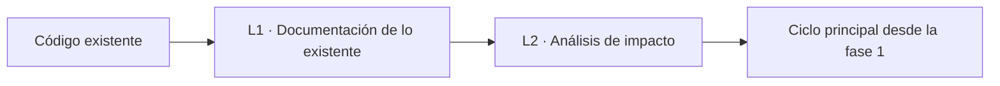
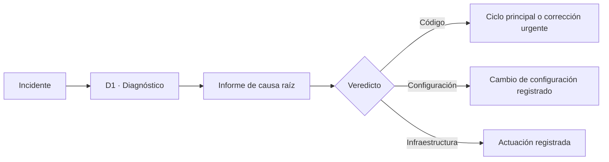
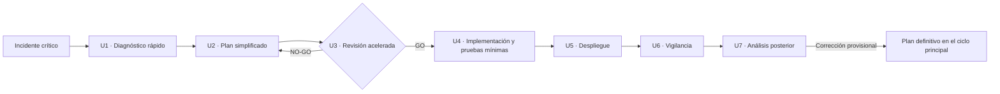
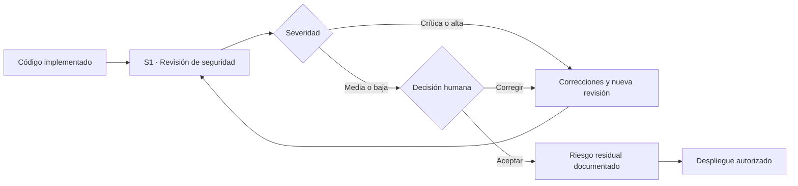

# Ciclos complementarios: legado, depuración, corrección urgente y seguridad

**Cómo aplica SPAD las mismas reglas cuando el trabajo no es una funcionalidad nueva: código sin documentar, incidentes, emergencias y código sensible**

| | |
|---|---|
| Documento | Documento 04 · Ciclos complementarios |
| Versión | 0.1 |
| Fecha | 19-09-2026 |
| Autor | Fernando García Varela |
| Estado | En construcción. Desarrolla los ciclos de legado, depuración, corrección urgente y seguridad de la guía anterior con la escala de severidades, la aceptación del riesgo y la entrega a operación. |
| Tipo | Guía operativa |

<!-- cifras: 4 | ciclos complementarios ; 3 | veredictos de causa raíz ; 4 | niveles de severidad ; 0 | urgencias sin revisión -->

---

> **Versión en revisión: no difundir.** El estado actual de SPAD (versión 0.x) no está pensado para compartirse de forma general. Se mantiene en público para que un número reducido de personas pueda revisarlo, dar su opinión y ayudar a mejorarlo. Se está trabajando en la adecuación de los documentos y las herramientas para que sean reutilizables; este aviso desaparecerá cuando el marco pase a la versión 1.x.

> **Aviso legal y exención de responsabilidad.** SPAD es una metodología de referencia que se ofrece «tal cual» y con fines exclusivamente informativos. No constituye asesoramiento jurídico, regulatorio ni profesional, no garantiza resultados ni el cumplimiento de ninguna norma y no es una certificación. **Cada organización que use SPAD es la única responsable de validar sus resultados, identificar la normativa que le aplica, verificar su vigencia y certificar su propio cumplimiento regulatorio**, con el asesoramiento cualificado que corresponda. El autor no asume responsabilidad alguna por el uso que se haga de este contenido ni por las decisiones que se adopten con él. Los datos, cifras, compañías y casos de los ejemplos son ficticios o ilustrativos.

## 1. Objeto

El ciclo principal (documento 01) construye funcionalidad nueva. Este documento define los cuatro ciclos que cubren el resto del trabajo real de un equipo, con las mismas reglas: fases bloqueantes, artefactos, IA revisora independiente, validación humana y registro.

| Ciclo | Se usa cuando | Desemboca en |
|---|---|---|
| **Legado** | Hay que modificar código existente sin documentación suficiente. | El ciclo principal, desde la fase 1. |
| **Depuración** | Aparece un problema en producción o en desarrollo. | Ciclo principal (código), ajuste de configuración o actuación en infraestructura. |
| **Corrección urgente** | Un incidente crítico exige solución inmediata. | Solución desplegada, análisis posterior y, si procede, plan definitivo. |
| **Seguridad** | El código maneja datos sensibles, autenticación, autorización o pagos, o el contexto lo exige. | Hallazgos clasificados; los críticos y altos bloquean el despliegue. |

---

## 2. Ciclo de legado

### 2.1 Fases

| Fase | Responsable | Entrada | Salida obligatoria |
|---|---|---|---|
| **L1 · Documentación de lo existente** | IA analista | Código existente y su ubicación. | Comportamiento actual (propósito, funciones, entradas, salidas, efectos secundarios); componentes y dependencias internas y externas; diagramas de flujo y de arquitectura; riesgos identificados. |
| **L2 · Análisis de impacto** | IA analista | Código documentado y objetivo del cambio. | Áreas afectadas con nivel de impacto; riesgos de la modificación y mitigación; pruebas existentes relacionadas y huecos de cobertura; casos límite y si tienen prueba; recomendaciones. |

Después, el trabajo continúa en la **fase 1 (PLAN)** del ciclo principal, que toma L1 y L2 como entrada.

<!-- grafico: Ciclo de legado | Entender antes de cambiar -->

### 2.2 Reglas

- La IA analista **describe**, no propone soluciones ni corrige.
- La documentación de L1 se valida contrastándola con el comportamiento observable (pruebas existentes, registros, muestras de ejecución); una documentación plausible pero no contrastada es un riesgo, no una evidencia.
- Si L2 revela que no existen pruebas del comportamiento que se va a cambiar, la estrategia de pruebas (fase 4) incluye **pruebas de caracterización** del comportamiento actual antes de modificarlo.

> **Por qué importa.** La mayoría de los cambios en producción son cambios sobre código heredado. Modificar lo que no se entiende es la causa habitual de regresiones; el ciclo de legado obliga a entender primero y deja escrito lo que se entendió.

---

## 3. Ciclo de depuración

### 3.1 Fase

| Fase | Responsable | Entrada | Salida obligatoria |
|---|---|---|---|
| **D1 · Diagnóstico** | IA de diagnóstico | Descripción del incidente, entorno, evidencias disponibles (registros, trazas, configuración). | **Informe de causa raíz**: modo de análisis; evidencias examinadas; explicación técnica; categoría (error de lógica, configuración, condición de carrera, agotamiento de recursos, dependencia, otra); **veredicto**: código · configuración · infraestructura; acciones con prioridad. |

Modos de análisis:

| Modo | Qué hace | Cuándo |
|---|---|---|
| **Análisis estático** | Examina código, configuración y registros sin ejecutar nada. | Siempre como primer paso; único modo si no hay entorno seguro de ejecución. |
| **Análisis con ejecución** | Reproduce el problema con trazas en un entorno controlado. | Cuando el estático no es concluyente y existe entorno de pruebas. Solo se admiten trazas o indicadores temporales; ningún cambio funcional. |

### 3.2 Salidas según el veredicto

| Veredicto | Siguiente paso |
|---|---|
| **Código** | Ciclo principal desde la fase 1 (o corrección urgente si el incidente es crítico). |
| **Configuración** | Ajuste de configuración registrado como cambio, con reversión. |
| **Infraestructura** | Actuación en infraestructura registrada como cambio, con reversión. |

<!-- grafico: Ciclo de depuración | Diagnóstico primero; la solución depende del veredicto -->

### 3.3 Reglas

- La IA de diagnóstico **no genera código de solución** ni modifica código de producción: produce un diagnóstico. Hacerlo es una violación de fase (documento 03).
- Un informe sin veredicto es un artefacto incompleto.
- El informe se conserva en el tema del incidente, aunque la causa resulte ser de configuración: es aprendizaje de la organización.

> **Por qué importa.** Bajo la presión de un incidente, la tentación es pedir a la IA «arréglalo». Separar diagnóstico y solución evita corregir síntomas y produce un informe que explica qué pasó, que es lo que después piden la dirección, el cliente o el auditor.

---

## 4. Ciclo de corrección urgente

Para incidentes críticos (prioridades P1 y P2 según la escala de la organización) que exigen solución inmediata. **Acelera las fases; no las elimina.**

### 4.1 Fases

| Fase | Responsable | Salida obligatoria | Parámetro del contexto global |
|---|---|---|---|
| **U1 · Diagnóstico rápido** | IA de diagnóstico | Informe de causa raíz abreviado con veredicto. | — |
| **U2 · Plan simplificado** | IA planificadora | Cambio mínimo propuesto, alcance, riesgo, plan de reversión. | Plazo máximo del plan (valor de partida a fijar por cada organización). |
| **U3 · Revisión acelerada** | IA revisora | Veredicto sobre el plan simplificado. **Obligatoria.** | — |
| **U4 · Implementación con pruebas mínimas** | IA constructora | Cambio y pruebas mínimas que cubren la ruta corregida. **Obligatorias.** | — |
| **U5 · Despliegue** | Persona autorizada | Despliegue registrado con método y reversión disponible. | Aprobación de emergencia: quién puede darla. |
| **U6 · Vigilancia** | Operación | Indicadores vigilados y estado (estable · inestable · revertido). | Duración mínima de la vigilancia. |
| **U7 · Análisis posterior** | Persona que orquesta, con IA de diagnóstico | Cronología, causa raíz, eficacia de la corrección, lecciones, acciones con responsable y fecha; si la corrección es provisional, **tema del plan definitivo**. | Plazo máximo para el análisis posterior. |

<!-- grafico: Corrección urgente | Más rápida, con las mismas garantías -->

### 4.2 Reglas

- La aprobación de emergencia la da una persona con autoridad definida en el contexto global; queda registrada.
- Una corrección provisional **abre obligatoriamente** un tema para el plan definitivo; no puede quedarse en producción sin fecha de sustitución.
- El análisis posterior es obligatorio aunque la corrección haya funcionado.
- Los plazos (plan simplificado, vigilancia, análisis posterior) son parámetros del contexto global, no cifras fijas de la metodología.

> **Por qué importa.** Las urgencias son el momento en que más controles se relajan y más daño hacen los errores: una corrección apresurada sin revisión ni pruebas produce con frecuencia el segundo incidente. SPAD acelera la revisión y reduce las pruebas al mínimo, pero no las suprime, y convierte cada urgencia en aprendizaje.

---

## 5. Ciclo de seguridad

### 5.1 Cuándo es obligatorio

| Situación | Revisión de seguridad |
|---|---|
| Autenticación, autorización, gestión de sesiones o de secretos. | Obligatoria. |
| Pagos, operaciones monetarias, datos financieros. | Obligatoria. |
| Datos personales o información confidencial. | Obligatoria. |
| Entradas de usuarios no confiables, interfaces expuestas. | Obligatoria. |
| Componentes de IA en producción (instrucciones, agentes, recuperación de información). | Obligatoria, con los requisitos del documento 05. |
| Resto del código. | Recomendable; según el contexto de proyecto. |

### 5.2 Fase

| Fase | Responsable | Entrada | Salida obligatoria |
|---|---|---|---|
| **S1 · Revisión de seguridad** | IA revisora de seguridad (distinta de la constructora) | Código implementado, contexto de seguridad, dependencias. | Alcance revisado; vulnerabilidades con identificador, severidad, categoría, referencia a la lista de referencia (OWASP Top 10 y, para componentes de IA, OWASP Top 10 para aplicaciones con modelos de lenguaje), ubicación, escenario de explotación y remediación; gestión de secretos; dependencias con vulnerabilidades conocidas; decisión de despliegue; riesgos residuales. |

### 5.3 Severidades, bloqueo y aceptación del riesgo

| Severidad | Efecto | Quién decide |
|---|---|---|
| **Crítica** | Bloquea el despliegue. Vuelve a correcciones (fase 9) y nueva revisión de seguridad. | Nadie puede aceptarla como riesgo residual. |
| **Alta** | Bloquea el despliegue. Vuelve a correcciones y nueva revisión. | Solo excepcionalmente, aceptación por la autoridad de riesgo del contexto global, por escrito y con fecha de corrección. |
| **Media** | No bloquea. Se corrige o se acepta como riesgo residual. | Persona con autoridad de aceptación según el contexto global. |
| **Baja** | No bloquea. Se corrige o se acepta. | Persona que orquesta. |

La escala se corresponde con la de SEVEN-G para organizaciones que lo aplican ([SEVEN-G 33 · Metodología de riesgos de IA](../../../SEVEN-G/html/es/33_SEVEN-G_Metodologia_de_riesgos_de_IA.html)); en ellas, el riesgo residual lo acepta el órgano que corresponde a su nivel y los hallazgos críticos y altos bloquean la puerta de decisión G5.

**Ninguna IA acepta un riesgo residual.** La IA revisora de seguridad clasifica y recomienda; acepta una persona.

<!-- grafico: Ciclo de seguridad | Clasificar, corregir lo que bloquea, aceptar lo residual por escrito -->

### 5.4 Cadena de suministro y licencias

La revisión de seguridad y la revisión del código (fase 8) comprueban también:

- que cada dependencia añadida **existe**, tiene procedencia y mantenimiento conocidos y no tiene vulnerabilidades conocidas sin mitigar (la IA puede sugerir paquetes inexistentes o maliciosos);
- que las licencias de las dependencias y de los fragmentos identificados como procedentes de terceros son compatibles con la política de licencias de la organización;
- que existe una relación de componentes de software de la entrega cuando el contexto lo exige.

> **Por qué importa.** El código generado con IA hereda las vulnerabilidades y las licencias de lo que la IA propone incorporar. Revisar el código propio y no sus dependencias deja abierta la puerta más usada.

---

## 6. Entrega a operación

Todos los ciclos que terminan en un cambio desplegable pasan por la **gestión de versiones** (fase 10 del ciclo principal o U5–U6 en la corrección urgente), que incluye plan de despliegue, plan de reversión probado, requisitos de vigilancia y responsable de operación. En organizaciones que aplican SEVEN-G, esto enlaza con el manual de operación y el plan de reversión ([SEVEN-G 52 · Manual de operación de IA](../../../SEVEN-G/html/es/52_SEVEN-G_Manual_de_operacion_de_IA.html)).

---

## 7. Documentos relacionados

| Documento | Relación |
|---|---|
| **documento 01 · Guía operativa** | Ciclo principal al que desembocan estos ciclos; fase 9 de correcciones; fase 10 de versiones. |
| **documento 02 · Contextos, temas y registro de artefactos** | Parámetros de plazos, severidades y aceptación en el contexto global. |
| **documento 03 · Política de validación** | Violaciones de fase propias de estos ciclos. |
| **documento 05 · Sistemas que incluyen IA** | Requisitos de seguridad adicionales para componentes de IA. |
| **documento 07 · Contratos de entrada y salida** | Estructura de los informes de causa raíz, de seguridad y de corrección urgente. |
| [SEVEN-G 33 · Metodología de riesgos de IA](../../../SEVEN-G/html/es/33_SEVEN-G_Metodologia_de_riesgos_de_IA.html) | Escala de riesgo y aceptación en SEVEN-G. |
| [SEVEN-G 53 · Construcción de soluciones con IA](../../../SEVEN-G/html/es/53_SEVEN-G_Construccion_de_soluciones_con_IA.html) | Evidencias de SEVEN-G en las que desembocan estos ciclos. |

---

## 8. Control de versiones

| Versión | Fecha | Cambios |
|---|---|---|
| 0.1 | 19-09-2026 | Primera versión. Desarrolla los cuatro ciclos con fases numeradas, reglas y diagramas; pruebas de caracterización en legado; plazos como parámetros del contexto global; severidades con bloqueo y aceptación humana del riesgo; cadena de suministro y licencias; entrega a operación. |
