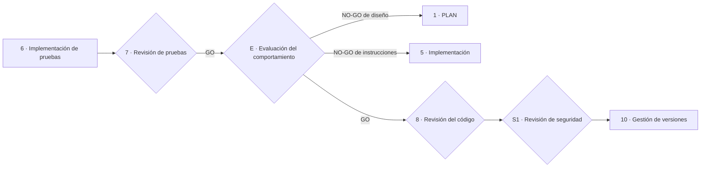

# Sistemas que incluyen IA: evaluación del comportamiento y agentes

**Qué añade SPAD cuando el sistema construido no solo se escribe con IA, sino que lleva IA dentro: instrucciones en producción, recuperación de información, agentes que actúan y modelos que cambian sin que cambie el código**

| | |
|---|---|
| Documento | Documento 05 · Sistemas que incluyen IA |
| Versión | 0.1 |
| Fecha | 19-09-2026 |
| Autor | Fernando García Varela |
| Estado | En construcción. Documento nuevo; sustituye a la habilidad derivada de diseño de agentes, que era una lista de temas sin método. |
| Tipo | Guía operativa |

<!-- cifras: 2 | objetos distintos: código con IA y sistema con IA ; 4 | niveles de autonomía A0–A3 ; 5 | requisitos añadidos al plan ; 1 | fase nueva de evaluación -->

---

> **Versión en revisión: no difundir.** El estado actual de SPAD (versión 0.x) no está pensado para compartirse de forma general. Se mantiene en público para que un número reducido de personas pueda revisarlo, dar su opinión y ayudar a mejorarlo. Se está trabajando en la adecuación de los documentos y las herramientas para que sean reutilizables; este aviso desaparecerá cuando el marco pase a la versión 1.x.

> **Aviso legal y exención de responsabilidad.** SPAD es una metodología de referencia que se ofrece «tal cual» y con fines exclusivamente informativos. No constituye asesoramiento jurídico, regulatorio ni profesional, no garantiza resultados ni el cumplimiento de ninguna norma y no es una certificación. Las referencias a regulación general (como el Reglamento Europeo de IA o el RGPD) pueden ser incompletas, no aplicar a un caso concreto o quedar desactualizadas. **Cada organización que use SPAD es la única responsable de validar sus resultados, identificar la normativa que le aplica, verificar su vigencia y certificar su propio cumplimiento regulatorio**, con el asesoramiento cualificado que corresponda. El autor no asume responsabilidad alguna por el uso que se haga de este contenido ni por las decisiones que se adopten con él. Los datos, cifras, compañías y casos de los ejemplos son ficticios o ilustrativos.

## 1. Dos objetos distintos

SPAD nació para gobernar el **código escrito con ayuda de IA**. Cada vez más, lo que se construye es un **sistema que incluye IA**: una aplicación cuyo comportamiento depende, en producción, de un modelo, de unas instrucciones, de una base de conocimiento o de un agente que ejecuta acciones.

| Aspecto | Código escrito con IA | Sistema que incluye IA |
|---|---|---|
| Qué produce la IA | Código, pruebas, documentación, revisadas antes de desplegar. | Respuestas, decisiones o acciones **en producción**, ante entradas que nadie ha visto antes. |
| Cuándo se comprueba el comportamiento | Antes del despliegue, con pruebas deterministas. | Antes y **durante** el uso, con evaluaciones sobre conjuntos de casos y vigilancia continua. |
| Qué cambia sin que cambie el código | Nada. | El modelo del proveedor, las instrucciones, los datos recuperados, las herramientas disponibles. |
| Riesgos propios | Los del software: defectos, deuda, vulnerabilidades. | Además: respuestas incorrectas con seguridad, inyección de instrucciones, fuga de datos, acciones no autorizadas, sesgo, deriva. |

Este documento define lo que SPAD **añade** al ciclo principal cuando el objeto es un sistema que incluye IA. Todo lo demás (fases, roles, veredictos, validación, registros) se aplica igual.

> **Por qué importa.** Es el caso de mayor riesgo y el que menos cubren los métodos de ingeniería clásicos. Un sistema con IA puede pasar todas las pruebas de código y, aun así, dar respuestas inaceptables, ejecutar acciones que nadie autorizó o cambiar de comportamiento cuando el proveedor actualiza el modelo.

---

## 2. Nivel de autonomía

Todo componente de IA que decide o actúa se clasifica desde el plan con la escala de autonomía de SEVEN-G:

| Nivel | Nombre | Qué hace el sistema | Qué hace la persona | Ejemplo ilustrativo |
|---|---|---|---|---|
| **A0** | Asistencia | Informa, resume o genera contenido. | Decide y ejecuta. | Resumen de un expediente para un analista. |
| **A1** | Recomendación | Propone una decisión o acción concreta. | Valida cada acción antes de ejecutarla. | Propuesta de respuesta a un cliente que un agente humano aprueba. |
| **A2** | Actuación supervisada | Ejecuta acciones dentro de límites definidos. | Supervisa, puede interrumpir y revisa a posteriori. | Reposición de existencias con revisión diaria de excepciones. |
| **A3** | Actuación autónoma | Ejecuta secuencias de acciones sin revisión individual, dentro de límites estrictos. | Fija límites, supervisa agregados y dispone de interruptor de parada. | Ajuste continuo de precios dentro de una banda aprobada. |

El nivel determina la intensidad de los requisitos de este documento: A0 y A1 exigen evaluación del comportamiento; A2 y A3 exigen además límites de actuación, registro de acciones, interruptor de parada probado y, en organizaciones que aplican SEVEN-G, la intensidad Enterprise y los controles de [SEVEN-G 35 · Seguridad de IA y agentes](../../../SEVEN-G/html/es/35_SEVEN-G_Seguridad_de_IA_y_agentes.html).

---

## 3. Qué añade a cada fase

| Fase | Requisito añadido |
|---|---|
| **0 · Contexto y objetivo** | Criterios de éxito **medibles sobre el comportamiento** (exactitud, tasa de rechazo correcto, latencia, coste por interacción) y lo que el sistema **nunca debe hacer**. |
| **1 · PLAN** | Nivel de autonomía; componentes de IA (modelo, instrucciones, recuperación de información, herramientas del agente, memoria); límites de actuación; qué datos recibe el modelo y qué proveedor; modos de fallo y comportamiento seguro ante ellos; estrategia frente a cambios del modelo del proveedor. |
| **2 · Revisión del plan** | La IA revisora evalúa además: adecuación del nivel de autonomía al riesgo; suficiencia de los límites; exposición de datos al proveedor; existencia de interruptor de parada y de alternativa sin IA. |
| **3 · Guía de código** | Reglas para las instrucciones (versionadas como código, sin datos personales), para los contratos de las herramientas del agente (permisos mínimos, parámetros validados) y para el registro de cada interacción. |
| **4 · Estrategia de pruebas** | Se añade la **estrategia de evaluación del comportamiento** (sección 4): conjuntos de casos, criterios de aceptación, pruebas adversarias, pruebas de sesgo, y su umbral. |
| **5 y 6 · Implementación** | Las instrucciones, los conjuntos de evaluación y las herramientas del agente son artefactos del tema, versionados con el código. |
| **7 · Revisión de pruebas** | Comprueba que la evaluación del comportamiento cubre los criterios de la fase 0 y los modos de fallo del plan. |
| **E · Evaluación del comportamiento** (nueva, tras la 7) | Sección 4. |
| **8 · Revisión del código** | Revisa además el registro de interacciones, la gestión de la memoria y de los datos, y la separación entre las instrucciones del sistema y las entradas del usuario. |
| **S1 · Revisión de seguridad** | **Obligatoria**, con la lista OWASP Top 10 para aplicaciones con modelos de lenguaje como referencia: inyección de instrucciones, fuga de datos del sistema o del usuario, salidas inseguras, envenenamiento de datos, permisos excesivos de herramientas, dependencia excesiva del modelo. |
| **10 · Gestión de versiones** | La versión incluye el modelo y sus parámetros, las instrucciones y los conjuntos de evaluación; el plan de vigilancia incluye deriva y coste; el plan de reversión incluye el **modelo de respaldo** o la alternativa sin IA. |

---

## 4. Fase E · Evaluación del comportamiento

### 4.1 Qué es

Una fase adicional, entre la revisión de pruebas y la revisión del código, en la que el sistema con IA se ejecuta sobre **conjuntos de casos representativos** y sus salidas se comparan con criterios de aceptación fijados de antemano. Las pruebas de código verifican que el programa hace lo que dice el código; la evaluación verifica que el **sistema** hace lo que dice el objetivo.

| Elemento | Contenido |
|---|---|
| **Conjunto de evaluación** | Casos representativos del uso real, con la salida esperada o los criterios para juzgarla, incluidos casos límite y casos que el sistema **debe rechazar**. Versionado; sin datos personales reales salvo base jurídica y medidas. |
| **Criterios de aceptación** | Umbrales por métrica (exactitud, cobertura de rechazo, alucinaciones detectadas, latencia, coste), fijados en la fase 0 o en el plan. |
| **Pruebas adversarias** | Inyección de instrucciones directa e indirecta (a través de documentos recuperados), intentos de extracción de las instrucciones del sistema o de datos, entradas fuera de alcance, solicitudes de acciones no autorizadas. |
| **Pruebas de sesgo** | Pares contrafactuales (misma entrada con un atributo protegido cambiado) y calidad por segmento, obligatorias cuando el sistema decide, recomienda o se comunica con personas. |
| **Evaluador** | Automático cuando existe respuesta de referencia; con jueces (modelo o persona) cuando no; en todo caso, una **muestra revisada por personas**. |
| **Modelo de respaldo** | Si el plan prevé degradación a otro modelo, ese modelo se evalúa con el mismo conjunto antes del despliegue. |

### 4.2 Responsable, entrada y salida

| Fase | Responsable | Entrada | Salida obligatoria |
|---|---|---|---|
| **E · Evaluación del comportamiento** | IA constructora ejecuta; IA revisora evalúa los resultados; una persona revisa la muestra | Sistema implementado, conjunto de evaluación, criterios. | Informe de evaluación: resultados por métrica frente a umbral; fallos por categoría con ejemplos; resultados adversarios y de sesgo; muestra revisada por personas; **veredicto** (GO · GO con cambios · NO-GO). |

Un NO-GO devuelve el trabajo a la fase 1 si el fallo es de diseño (límites, herramientas, arquitectura) o a la fase 5 si es de instrucciones o de implementación.

<!-- grafico: Ciclo principal con evaluación del comportamiento | La fase E se sitúa entre la revisión de pruebas y la revisión del código -->

> **Por qué importa.** Sin evaluación del comportamiento, la única prueba de que un asistente responde bien es la demostración que hizo alguien con las preguntas que se le ocurrieron. El conjunto de evaluación versionado permite además repetir la prueba cada vez que cambia el modelo, las instrucciones o los datos, que es exactamente cuando el comportamiento cambia sin que nadie haya tocado el código.

---

## 5. Agentes

Un agente es un componente de IA que **ejecuta acciones** mediante herramientas (consultas, escrituras, llamadas a otros sistemas). El plan de un agente incluye:

| Elemento | Contenido |
|---|---|
| **Roles y responsabilidades** | Qué hace el agente y qué no; si hay varios agentes, quién coordina y con qué autoridad. |
| **Contratos de herramientas** | Cada herramienta con parámetros validados, permisos mínimos, efectos (lectura o escritura) y límites (importe, volumen, alcance). |
| **Límites de actuación** | Qué acciones puede ejecutar sin validación (A2/A3), cuáles requieren aprobación humana y cuáles están prohibidas. |
| **Memoria** | Qué recuerda a corto y largo plazo, dónde se guarda, con qué retención y sin qué datos. |
| **Modos de fallo y parada segura** | Qué ocurre si una herramienta falla, si el modelo no responde o si se detecta una acción fuera de límites: estado seguro, escalado a persona, **interruptor de parada** con responsable y prueba periódica. |
| **Registro** | Cada acción con entrada, decisión, herramienta invocada, resultado y persona que supervisa, reconstruible a posteriori. |
| **Identidad** | El agente actúa con credenciales propias, no con las de una persona, sin credenciales de producción en desarrollo. |

Reglas:

1. Ningún agente con autonomía A2 o A3 se despliega sin evaluación del comportamiento que incluya intentos de exceder sus límites.
2. La tasa de anulación humana de sus acciones se vigila: cercana a cero durante meses indica supervisión nominal; muy alta, un sistema mal calibrado.
3. Los agentes de construcción (los que SPAD usa para escribir código) están sujetos a las mismas reglas: mínimo privilegio, sin credenciales de producción y registro de acciones.

---

## 6. Operación: lo que cambia sin que cambie el código

| Cambio | Tratamiento en SPAD |
|---|---|
| **El proveedor actualiza el modelo** | Se ejecuta de nuevo el conjunto de evaluación antes de aceptar la versión nueva; si no se puede fijar la versión, la vigilancia de deriva es obligatoria. |
| **Cambian las instrucciones** | Son código: pasan por plan reducido, revisión y evaluación. |
| **Cambia la base de conocimiento** | Se evalúa la recuperación (pertinencia, fuentes vigentes) y se repiten los casos adversarios de inyección indirecta. |
| **Deriva de uso** | Se vigila la distribución de temas y las consultas fuera del alcance evaluado; un cambio significativo abre un tema. |
| **Coste** | Presupuesto de consumo por interacción y periodo; degradación por coste solo a modelos evaluados. |

En organizaciones que aplican SEVEN-G, esta vigilancia se integra en el manual de operación ([SEVEN-G 52 · Manual de operación de IA](../../../SEVEN-G/html/es/52_SEVEN-G_Manual_de_operacion_de_IA.html)).

---

## 7. Datos y proveedor del modelo

| Regla | Detalle |
|---|---|
| Clasificación de lo que se envía | Solo las clases de información autorizadas en el contexto global para ese proveedor y entorno (documento 02). |
| Datos personales | Nunca en instrucciones ni en conjuntos de evaluación sin base jurídica documentada y medidas; datos sintéticos por defecto. |
| Retención y uso por el proveedor | Verificados contractualmente antes del uso; sin uso de las entradas para entrenamiento salvo acuerdo expreso. |
| Secretos | Nunca en instrucciones ni en código; las herramientas del agente los obtienen de un almacén de secretos. |
| Separación | Las instrucciones del sistema y las entradas del usuario o de los documentos recuperados se mantienen separadas y marcadas; el contenido recuperado se trata como **datos, no como instrucciones**. |

---

## 8. Relación con la regulación

Los sistemas que incluyen IA pueden estar sujetos a obligaciones específicas (por ejemplo, las del Reglamento Europeo de IA sobre transparencia, supervisión humana, documentación técnica o clasificación de riesgo, y las de protección de datos sobre decisiones automatizadas). SPAD **no determina** esas obligaciones: produce artefactos que sirven de evidencia (plan, evaluación, registro de acciones, versión). La identificación y la verificación de la regulación aplicable corresponden a cada organización, con asesoramiento jurídico; en SEVEN-G, a través de [SEVEN-G 32 · Inventario y clasificación regulatoria](../../../SEVEN-G/html/es/32_SEVEN-G_Inventario_y_clasificacion_regulatoria.html) y [SEVEN-G 34 · Mapeo regulatorio](../../../SEVEN-G/html/es/34_SEVEN-G_Mapeo_regulatorio.html).

---

## 9. Documentos relacionados

| Documento | Relación |
|---|---|
| **documento 01 · Guía operativa** | Ciclo principal al que se añaden estos requisitos. |
| **documento 02 · Contextos, temas y registro de artefactos** | Reglas de datos y proveedores del contexto global. |
| **documento 04 · Ciclos complementarios** | Revisión de seguridad. |
| **documento 07 · Contratos de entrada y salida** | Contrato del informe de evaluación del comportamiento. |
| [SEVEN-G 35 · Seguridad de IA y agentes](../../../SEVEN-G/html/es/35_SEVEN-G_Seguridad_de_IA_y_agentes.html) | Niveles de autonomía, controles de agentes e interruptor de parada. |
| [SEVEN-G 52 · Manual de operación de IA](../../../SEVEN-G/html/es/52_SEVEN-G_Manual_de_operacion_de_IA.html) | Vigilancia de deriva, sesgo y coste en operación. |
| [SEVEN-G 53 · Construcción de soluciones con IA](../../../SEVEN-G/html/es/53_SEVEN-G_Construccion_de_soluciones_con_IA.html) | Pruebas exigidas a los sistemas de IA antes de la puerta de decisión G5. |

---

## 10. Control de versiones

| Versión | Fecha | Cambios |
|---|---|---|
| 0.1 | 19-09-2026 | Primera versión. Distingue código escrito con IA y sistema que incluye IA; niveles de autonomía A0–A3; requisitos añadidos a cada fase; fase E de evaluación del comportamiento con conjuntos, criterios, pruebas adversarias y de sesgo; plan de agentes; cambios sin cambio de código; datos y proveedor; relación con la regulación. Sustituye a la habilidad derivada de diseño de agentes. |
