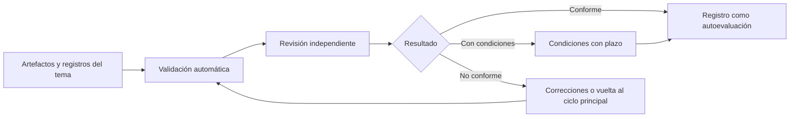

# Autoevaluación de conformidad y métricas del proceso

**Cómo comprueba una organización que ha trabajado conforme a SPAD, qué evidencias necesita y con qué indicadores sabe si el método funciona, sin certificaciones ni cifras prometidas**

| | |
|---|---|
| Documento | Documento 08 · Autoevaluación de conformidad y métricas del proceso |
| Versión | 0.1 |
| Fecha | 19-09-2026 |
| Autor | Fernando García Varela |
| Estado | En construcción. Reescribe la autoevaluación anterior con los artefactos del ciclo canónico y añade las métricas del proceso. |
| Tipo | Guía de aplicación |

<!-- cifras: 6 | condiciones de conformidad ; 3 | resultados posibles ; 8 | métricas del proceso ; 0 | certificaciones -->

---

> **Versión en revisión: no difundir.** El estado actual de SPAD (versión 0.x) no está pensado para compartirse de forma general. Se mantiene en público para que un número reducido de personas pueda revisarlo, dar su opinión y ayudar a mejorarlo. Se está trabajando en la adecuación de los documentos y las herramientas para que sean reutilizables; este aviso desaparecerá cuando el marco pase a la versión 1.x.

> **Aviso legal y exención de responsabilidad.** SPAD es una metodología de referencia que se ofrece «tal cual» y con fines exclusivamente informativos. No constituye asesoramiento jurídico, regulatorio ni profesional, no garantiza resultados ni el cumplimiento de ninguna norma y no es una certificación. **Cada organización que use SPAD es la única responsable de validar sus resultados, identificar la normativa que le aplica, verificar su vigencia y certificar su propio cumplimiento regulatorio**, con el asesoramiento cualificado que corresponda. El autor no asume responsabilidad alguna por el uso que se haga de este contenido ni por las decisiones que se adopten con él. Los datos, cifras, compañías y casos de los ejemplos son ficticios o ilustrativos.

## 1. Qué es la autoevaluación

La **autoevaluación de conformidad** es una revisión estructurada, realizada por la propia organización, para comprobar si un sistema, un proyecto, un agente o un equipo ha trabajado **conforme a SPAD**.

| Es | No es |
|---|---|
| Una herramienta interna de revisión. | Una certificación. |
| Realizada por una persona independiente de quienes construyeron. | Emitida o respaldada por su autor ni por ningún tercero. |
| Evidencia de rigor metodológico para auditorías internas o externas. | Acreditación del cumplimiento de ninguna ley o norma. |
| Referenciable en documentación interna y, con aprobación, en comunicaciones con clientes, siempre como autoevaluación. | Un reclamo público ni un sello. |

Presentar la autoevaluación como certificación es un incumplimiento del gobierno de la organización y del uso permitido del nombre SPAD (documento 00, sección 11).

> **Por qué importa.** Una autoevaluación honesta da a la organización una definición compartida de «terminado» y un conjunto de evidencias listo para quien lo pida. Un sello que nadie ha concedido daría una falsa seguridad y expondría a la organización si alguien lo pusiera a prueba.

---

## 2. Condiciones de conformidad

Un trabajo es conforme a SPAD cuando la persona que evalúa comprueba las seis condiciones:

| # | Condición | Evidencia |
|---|---|---|
| 1 | **Las decisiones se tomaron antes de escribir código.** | PLAN validado y revisado con GO antes de la primera implementación; sin código en el plan. |
| 2 | **Cada fase produjo su artefacto**, completo según su contrato. | Artefactos numerados en la carpeta del tema; validación automática sin errores. |
| 3 | **Las revisiones fueron independientes.** | Registro del modelo: la IA revisora no coincide con la constructora en ninguna fase; revisión humana del código registrada; segunda revisión humana en código sensible. |
| 4 | **No se saltó ni se fusionó ninguna fase** (salvo las agrupaciones de la versión reducida, si aplicaba). | Secuencia completa de artefactos; registro de validación por fase. |
| 5 | **Las correcciones fueron mínimas, justificadas y trazables.** | Cada corrección enlaza con un hallazgo; sin refactorizaciones fuera de los hallazgos. |
| 6 | **Ninguna IA aprobó nada.** | Registro de validación humana completo; veredictos aceptados por una persona identificada; riesgos residuales aceptados por la autoridad que corresponde. |

Si el sistema incluye IA (documento 05), se añade una séptima: **la evaluación del comportamiento se ejecutó antes del despliegue y se repite con cada cambio de modelo, instrucciones o datos**.

---

## 3. Artefactos obligatorios

| Trabajo | Artefactos que deben existir |
|---|---|
| **Ciclo principal (versión completa)** | Fase 0 (contexto y objetivo); PLAN; revisión del plan; guía de código; estrategia de pruebas; implementación; implementación de pruebas; revisión de pruebas; revisión del código; correcciones (si hubo hallazgos); versión; registro de validación; registro del modelo en cada artefacto. |
| **Versión reducida** | Plan revisado; entrega revisada; versión; registro de validación; registro del modelo. |
| **Legado** | L1 y L2 además del ciclo principal. |
| **Depuración** | Informe de causa raíz con veredicto. |
| **Corrección urgente** | Diagnóstico rápido; plan simplificado; revisión acelerada; implementación con pruebas; despliegue con aprobación de emergencia; vigilancia; análisis posterior; tema del plan definitivo si la corrección fue provisional. |
| **Seguridad** | Informe de revisión de seguridad; aceptación de riesgos residuales por una persona. |
| **Sistema que incluye IA** | Informe de evaluación del comportamiento; conjuntos de evaluación versionados. |

La ausencia de un artefacto obligatorio produce una autoevaluación **negativa** de forma automática.

---

## 4. Procedimiento

| Paso | Quién | Qué |
|---|---|---|
| 1 · Recogida | Responsable del trabajo | Reúne los artefactos del tema y los registros. |
| 2 · Validación automática | Validador de artefactos (documento 07) | Comprueba completitud, escalas y coherencia de veredictos. |
| 3 · Revisión independiente | Persona designada por la organización, **independiente de quienes construyeron y orquestaron** | Comprueba las condiciones de la sección 2 sobre las evidencias. |
| 4 · Resultado | Persona revisora | **Conforme** · **Conforme con condiciones** (con las condiciones y su plazo) · **No conforme** (con los motivos). |
| 5 · Corrección | Equipo | Solo mediante la fase de correcciones; no se admite rediseño en esta etapa. Si hace falta rediseñar, el trabajo vuelve al ciclo principal y la autoevaluación se repite. |
| 6 · Registro | Organización | Anota el resultado, la persona revisora, la fecha y el alcance, siempre como «conforme con SPAD (autoevaluación)». |

<!-- grafico: Autoevaluación de conformidad | De las evidencias al resultado, sin certificación -->

### 4.1 Alcance y vigencia

- Cada autoevaluación tiene un **alcance** (sistema, proyecto, agente, equipo o componente) y una **fecha**.
- Vigencia: la que fije el contexto global (valor de partida: doce meses), o menos si hay cambios importantes de arquitectura o de alcance, se introducen agentes o lógica de decisión nueva, o cambia el modelo de un sistema que incluye IA sin repetir la evaluación del comportamiento.

### 4.2 Gobierno

- El resultado es final dentro de la organización.
- La persona revisora es independiente de quienes construyeron; en organizaciones que aplican SEVEN-G, no es por ese hecho el Auditor de IA, que exige además las incompatibilidades de SEVEN-G.
- Las evidencias se conservan según la política de retención de la organización.
- En SEVEN-G, la autoevaluación **no es** una evidencia de puerta de decisión ni exime de ninguna: es un insumo ([SEVEN-G 53 · Construcción de soluciones con IA](../../../SEVEN-G/html/es/53_SEVEN-G_Construccion_de_soluciones_con_IA.html), sección 2.2).

---

## 5. Métricas del proceso

SPAD **no afirma cifras de mejora**. Cada organización mide si el método funciona frente a su propia situación de partida, con estos indicadores calculados a partir de los registros (documento 02):

| # | Métrica | Fórmula | Qué indica |
|---|---|---|---|
| 1 | **Tasa de invalidación por fase** | Respuestas inválidas ÷ respuestas de la fase × 100 | Fases con instrucciones débiles o modelos inadecuados. Por encima del umbral del contexto global, la instrucción se revisa. |
| 2 | **Tasa de invalidación por modelo** | Respuestas inválidas del modelo ÷ respuestas del modelo × 100 | Qué modelos siguen mejor las reglas; base para cambiar de modelo por rol. |
| 3 | **Tasa de NO-GO** | Revisiones con NO-GO ÷ revisiones × 100, por tipo de revisión | Calidad del diseño y de la construcción antes de revisar. Una tasa cero sostenida indica una revisión nominal. |
| 4 | **Iteraciones hasta GO** | Media y máximo de iteraciones por fase revisada | Coste del retrabajo dentro del ciclo. |
| 5 | **Tiempo por fase** | Mediana de tiempo entre la entrada y la validación de cada fase | Dónde está el cuello de botella; base para calibrar la versión reducida. |
| 6 | **Defectos escapados** | Defectos detectados en producción atribuibles a un tema ÷ temas entregados | Eficacia del conjunto de revisiones. La cifra que de verdad importa. |
| 7 | **Cobertura real frente a exigida** | Cobertura obtenida − cobertura mínima, por tema | Cumplimiento de la estrategia de pruebas. |
| 8 | **Correcciones fuera de hallazgo** | Correcciones sin hallazgo asociado ÷ correcciones × 100 | Refactorizaciones encubiertas. Debería tender a cero. |

Para sistemas que incluyen IA se añaden las métricas de la evaluación del comportamiento (exactitud, rechazo correcto, pruebas adversarias superadas, diferencia por segmento) y, en operación, la deriva y el coste por interacción (documento 05).

| Métrica de resultado (frente a la situación de partida) | Cómo medirla |
|---|---|
| Retrabajo tras la entrega | Horas de corrección posteriores a la versión ÷ horas de construcción, antes y después de SPAD. |
| Incidentes en producción | Incidentes por tema entregado, antes y después. |
| Tiempo de preparación de auditorías | Horas para reunir evidencias de un tema, antes y después. |
| Tiempo hasta producción | Mediana de días de la fase 0 a la versión, por tipo de trabajo. |

> **Por qué importa.** Los materiales originales de SPAD prometían reducciones concretas de retrabajo e incidentes. SEVEN-G no usa cifras sin respaldo y SPAD tampoco: las métricas de esta sección son el modo de que cada organización obtenga sus propias cifras, y de que la metodología se calibre con datos en lugar de con expectativas.

---

## 6. Cuándo conviene usar SPAD, según las métricas

| Señal en las métricas | Lectura |
|---|---|
| Tasa de invalidación alta en una fase y baja en las demás | La instrucción de esa fase necesita reforzarse; no es un problema del método. |
| Tasa de NO-GO cercana a cero durante meses | La IA revisora o la validación humana se han vuelto un trámite; revisar la independencia. |
| Tiempo por fase muy superior al de construcción en trabajos pequeños | Aplicar la versión reducida en esos trabajos. |
| Defectos escapados que no bajan tras varios ciclos | Revisar la estrategia de pruebas y la evaluación del comportamiento; considerar revisión humana adicional. |
| Correcciones fuera de hallazgo crecientes | La IA correctora está refactorizando; reforzar la prohibición y la revisión. |

---

## 7. Siguientes pasos de SPAD

| Paso | Descripción | Estado |
|---|---|---|
| Validador de artefactos | Herramienta sin servidor que comprueba los contratos (documento 07, sección 6) y genera el registro del tema. | Propuesto. |
| Plantillas de contextos | Contexto global y de proyecto de ejemplo, con valores de partida marcados como tales. | Propuesto. |
| Calculadora de métricas | A partir de los registros de validación e infracciones, las métricas de la sección 5. | Propuesto. |
| Casos de aplicación | Ejemplos ficticios completos de un tema en versión completa y en versión reducida. | Propuesto. |

---

## 8. Documentos relacionados

| Documento | Relación |
|---|---|
| **documento 00 · Qué es SPAD y para qué sirve** | Uso permitido del nombre y ausencia de certificación. |
| **documento 01 · Guía operativa** | Fases y artefactos cuya existencia se comprueba. |
| **documento 02 · Contextos, temas y registro de artefactos** | Registros de los que salen las evidencias y las métricas. |
| **documento 03 · Política de validación** | Tasa de invalidación y registro de infracciones. |
| **documento 07 · Contratos de entrada y salida** | Validación automática previa a la revisión independiente. |
| [SEVEN-G 53 · Construcción de soluciones con IA](../../../SEVEN-G/html/es/53_SEVEN-G_Construccion_de_soluciones_con_IA.html) | Tratamiento de la autoevaluación dentro de SEVEN-G. |

---

## 9. Control de versiones

| Versión | Fecha | Cambios |
|---|---|---|
| 0.1 | 19-09-2026 | Primera versión. Reescribe la autoevaluación anterior: naturaleza, seis condiciones con evidencias (siete para sistemas con IA), artefactos obligatorios alineados con el ciclo canónico y los ciclos complementarios, procedimiento con validación automática, alcance y vigencia como parámetro, gobierno; añade las métricas del proceso y de resultado y los siguientes pasos. |
