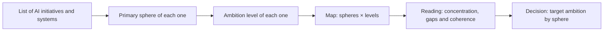

# What SPHERES is and how it helps

**Nine spheres and three ambition levels so that a board can talk about artificial intelligence in business language: where to play, with what ambition and what to ask**

| | |
|---|---|
| Document | Document 00 · What SPHERES is and how it helps |
| Version | 0.1 |
| Date | 17-09-2026 |
| Author | Fernando García · SEACHAD |
| Status | Under construction. Supporting methodology of SEVEN-G and not released commercially; its current operating rules are in SEVEN-G document 10. |
| Type | Methodology overview |

<!-- cifras: 9 | impact spheres ; 3 | ambition levels ; 4 | sphere types ; 6 | documents -->

---

> **Version under review: please do not circulate.** The current state of SPHERES (version 0.x) is not meant to be shared widely. It is public so that a small number of people can review it, give feedback and help improve it. Documents and tools are being adapted to make them reusable; this notice will disappear when the framework reaches version 1.x.

> **Legal notice and disclaimer.** SPHERES is a reference methodology provided "as is" and for information purposes only. It does not constitute legal, regulatory, financial or professional advice, nor does it guarantee compliance with any law or standard. References to general regulation (such as the EU AI Act or the GDPR) and to regulation specific to each sector or jurisdiction may be incomplete, may not apply to a particular case or may become out of date. **Each organisation that uses SPHERES is solely responsible for identifying the regulation that applies to it, verifying that it is current and certifying its own regulatory compliance**, with the appropriate qualified advice. The author and SEACHAD accept no liability for any use made of this content or for any decisions taken on the basis of it. The data, figures, companies and cases in the examples are fictitious or illustrative.

## 1. What SPHERES is

**SPHERES** is the SEACHAD methodology for **placing artificial intelligence in the business** before talking about technology. It organises everything that AI can change in an organisation into **nine impact spheres** and grades each bet with **three ambition levels**: Optimise, Augment and Transform.

The name comes from the English word *spheres*. It is not an acronym: it describes the central idea of the method, which is that AI is not a project for the technology area but a change that reaches customers, the offering, people, processes, data, knowledge, decisions, obligations and governance.

SPHERES answers three questions that any board or management committee should be able to answer clearly:

> **Public status and reuse.** SPHERES is offered as an open reference framework in development. It is not released as a final commercial deliverable or a closed product for clients. The content, templates and methodological explanation may be reused by any organisation for methodological use, unless a written and specific agreement sets different terms for modifications or proprietary developments; no client may claim exclusivity over the base framework by the mere use of SPHERES.

| Question | What SPHERES contributes | Where it is developed |
|---|---|---|
| **Where do we play?** | A map of nine spheres that covers the whole organisation and forces priorities to be chosen. | Documents 02, 03 and 04 |
| **With what ambition?** | Three levels with different cost, risk, timescale and resistance, which are chosen deliberately. | Document 01 |
| **What do we ask?** | Questions for the board, warning signs and a conversation script for each sphere. | Document 05 |

> **Why it matters.** Without a common language, each area talks about AI in its own way: technology talks about models, finance about savings, the business about use cases and compliance about risks. SPHERES gives everyone the same map, so that the board can compare bets, detect gaps and decide where to invest without having to understand how each system works.

SPHERES is a **supporting methodology of SEVEN-G**, the SEACHAD framework for value, governance and transformation with AI. It constitutes its component A (impact map). This library explains the method in detail and with examples; the operating rules, the indicators with a formula and the tools are in SEVEN-G (section 8).

---

## 2. The problem it solves

Most organisations do not have a problem of a lack of AI initiatives, but of a **lack of direction** over them. The symptoms are recognisable:

| Symptom | What usually lies behind it | How SPHERES addresses it |
|---|---|---|
| The board receives a list of "use cases" that it does not know how to prioritise. | The technology is described, not the effect on the business. | Each initiative is placed in a sphere and at a level; the list becomes a map. |
| All the effort is concentrated on automating internal tasks. | Efficiency is easier to justify and to measure. | The map shows at a glance that there are no bets in Customer or Product, nor at the Augment or Transform level. |
| A "transformation with AI" is announced that changes nothing visible. | The narrative is confused with the effect. | Ambition levels are defined by what changes in the business, not by how the programme is presented. |
| Initiatives are delayed or stopped in advanced phases. | Data, accessible knowledge or decision rules are missing. | The enabling spheres (05, 06 and 07) are diagnosed before the ambition is set. |
| Regulation appears at the end, when the system has already been built. | It is treated as a formality and not as a design boundary. | Sphere 08 is on the map from the outset and has its own grades. |
| Nobody knows who is accountable for AI in the company. | There is no governance with the formality of finance or risk. | Sphere 09 is the meta-sphere: it connects the others and is assessed separately. |

> **Why it matters.** These symptoms are not corrected with more technology or more pilots. They are corrected with a well-structured management conversation. SPHERES makes that conversation repeatable: the same spheres, the same levels and the same questions at every review.

---

## 3. The nine spheres at a glance

<!-- figura: esferas -->

The spheres cover **all the areas of relationship of a company**, regardless of its sector. They are grouped into four types that are read from the outside in:

| Type | Sphere | Motto | Essential question |
|---|---|---|---|
| **Where value is created** | 01 · Customer | Knowledge, relationship and anticipation | Do we know and serve our customers better than the competition? |
| | 02 · Product and service | AI inside, on top of or as the product | Are we protecting the current product or building the next one? |
| | 03 · People | Recipients, subjects and promoters of AI | Does AI replace, augment or reorganise work? |
| | 04 · Operations | Processes, value chain and efficiency | Are we automating tasks or redesigning processes? |
| **Enablers** | 05 · Data | The material substrate of all AI | Do we know what data we have and whether we can use it? |
| | 06 · Knowledge | Organisational memory and collective intelligence | What is lost if the people who know the most leave? |
| | 07 · Decision | Who decides, with what information and with how much delegation | What does AI decide on its own and what is never delegated? |
| **Boundaries** | 08 · Regulation, ethics and accountability | Regulation, principles and chain of accountability | Do we govern proactively or do we wait for the regulator? |
| **Meta-sphere** | 09 · AI governance | The sphere that connects the other eight | Does AI have governance as formal as finance? |

Four ideas explain the structure:

1. **Spheres 01 to 04 are the only ones in which AI generates direct value** for the company: revenue, retention, margin, productivity, cost or quality.
2. **Spheres 05 to 07 do not generate value in themselves, but they constrain it.** A high ambition in Customer without reliable data, without accessible knowledge and without clear decision rules is a high-risk bet.
3. **Sphere 08 sets the boundaries** within which the company can act: the law, ethical principles and accountability when something goes wrong.
4. **Sphere 09 is the centre**: the governance system that decides, oversees and corrects across the other eight.

> **Why it matters.** A map with only value spheres would invite the pursuit of opportunities without checking whether the company can execute them or whether it should. By including enablers, boundaries and governance in the same picture, SPHERES forces the opportunity, the capability and the accountability to be looked at together.

---

## 4. The three ambition levels at a glance

<!-- figura: niveles -->

Each sphere from 01 to 07 is analysed with three ambition levels. **They are not a ladder**: it is not mandatory to go through Optimise to reach Transform, nor is Transform better than Optimise. They are three different types of bet.

| Level | What it means | What changes | Illustrative example |
|---|---|---|---|
| **Optimise** | Doing the same thing faster, more cheaply or with fewer errors. | The efficiency of a task or process. What is done and who does it do not change. | Automatically classifying the enquiries that reach customer service. |
| **Augment** | People do what they could not do before. | The role and capabilities of people. The business does not change. | A copilot that enables analysts to review transactions that they previously referred to specialists. |
| **Transform** | What is offered, how the company competes or how it is organised changes. | The value proposition, the revenue model or the operating model. | A paid service that exists only because there is a proprietary model behind it. |

Investment, uncertainty and organisational resistance **increase** from Optimise to Transform. That is why each level requires different decision criteria: measuring a Transform bet against the payback period of an automation kills it before it can demonstrate anything. Document 01 develops the three levels in detail.

Spheres 08 and 09 **are not assessed with these three levels**, because they do not generate value in themselves. They are assessed by dimensions with four grades (Absent, Basic, Systematic and Advanced), as explained in document 04.

> **Why it matters.** The ambition level is the question that distinguishes a company that **is transforming** from one that **is only becoming more efficient**. Both are legitimate, but they are not the same thing, they do not cost the same and they are not governed in the same way. Calling an automation with a good narrative a transformation is one of the most expensive and most common mistakes.

---

## 5. How the map is read

The SPHERES map is read by crossing spheres and levels. In its simplest form it is a table of nine rows in which each of the company's AI initiatives occupies **one cell**: its primary sphere and its ambition level.

<!-- grafico: How the map is built | From the list of initiatives to the management conversation -->

The map is read at **three points in time**:

| Point in time | Question | What is looked at |
|---|---|---|
| **Current situation** | Where are we? | Which initiatives and systems exist, in which sphere and at what actual level. |
| **Target ambition** | Where do we want to be? | What priority and what ambition level management sets for each sphere. |
| **Portfolio** | Is what we are doing taking us there? | Whether the initiatives under way cover the ambition or whether there are gaps and dispersion. |

Three readings almost always appear in the first session:

- **Concentration**: most of the effort is in Operations and in Optimise. That is not bad in itself, but it should be a decision and not inertia.
- **Gaps**: priority spheres without any initiative, or an Augment ambition in Data with nothing delivering it.
- **Incoherence**: a Transform ambition in a value sphere supported by weak enablers.

> **Why it matters.** A map does not decide for the board, but it makes visible decisions that were being taken unintentionally. Concentration, gaps and incoherences are exactly the matters on which a board must take a position.

---

## 6. How it helps

SPHERES has specific uses, each with a verifiable outcome:

| Use | Question it answers | Outcome | Who uses it |
|---|---|---|---|
| **First conversation with the board** | Do we understand everything that AI can change in the company? | The board's initial position on priorities and on people. | Board, chair, director with AI experience |
| **Diagnosis** | Where are we today? | Current map of initiatives by sphere and level, with grades for spheres 08 and 09. | AI office or AI committee |
| **Setting the ambition** | Where do we want to play and with what ambition? | Priority and target ambition by sphere, approved by management. | Senior management, board |
| **Prioritising the portfolio** | Which initiatives close gaps and which disperse resources? | Ordered portfolio with sphere and level per initiative. | AI committee, finance |
| **Overseeing** | Are we moving towards the ambition or drifting away from it? | Quarterly map with gaps and alerts. | Board, board committee |
| **Communicating** | How do we explain to the organisation what we are doing with AI and why? | An understandable narrative, the same for all areas. | Management, people, communications |
| **Screening ideas** | Does this proposal fit with what we have decided? | Sphere and level proposed from the very start. | Area heads, employees |

> **Why it matters.** A method that is only useful for a workshop is forgotten the next day. SPHERES is used from the first conversation with the board to the annual portfolio review, with the same vocabulary. That continuity is what makes it possible to compare one year with the next.

---

## 7. A complete example

*Fictitious company. Illustrative data, unrelated to any real organisation.*

A medium-sized distribution company has twenty AI initiatives at different stages. The management committee presents them as "our AI strategy". When they are placed on the map, the following emerges:

| Sphere | Optimise | Augment | Transform |
|---|---|---|---|
| 01 · Customer | 3 | 1 | — |
| 02 · Product and service | — | — | — |
| 03 · People | 2 | — | — |
| 04 · Operations | 11 | 1 | — |
| 05 · Data | 1 | — | — |
| 06 · Knowledge | 1 | — | — |
| 07 · Decision | — | — | — |

In addition, the company has not classified its systems according to the applicable regulation (sphere 08, Compliance: Basic grade) and there is no single owner of AI (sphere 09, Structure: Absent grade).

**Reading the map**

1. **Nineteen of the twenty initiatives are Optimise** and eleven are in Operations. The company is becoming more efficient, not transforming.
2. **Product and service is empty**, even though the company's strategic plan talks about launching digital services.
3. **Decision is empty** and there are three Customer initiatives that recommend prices and discounts. Nobody has defined what the system decides and what a person validates.
4. **Data has a single initiative**, for data cleansing, while several Customer initiatives depend on behavioural data that has not been catalogued.
5. **There is no governance**: nobody can stop an initiative or is accountable to the board.

**Decisions it prompts**

| Board decision | Sphere | Consequence |
|---|---|---|
| Maintain the efficiency bet in Operations, but with an investment limit. | 04 | It is reviewed whether the eleven initiatives deliver actual savings or only released hours. |
| Set Transform as the ambition in Product and service. | 02 | A first initiative is commissioned with learning milestones and an investment limit per stage. |
| Set Augment as the ambition in Data before scaling Customer. | 05 | Priority is given to cataloguing customer data and documenting its legal basis. |
| Define autonomy levels for pricing decisions. | 07 | No price recommendation is executed without validation until approved rules are in place. |
| Designate an owner of AI and a committee with the power to stop initiatives. | 09 | Sphere 09 moves from Absent to Basic in the first quarter. |

> **Why it matters.** None of the above requires technical knowledge. The five decisions come from looking at the map and asking the questions for each sphere. That is the purpose of SPHERES: that management decides on AI as naturally as it decides on investment, risk or talent.

---

## 8. Relationship with SEVEN-G

SPHERES was created as an independent framework for conversation with the board and is today **component A (impact map) of SEVEN-G**. The division of work between the two libraries is deliberate:

| Aspect | SPHERES (this library) | SEVEN-G |
|---|---|---|
| **Purpose** | Explain what the spheres and levels are, why they matter and how to use them in a management conversation. | Govern, measure and audit AI in the company and in each initiative. |
| **Content** | Concepts, examples, questions, warning signs and conversation script. | Classification rules, indicators with a formula, decision gates, templates and tools. |
| **Readers** | Board, senior management and anyone who needs to understand the map. | AI office, AI committee, product owners, audit. |
| **Rule in case of doubt** | Refers to SEVEN-G. | It is the source of truth for the operating rules. |

SEVEN-G documents that develop SPHERES:

| SEVEN-G document | What it contributes |
|---|---|
| [SEVEN-G 10 · Sphere map and ambition levels](../../../SEVEN-G/html/en/10_SEVEN-G_Mapa_de_esferas_y_niveles_de_ambicion.html) | Primary and secondary sphere rules, indicators by sphere, grades for 08 and 09 and heat map. |
| [SEVEN-G 12 · Transformation index](../../../SEVEN-G/html/en/12_SEVEN-G_Indice_de_transformacion.html) | The five questions for classifying the ambition of an initiative and the company's profile. |
| [SEVEN-G 13 · AI thesis, ambition and risk appetite](../../../SEVEN-G/html/en/13_SEVEN-G_Tesis_de_IA_ambicion_y_apetito_de_riesgo.html) | How the target ambition by sphere is set and approved. |
| [SEVEN-G 14 · Portfolio management](../../../SEVEN-G/html/en/14_SEVEN-G_Gestion_de_cartera.html) | Use of the map to prioritise and balance the portfolio. |
| [SEVEN-G 61 · Board conversation guide](../../../SEVEN-G/html/en/61_SEVEN-G_Guia_de_conversacion_con_el_consejo.html) | Full script, response formats and difficult questions. |

SEVEN-G tools that use the map: the initiative register (T01), where each initiative carries its sphere and its level, and the board AI dashboard (T17), which shows the portfolio heat map.

> **Why it matters.** Separating the explanation from the rule avoids two risks: that the board receives an operating manual it does not need to read, and that the AI office applies criteria different from those explained to the board. Both use the same spheres, the same levels and the same names.

---

## 9. Who it is for

| Profile | What they gain | Where to start |
|---|---|---|
| **Directors and chair** | A language for overseeing AI without going into technology, and the questions worth asking. | This document and document 05. |
| **Senior management** | A map for setting priorities and ambition, and for explaining the AI strategy to the organisation. | Documents 00, 01 and the one covering the spheres they lead. |
| **AI committee or AI office** | Common criteria for classifying initiatives and detecting gaps. | Document 01 and SEVEN-G document 10. |
| **Area heads** | A way of proposing initiatives that management understands and can compare. | The document for their sphere (02, 03 or 04). |
| **People in the organisation** | An explanation of why and for what purpose AI is used, and of their role in it. | Document 02, sphere 03 · People. |
| **Internal or external consultants** | A recognisable and open method for structuring the diagnosis and the conversation with the board. | The whole library and SEVEN-G. |

---

## 10. How to use this library

| Document | Content | When to read it |
|---|---|---|
| **document 00 · What SPHERES is and how it helps** | Overview of the methodology, the problem it solves and a complete example. | First. |
| **document 01 · Ambition levels** | Optimise, Augment and Transform in detail, how to classify and common mistakes. | Before classifying any initiative. |
| **document 02 · Spheres where value is created** | Customer, Product and service, People and Operations, with examples by level. | To diagnose opportunities. |
| **document 03 · Enabling spheres** | Data, Knowledge and Decision: why they constrain everything else. | Before setting a high ambition in any value sphere. |
| **document 04 · Regulation and AI governance** | Spheres 08 and 09, their dimensions and their grades. | To assess boundaries and governance capability. |
| **document 05 · Conversation with the board** | Sixty-minute script, question bank and first ninety days. | To prepare the session with the board. |

Documents 02, 03 and 04 follow the same structure for each sphere: what it is, why it matters, what it covers, examples by level, questions for the board, warning signs and how it is measured.

---

## 11. Principles of use

| # | Principle | Mistake it prevents |
|---|---|---|
| 1 | **The map talks about business, not technology.** An initiative is placed according to what it changes, not the tool it uses. | Classifying as Transform everything that uses generative AI or agents. |
| 2 | **Each initiative has one primary sphere and a single level.** The primary sphere is the one of the metric that justifies the investment. | Spreading an initiative across several spheres to make it look more important. |
| 3 | **The levels are not a ladder.** They are chosen according to the strategy, not according to the maturity the company wants to appear to have. | Thinking that every company must end up in Transform. |
| 4 | **The enablers are looked at before the ambition is set.** | Promising a transformation that the data or the decision rules cannot sustain. |
| 5 | **Spheres 08 and 09 have grades, not ambition levels.** | Presenting "Transform regulation" as if it were a business bet. |
| 6 | **If an initiative does not fit into any sphere, its objective is not clear.** | Keeping projects without an identifiable business purpose. |
| 7 | **The map is updated, not archived.** It is reviewed at least every quarter as part of oversight and every year in the strategy review. | Using the map in a workshop and forgetting it. |

---

## 12. Licence, attribution and status

SPHERES is published under a **Creative Commons Attribution 4.0 International (CC BY 4.0)** licence. It may be used, adapted and extended, including for commercial purposes, provided that authorship is visibly credited: *SPHERES · Fernando García · SEACHAD*. The full conditions of use and citation are those of SEVEN-G ([SEVEN-G 93 · Licence, use by third parties and citation](../../../SEVEN-G/html/en/93_SEVEN-G_Licencia_uso_y_citacion.html)).

There is no SPHERES certification. Use of the name does not imply endorsement by the author.

SPHERES is **under construction as an independent methodology**. This first version explains the method and refers to SEVEN-G for everything operational. It will grow with new examples, sector cases and application experience.

---

## 13. Version control

| Version | Date | Changes |
|---|---|---|
| 0.1 | 17-09-2026 | First version. Presents SPHERES on the basis of the original sphere framework and its integration into SEVEN-G: problem it solves, nine spheres, three levels, reading the map, uses, complete example, relationship with SEVEN-G and library. |
