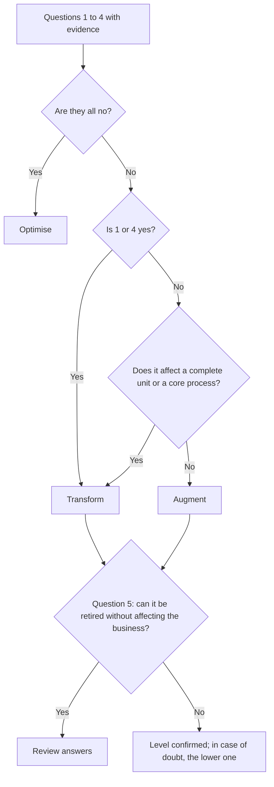

# Ambition levels

**Optimise, Augment and Transform: three types of bet with different cost, risk, timescale and resistance, and how to tell them apart with evidence**

| | |
|---|---|
| Document | Document 01 · Ambition levels |
| Version | 0.1 |
| Date | 17-09-2026 |
| Author | Fernando García · SEACHAD |
| Status | Under construction. The current classification rules are in SEVEN-G document 12. |
| Type | Methodology concept |

<!-- cifras: 3 | ambition levels ; 5 | classification questions ; 1 | level per initiative ; 3 | different progression criteria -->

---

> **Legal notice and disclaimer.** SPHERES is a reference methodology provided "as is" and for information purposes only. It does not constitute legal, regulatory, financial or professional advice, nor does it guarantee compliance with any law or standard. **Each organisation that uses SPHERES is solely responsible for identifying the regulation that applies to it, verifying that it is current and certifying its own regulatory compliance**, with the appropriate qualified advice. The author and SEACHAD accept no liability for any use made of this content or for any decisions taken on the basis of it. The data, figures, companies and cases in the examples are fictitious or illustrative.

## 1. Purpose

This document explains the **three ambition levels** of SPHERES: what each one means, what changes in the organisation, where its value lies, what risks it carries, how it is decided and how it is recognised with evidence. It also explains how to classify an initiative and what the most common mistakes are.

The levels apply to spheres **01 to 07**. Spheres 08 and 09 are assessed with their own grades (document 04).

---

## 2. What an ambition level is

An ambition level describes **what an AI initiative changes in the business**. It does not describe the technology it uses, what it costs or how novel it appears.

<!-- figura: niveles -->

The same technology can serve different levels. A generative AI agent that drafts responses for the customer service team is **Optimise**: the service and the job are the same. A classical statistical model that makes it possible to launch pay-per-kilometre insurance is **Transform**: the customer receives an offering that did not exist before.

> **Why it matters.** If the level were assigned according to the technology, any programme with generative AI would be presented as a transformation and the portfolio would look much more ambitious than it is. Defining the level by its effect on the business is what enables the board to know whether the company is transforming or only becoming more efficient.

---

## 3. Optimise

**Definition.** Doing what is already done, faster, more cheaply or with fewer errors. What is done and who does it do not change.

| Aspect | Description |
|---|---|
| **What changes** | The efficiency of a task or a process. |
| **Where the value lies** | Mainly in avoided cost, cycle time and error reduction. |
| **Uncertainty** | Low: the starting situation is known and the effect can be compared. |
| **Organisational resistance** | Low or localised in the teams affected. |
| **How it is decided** | Area management, within the approved portfolio framework. |
| **Criterion for proceeding** | Positive annual net benefit within the horizon set by management. |
| **If it is retired** | The company goes back to doing the same thing with the previous cost and time. |

**Illustrative examples**

| Sphere | Example | Why it is Optimise |
|---|---|---|
| 01 · Customer | Automatic classification and routing of the enquiries that arrive by email. | The customer receives the same service; the assignment time is reduced. |
| 02 · Product and service | Automated testing that detects defects before launch. | The product is the same; it is produced at lower cost and with fewer failures. |
| 03 · People | Automatic generation of periodic reports that used to be produced by hand. | The job is the same; low-value work disappears. |
| 04 · Operations | Automatic reading of invoices and reconciliation with orders. | The process is the same; the unit cost and the error rate fall. |
| 05 · Data | Detection and removal of duplicate customer records. | Existing data is managed better and with less effort. |

**Risks specific to Optimise**

- **Counting released hours as savings.** If the released time is not converted into actual lower cost or an explicit reassignment, the savings do not exist in the income statement.
- **Shifting the bottleneck.** Automating an isolated step speeds up the queue for the next step without improving the process as a whole.
- **Accumulating invisible dependencies.** Many small automations end up supporting critical processes without anyone having decided so.

> **Why it matters.** Optimise is the natural entry point to AI and usually funds everything else. But a portfolio made up only of Optimise produces a more efficient company with the same business model, exposed to a competitor using AI to change the rules of the market.

---

## 4. Augment

**Definition.** People do what they could not do before. Human work does not disappear: it is extended and the role changes.

| Aspect | Description |
|---|---|
| **What changes** | The role, the capabilities and sometimes the design of a complete process. The business model does not change. |
| **Where the value lies** | Combined: cost and performance (productivity, quality, conversion, decision quality). |
| **Uncertainty** | Medium: the value depends on people genuinely adopting the new way of working. |
| **Organisational resistance** | Medium: it requires changes in habits, training and sometimes the job description. |
| **How it is decided** | Management, with visibility for the AI committee. |
| **Criterion for proceeding** | Actual adoption and performance improvement measured against the starting situation. |
| **If it is retired** | People lose a capability that is already part of their work. |

**Illustrative examples**

| Sphere | Example | Why it is Augment |
|---|---|---|
| 01 · Customer | Before each visit, account managers receive an analysis of each customer's likely needs and churn risk. | They hold a sales conversation that they could not prepare before. |
| 03 · People | A copilot enables risk analysts to review complex transactions that they previously referred to specialists. | The content of the job changes; the business is the same. |
| 04 · Operations | Planners simulate demand and supply scenarios before deciding. | They decide with an analytical capability they did not have. |
| 06 · Knowledge | An internal legal assistant gives business teams access to criteria that only the experts knew. | People access expert knowledge they did not have before. |
| 07 · Decision | The system presents options with their risk and probability, and a person chooses and keeps a record. | How decisions are made changes, without delegating the decision. |

**Risks specific to Augment**

- **Measuring licences instead of usage.** Rolling out a copilot to the whole workforce does not augment anyone if it is not used or is used for the same things as before.
- **Neglecting training and change management.** Without them, adoption stalls and the investment remains a cost.
- **Not updating the role.** If the job is still described, assessed and remunerated as before, people go back to the previous way of working.

> **Why it matters.** Augment is the level at which most value is lost silently. The technology works, but the value depends on people, and that value does not materialise if actual adoption is not measured and work is not redesigned. It is also the level that best protects the culture, because it treats people as beneficiaries and not only as a cost.

---

## 5. Transform

**Definition.** What the company offers, how it competes or how it is organised changes fundamentally. It has the greatest potential and the greatest risk.

| Aspect | Description |
|---|---|
| **What changes** | The value proposition, the revenue model or the operating model. |
| **Where the value lies** | Mainly in new revenue, new markets and changes to the operating model. |
| **Uncertainty** | High: it depends on the market, the customer or the organisation itself. |
| **Organisational resistance** | High: it affects structures, incentives and decision-making power. |
| **How it is decided** | Explicit decision of the board or senior management. |
| **Criterion for proceeding** | Learning milestones, investment limit per stage and market evidence. |
| **If it is retired** | An offering, a channel or a way of organising is lost. |

**Illustrative examples**

| Sphere | Example | Why it is Transform |
|---|---|---|
| 01 · Customer | An AI agent becomes the main point of contact with the customer, with handover to people in defined cases. | How the company relates to its customers changes. |
| 02 · Product and service | A machinery manufacturer stops selling only equipment and sells guaranteed operating hours thanks to predictive maintenance. | What is sold and how it is charged for changes. |
| 03 · People | The planning function is reorganised: a system allocates resources under oversight and planners manage exceptions. | The structure and the division of work in a complete unit change. |
| 05 · Data | Aggregated and anonymised operational data is offered as an information service to third parties. | Data generates a revenue line that did not exist. |
| 07 · Decision | The pricing function is reorganised: prices across the whole catalogue are set autonomously within approved limits and the pricing team moves on to designing and overseeing the rules. | The process and roles of an entire unit change: who decides and how decision-making is organised. |

**Risks specific to Transform**

- **Calling an automation with a good narrative a transformation.** This is the most expensive mistake: transformation budgets and timescales are approved for something that does not change the business.
- **Demanding a return too soon.** Measuring a Transform bet against the payback period of an automation stops it before it can provide market evidence.
- **Underestimating the enablers.** Transforming Customer or Product without sufficient data, knowledge and decision rules is a sign of risk, not of boldness.
- **Ignoring the effect on people.** Transformations change roles and structures; deciding them without an explicit position from management generates rejection and reputational risk.

> **Why it matters.** Transform is the only level that changes the company's competitive position. That is why it must be decided by whoever is accountable for the strategy, with stage-based progression criteria and with explicit acceptance that some bets will fail. Without that differentiated treatment, Transform bets are either never approved or approved without control.

---

## 6. Comparison of the three levels

| Aspect | Optimise | Augment | Transform |
|---|---|---|---|
| **Key question** | Do we do it better? | Can we do more? | Do we do something different? |
| **What changes** | Efficiency of a task or process | Role and capabilities of people | Value proposition, revenue or organisation |
| **Value** | Avoided cost | Cost and performance | New revenue and operating model |
| **Relative investment** | Lower | Medium | Higher and in stages |
| **Uncertainty** | Low | Medium | High |
| **Organisational resistance** | Low or localised | Medium | High |
| **Time to evidence** | Short | Medium: depends on adoption | Long: depends on the market |
| **Who decides** | Area management | Management, with the AI committee | Board or senior management |
| **What measures progress** | Net benefit | Adoption and performance | Learning milestones and market evidence |
| **Common mistake** | Counting released capacity as savings | Measuring licences instead of usage | Calling an automation a transformation |

---

## 7. Not a ladder

Ambition levels **do not describe the maturity** of the company or a mandatory path.

| Misconception | Reality |
|---|---|
| "You have to optimise first and transform afterwards." | A company can start with a Transform bet in Product while optimising Operations. What matters is that it has sufficient enabling capability. |
| "Transform is better than Optimise." | They are different bets. In a non-priority sphere, Optimise may be exactly the right ambition. |
| "A mature company has everything in Transform." | A healthy portfolio combines the three levels according to the strategy. Maturity is measured with other criteria (SEVEN-G document 11). |
| "If the project is large, it is Transform." | The amount of investment does not determine the level. A large automation is still Optimise. |

> **Why it matters.** If the levels were understood as a ladder, each area would try to move up a level to appear more advanced and the classification would lose all its value as information for the board. Treating the levels as types of bet makes it possible to decide the right combination for each sphere.

---

## 8. How to classify an initiative

Classification is carried out with **five questions** answered yes or no, always with evidence. A yes without evidence counts as no.

| # | Question | Points to |
|---|---|---|
| 1 | Does the value proposition received by the customer or end user change? | Transform |
| 2 | Is the process redesigned end to end, and not just a task within the process? | Augment or Transform |
| 3 | Do roles, the organisational structure or who takes which decisions change? | Augment or Transform |
| 4 | Does it generate revenue, services or markets that did not exist? | Transform |
| 5 | Could it be retired without affecting the business model, simply returning to the previous cost? | Optimise |

Basic reading rules:

- If questions 1 to 4 are **no**, the initiative is **Optimise**, however it has been presented.
- If question 1 or 4 is **yes**, the initiative is **Transform**.
- If question 2 or 3 is **yes**, the initiative is **Augment**, unless the change affects a complete organisational unit or a core business process, in which case it is **Transform**.
- Question 5 serves as a **cross-check**: if an initiative classified as Augment or Transform could be retired with no consequence other than returning to the previous cost, the answers must be reviewed.
- **In case of reasonable doubt, the lower level is assigned**, and whoever proposes the higher level provides the evidence.

<!-- grafico: Quick classification | The questions are answered with evidence and the result is cross-checked with question 5 -->

The full rules, the cross-check cases and who classifies, confirms and reviews the level are in [SEVEN-G 12 · Transformation index](../../../SEVEN-G/html/en/12_SEVEN-G_Indice_de_transformacion.html), section 3. In SEVEN-G the level is proposed when the initiative is registered, confirmed before investing in building it and checked with evidence once the initiative is producing results.

> **Why it matters.** Five questions with evidence replace opinion. Two areas that present similar initiatives obtain the same level, and the board can trust that the map describes reality and not the enthusiasm of each sponsor.

---

## 9. Borderline cases

*Generic and illustrative examples.*

| Case | Level | Reasoning |
|---|---|---|
| Licences for an AI assistant for the whole workforce, without an adoption plan. | **Optimise** | No role or process changes demonstrably (questions 2 and 3: no). |
| The same assistant, with a redesign of the functions of an analysis team that takes on reviews it previously outsourced. | **Augment** | The content of the jobs changes (question 3: yes). |
| Agent-based automation of a complete back-office process, with fewer people doing the same thing. | **Optimise** | Reducing the number of people doing the same thing is not a change of role. If the process is redesigned but the roles do not change, it would be Augment. |
| AI-driven dynamic pricing within current tariffs. | **Augment** | The decision passes to a system under oversight (question 3: yes), but the customer receives the same offering. |
| Personalised usage-based pricing that the customer chooses as a new option. | **Transform** | The customer receives a new form of pricing (question 1: yes). |
| Common data platform for several initiatives. | **Optimise** by default | It is classified by its own effect; it does not inherit the ambition of the initiatives it enables. |
| Exploratory pilot of a new service. | According to what would change at scale | It is classified by its hypothesis; the actual level is checked with evidence. |
| Initiative with an Optimise component and a Transform component. | **It is split** or classified by the component that accounts for more than half of the investment | Levels are not averaged. |

---

## 10. The ambition of a sphere and portfolio balance

In addition to classifying initiatives, management sets a **target ambition for each sphere** from 01 to 07. That ambition is not assigned by opinion: it is expressed through the initiatives that deliver it.

| Concept | What it is | Illustrative example |
|---|---|---|
| **Level achieved** | The highest level with at least one initiative in production and measured value. | In Customer, Optimise: there is an enquiry router with validated savings. |
| **Level in the portfolio** | The highest level with any initiative approved for building. | In Customer, Augment: an assistant for account managers has been approved. |
| **Target ambition** | The level that management wants for the sphere within the horizon of its strategy. | In Customer, Augment. |
| **Gap** | The target ambition has no approved initiative delivering it. | In Data, an Augment target and no approved initiative at that level. |

A balanced portfolio does **not** spread investment equally across levels. It reflects the strategy: plenty of efficiency where the company competes on cost, Augment bets where talent is the advantage and some Transform bet, bounded and in stages, where the company wants to change its position. Setting and approving the ambition by sphere is described in [SEVEN-G 13 · AI thesis, ambition and risk appetite](../../../SEVEN-G/html/en/13_SEVEN-G_Tesis_de_IA_ambicion_y_apetito_de_riesgo.html).

> **Why it matters.** The question "are we transforming?" can only be answered by comparing the declared ambition with what the portfolio actually delivers. That comparison, sphere by sphere, is what makes it possible to detect declared but unevidenced transformation.

---

## 11. Common mistakes

| Mistake | Consequence | How to avoid it |
|---|---|---|
| Classifying by technology ("it uses agents, so it is Transform"). | A portfolio that looks ambitious with no real change. | Apply the five questions with evidence. |
| Classifying by the amount or by the visibility of the programme. | Transformation criteria are applied to expensive automations. | Remember that the amount does not determine the level. |
| Moving up a level to obtain funding. | The board approves expectations that will not be met. | Independent review of the level and subsequent checking with evidence. |
| Applying the same return criterion to all initiatives. | Transform bets are stopped before they learn. | Different progression criteria by level. |
| Counting released hours as savings in Optimise. | Savings that do not appear in the income statement. | Distinguish released, realised and reassigned capacity. |
| Measuring the success of Augment by assigned licences. | Investment without any change in the way of working. | Measure active usage and performance improvement. |
| Setting the ambition of a sphere without looking at the enablers. | Promises that the data or the decision rules cannot sustain. | Read document 03 before setting a high ambition. |

---

## 12. Related documents

| Document | Relationship |
|---|---|
| **document 00 · What SPHERES is and how it helps** | Overview of the map and the levels. |
| **document 02 · Spheres where value is created** | Examples by level in Customer, Product and service, People and Operations. |
| **document 03 · Enabling spheres** | Examples by level in Data, Knowledge and Decision. |
| **document 04 · Regulation and AI governance** | Why spheres 08 and 09 do not use ambition levels. |
| [SEVEN-G 10 · Sphere map and ambition levels](../../../SEVEN-G/html/en/10_SEVEN-G_Mapa_de_esferas_y_niveles_de_ambicion.html) | Sphere and level rules, indicators and heat map. |
| [SEVEN-G 12 · Transformation index](../../../SEVEN-G/html/en/12_SEVEN-G_Indice_de_transformacion.html) | Full classification rules and the company's transformation profile. |

---

## 13. Version control

| Version | Date | Changes |
|---|---|---|
| 0.1 | 17-09-2026 | First version. Develops the three ambition levels with definition, value, risks, examples by sphere, comparison, classification with five questions, borderline cases, ambition by sphere and common mistakes. |
