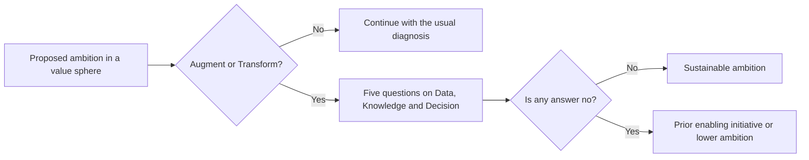

# Enabling spheres

**Data, Knowledge and Decision: why they condition all the value of AI, examples by ambition level and how to diagnose actual capability**

| | |
|---|---|
| Document | Document 03 · Enabling spheres |
| Version | 0.1 |
| Date | 17-09-2026 |
| Author | Fernando García Varela |
| Status | Under construction. The indicators with formulas for these spheres are in SEVEN-G document 10. |
| Type | Methodology spheres |

<!-- cifras: 3 | enabling spheres ; 4 | autonomy levels ; 12 | questions for the board ; 5 | diagnostic questions -->

---

> **Legal notice and disclaimer.** SPHERES is a reference methodology provided "as is" and for information purposes only. It does not constitute legal, regulatory, financial or professional advice, nor does it guarantee compliance with any law or standard. References to general regulation (such as the GDPR) may be incomplete, may not apply to a particular case or may become out of date. **Each organisation that uses SPHERES is solely responsible for identifying the regulation that applies to it, verifying that it is current and certifying its own regulatory compliance**, with the appropriate qualified advice. The author accepts no liability for any use made of this content or for any decisions taken on the basis of it. The data, figures, companies and cases in the examples are fictitious or illustrative.

## 1. What the enabling spheres are

Spheres **05 Data, 06 Knowledge and 07 Decision** do not create value in themselves: they **make possible or impossible** the value of spheres 01 to 04.

| Sphere | What it enables | What happens if it fails |
|---|---|---|
| **05 · Data** | AI systems have raw material that is available, reliable and legitimately usable. | Initiatives are delayed, stopped or run on data they should not use. |
| **06 · Knowledge** | What the organisation knows is accessible and does not depend on a few people. | Assistants give poor answers, and critical know-how is lost when someone leaves. |
| **07 · Decision** | It is clear what AI decides, what a person validates and what is never delegated. | Delegation happens by default, without real oversight or traceability. |

It is in these spheres **that the uncomfortable questions arise**. Talking about opportunities in Customer or in Product is easy; acknowledging that nobody knows what data the company has, that critical knowledge is in the heads of three people or that a system already sets prices without anyone having decided it, is not.

> **Why it matters.** An ambition to Transform in a value sphere without sufficient capability in Data, Knowledge and Decision **is a sign of risk, not of boldness**. Most delays and failures of AI initiatives are not due to the model, but to unavailable data, undocumented knowledge or decisions without rules. Diagnosing the enablers before setting the ambition avoids promising what the organisation cannot sustain.

### When an enabler is the primary sphere

The fact that an initiative **uses** data, knowledge or decisions does not place it in these spheres: almost all AI initiatives use them. An enabler is the **primary sphere** only when the main outcome of the initiative is **the enabling capability itself**.

| Initiative (illustrative) | Primary sphere | Reason |
|---|---|---|
| Common data platform for several AI use cases. | 05 · Data | The outcome is the capability; the value of the use cases that use it is allocated to those use cases. |
| Product recommender that uses behavioural data. | 01 · Customer | The main metric is conversion, even though it depends on the data. |
| Legal knowledge base that the whole company can query. | 06 · Knowledge | The outcome is access to knowledge. |
| System that defines and records which credit decisions a model may make and which are reviewed by a person. | 07 · Decision | The outcome is the decision system and its traceability. |

---

## 2. Sphere 05 · Data

**Motto:** the material substrate of all AI.

### What it is

The Data sphere brings together the **availability, quality, cataloguing, lineage, legal basis and architecture** of the data used by AI systems, and **data as a product**.

> **Why it matters.** Without adequate data, no AI system works well, however good the model. And without a documented legal basis, a system that works can become a regulatory and reputational problem. The most useful question a board can ask about AI is not technical: it is whether the company knows what data it has, where it is, who is accountable for its quality and whether it can legally use it for AI.

### What it covers and what it does not

| Covers | Does not cover |
|---|---|
| Inventory and catalogue of the data used by AI systems. | The use of data for a specific business purpose: that is the sphere of that purpose (01 to 04). |
| Quality, quality monitoring and data drift. | Data protection as a regulatory obligation: it is assessed in sphere 08. |
| Lineage: where the data used by each system to make decisions comes from. | |
| Legal basis and conditions of use of data for AI. | |
| Synthetic data, enrichment with external sources and natural-language queries. | |
| Data as a product or service. | |

### Examples by ambition level

| Level | Examples | What distinguishes it |
|---|---|---|
| **Optimise** | Cleansing, standardisation and deduplication · Cataloguing with AI-generated metadata and automated lineage · Continuous monitoring of quality and drift. | Existing data is managed better and with less effort. |
| **Augment** | Synthetic data where real data is scarce · Enrichment with external sources · Natural-language data queries by any authorised employee. | More people can use more data to make decisions. |
| **Transform** | Data turned into a product or service · Distributed, domain-governed data architecture · Living representation of operations fed in real time. | Data changes the business model or the operating model. |

### Illustrative case

*Fictitious regional insurance company.*

Management approves three Customer initiatives: a churn risk model, a coverage recommender and an assistant for sales agents. Four months later, all three are stalled in the same phase. The reason is not technical: data on customer interactions is spread across four systems, has no owner, and nobody has confirmed whether the consent under which it was obtained allows it to be used for these purposes. The company decides to open an initiative with **Data** as the primary sphere (**Optimise** level): a catalogue of customer data with an owner, quality rules and a documented legal basis for each use. Only when that initiative reaches its first milestone are the Customer initiatives resumed. At the next review, the board sets **Augment** as the ambition for the Data sphere and asks for a quarterly indicator of initiatives blocked by data.

### Questions for the board

- Do we know what data we have, where it is, who is accountable for its quality and whether we can legally use it for AI?
- How many initiatives are delayed or stopped for lack of data?
- Have we documented where the data used by each system in production to make decisions comes from?
- Is our data an advantage that a competitor cannot replicate?

### Warning signs

- Initiatives that reach the build phase without having confirmed access to the data.
- Personal data used to train or feed systems without a documented legal basis.
- Critical datasets without an identified owner.
- Systems in production without data and model lineage.

### How it is measured

The reference indicators are catalogue coverage, quality of critical data, documented legal basis, documented lineage, time to data access and initiatives blocked by data. Their formulas are in [SEVEN-G 10 · Sphere map and ambition levels](../../../SEVEN-G/html/en/10_SEVEN-G_Mapa_de_esferas_y_niveles_de_ambicion.html), section 5.5, and their governance in [SEVEN-G 51 · Data and knowledge for AI](../../../SEVEN-G/html/en/51_SEVEN-G_Datos_y_conocimiento.html).

---

## 3. Sphere 06 · Knowledge

**Motto:** organisational memory and collective intelligence.

### What it is

The Knowledge sphere brings together the organisation's **documented and tacit knowledge**, its **memory**, the search for and reuse of what is already known, **domain-specialised assistants** and the organisation's ability to **learn** from what it does and decides.

The difference from the Data sphere is one of nature: data records facts; knowledge explains **how things are done, why something was decided and what worked or failed**.

> **Why it matters.** A decisive part of what a company knows is not written down anywhere: it lies with its most experienced people. If the people who know the most left tomorrow, what would be lost? AI can narrow that gap by capturing that knowledge and making it accessible, but **only if work begins before they leave**. Moreover, generative AI assistants answer with whatever they find: if knowledge is disorganised or outdated, they give poor answers with complete confidence.

### What it covers and what it does not

| Covers | Does not cover |
|---|---|
| Internal documentation, procedures and criteria. | Structured operational data: that is sphere 05. |
| Experts' tacit knowledge and its capture. | Training of people as an individual capability: that is sphere 03. |
| Semantic search and domain knowledge assistants. | |
| Memory of decisions, projects and lessons learned. | |
| Currency and accuracy of the sources that feed AI systems. | |
| Access control over confidential information through assistants. | |

### Examples by ambition level

| Level | Examples | What distinguishes it |
|---|---|---|
| **Optimise** | Semantic search over internal documentation · FAQ bases updated with AI · Meeting transcription and summarisation with a record of decisions. | What was already written is found sooner. |
| **Augment** | Capture of experts' tacit knowledge · Domain knowledge assistants (legal, technical, regulatory, product) · Detection of patterns of success and failure in previous projects. | People access expert knowledge they did not have before. |
| **Transform** | The organisation's knowledge as an active system that proposes and does not merely respond · Proprietary knowledge as a competitive advantage that is hard to replicate · The company retains what it has done, decided and learned. | Knowledge changes how the company competes or is organised. |

### Illustrative case

*Fictitious engineering firm specialising in industrial installations.*

The company identifies that the design of one type of installation depends on two engineers close to retirement. It launches an **Augment** initiative in Knowledge: structured sessions in which an assistant interviews the experts about real design decisions, contrasts them with archived projects and builds a base of criteria reviewed by the experts themselves. The result is an assistant that younger engineers consult before each design. Management sets two conditions: that a sample of the answers be reviewed by experts every quarter to measure their accuracy, and that the assistant respect the access permissions for each customer's projects.

### Questions for the board

- How much critical knowledge depends on a few people and is not available to the organisation?
- If the people who know the most left tomorrow, what would be lost? Are we beginning to capture it in time?
- Are the answers from our knowledge assistants reliable, and who verifies them?
- Do we learn from what we have decided and done, or do we repeat mistakes?

### Warning signs

- Knowledge assistants without an assessment of the accuracy of their answers.
- Outdated documentation feeding generative AI systems.
- Critical domains that depend on one or two people without a capture plan.
- Access to confidential information through assistants without permission controls.

### How it is measured

The reference indicators are coverage of critical knowledge, knowledge concentration in a few people, verified accuracy of assistants, useful resolution, currency of sources and time to autonomy of new joiners. Their formulas are in [SEVEN-G 10](../../../SEVEN-G/html/en/10_SEVEN-G_Mapa_de_esferas_y_niveles_de_ambicion.html), section 5.6.

---

## 4. Sphere 07 · Decision

**Motto:** who decides, with what information and with how much delegation.

### What it is

The Decision sphere brings together **which decisions AI systems make, recommend or execute**, with what information, at what **autonomy level**, with what **human oversight** and with what **traceability**.

> **Why it matters.** Every time an AI system recommends or executes something, a decision is being shared between people and machines. If the company has not defined what AI decides on its own, what requires human validation and what is never delegated, **it is delegating by default**. And when something goes wrong, nobody can reconstruct what the system recommended, what the person decided and why.

### The four autonomy levels

SPHERES uses the SEVEN-G autonomy scale to describe how much is delegated in each type of decision:

| Level | Name | What the system does | What the person does | Illustrative example |
|---|---|---|---|---|
| **A0** | Assistance | Informs, summarises or generates content. | Decides and executes. | Summary of a case file before the analyst reviews it. |
| **A1** | Recommendation | Proposes a specific decision or action. | Validates each action before it is executed. | Discount proposal that the account manager approves or rejects. |
| **A2** | Supervised action | Executes actions within defined limits. | Oversees, can interrupt and reviews afterwards. | Automatic stock replenishment with a daily review of exceptions. |
| **A3** | Autonomous action | Executes sequences of actions without individual review within strict limits. | Sets limits, oversees aggregates and has a kill switch. | Continuous price adjustment of a catalogue within an approved band. |

The autonomy level **is not the same as the ambition level**. An A0 system that only summarises information can be part of a Transform bet. Conversely, moving a decision that a person used to make to an A2 or A3 system changes who decides, and that points at least to Augment (document 01, section 8, question 3).

> **Why it matters.** Assigning an autonomy level to each type of decision turns an abstract discussion about "trusting AI" into a specific rule that can be approved, overseen and audited. It is also the basis for knowing which systems need a kill switch and who can activate it.

### What it covers and what it does not

| Covers | Does not cover |
|---|---|
| Inventory of the decision types in which AI is involved. | The business outcome of each decision: that is the sphere of that outcome (01 to 04). |
| Autonomy level assigned to each decision type. | Legal obligations regarding automated decisions: they are assessed in sphere 08. |
| Human oversight, override and escalation. | |
| Traceability of what the system recommended and what the person decided. | |
| Kill switches and action limits. | |
| Quality and speed of assisted decisions. | |

### Examples by ambition level

| Level | Examples | What distinguishes it |
|---|---|---|
| **Optimise** | Dashboards that prioritise relevant information · Predictive alerts before an indicator deteriorates · Automation of low-risk, high-frequency decisions. | The same decisions, with less effort or sooner. |
| **Augment** | Options with risk and probability analysis from which a person chooses · Scenario simulation · Traceability of what AI recommended and what the person decided. | Decision-makers have analytical capabilities they did not have. |
| **Transform** | Autonomous decisions in bounded domains (dynamic pricing, resource allocation) · Coordination of decisions between systems with aggregate oversight · Executives who oversee decision systems instead of deciding each case. | Who decides and how decision-making is organised change. |

### Illustrative case

*Fictitious logistics operator.*

In its first diagnosis, the operator discovers that a route allocation system installed as a "support tool" has been executing route changes without review for months: in practice it works as A2, but nobody has decided this and there are no written limits. The override rate by traffic managers is practically zero, which management interpreted as success. On analysis, it turns out that traffic managers have no simple way to override a decision. The company defines the decision types in writing, assigns A2 with limits (maximum diversion distance, priority customers excluded), enables a kill switch with a designated owner and records every recommendation and every override. The override rate first rises and then stabilises within a band that the AI Product Owner considers reasonable.

### Questions for the board

- What does AI decide on its own, what requires human validation and what is never delegated? If we have not defined this, we are delegating by default.
- Can we reconstruct what the system recommended and what the person decided in each relevant decision?
- Which systems act with A2 or A3 autonomy, and who can stop them?
- Are decisions improving with AI, or are they just being made faster?

### Warning signs

- Systems that execute actions without an assigned autonomy level or a kill switch.
- A human override rate close to zero for months: it may indicate nominal oversight.
- A very high override rate: the system is not calibrated or is not trusted.
- Decisions with significant effects on people without meaningful human review.

### How it is measured

The reference indicators are decisions with assigned autonomy, decision traceability, human override rate, tested kill switches, improvement in decision quality and decision latency. Their formulas are in [SEVEN-G 10](../../../SEVEN-G/html/en/10_SEVEN-G_Mapa_de_esferas_y_niveles_de_ambicion.html), section 5.7, and the security of systems that act in [SEVEN-G 35 · AI and agent security](../../../SEVEN-G/html/en/35_SEVEN-G_Seguridad_de_IA_y_agentes.html).

---

## 5. Quick diagnosis of the enablers

Before setting an ambition to Augment or Transform in any value sphere, it is advisable to answer five questions. They do not replace a full diagnosis, but they detect the most frequent blockers.

| # | Question | Sphere | If the answer is no |
|---|---|---|---|
| 1 | Has the data the ambition requires been identified, with an owner and a legal basis? | 05 | Open a Data initiative first or reduce the ambition. |
| 2 | Has the quality of that data been checked on a real sample? | 05 | Set quality thresholds and measure them before building. |
| 3 | Is the knowledge on which the initiative depends documented and accessible? | 06 | Capture the critical knowledge and assign who verifies the answers. |
| 4 | Has it been defined which decisions the system will make or recommend and at what autonomy level? | 07 | Define decision types, A0–A3 level and oversight before deploying. |
| 5 | Can what the system does be reconstructed and, if necessary, stopped? | 07 | Design traceability and a kill switch as requirements, not as enhancements. |

<!-- grafico: Consistency between ambition and enablers | A high ambition in a value sphere is checked against the actual capability of the enablers -->

> **Why it matters.** This diagnosis is cheap and quick, and it avoids the most costly mistake in AI portfolios: approving ambitious initiatives that are stopped months later for reasons that could have been known from day one.

---

## 6. Related documents

| Document | Relationship |
|---|---|
| **document 00 · What SPHERES is and how it helps** | Presentation of the complete map. |
| **document 01 · Ambition levels** | Difference between ambition level and autonomy level. |
| **document 02 · Spheres where value is created** | The spheres whose value depends on these. |
| **document 04 · Regulation and AI governance** | Data protection and automated decisions as an obligation (sphere 08). |
| [SEVEN-G 10 · Sphere map and ambition levels](../../../SEVEN-G/html/en/10_SEVEN-G_Mapa_de_esferas_y_niveles_de_ambicion.html) | Classification rules and indicators with formulas. |
| [SEVEN-G 51 · Data and knowledge for AI](../../../SEVEN-G/html/en/51_SEVEN-G_Datos_y_conocimiento.html) | Governance and preparation of data and knowledge for AI. |
| [SEVEN-G 35 · AI and agent security](../../../SEVEN-G/html/en/35_SEVEN-G_Seguridad_de_IA_y_agentes.html) | Autonomy levels and controls for systems that act. |

---

## 7. Version control

| Version | Date | Changes |
|---|---|---|
| 0.1 | 17-09-2026 | First version. Develops spheres 05 to 07 with what they are, why they matter, when they are the primary sphere, scope, examples by level, illustrative cases, questions for the board, warning signs and measurement; includes the A0–A3 autonomy levels and a quick five-question diagnosis. |
