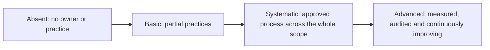

# Regulation and AI governance

**Spheres 08 and 09: the boundaries within which AI is used and the system that connects the other eight, assessed by dimensions and grades rather than by ambition levels**

| | |
|---|---|
| Document | Document 04 · Regulation and AI governance |
| Version | 0.1 |
| Date | 17-09-2026 |
| Author | Fernando García · SEACHAD |
| Status | Under construction. The grades, indicators and rules in force are in SEVEN-G document 10. |
| Type | Methodology spheres |

<!-- cifras: 2 | spheres with their own grades ; 6 | dimensions ; 4 | grades ; 3 | ways of obtaining capabilities -->

---

> **Legal notice and disclaimer.** SPHERES is a reference methodology provided "as is" and for information purposes only. It does not constitute legal, regulatory, financial or professional advice, nor does it guarantee compliance with any law or standard. References to general regulation (such as the EU AI Act, the GDPR or Spain's LOPDGDD) and to regulation specific to each sector or jurisdiction may be incomplete, may not apply to a particular case or may become out of date as a result of regulatory changes, interpretations or supervisory positions. **Each organisation that uses SPHERES is solely responsible for identifying the regulation that applies to it, verifying that it is current and certifying its own regulatory compliance**, with the appropriate qualified advice. The author and SEACHAD accept no liability for any use made of this content or for any decisions taken on the basis of it. The data, figures, companies and cases in the examples are fictitious or illustrative.

## 1. Why these two spheres are different

Spheres 01 to 07 describe **where** AI is used and **what makes it possible**. Spheres 08 and 09 describe **within what boundaries** it is used and **how it is governed**.

| Sphere | Role on the map | Reference question for the board |
|---|---|---|
| **08 · Regulation, ethics and accountability** | **The boundaries**: the applicable regulation, the ethical principles the company voluntarily adopts and the chain of accountability when something goes wrong. | Do we govern proactively or do we wait for the regulator to force us? |
| **09 · AI governance** | **The centre**: the meta-sphere that connects the other eight through a structure of accountability, decision-making and oversight. | Does AI have corporate governance with the same formality as finance, risk or compliance? |

That is why they **are not assessed with Optimise, Augment and Transform**. They do not generate value in themselves: they set the conditions for the value of the others to be legitimate, sustainable and controllable. Instead of ambition levels, each one is assessed in **three dimensions** with **four grades**.

> **Why it matters.** If these spheres were measured with ambition levels, phrases such as "Transform regulation" or "Augment governance" would appear, which mean nothing verifiable. Worse still: investment in compliance would be read as a mere efficiency and would lower the profile of the portfolio, or would be used to inflate it. Grades by dimension make it possible to state precisely what capability the company has and what it needs.

---

## 2. The four grades

The grades are common to the six dimensions of spheres 08 and 09.

| Grade | General criterion | Minimum evidence | How it is recognised in practice |
|---|---|---|---|
| **Absent** | There is no defined owner or practice, or they exist only on an ad hoc and undocumented basis. | — | "Each project looks after that." |
| **Basic** | Practices and owners exist, but they depend on specific people or projects and do not cover the whole scope. | Partial documents or records. | There is one person who knows about the subject and some assessments have been carried out, but not for all systems. |
| **Systematic** | Defined, approved process applied to the whole scope, with owners and verifiable evidence. | Approved procedure, complete records, calculated indicators. | Every AI system in the company goes through the same process and leaves evidence. |
| **Advanced** | Systematic, with indicators on target for at least two quarters, continuous improvement and independent review. | Internal or external audit report with no open major nonconformities. | The process works, is measured, is audited and improves. |

<!-- grafico: Progression of the grades | Each grade incorporates the requirements of the previous one -->

Three rules for using the grades properly:

1. **A grade is assigned on the basis of evidence**, not optimistic self-assessment. Without the minimum evidence, the lower grade is assigned.
2. **The grades are not maturity levels of the company.** They serve as evidence for the strategy and governance dimension and the risk, security and compliance dimension of the SEVEN-G maturity model, but do not replace them.
3. **The target is set by dimension.** "Reach Systematic in Compliance and Basic in Ethical leadership within twelve months" is a verifiable target; "improve AI governance" is not.

---

## 3. Sphere 08 · Regulation, ethics and accountability

**Motto:** regulation, principles and chain of accountability.

### What it is

Sphere 08 brings together **the regulatory framework applicable to AI** (general AI and data protection regulation, and sector regulation), **the ethical principles** that the company adopts beyond the legal minimum and **the chain of accountability** when an AI system causes harm or makes a mistake.

> **Why it matters.** The cost of waiting for the regulator to force action is measured in penalties, but above all in **reputation and trust**. A company that discovers in an inspection, in a complaint or in the press that one of its systems was wrongly classified or discriminated against a group loses something that no saving can make up for. Moreover, AI regulation changes quickly: what is good practice today may become an obligation in a short time.

### The three dimensions

| Dimension | What it assesses | Basic grade example | Systematic grade example | Advanced grade example |
|---|---|---|---|---|
| **Compliance** | Classification of systems under the EU AI Act, transparency and human oversight obligations, data protection in automated decision-making and profiling, and sector regulation. | Some systems classified on demand, when a project asks for it. | All inventoried systems are classified; the required assessments are carried out before investing in the build; nonconformities are corrected within the time limit. | All of the above, with indicators on target for two quarters and an audit with no open major nonconformities. |
| **Anticipation** | Monitoring of emerging regulation, impact assessments before deployment and preparation for external audits. | Regulation is followed informally, through the news or advisers. | Monitoring process with an owner; each relevant change has an impact analysis within the time limit; mock audits are carried out. | The company adapts its systems before the obligation becomes applicable and documents this. |
| **Ethical leadership** | Own principles beyond the legal minimum, an ethics body with real veto power and public transparency about the use of AI. | Published principles with no mechanism to apply them. | Principles approved by the board, ethical review of the initiatives that require it and a body with documented veto power. | Periodic public report on the use of AI and recorded veto or modification decisions. |

> **Why it matters.** The three dimensions respond to three different risks. Without **Compliance**, the company is in breach today. Without **Anticipation**, it will be in breach tomorrow and will have to rebuild systems in a hurry. Without **Ethical leadership**, it may comply with the law and still lose the trust of customers, employees and society through uses that are legal but unacceptable.

### What it covers and what it does not

| Covers | Does not cover |
|---|---|
| Regulatory classification of AI systems. | The operational and security risks of each system: they are managed with the SEVEN-G risk methodology. |
| Transparency, human oversight and documentation obligations. | Data quality management: that is sphere 05. |
| Data protection in automated decision-making and profiling. | |
| Applicable sector regulation (for example, in banking, insurance, health or energy). | |
| Regulatory monitoring and impact assessments. | |
| Ethical principles, ethics body and public transparency. | |

**Rule of use on the map.** Sphere 08 is the primary sphere of an initiative **only when its purpose is compliance or ethics** (for example, a system that monitors regulatory changes and assigns them to owners). It is **never** used to indicate that an initiative in another sphere carries regulatory risk: that is recorded in its regulatory classification and in its risk register.

### Illustrative case

*Fictitious financial institution.*

The institution has in production a model that prioritises financing applications and an assistant that answers customers. Neither is classified under the applicable AI regulation; the first could significantly affect people and the second interacts with customers without informing them that it is an AI system. Sphere 08 is diagnosed as follows: **Compliance, Basic** (there is a legal analysis of the assistant, but not of the model); **Anticipation, Absent** (nobody monitors which obligations will become applicable); **Ethical leadership, Basic** (there are published principles, but no body applies them). The board sets as a twelve-month target **Systematic** in Compliance and in Anticipation, and **Basic** in Ethical leadership with a body that has real veto power. The first action is to classify all the systems in the inventory, starting with those that affect decisions about people.

### Questions for the board

| Dimension | Questions |
|---|---|
| **Compliance** | Are all our AI systems classified? Could any of them be a prohibited or high-risk practice without our knowing it? Who signs off that classification? |
| **Anticipation** | Which obligations will apply to us in the coming years, and which systems do they affect? Are we prepared for an external AI audit? |
| **Ethical leadership** | Do we have our own principles that go beyond the law? Is there anyone with real power to say no to an initiative that is profitable but inappropriate? |

### Warning signs

- Systems in production pending regulatory classification beyond the approved time limit.
- Impact assessments carried out after go-live.
- Ethics committee with no decision recorded in a year.
- Detected use of unauthorised AI tools that has not been regularised.

### How it is measured

The reference indicators are classified systems, required assessments completed on time, overdue regulatory nonconformities, timely analysis of regulatory changes, early adaptation, unauthorised use regularised, ethical review applied, effective veto power and public transparency. Their formulas are in [SEVEN-G 10 · Sphere map and ambition levels](../../../SEVEN-G/html/en/10_SEVEN-G_Mapa_de_esferas_y_niveles_de_ambicion.html), section 6. The specific obligations are analysed in [SEVEN-G 34 · Regulatory mapping](../../../SEVEN-G/html/en/34_SEVEN-G_Mapeo_regulatorio.html) and the corporate policy in [SEVEN-G 31 · Corporate AI policy and acceptable use policy](../../../SEVEN-G/html/en/31_SEVEN-G_Politica_corporativa_y_uso_aceptable.html).

---

## 4. Sphere 09 · AI governance

**Motto:** the sphere that connects the other eight.

### What it is

Sphere 09 is the **meta-sphere**. It brings together **ultimate accountability for AI**, the bodies that decide and oversee, portfolio management, decision gates, reporting to the board, the **balance between speed and control** and the relationship with **AI suppliers**.

> **Why it matters.** The other eight spheres may be well analysed and, even so, nothing happens if nobody is accountable for deciding, prioritising, overseeing and stopping. AI needs corporate governance with the **same formality as finance, audit or compliance**: designated owners, decision rules, regular reporting and a real ability to change course. Without it, AI grows through an accumulation of projects and nobody is accountable for the whole.

### The three dimensions

| Dimension | What it assesses | Basic grade example | Systematic grade example | Advanced grade example |
|---|---|---|---|---|
| **Structure** | Who has ultimate accountability for the AI strategy, whether there is a framework that connects it with the business strategy, whether there is a portfolio prioritised by impact and risk and whether the board receives regular and understandable information. | Designated owner; the portfolio is a list of projects. | AI thesis and risk appetite approved; AI Committee operational; initiative register with roles and decision gates; quarterly reporting to the board. | All of the above, with the board's recommendations up to date and a complete annual review of the strategy. |
| **Balance between speed and control** | Whether the company is accelerating adoption with risk under control, whether there are decision gates in the lifecycle, how it measures its maturity and whether it can stop an initiative that is not working. | Some controls, applied unevenly. | Decision gates with independent validation in all initiatives; control intensity proportionate to risk; decision time limits measured; stops and retirements recorded. | Decision times within time limits without an increase in incidents; annual calibration of time limits and thresholds. |
| **Supplier ecosystem** | Whether the company depends on a single model supplier, whether it assesses build, buy or partner for each capability, whether contracts protect its data and intellectual property and whether it understands the cost structure of AI. | Known suppliers, without consistent assessment. | Supplier register with requirement level; minimum contractual clauses; AI cost known by category and by use case. | Tested exit strategy for critical suppliers and concentration within risk appetite. |

> **Why it matters.** The three dimensions prevent three different governance failures. Without **Structure**, nobody is accountable. Without **Balance between speed and control**, governance either holds everything back, and teams bypass it, or controls nothing. Without governance of the **Supplier ecosystem**, the company discovers too late that it depends on a third party that sets the price, the conditions and the use of its data.

### Build, buy or partner

One of the most frequent decisions in the Ecosystem dimension is how to obtain each AI capability:

| Option | When it makes sense | Main risk | Control question |
|---|---|---|---|
| **Build** | The capability is differentiating and the company has its own data and talent. | Higher cost and longer lead time; dependence on a few people. | Is it really an advantage that nobody can sell us? |
| **Buy** | The capability is common in the market and does not differentiate. | Dependence on the supplier, use of the data and rising cost. | Can we exit if the price or the conditions change? |
| **Partner** | The capability requires knowledge or data that the company does not have on its own. | Sharing of intellectual property and results. | Is it clear who owns what and what happens if the partnership ends? |

### What it covers and what it does not

| Covers | Does not cover |
|---|---|
| Ultimate owner, bodies and allocation of roles for AI. | The decisions that AI systems make in operations: that is sphere 07. |
| AI thesis, ambition by sphere and risk appetite. | Legal obligations as such: that is sphere 08. |
| Initiative portfolio, decision gates, stops and retirements. | |
| Regular reporting to the board and follow-up of its recommendations. | |
| Model and AI suppliers: assessment, contracts, concentration, exit and costs. | |

### Illustrative case

*Fictitious industrial group with several subsidiaries.*

Each subsidiary has launched its own AI initiatives and contracted its own suppliers. The board asks for a report and discovers that nobody can provide it: there is no common register, there is no ultimate owner and spending on models is spread across the technology budget lines of each subsidiary. Sphere 09 is diagnosed as follows: **Structure, Absent**; **Balance between speed and control, Basic** (two subsidiaries have their own committees); **Supplier ecosystem, Absent**. In the first quarter, the group designates an AI owner who reports to the board, creates a committee with the power to stop initiatives, registers all initiatives in a common register and consolidates spending on models. On reviewing the register, the committee stops three duplicated initiatives and discovers that almost all spending on models is concentrated in a single supplier without an exit strategy.

### Questions for the board

| Dimension | Questions |
|---|---|
| **Structure** | Who has ultimate accountability for the AI strategy? Is there a framework that connects it with the business strategy? Is there a portfolio prioritised by impact and risk? Do we receive regular and understandable information? |
| **Balance between speed and control** | Are we accelerating adoption with risk under control? Are there decision gates in the lifecycle? How do we measure our maturity? Can we stop an initiative that is not working? |
| **Supplier ecosystem** | Do we depend on a single model supplier? Do we assess build, buy or partner for each capability? Do contracts protect our data and intellectual property? Do we understand the cost structure of AI? |

### Warning signs

- Nobody has stopped or retired an initiative in the last twelve months.
- Initiatives in production without a recorded decision or a current periodic review.
- Decision times well above what is reasonable, which push teams to bypass the process.
- A single supplier accounts for most of the spending on models without an exit strategy.

### How it is measured

The reference indicators are coverage of the register of initiatives and systems, current continuity review, board recommendations closed on time, decision time at the gates, time to production, ability to stop, concentration in the main model supplier, exit strategy and allocated AI cost. Their formulas are in [SEVEN-G 10](../../../SEVEN-G/html/en/10_SEVEN-G_Mapa_de_esferas_y_niveles_de_ambicion.html), section 7. The governance model is developed in [SEVEN-G 30 · Governance model](../../../SEVEN-G/html/en/30_SEVEN-G_Modelo_de_gobierno.html) and supplier management in [SEVEN-G 36 · AI third parties and suppliers](../../../SEVEN-G/html/en/36_SEVEN-G_Terceros_y_proveedores_de_IA.html). The SEVEN-G initiative register (T01) and the board AI dashboard (T17) are the tools that support this sphere.

---

## 5. How 08 and 09 are presented on the map

On the portfolio map, spheres 08 and 09 **do not occupy Optimise, Augment and Transform columns**. They are shown in a separate block with the current grade and the target grade of each dimension.

*Illustrative example of a fictitious company.*

| Sphere | Dimension | Current grade | Target grade | Reading |
|---|---|---|---|---|
| 08 | Compliance | Systematic | Systematic | On target; maintain. |
| 08 | Anticipation | Basic | Systematic | Gap: there is no regulatory monitoring process. |
| 08 | Ethical leadership | Basic | Basic | On target for this year. |
| 09 | Structure | Systematic | Systematic | On target. |
| 09 | Balance between speed and control | Basic | Systematic | Gap: decision gates are not applied to all initiatives. |
| 09 | Supplier ecosystem | Absent | Basic | Priority gap: dependence on a supplier without assessment. |

Initiatives whose primary sphere is 08 or 09 (for example, a tool for the system inventory or for regulatory monitoring) have their own ambition level like any other, but **that level does not rate the sphere**. Their investment is shown in a separate band, for governance and compliance enablement, so as not to mix it with investment that seeks value.

> **Why it matters.** Visually separating these two spheres allows the board to see two things at once without confusing them: where and with what ambition the company is betting on AI, and whether it has the boundaries and governance needed to sustain those bets.

---

## 6. Related documents

| Document | Relationship |
|---|---|
| **document 00 · What SPHERES is and how it helps** | Presentation of the complete map. |
| **document 01 · Ambition levels** | Why ambition levels do not apply to these spheres. |
| **document 03 · Enabling spheres** | Automated decisions and personal data from the point of view of capability. |
| **document 05 · Conversation with the board** | How to address regulation and governance in the session with the board. |
| [SEVEN-G 10 · Sphere map and ambition levels](../../../SEVEN-G/html/en/10_SEVEN-G_Mapa_de_esferas_y_niveles_de_ambicion.html) | Grades, no-mixing rules and indicators with formulas. |
| [SEVEN-G 30 · Governance model](../../../SEVEN-G/html/en/30_SEVEN-G_Modelo_de_gobierno.html) | Bodies, roles and decision rules. |
| [SEVEN-G 34 · Regulatory mapping](../../../SEVEN-G/html/en/34_SEVEN-G_Mapeo_regulatorio.html) | Regulatory obligations applicable to AI systems. |
| [SEVEN-G 36 · AI third parties and suppliers](../../../SEVEN-G/html/en/36_SEVEN-G_Terceros_y_proveedores_de_IA.html) | Assessment, contracts and exit of suppliers. |

---

## 7. Version control

| Version | Date | Changes |
|---|---|---|
| 0.1 | 17-09-2026 | First version. Develops spheres 08 and 09 with their role on the map, the four grades, the six dimensions with examples by grade, scope, illustrative cases, questions for the board, warning signs, measurement, the build, buy or partner decision and their presentation on the map. |
