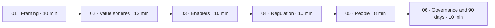
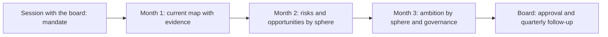

# Conversation with the board

**How to use the nine spheres and the three levels in a first sixty-minute session: preparation, script, questions, position on people and first ninety days**

| | |
|---|---|
| Document | Document 05 · Conversation with the board |
| Version | 0.1 |
| Date | 17-09-2026 |
| Author | Fernando García Varela |
| Status | Under construction. The full script, the response formats and the difficult questions are in SEVEN-G document 61. |
| Type | Application guide |

<!-- cifras: 60 | minutes of session ; 6 | blocks ; 9 | reference questions ; 90 | days of initial plan -->

---

> **Legal notice and disclaimer.** SPHERES is a reference methodology provided "as is" and for information purposes only. It does not constitute legal, regulatory, financial or professional advice, nor does it guarantee compliance with any law or standard. References to general regulation (such as the EU AI Act) and to regulation specific to each sector or jurisdiction may be incomplete, may not apply to a particular case or may become out of date. **Each organisation that uses SPHERES is solely responsible for identifying the regulation that applies to it, verifying that it is current and certifying its own regulatory compliance**, with the appropriate qualified advice. The author accepts no liability for any use made of this content or for any decisions taken on the basis of it. The data, figures, companies and cases in the examples are fictitious or illustrative.

## 1. What this conversation is for

A board of directors does not think in terms of "AI use cases". It thinks in terms of **risk, opportunity, accountability and competitive advantage**. The conversation that SPHERES proposes translates AI into those terms and ends with specific decisions.

It has four objectives:

| Objective | Outcome at the end of the session |
|---|---|
| **Understand the scope** | The board understands that AI affects the whole organisation, not just technology. |
| **Position the company** | There is a first reading of where the company's AI stands on the map and with what ambition. |
| **Take a position** | The board has expressed its position, even if provisional, on priorities and on people. |
| **Decide** | There is a mandate with an owner and a date for the first ninety days. |

> **Why it matters.** Many board sessions on AI end with a sense of interest and no decision. The sphere map gives the conversation a structure that moves from the general to the specific and forces it to close with a mandate. Without that structure, AI returns to the agenda six months later at the same point.

---

## 2. Principles of the conversation

| # | Principle | How it is applied | What is avoided |
|---|---|---|---|
| 1 | **Business before technology.** | The discussion is about customers, the offering, people, processes, risk and accountability. Technical terms are translated or omitted. | A session about models, platforms or suppliers. |
| 2 | **Questions before answers.** | Each block puts a reference question to the board, and the board is listened to before anything is proposed. | A sales presentation that the board only listens to. |
| 3 | **One example per level is enough.** | In each sphere, one example of Optimise, one of Augment and one of Transform are chosen, preferably from the company itself or its sector. | Going through catalogues of possibilities. |
| 4 | **Honesty about gaps.** | The enablers are presented with what is known and what is not; "no data" is said out loud. | Hiding that there is no inventory or that nobody knows what data can be used. |
| 5 | **No unsupported figures.** | Only figures from the company or from verifiable sources are used; examples are marked as illustrative. | Market statistics without a source to create urgency. |
| 6 | **End with a decision.** | The last block asks for an explicit mandate with an owner and a report-back date. | "We will look into it". |

---

## 3. Preparation

The quality of the session depends on the preparation. It is advisable to start two to three weeks beforehand.

| When | What | Who |
|---|---|---|
| **Two or three weeks before** | Short interviews with the chair, the chief executive and senior business, people, technology and risk management. Preliminary list of known AI initiatives and systems. | The presenter, with the AI Office if there is one |
| **Two weeks before** | **First preliminary map**: each known initiative is placed in its primary sphere and at its ambition level (document 01). The approximate grades of spheres 08 and 09 are noted (document 04). The examples per level are chosen. | The presenter |
| **One week before** | Two-page note for the board: session objective, nine spheres, three levels, the reference questions and the decision that will be requested at the end. | Board secretariat |
| **The day before** | Timed rehearsal. Each block fits its time or is cut. | The presenter |

### How to build the preliminary map

1. **Gather the list** of AI initiatives and systems from the interviews, the budgets and the contracts with suppliers. It is common to discover initiatives that management was not aware of.
2. **Assign the primary sphere** of each one: the sphere in which its main metric is measured, not the area that sponsors it.
3. **Assign the ambition level** with the five questions in document 01. In case of doubt, the lower level.
4. **Diagnose the enablers** with the five quick questions in document 03.
5. **Estimate the grades** of the dimensions of 08 and 09 with the evidence available.
6. **Mark what is not known.** A preliminary map with declared gaps is more useful than a complete, invented one.

> **Why it matters.** Presenting the board with its own company on the map, even in preliminary form, changes the tone of the session: the discussion moves from AI in general to the company's own decisions. And the gaps in the map are often, in themselves, the first relevant finding.

---

## 4. Sixty-minute script

<!-- grafico: Session script | Six blocks that go from framing to decision -->

| Block | Minutes | Objective | Reference question | Outcome |
|---|---|---|---|---|
| **01 · Strategic framing** | 0–10 | Position AI as a business issue and present the map. | What business are we in and how does AI change its rules? | Two or three priority spheres noted. |
| **02 · Spheres where value is created** | 10–22 | See where the company's AI is today and where it could be. | Are we using AI to protect the current business or to build the next one? | First reading of the portfolio and of whether there is any Transform bet. |
| **03 · Enabling spheres** | 22–32 | Diagnose real capability. | Do we know what data we have, what knowledge depends on a few people and what decisions we have already delegated? | Enabling gaps recognised. |
| **04 · Regulation, ethics and accountability** | 32–42 | Find out whether the company governs proactively or reactively. | Do we govern proactively or do we wait for the regulator to force us? | Knowing whether there is an inventory with regulatory classification and who is accountable for it. |
| **05 · Position on people** | 42–50 | Obtain an explicit position. | Will AI replace, augment or reorganise people's work? | Provisional position or assignment with a date. |
| **06 · AI governance and first 90 days** | 50–60 | Close with a decision. | Do we commission the diagnosis and the governance structure within ninety days? | Mandate with an owner, the body that receives the result and a report-back date. |

### Block 01 · Strategic framing

**What is presented.** Why AI is a board matter: risk, opportunity, accountability and competitive advantage. The nine spheres grouped into where value is created, enablers, boundaries and meta-sphere. The three ambition levels as types of bet, not as a ladder.

**What the board is asked.** Which two or three spheres concern you most today?

**What to avoid.** Starting with technology or with the evolution of models.

### Block 02 · Spheres where value is created

**What is presented.** Customer, Product and service, People and Operations, with one example per level in each. For example, in Customer: classifying and routing queries (Optimise), preparing each sales visit with the customer's likely needs (Augment), a main relationship channel handled by an assistant with oversight (Transform). Then, the company's preliminary map in these four spheres.

**What the board is asked.** Are we using AI to protect the current product or to build the next one? If a competitor knows our customers better, how long will it take us to lose relevance?

**What to avoid.** Going through every possible example or presenting efficiency as transformation.

### Block 03 · Enabling spheres

**What is presented.** Data, Knowledge and Decision, with the findings from the interviews: quality and legal basis of the data, dependence on the knowledge of a few people, decisions already delegated to systems without a defined autonomy level.

**What the board is asked.** Have we defined which decisions AI can take alone, which require human validation and which must never be delegated?

**What to avoid.** Turning the block into a review of the technology architecture.

### Block 04 · Regulation, ethics and accountability

**What is presented.** What the EU AI Act requires according to the risk level of each system, data protection in automated decisions and applicable sector regulation, always with the consultation date. The three dimensions: Compliance, Anticipation and Ethical leadership. It is often the topic that concerns the board most.

**What the board is asked.** Do we govern proactively or do we wait for the regulator to force us? Is there anyone with real power to say no to an initiative that is profitable but inappropriate?

**What to avoid.** Presenting regulation as a catalogue of penalties or treating as settled interpretations that require legal judgement.

### Block 05 · Position on people

It is covered in section 6 of this document.

### Block 06 · AI governance and first ninety days

**What is presented.** The meta-sphere and its three dimensions: Structure, Balance between speed and control and Supplier ecosystem. The ninety-day plan in section 7.

**What is asked of the board.** An explicit decision: do we commission the diagnosis and the governance structure within ninety days, with which owner and with what date for reporting back to the board?

**What to avoid.** Ending without a decision.

---

## 5. Question bank by sphere

Each sphere has a **reference question**, designed to open the conversation, and **follow-up questions** to go deeper when the board asks for it.

| Sphere | Reference question | Follow-up questions |
|---|---|---|
| **01 · Customer** | If a competitor knows our customers better because it uses AI better, how long will it take us to lose relevance? | What part of the customer relationship is already mediated by AI, and who is accountable for its quality? Do we know whether AI improves retention or only reduces the cost of serving? |
| **02 · Product and service** | Are we using AI to protect the current product or to build the next one? | What part of our revenue comes from products that would not exist without AI? Do we know the AI cost per unit of service? |
| **03 · People** | Does AI replace, augment or reorganise people's work? | What happens to released capacity? What proportion of initiatives originates from employees themselves? |
| **04 · Operations** | Do we know which processes are candidates for immediate automation and which need a complete redesign? | Are we automating tasks or redesigning processes? What happens if a system supporting a critical operation fails? |
| **05 · Data** | Do we know what data we have, where it is, who is accountable for its quality and whether we can legally use it for AI? | How many initiatives are delayed for lack of data? Is our data an advantage that is hard to replicate? |
| **06 · Knowledge** | If the people who know the most left tomorrow, what would be lost? | Who verifies the answers from our assistants? Do we learn from what we decide or do we repeat mistakes? |
| **07 · Decision** | What does AI decide on its own, what requires human validation and what is never delegated? | Can we reconstruct what the system recommended and what the person decided? Who can stop a system that acts? |
| **08 · Regulation, ethics and accountability** | Do we govern proactively or do we wait for the regulator to force us? | Are all our systems classified? Who signs off that classification? Do we have principles that go beyond the law? |
| **09 · AI governance** | Does AI have corporate governance with the same formality as finance, risk or compliance? | Who is ultimately accountable? Can we stop an initiative that is not working? Do we depend on a single model supplier? |

> **Why it matters.** The reference questions are deliberately uncomfortable. Their purpose is not to obtain an immediate answer, but for the board to recognise that it does not have one and to commission the work needed to obtain it.

---

## 6. The position on people

Block 05 is the shortest and the most delicate. A single question is asked: **will AI replace, augment or reorganise people's work in this company?**

### The three positions

| Position | What it means | What it implies for the company | Risk if it is not managed |
|---|---|---|---|
| **Replace** | AI takes on work that people do today and the company reduces capacity. | Explicit management decision, a responsible social plan, dialogue with employee representatives where appropriate and transparent communication. | Internal rejection, loss of key talent and reputational risk. |
| **Augment** | AI extends what people can do; the workforce is maintained and its work changes. | Training, role redesign, and assessment and pay consistent with the new work. | Investment without return if there is no real adoption. |
| **Reorganise** | AI changes the structure: functions disappear and others appear. | Transition plan, professional reskilling, new oversight and quality roles, and internal mobility criteria. | Prolonged uncertainty and departure of the people with the most options. |

In practice, a company may adopt different positions by function. What must not happen is for there to be no position and for each project to decide it on its own.

### The three roles worth recalling

Before asking for the position, it is recalled that people are at the same time **recipients** (their tools and expectations change), **subjects** (AI may change or eliminate their job) and **promoters** (whoever knows a process best identifies uses that no outsider would see). Document 02 develops them.

### What is asked of the board

An explicit position, even if provisional. If the board is not in a position to set it in the session, a proposal is commissioned with a date.

> **Why it matters.** This answer defines the culture, the ability to attract and retain talent and the relationship with the workforce for years. Watering down the question to make it comfortable is a mistake: the people in the organisation perceive management's real position even if it is not stated, and the absence of a position is almost always interpreted as the worst of the three.

---

## 7. First ninety days

The session ends with a mandate for the first ninety days. The sphere map is the common thread of the three months.

| Period | Objective | What is done with the map | Outcome for the board |
|---|---|---|---|
| **Month 1** | Diagnosis | Complete inventory of initiatives and systems; current map by sphere and level; grades of 08 and 09 with evidence; diagnosis of the enablers. | Map of the current situation with the "no data" items made explicit. |
| **Month 2** | Risks and opportunities | Main risks and opportunities by sphere, with owner, estimated economic impact and time frame. | Prioritised list of risks and opportunities by sphere. |
| **Month 3** | Governance structure | Proposal of target ambition by sphere, target grades for 08 and 09, main indicators, bodies, roles and rhythm of reporting to the board. | Ambition by sphere and governance structure for approval. |

<!-- grafico: First ninety days | The map moves from preliminary to approved -->

The detailed plan, with deliverables, owners and criteria, is in [SEVEN-G 90 · Implementation guide](../../../SEVEN-G/html/en/90_SEVEN-G_Guia_de_implantacion.html).

> **Why it matters.** Ninety days is long enough to move from intuition to evidence and short enough for the board to keep its attention. At the end of the period, the map stops being a session exercise and becomes the tool with which the board oversees AI every quarter.

---

## 8. After the session

| Time limit | Action | Accountable |
|---|---|---|
| **Two working days** | Note of conclusions: priority spheres, readings of the map, position on people and decision adopted. | The presenter |
| **Five working days** | Recording of decisions and assignments with owner and date. | Board secretariat |
| **Next session** | First item on the agenda: status of what was decided and updated map. | Designated AI owner |

From the diagnosis onwards, the map is reviewed **every quarter** in the board's oversight, with the gaps between target ambition and the portfolio, and **every year** in the review of the AI strategy. In SEVEN-G, the board AI dashboard (T17) shows the portfolio heat map, and the register of recommendations and decisions keeps what the board requests and its fulfilment.

---

## 9. The role of the person supporting the board

The session may be led by management, a director with AI experience or an internal or external adviser. In all cases, these rules should be respected:

| Does | Does not |
|---|---|
| Helps the board ask the right questions, interpret the evidence and follow up on what has been decided. | Lead the AI Office or take decisions that belong to the board or to management. |
| Translates technical issues into business language. | Use market figures without a source to create urgency. |
| Points out unsupported figures, undeclared omissions and unnecessary technical jargon. | Recommend suppliers, products or services in which they have an interest. |
| Declares their interests and relationships with suppliers. | Oversee initiatives in which they or their organisation provide implementation services. |

The detail of this role, its independence and the board's training in AI are in [SEVEN-G 61 · Board conversation guide](../../../SEVEN-G/html/en/61_SEVEN-G_Guia_de_conversacion_con_el_consejo.html), section 10.

> **Why it matters.** The usefulness of the sphere map depends on the board's trust in whoever presents it. If the conversation is perceived as the prelude to a sale, the board will distrust the diagnosis, however good it may be.

---

## 10. Frequent mistakes

| Mistake | Consequence | How to avoid it |
|---|---|---|
| Starting with technology. | The board disengages or delegates the subject to the IT area. | Open with the business question and the map. |
| Presenting only opportunities. | The board approves ambition without knowing the gaps or the boundaries. | Devote dedicated time to enablers, regulation and governance. |
| Using market figures without a source. | Loss of credibility as soon as a director asks where they come from. | Use the company's own data or verifiable sources; mark examples as illustrative. |
| Presenting a complete map without evidence. | Decisions based on a false picture of the company. | Declare the gaps and the "no data" items. |
| Avoiding the question about people. | The position is taken by projects one by one. | Devote a dedicated block to it and ask for a position or an assignment. |
| Ending without a decision. | AI returns to the agenda at the same point months later. | Prepare the decision that will be requested and put it forward in the last block. |
| Not following up. | The map remains a session document. | Record decisions and review the map every quarter. |

---

## 11. Related documents

| Document | Relationship |
|---|---|
| **document 00 · What SPHERES is and how it helps** | Presentation of the map and a complete example of reading it. |
| **document 01 · Ambition levels** | Classification of initiatives for the preliminary map. |
| **document 02 · Spheres where value is created** | Examples and questions for blocks 02 and 05. |
| **document 03 · Enabling spheres** | Quick diagnosis for block 03. |
| **document 04 · Regulation and AI governance** | Dimensions and grades for blocks 04 and 06. |
| [SEVEN-G 61 · Board conversation guide](../../../SEVEN-G/html/en/61_SEVEN-G_Guia_de_conversacion_con_el_consejo.html) | Full script, response formats, difficult questions and role of the director with AI experience. |
| [SEVEN-G 62 · Recommendations and decisions register](../../../SEVEN-G/html/en/62_SEVEN-G_Registro_de_recomendaciones_y_decisiones.html) | Register of what the board decides and recommends. |
| [SEVEN-G 90 · Implementation guide](../../../SEVEN-G/html/en/90_SEVEN-G_Guia_de_implantacion.html) | Detailed plan for the first ninety days. |

---

## 12. Version control

| Version | Date | Changes |
|---|---|---|
| 0.1 | 17-09-2026 | First version. Develops the conversation with the board based on the sphere map: objectives, principles, preparation and preliminary map, sixty-minute script, question bank by sphere, position on people, first ninety days, follow-up, role of the person supporting the board and frequent mistakes. |
