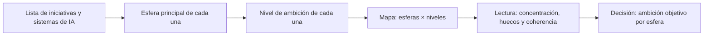

# Qué es SPHERES y para qué sirve

**Nueve esferas y tres niveles de ambición para que un consejo hable de inteligencia artificial en lenguaje de negocio: dónde jugar, con qué ambición y qué preguntar**

| | |
|---|---|
| Documento | Documento 00 · Qué es SPHERES y para qué sirve |
| Versión | 0.1 |
| Fecha | 17-09-2026 |
| Autor | Fernando García Varela |
| Estado | En construcción. Metodología de apoyo de SEVEN-G y versión no liberada comercialmente; sus reglas operativas vigentes están en el documento 10 de SEVEN-G. |
| Tipo | Presentación de la metodología |

<!-- cifras: 9 | esferas de impacto ; 3 | niveles de ambición ; 4 | tipos de esfera ; 6 | documentos -->

---

> **Versión en revisión: no difundir.** El estado actual de SPHERES (versión 0.x) no está pensado para compartirse de forma general. Se mantiene en público para que un número reducido de personas pueda revisarlo, dar su opinión y ayudar a mejorarlo. Se está trabajando en la adecuación de los documentos y las herramientas para que sean reutilizables; este aviso desaparecerá cuando el marco pase a la versión 1.x.

> **Aviso legal y exención de responsabilidad.** SPHERES es una metodología de referencia que se ofrece «tal cual» y con fines exclusivamente informativos. No constituye asesoramiento jurídico, regulatorio, financiero ni profesional, ni garantiza el cumplimiento de ninguna norma. Las referencias a regulación general (como el Reglamento Europeo de IA o el RGPD) y a regulación específica de cada sector o jurisdicción pueden ser incompletas, no aplicar a un caso concreto o quedar desactualizadas. **Cada organización que use SPHERES es la única responsable de identificar la normativa que le aplica, verificar su vigencia y certificar su propio cumplimiento regulatorio**, con el asesoramiento cualificado que corresponda. Esta metodología es una ayuda genérica y gratuita, compartida con la comunidad para que nadie tenga que empezar desde cero; cada persona u organización puede y debe adaptarla a su propio uso. No debe entenderse que sus partes jurídicamente sensibles hayan sido revisadas por una asesoría jurídica: esas revisiones, para cada empresa o sector, son responsabilidad última de la empresa, el consultor o la organización que la use. Aunque se procura mantenerla al día, alguna norma puede haber cambiado sin que se recoja aquí. En la máxima medida permitida por la ley, el autor no asume responsabilidad alguna por los efectos de su aplicación en ninguna organización ni por su aplicabilidad completa. La metodología no otorga certificación de ningún tipo. El autor no asume responsabilidad alguna por el uso que se haga de este contenido ni por las decisiones que se adopten con él. Los datos, cifras, compañías y casos de los ejemplos son ficticios o ilustrativos.

## 1. Qué es SPHERES

**SPHERES** es la metodología de Fernando García Varela para **situar la inteligencia artificial en el negocio** antes de hablar de tecnología. Ordena todo lo que la IA puede cambiar en una organización en **nueve esferas de impacto** y gradúa cada apuesta con **tres niveles de ambición**: Optimizar, Aumentar y Transformar.

El nombre procede de la palabra inglesa *spheres* (esferas). No es un acrónimo: describe la idea central del método, que la IA no es un proyecto del área de tecnología sino un cambio que alcanza a clientes, oferta, personas, procesos, datos, conocimiento, decisiones, obligaciones y gobierno.

SPHERES responde a tres preguntas que cualquier consejo o comité de dirección debería poder contestar con claridad:

| Pregunta | Qué aporta SPHERES | Dónde se desarrolla |
|---|---|---|
| **¿Dónde jugamos?** | Un mapa de nueve esferas que cubre toda la organización y obliga a elegir prioridades. | Documentos 02, 03 y 04 |
| **¿Con qué ambición?** | Tres niveles con distinto coste, riesgo, plazo y resistencia, que se eligen de forma consciente. | Documento 01 |
| **¿Qué preguntamos?** | Preguntas para el consejo, señales de alerta y un guion de conversación por esfera. | Documento 05 |

> **Por qué importa.** Sin un lenguaje común, cada área habla de la IA a su manera: tecnología habla de modelos, finanzas de ahorros, negocio de casos de uso y cumplimiento de riesgos. SPHERES da a todos el mismo mapa, de modo que el consejo puede comparar apuestas, detectar huecos y decidir dónde invertir sin tener que entender cómo funciona cada sistema.

SPHERES es una **metodología de apoyo de SEVEN-G**, el marco de valor, gobierno y transformación con IA de Fernando García Varela. Constituye su componente A (mapa de impacto). Esta biblioteca explica el método con detalle y con ejemplos; las reglas operativas, los indicadores con fórmula y las herramientas están en SEVEN-G (sección 8).

> **Titularidad y reutilización.** La propiedad intelectual de SPHERES pertenece a su autor, **Fernando García Varela**. Se ofrece como marco de referencia abierto, en desarrollo, para uso, adaptación y aprendizaje; no está liberado como entregable comercial definitivo ni como producto cerrado para clientes. Su reutilización y adaptación por cualquier organización quedan sujetas a la licencia de contenidos y de código de SEVEN-G (**CC BY 4.0** para los contenidos, **MIT** para el código; documento 93 de SEVEN-G), que exige reconocer la autoría e indicar los cambios. Usar SPHERES, incluida su adaptación conforme a esa licencia, no transfiere la titularidad de la metodología ni otorga exclusividad ni derecho de propiedad sobre su base a ningún cliente, proveedor o tercero, salvo pacto escrito y específico sobre desarrollos propios.

---

## 2. El problema que resuelve

La mayoría de las organizaciones no tiene un problema de falta de iniciativas de IA, sino de **falta de dirección** sobre ellas. Los síntomas son reconocibles:

| Síntoma | Qué suele haber detrás | Cómo lo aborda SPHERES |
|---|---|---|
| El consejo recibe una lista de "casos de uso" que no sabe priorizar. | Se describe la tecnología, no el efecto en el negocio. | Cada iniciativa se sitúa en una esfera y un nivel; la lista se convierte en un mapa. |
| Todo el esfuerzo se concentra en automatizar tareas internas. | La eficiencia es más fácil de justificar y de medir. | El mapa muestra de un vistazo que no hay apuestas en Cliente o Producto, ni de nivel Aumentar o Transformar. |
| Se anuncia una "transformación con IA" que no cambia nada visible. | Se confunde el discurso con el efecto. | Los niveles de ambición se definen por lo que cambia en el negocio, no por cómo se presenta el programa. |
| Las iniciativas se retrasan o se paran en fases avanzadas. | Faltan datos, conocimiento accesible o reglas de decisión. | Las esferas habilitadoras (05, 06 y 07) se diagnostican antes de fijar la ambición. |
| La regulación aparece al final, cuando el sistema ya está construido. | Se trata como un trámite y no como un límite de diseño. | La esfera 08 está en el mapa desde el principio y tiene grados propios. |
| Nadie sabe quién responde de la IA en la compañía. | No existe un gobierno con la formalidad de las finanzas o los riesgos. | La esfera 09 es la meta-esfera: conecta a las demás y se evalúa por separado. |

> **Por qué importa.** Estos síntomas no se corrigen con más tecnología ni con más pilotos. Se corrigen con una conversación de dirección bien estructurada. SPHERES convierte esa conversación en algo repetible: las mismas esferas, los mismos niveles y las mismas preguntas en cada revisión.

---

## 3. Las nueve esferas de un vistazo

<!-- figura: esferas -->

Las esferas cubren **todos los ámbitos de relación de una empresa**, con independencia de su sector. Se agrupan en cuatro tipos que se leen de fuera hacia dentro:

| Tipo | Esfera | Lema | Pregunta esencial |
|---|---|---|---|
| **Donde se genera valor** | 01 · Cliente | Conocimiento, relación y anticipación | ¿Conocemos y atendemos a nuestros clientes mejor que la competencia? |
| | 02 · Producto y servicio | La IA dentro, encima o como el producto | ¿Protegemos el producto actual o construimos el siguiente? |
| | 03 · Personas | Receptoras, sujetos y promotoras de la IA | ¿La IA sustituye, aumenta o reorganiza el trabajo? |
| | 04 · Operaciones | Procesos, cadena de valor y eficiencia | ¿Automatizamos tareas o rediseñamos procesos? |
| **Habilitadoras** | 05 · Datos | El sustrato material de toda la IA | ¿Sabemos qué datos tenemos y si podemos usarlos? |
| | 06 · Conocimiento | Memoria organizativa e inteligencia colectiva | ¿Qué se pierde si se van las personas que más saben? |
| | 07 · Decisión | Quién decide, con qué información y con cuánta delegación | ¿Qué decide la IA sola y qué no se delega nunca? |
| **Límites** | 08 · Regulación, ética y responsabilidad | Normativa, principios y cadena de responsabilidad | ¿Gobernamos de forma proactiva o esperamos al regulador? |
| **Meta-esfera** | 09 · Gobierno de la IA | La esfera que conecta las otras ocho | ¿Tiene la IA un gobierno tan formal como las finanzas? |

Cuatro ideas explican la estructura:

1. **Las esferas 01 a 04 son las únicas en las que la IA genera valor directo** para la compañía: ingresos, retención, margen, productividad, coste o calidad.
2. **Las esferas 05 a 07 no generan valor por sí mismas, pero lo condicionan.** Una gran ambición en Cliente sin datos fiables, sin conocimiento accesible y sin reglas claras de decisión es una apuesta de alto riesgo.
3. **La esfera 08 fija los límites** dentro de los que se puede actuar: la ley, los principios éticos y la responsabilidad cuando algo falla.
4. **La esfera 09 es el centro**: el sistema de gobierno que decide, supervisa y corrige en las otras ocho.

> **Por qué importa.** Un mapa que solo tuviera esferas de valor invitaría a perseguir oportunidades sin mirar si la compañía puede ejecutarlas o si debe hacerlo. Al incluir habilitadoras, límites y gobierno en el mismo dibujo, SPHERES obliga a mirar la oportunidad, la capacidad y la responsabilidad a la vez.

---

## 4. Los tres niveles de ambición de un vistazo

<!-- figura: niveles -->

Cada esfera de la 01 a la 07 se analiza con tres niveles de ambición. **No son una escalera**: no es obligatorio pasar por Optimizar para llegar a Transformar, ni Transformar es mejor que Optimizar. Son tres tipos de apuesta distintos.

| Nivel | Qué significa | Qué cambia | Ejemplo ilustrativo |
|---|---|---|---|
| **Optimizar** | Hacer lo mismo más rápido, más barato o con menos errores. | La eficiencia de una tarea o proceso. No cambia qué se hace ni quién lo hace. | Clasificar automáticamente las consultas que llegan al servicio de atención. |
| **Aumentar** | Las personas hacen lo que antes no podían. | El rol y las capacidades de las personas. No cambia el negocio. | Un copiloto que permite a los analistas revisar operaciones que antes derivaban a especialistas. |
| **Transformar** | Cambia qué se ofrece, cómo se compite o cómo se organiza la compañía. | La propuesta de valor, el modelo de ingresos o el modelo operativo. | Un servicio de pago que solo existe porque hay un modelo propio detrás. |

La inversión, la incertidumbre y la resistencia organizativa **crecen** de Optimizar a Transformar. Por eso cada nivel exige criterios de decisión distintos: medir una apuesta de Transformar con el plazo de retorno de una automatización la mata antes de que pueda demostrar nada. El documento 01 desarrolla los tres niveles con detalle.

Las esferas 08 y 09 **no se evalúan con estos tres niveles**, porque no generan valor por sí mismas. Se evalúan por dimensiones con cuatro grados (Ausente, Básico, Sistemático y Avanzado), como explica el documento 04.

> **Por qué importa.** El nivel de ambición es la pregunta que distingue a una compañía que **se transforma** de una que **solo se eficienta**. Ambas cosas son legítimas, pero no son lo mismo, no cuestan lo mismo y no se gobiernan igual. Llamar transformación a una automatización con buen discurso es uno de los errores más caros y más frecuentes.

---

## 5. Cómo se lee el mapa

El mapa de SPHERES se lee cruzando esferas y niveles. En su forma más simple es una tabla de nueve filas en la que cada iniciativa de IA de la compañía ocupa **una celda**: su esfera principal y su nivel de ambición.

<!-- grafico: Cómo se construye el mapa | De la lista de iniciativas a la conversación de dirección -->

El mapa se lee en **tres tiempos**:

| Tiempo | Pregunta | Qué se mira |
|---|---|---|
| **Situación actual** | ¿Dónde estamos? | Qué iniciativas y sistemas existen, en qué esfera y con qué nivel real. |
| **Ambición objetivo** | ¿Dónde queremos estar? | Qué prioridad y qué nivel de ambición fija la dirección para cada esfera. |
| **Cartera** | ¿Lo que hacemos nos lleva allí? | Si las iniciativas en marcha cubren la ambición o si hay brechas y dispersión. |

Tres lecturas aparecen casi siempre en la primera sesión:

- **Concentración**: la mayor parte del esfuerzo está en Operaciones y en Optimizar. No es malo en sí, pero conviene que sea una decisión y no una inercia.
- **Huecos**: esferas prioritarias sin ninguna iniciativa, o una ambición de Aumentar en Datos sin nada que la ejecute.
- **Incoherencia**: una ambición de Transformar en una esfera de valor apoyada en habilitadoras débiles.

> **Por qué importa.** Un mapa no decide por el consejo, pero hace visibles decisiones que se estaban tomando sin querer. La concentración, los huecos y las incoherencias son exactamente los temas sobre los que un consejo debe pronunciarse.

---

## 6. Para qué sirve

SPHERES tiene usos concretos, cada uno con un resultado verificable:

| Uso | Pregunta que responde | Resultado | Quién lo usa |
|---|---|---|---|
| **Primera conversación con el consejo** | ¿Entendemos todo lo que la IA puede cambiar en la compañía? | Posición inicial del consejo sobre prioridades y sobre las personas. | Consejo, presidencia, consejero con experiencia en IA |
| **Diagnóstico** | ¿Dónde estamos hoy? | Mapa actual de iniciativas por esfera y nivel, con grados de las esferas 08 y 09. | Oficina o comité de IA |
| **Fijar la ambición** | ¿Dónde queremos jugar y con qué ambición? | Prioridad y ambición objetivo por esfera, aprobadas por la dirección. | Alta dirección, consejo |
| **Priorizar la cartera** | ¿Qué iniciativas cierran brechas y cuáles dispersan recursos? | Cartera ordenada con esfera y nivel por iniciativa. | Comité de IA, finanzas |
| **Supervisar** | ¿Avanzamos hacia la ambición o nos desviamos? | Mapa trimestral con brechas y alertas. | Consejo, comisión delegada |
| **Comunicar** | ¿Cómo explicamos a la organización qué hacemos con la IA y por qué? | Un relato comprensible, igual para todas las áreas. | Dirección, personas, comunicación |
| **Filtrar ideas** | ¿Esta propuesta encaja en lo que hemos decidido? | Esfera y nivel propuestos desde el primer momento. | Responsables de área, empleados |

> **Por qué importa.** Un método que solo sirve para un taller se olvida al día siguiente. SPHERES se usa desde la primera conversación con el consejo hasta la revisión anual de la cartera, con el mismo vocabulario. Esa continuidad es lo que permite comparar un año con el siguiente.

---

## 7. Un ejemplo completo

*Compañía ficticia. Datos ilustrativos, sin relación con ninguna organización real.*

Una compañía de distribución de tamaño medio tiene veinte iniciativas de IA en distintos estados. El comité de dirección las presenta como "nuestra estrategia de IA". Al situarlas en el mapa aparece lo siguiente:

| Esfera | Optimizar | Aumentar | Transformar |
|---|---|---|---|
| 01 · Cliente | 3 | 1 | — |
| 02 · Producto y servicio | — | — | — |
| 03 · Personas | 2 | — | — |
| 04 · Operaciones | 11 | 1 | — |
| 05 · Datos | 1 | — | — |
| 06 · Conocimiento | 1 | — | — |
| 07 · Decisión | — | — | — |

Además, la compañía no tiene clasificados sus sistemas según la regulación aplicable (esfera 08, Cumplimiento: grado Básico) y no existe un responsable único de la IA (esfera 09, Estructura: grado Ausente).

**Lectura del mapa**

1. **Diecinueve de veinte iniciativas son de Optimizar** y once están en Operaciones. La compañía se está eficientando, no transformando.
2. **Producto y servicio está vacía**, aunque el plan estratégico de la compañía habla de lanzar servicios digitales.
3. **Decisión está vacía** y hay tres iniciativas de Cliente que recomiendan precios y descuentos. Nadie ha definido qué decide el sistema y qué valida una persona.
4. **Datos tiene una sola iniciativa** de limpieza, mientras varias iniciativas de Cliente dependen de datos de comportamiento que no están catalogados.
5. **No hay gobierno**: nadie puede parar una iniciativa ni responde ante el consejo.

**Decisiones que provoca**

| Decisión del consejo | Esfera | Consecuencia |
|---|---|---|
| Mantener la apuesta por la eficiencia en Operaciones, pero con un límite de inversión. | 04 | Se revisa si las once iniciativas tienen ahorro real o solo horas liberadas. |
| Fijar Transformar como ambición en Producto y servicio. | 02 | Se encarga una primera iniciativa con hitos de aprendizaje y límite de inversión por etapa. |
| Fijar Aumentar como ambición en Datos antes de escalar Cliente. | 05 | Se prioriza catalogar y documentar la base legal de los datos de clientes. |
| Definir niveles de autonomía para las decisiones de precio. | 07 | Ninguna recomendación de precio se ejecuta sin validación hasta que haya reglas aprobadas. |
| Designar un responsable de la IA y un comité con capacidad de parar iniciativas. | 09 | La esfera 09 pasa de Ausente a Básico en el primer trimestre. |

> **Por qué importa.** Nada de lo anterior exige conocimientos técnicos. Las cinco decisiones salen de mirar el mapa y hacer las preguntas de cada esfera. Ese es el propósito de SPHERES: que la dirección decida sobre la IA con la misma naturalidad con la que decide sobre inversión, riesgo o talento.

---

## 8. Relación con SEVEN-G

SPHERES nació como un marco independiente de conversación con el consejo y hoy es el **componente A (mapa de impacto) de SEVEN-G**. La división del trabajo entre ambas bibliotecas es deliberada:

| Aspecto | SPHERES (esta biblioteca) | SEVEN-G |
|---|---|---|
| **Propósito** | Explicar qué son las esferas y los niveles, por qué importan y cómo usarlos en una conversación de dirección. | Gobernar, medir y auditar la IA en la compañía y en cada iniciativa. |
| **Contenido** | Conceptos, ejemplos, preguntas, señales de alerta y guion de conversación. | Reglas de clasificación, indicadores con fórmula, puertas de decisión, plantillas y herramientas. |
| **Lectores** | Consejo, alta dirección y cualquier persona que necesite entender el mapa. | Oficina de IA, comité de IA, responsables de producto, auditoría. |
| **Regla en caso de duda** | Remite a SEVEN-G. | Es la fuente de verdad de las reglas operativas. |

Documentos de SEVEN-G que desarrollan SPHERES:

| Documento de SEVEN-G | Qué aporta |
|---|---|
| [SEVEN-G 10 · Mapa de esferas y niveles de ambición](../../../SEVEN-G/html/es/10_SEVEN-G_Mapa_de_esferas_y_niveles_de_ambicion.html) | Reglas de esfera principal y secundaria, indicadores por esfera, grados de 08 y 09 y mapa de calor. |
| [SEVEN-G 12 · Índice de transformación](../../../SEVEN-G/html/es/12_SEVEN-G_Indice_de_transformacion.html) | Las cinco preguntas para clasificar la ambición de una iniciativa y el perfil de la compañía. |
| [SEVEN-G 13 · Tesis de IA, ambición y apetito de riesgo](../../../SEVEN-G/html/es/13_SEVEN-G_Tesis_de_IA_ambicion_y_apetito_de_riesgo.html) | Cómo se fija y se aprueba la ambición objetivo por esfera. |
| [SEVEN-G 14 · Gestión de cartera](../../../SEVEN-G/html/es/14_SEVEN-G_Gestion_de_cartera.html) | Uso del mapa para priorizar y equilibrar la cartera. |
| [SEVEN-G 61 · Guía de conversación con el consejo](../../../SEVEN-G/html/es/61_SEVEN-G_Guia_de_conversacion_con_el_consejo.html) | Guion completo, formatos de respuesta y preguntas difíciles. |

Herramientas de SEVEN-G que usan el mapa: el registro de iniciativas (T01), donde cada iniciativa lleva su esfera y su nivel, y el panel de IA para el consejo (T17), que muestra el mapa de calor de la cartera.

> **Por qué importa.** Separar la explicación de la regla evita dos riesgos: que el consejo reciba un manual operativo que no necesita leer, y que la oficina de IA aplique criterios distintos a los que se explicaron al consejo. Ambos usan las mismas esferas, los mismos niveles y los mismos nombres.

---

## 9. Para quién es

| Perfil | Qué obtiene | Por dónde empezar |
|---|---|---|
| **Consejeros y presidencia** | Un lenguaje para supervisar la IA sin entrar en tecnología, y las preguntas que conviene hacer. | Este documento y el documento 05. |
| **Alta dirección** | Un mapa para fijar prioridades y ambición, y para explicar la estrategia de IA a la organización. | Documentos 00, 01 y el de las esferas que dirige. |
| **Comité u oficina de IA** | Criterios comunes para clasificar iniciativas y detectar brechas. | Documento 01 y documento 10 de SEVEN-G. |
| **Responsables de área** | Una forma de proponer iniciativas que la dirección entiende y puede comparar. | El documento de su esfera (02, 03 o 04). |
| **Personas de la organización** | Una explicación de por qué y para qué se usa la IA, y de su papel en ello. | Documento 02, esfera 03 · Personas. |
| **Consultores internos o externos** | Un método reconocible y abierto para estructurar el diagnóstico y la conversación con el consejo. | Toda la biblioteca y SEVEN-G. |

---

## 10. Cómo usar esta biblioteca

| Documento | Contenido | Cuándo leerlo |
|---|---|---|
| **documento 00 · Qué es SPHERES y para qué sirve** | Presentación de la metodología, el problema que resuelve y un ejemplo completo. | Primero. |
| **documento 01 · Niveles de ambición** | Optimizar, Aumentar y Transformar con detalle, cómo clasificar y errores frecuentes. | Antes de clasificar cualquier iniciativa. |
| **documento 02 · Esferas donde se genera valor** | Cliente, Producto y servicio, Personas y Operaciones, con ejemplos por nivel. | Para diagnosticar oportunidades. |
| **documento 03 · Esferas habilitadoras** | Datos, Conocimiento y Decisión: por qué condicionan todo lo demás. | Antes de fijar una ambición alta en cualquier esfera de valor. |
| **documento 04 · Regulación y gobierno de la IA** | Las esferas 08 y 09, sus dimensiones y sus grados. | Para evaluar límites y capacidad de gobierno. |
| **documento 05 · Conversación con el consejo** | Guion de sesenta minutos, banco de preguntas y primeros noventa días. | Para preparar la sesión con el consejo. |

Los documentos 02, 03 y 04 siguen la misma estructura para cada esfera: qué es, por qué importa, qué cubre, ejemplos por nivel, preguntas para el consejo, señales de alerta y cómo se mide.

---

## 11. Principios de uso

| # | Principio | Error que evita |
|---|---|---|
| 1 | **El mapa habla de negocio, no de tecnología.** Una iniciativa se sitúa por lo que cambia, no por la herramienta que usa. | Clasificar como Transformar todo lo que use IA generativa o agentes. |
| 2 | **Cada iniciativa tiene una esfera principal y un único nivel.** La esfera principal es la de la métrica que justifica la inversión. | Repartir una iniciativa entre varias esferas para que parezca más importante. |
| 3 | **Los niveles no son una escalera.** Se eligen según la estrategia, no según la madurez que se quiere aparentar. | Pensar que toda compañía debe acabar en Transformar. |
| 4 | **Las habilitadoras se miran antes de fijar la ambición.** | Prometer una transformación que los datos o las reglas de decisión no pueden sostener. |
| 5 | **Las esferas 08 y 09 tienen grados, no niveles de ambición.** | Presentar "Transformar la regulación" como si fuera una apuesta de negocio. |
| 6 | **Si una iniciativa no encaja en ninguna esfera, su objetivo no está claro.** | Mantener proyectos sin propósito de negocio identificable. |
| 7 | **El mapa se actualiza, no se archiva.** Se revisa al menos cada trimestre en la supervisión y cada año en la revisión de la estrategia. | Usar el mapa en un taller y olvidarlo. |

---

## 12. Licencia, atribución y estado

SPHERES se publica bajo licencia **Creative Commons Atribución 4.0 Internacional (CC BY 4.0)**. Puede usarse, adaptarse y extenderse, también con fines comerciales, siempre que se cite de forma visible la autoría: *SPHERES · Fernando García Varela*. Las condiciones completas de uso y citación son las de SEVEN-G ([SEVEN-G 93 · Licencia, uso y citación](../../../SEVEN-G/html/es/93_SEVEN-G_Licencia_uso_y_citacion.html)).

No existe certificación de SPHERES. El uso del nombre no implica respaldo del autor.

SPHERES está **en construcción como metodología independiente**. Esta primera versión explica el método y remite a SEVEN-G para todo lo operativo. Crecerá con nuevos ejemplos, casos sectoriales y experiencias de aplicación.

---

## 13. Control de versiones

| Versión | Fecha | Cambios |
|---|---|---|
| 0.1 | 17-09-2026 | Primera versión. Presenta SPHERES a partir del marco de esferas original y de su integración en SEVEN-G: problema que resuelve, nueve esferas, tres niveles, lectura del mapa, usos, ejemplo completo, relación con SEVEN-G y biblioteca. |
