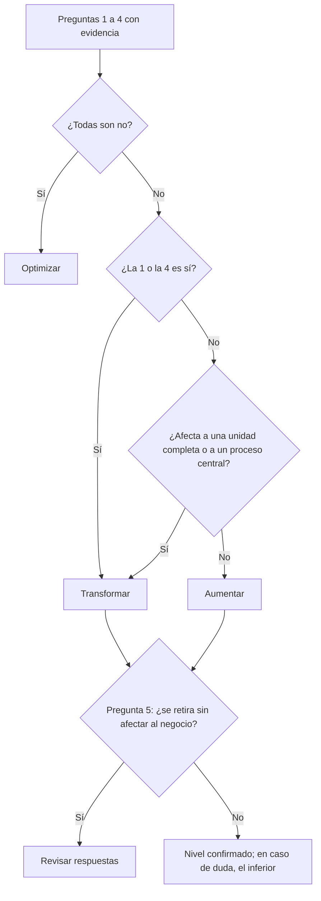

# Niveles de ambición

**Optimizar, Aumentar y Transformar: tres tipos de apuesta con distinto coste, riesgo, plazo y resistencia, y cómo distinguirlos con evidencia**

| | |
|---|---|
| Documento | Documento 01 · Niveles de ambición |
| Versión | 0.1 |
| Fecha | 17-09-2026 |
| Autor | Fernando García Varela |
| Estado | En construcción. Las reglas de clasificación vigentes están en el documento 12 de SEVEN-G. |
| Tipo | Concepto de la metodología |

<!-- cifras: 3 | niveles de ambición ; 5 | preguntas para clasificar ; 1 | nivel por iniciativa ; 3 | criterios de avance distintos -->

---

> **Aviso legal y exención de responsabilidad.** SPHERES es una metodología de referencia que se ofrece «tal cual» y con fines exclusivamente informativos. No constituye asesoramiento jurídico, regulatorio, financiero ni profesional, ni garantiza el cumplimiento de ninguna norma. **Cada organización que use SPHERES es la única responsable de identificar la normativa que le aplica, verificar su vigencia y certificar su propio cumplimiento regulatorio**, con el asesoramiento cualificado que corresponda. Esta metodología es una ayuda genérica y gratuita, compartida con la comunidad para que nadie tenga que empezar desde cero; cada persona u organización puede y debe adaptarla a su propio uso. No debe entenderse que sus partes jurídicamente sensibles hayan sido revisadas por una asesoría jurídica: esas revisiones, para cada empresa o sector, son responsabilidad última de la empresa, el consultor o la organización que la use. Aunque se procura mantenerla al día, alguna norma puede haber cambiado sin que se recoja aquí. En la máxima medida permitida por la ley, el autor no asume responsabilidad alguna por los efectos de su aplicación en ninguna organización ni por su aplicabilidad completa. La metodología no otorga certificación de ningún tipo. El autor no asume responsabilidad alguna por el uso que se haga de este contenido ni por las decisiones que se adopten con él. Los datos, cifras, compañías y casos de los ejemplos son ficticios o ilustrativos.

## 1. Objeto

Este documento explica los **tres niveles de ambición** de SPHERES: qué significa cada uno, qué cambia en la organización, dónde está su valor, qué riesgos tiene, cómo se decide y cómo se reconoce con evidencia. También explica cómo clasificar una iniciativa y cuáles son los errores más frecuentes.

Los niveles se aplican a las esferas **01 a 07**. Las esferas 08 y 09 se evalúan con grados propios (documento 04).

---

## 2. Qué es un nivel de ambición

Un nivel de ambición describe **lo que una iniciativa de IA cambia en el negocio**. No describe la tecnología que usa, lo que cuesta ni lo novedosa que parece.

<!-- figura: niveles -->

La misma tecnología puede servir a niveles distintos. Un agente de IA generativa que redacta borradores de respuesta para el equipo de atención es **Optimizar**: el servicio y el puesto son los mismos. Un modelo estadístico clásico que permite lanzar un seguro de uso por kilómetro es **Transformar**: el cliente recibe una oferta que antes no existía.

> **Por qué importa.** Si el nivel se asignara por la tecnología, cualquier programa con IA generativa se presentaría como transformación y la cartera parecería mucho más ambiciosa de lo que es. Definir el nivel por el efecto en el negocio es lo que permite al consejo saber si la compañía se transforma o solo se eficienta.

---

## 3. Optimizar

**Definición.** Hacer lo mismo que ya se hace, más rápido, más barato o con menos errores. No cambia qué se hace ni quién lo hace.

| Aspecto | Descripción |
|---|---|
| **Qué cambia** | La eficiencia de una tarea o de un proceso. |
| **Dónde está el valor** | Principalmente en coste evitado, tiempo de ciclo y reducción de errores. |
| **Incertidumbre** | Baja: la situación de partida es conocida y el efecto se puede comparar. |
| **Resistencia organizativa** | Baja o localizada en los equipos afectados. |
| **Cómo se decide** | La dirección del área, dentro del marco de cartera aprobado. |
| **Criterio para continuar** | Beneficio neto anual positivo en el horizonte fijado por la dirección. |
| **Si se retira** | La compañía vuelve a hacer lo mismo con el coste y el tiempo anteriores. |

**Ejemplos ilustrativos**

| Esfera | Ejemplo | Por qué es Optimizar |
|---|---|---|
| 01 · Cliente | Clasificación y enrutamiento automático de las consultas que llegan por correo. | El cliente recibe el mismo servicio; se reduce el tiempo de asignación. |
| 02 · Producto y servicio | Pruebas automatizadas que detectan defectos antes del lanzamiento. | El producto es el mismo; se produce con menos coste y menos fallos. |
| 03 · Personas | Generación automática de informes periódicos que antes se hacían a mano. | El puesto es el mismo; desaparece trabajo de bajo valor. |
| 04 · Operaciones | Lectura automática de facturas y conciliación con pedidos. | El proceso es el mismo; baja el coste unitario y la tasa de error. |
| 05 · Datos | Detección y eliminación de registros duplicados de clientes. | Los datos existentes se gestionan mejor con menos esfuerzo. |

**Riesgos propios de Optimizar**

- **Contar horas liberadas como ahorro.** Si el tiempo liberado no se convierte en menor coste real o en una reasignación explícita, el ahorro no existe en la cuenta de resultados.
- **Desplazar el cuello de botella.** Automatizar un paso aislado acelera la cola del paso siguiente sin mejorar el proceso completo.
- **Acumular dependencias invisibles.** Muchas automatizaciones pequeñas acaban soportando procesos críticos sin que nadie lo haya decidido.

> **Por qué importa.** Optimizar es la puerta de entrada natural a la IA y suele financiar lo demás. Pero una cartera hecha solo de Optimizar produce una compañía más eficiente con el mismo modelo de negocio, expuesta a que un competidor use la IA para cambiar las reglas del mercado.

---

## 4. Aumentar

**Definición.** Las personas hacen lo que antes no podían. El trabajo humano no desaparece: se amplía y el rol cambia.

| Aspecto | Descripción |
|---|---|
| **Qué cambia** | El rol, las capacidades y a veces el diseño de un proceso completo. No cambia el modelo de negocio. |
| **Dónde está el valor** | Combinado: coste y rendimiento (productividad, calidad, conversión, calidad de las decisiones). |
| **Incertidumbre** | Media: el valor depende de que las personas adopten de verdad la nueva forma de trabajar. |
| **Resistencia organizativa** | Media: exige cambiar hábitos, formación y a veces la descripción del puesto. |
| **Cómo se decide** | La dirección, con visibilidad del comité de IA. |
| **Criterio para continuar** | Adopción real y mejora de rendimiento medida frente a la situación de partida. |
| **Si se retira** | Las personas pierden una capacidad que ya forma parte de su trabajo. |

**Ejemplos ilustrativos**

| Esfera | Ejemplo | Por qué es Aumentar |
|---|---|---|
| 01 · Cliente | Los gestores comerciales reciben, antes de cada visita, un análisis de necesidades probables y de riesgo de abandono de cada cliente. | Hacen una conversación comercial que antes no podían preparar. |
| 03 · Personas | Un copiloto permite a los analistas de riesgos revisar operaciones complejas que antes derivaban a especialistas. | Cambia el contenido del puesto; el negocio es el mismo. |
| 04 · Operaciones | Los planificadores simulan escenarios de demanda y de suministro antes de decidir. | Deciden con una capacidad de análisis que no tenían. |
| 06 · Conocimiento | Un asistente jurídico interno da a los equipos de negocio acceso a criterios que solo conocían los expertos. | Las personas acceden a conocimiento experto que antes no tenían. |
| 07 · Decisión | El sistema presenta opciones con su riesgo y su probabilidad, y una persona elige y deja registro. | Cambia cómo se decide, sin delegar la decisión. |

**Riesgos propios de Aumentar**

- **Medir licencias en lugar de uso.** Repartir un copiloto a toda la plantilla no es aumentar a nadie si no se usa o se usa para lo mismo de antes.
- **Olvidar la formación y la gestión del cambio.** Sin ellas, la adopción se estanca y la inversión queda como coste.
- **No actualizar el rol.** Si el puesto sigue descrito, evaluado y retribuido como antes, las personas vuelven a la forma de trabajar anterior.

> **Por qué importa.** Aumentar es el nivel en el que más valor se pierde en silencio. La tecnología funciona, pero el valor depende de las personas, y ese valor no aparece si no se mide la adopción real ni se rediseña el trabajo. Es también el nivel que mejor protege la cultura, porque trata a las personas como beneficiarias y no solo como coste.

---

## 5. Transformar

**Definición.** Cambia de forma fundamental qué ofrece la compañía, cómo compite o cómo se organiza. Tiene el máximo potencial y el máximo riesgo.

| Aspecto | Descripción |
|---|---|
| **Qué cambia** | La propuesta de valor, el modelo de ingresos o el modelo operativo. |
| **Dónde está el valor** | Principalmente en nuevos ingresos, nuevos mercados y cambios del modelo operativo. |
| **Incertidumbre** | Alta: depende del mercado, del cliente o de la propia organización. |
| **Resistencia organizativa** | Alta: afecta a estructuras, incentivos y poder de decisión. |
| **Cómo se decide** | Decisión explícita del consejo o de la alta dirección. |
| **Criterio para continuar** | Hitos de aprendizaje, límite de inversión por etapa y evidencia de mercado. |
| **Si se retira** | Se pierde una oferta, un canal o una forma de organizarse. |

**Ejemplos ilustrativos**

| Esfera | Ejemplo | Por qué es Transformar |
|---|---|---|
| 01 · Cliente | Un agente de IA se convierte en el punto de contacto principal con el cliente, con derivación a personas en los casos definidos. | Cambia cómo se relaciona la compañía con sus clientes. |
| 02 · Producto y servicio | Un fabricante de maquinaria deja de vender solo equipos y vende horas de funcionamiento garantizadas gracias al mantenimiento predictivo. | Cambia qué se vende y cómo se cobra. |
| 03 · Personas | La función de planificación se reorganiza: un sistema asigna recursos con supervisión y los planificadores gestionan excepciones. | Cambian la estructura y el reparto del trabajo en una unidad completa. |
| 05 · Datos | Los datos agregados y anonimizados de la operación se ofrecen como servicio de información a terceros. | Los datos generan una línea de ingresos que no existía. |
| 07 · Decisión | La función de precios se reorganiza: los precios de todo el catálogo se fijan de forma autónoma dentro de límites aprobados y el equipo de precios pasa a diseñar y supervisar las reglas. | Cambian el proceso y los roles de una unidad completa: quién decide y cómo se organiza la decisión. |

**Riesgos propios de Transformar**

- **Llamar transformación a una automatización con buen discurso.** Es el error más caro: se aprueban presupuestos y plazos de transformación para algo que no cambia el negocio.
- **Exigir retorno demasiado pronto.** Medir una apuesta de Transformar con el plazo de retorno de una automatización la para antes de que pueda aportar evidencia de mercado.
- **Subestimar las habilitadoras.** Transformar Cliente o Producto sin datos, conocimiento y reglas de decisión suficientes es una señal de riesgo, no de audacia.
- **Ignorar el efecto sobre las personas.** Las transformaciones cambian roles y estructuras; decidirlo sin una posición explícita de la dirección genera rechazo y riesgo reputacional.

> **Por qué importa.** Transformar es el único nivel que cambia la posición competitiva de la compañía. Por eso debe decidirlo quien responde de la estrategia, con criterios de avance por etapas y con la aceptación explícita de que algunas apuestas fracasarán. Sin ese tratamiento diferenciado, las apuestas de Transformar o no se aprueban nunca o se aprueban sin control.

---

## 6. Comparación de los tres niveles

| Aspecto | Optimizar | Aumentar | Transformar |
|---|---|---|---|
| **Pregunta clave** | ¿Lo hacemos mejor? | ¿Podemos hacer más? | ¿Hacemos algo distinto? |
| **Qué cambia** | Eficiencia de una tarea o proceso | Rol y capacidades de las personas | Propuesta de valor, ingresos u organización |
| **Valor** | Coste evitado | Coste y rendimiento | Nuevos ingresos y modelo operativo |
| **Inversión relativa** | Menor | Media | Mayor y por etapas |
| **Incertidumbre** | Baja | Media | Alta |
| **Resistencia organizativa** | Baja o localizada | Media | Alta |
| **Plazo hasta evidencia** | Corto | Medio: depende de la adopción | Largo: depende del mercado |
| **Quién decide** | Dirección del área | Dirección, con el comité de IA | Consejo o alta dirección |
| **Qué mide el avance** | Beneficio neto | Adopción y rendimiento | Hitos de aprendizaje y evidencia de mercado |
| **Error frecuente** | Contar capacidad liberada como ahorro | Medir licencias en lugar de uso | Llamar transformación a una automatización |

---

## 7. No es una escalera

Los niveles de ambición **no describen la madurez** de la compañía ni un camino obligatorio.

| Idea equivocada | Realidad |
|---|---|
| "Primero hay que optimizar y después transformar." | Una compañía puede empezar por una apuesta de Transformar en Producto mientras optimiza Operaciones. Lo que importa es que tenga capacidad habilitadora suficiente. |
| "Transformar es mejor que Optimizar." | Son apuestas distintas. En una esfera no prioritaria, Optimizar puede ser exactamente la ambición correcta. |
| "Una compañía madura tiene todo en Transformar." | Una cartera sana combina los tres niveles según la estrategia. La madurez se mide con otros criterios (documento 11 de SEVEN-G). |
| "Si el proyecto es grande, es Transformar." | El importe de la inversión no determina el nivel. Una gran automatización sigue siendo Optimizar. |

> **Por qué importa.** Si los niveles se entendieran como una escalera, cada área intentaría subir de nivel para parecer más avanzada y la clasificación perdería todo valor como información para el consejo. Tratar los niveles como tipos de apuesta permite decidir la combinación adecuada para cada esfera.

---

## 8. Cómo clasificar una iniciativa

La clasificación se hace con **cinco preguntas** que se responden sí o no, siempre con evidencia. Una respuesta afirmativa sin evidencia cuenta como no.

| # | Pregunta | Apunta a |
|---|---|---|
| 1 | ¿Cambia la propuesta de valor que recibe el cliente o el usuario final? | Transformar |
| 2 | ¿Se rediseña el proceso de extremo a extremo, y no solo una tarea dentro del proceso? | Aumentar o Transformar |
| 3 | ¿Cambian los roles, la estructura organizativa o quién toma qué decisiones? | Aumentar o Transformar |
| 4 | ¿Genera ingresos, servicios o mercados que no existían? | Transformar |
| 5 | ¿Podría retirarse sin afectar al modelo de negocio, volviendo simplemente al coste anterior? | Optimizar |

Reglas básicas de lectura:

- Si las preguntas 1 a 4 son **no**, la iniciativa es **Optimizar**, se haya presentado como se haya presentado.
- Si la pregunta 1 o la 4 es **sí**, la iniciativa es **Transformar**.
- Si la pregunta 2 o la 3 es **sí**, la iniciativa es **Aumentar**, salvo que el cambio afecte a una unidad organizativa completa o a un proceso central del negocio, en cuyo caso es **Transformar**.
- La pregunta 5 sirve de **contraste**: si una iniciativa clasificada como Aumentar o Transformar podría retirarse sin más consecuencia que volver al coste anterior, las respuestas deben revisarse.
- **En caso de duda razonable, se asigna el nivel inferior**, y quien propone el superior aporta la evidencia.

<!-- grafico: Clasificación rápida | Las preguntas se responden con evidencia y el resultado se contrasta con la pregunta 5 -->

Las reglas completas, los casos de contraste y quién clasifica, confirma y revisa el nivel están en [SEVEN-G 12 · Índice de transformación](../../../SEVEN-G/html/es/12_SEVEN-G_Indice_de_transformacion.html), sección 3. En SEVEN-G el nivel se propone al registrar la iniciativa, se confirma antes de invertir en su construcción y se comprueba con evidencia cuando la iniciativa ya produce resultados.

> **Por qué importa.** Cinco preguntas con evidencia sustituyen a la opinión. Dos áreas que presentan iniciativas parecidas obtienen el mismo nivel, y el consejo puede confiar en que el mapa describe la realidad y no el entusiasmo de cada patrocinador.

---

## 9. Casos dudosos

*Ejemplos genéricos e ilustrativos.*

| Caso | Nivel | Razonamiento |
|---|---|---|
| Licencias de un asistente de IA para toda la plantilla, sin plan de adopción. | **Optimizar** | No cambia ningún rol ni ningún proceso de forma demostrable (preguntas 2 y 3: no). |
| El mismo asistente, con rediseño de las funciones de un equipo de análisis que pasa a asumir revisiones que antes externalizaba. | **Aumentar** | Cambia el contenido de los puestos (pregunta 3: sí). |
| Automatización con agentes de un proceso de back office completo, con menos personas haciendo lo mismo. | **Optimizar** | Reducir el número de personas que hacen lo mismo no es cambio de rol. Si el proceso se rediseña pero los roles no cambian, sería Aumentar. |
| Precio dinámico con IA dentro de las tarifas actuales. | **Aumentar** | La decisión pasa a un sistema con supervisión (pregunta 3: sí), pero el cliente recibe la misma oferta. |
| Precio personalizado por uso que el cliente elige como nueva modalidad. | **Transformar** | El cliente recibe una forma de precio nueva (pregunta 1: sí). |
| Plataforma común de datos para varias iniciativas. | **Optimizar** por defecto | Se clasifica por su efecto propio; no hereda la ambición de las iniciativas que habilita. |
| Piloto exploratorio de un nuevo servicio. | Según lo que cambiaría a escala | Se clasifica por su hipótesis; el nivel real se comprueba con evidencia. |
| Iniciativa con un componente de Optimizar y otro de Transformar. | **Se divide** o se clasifica por el componente que concentra más de la mitad de la inversión | Los niveles no se promedian. |

---

## 10. La ambición de una esfera y el equilibrio de la cartera

Además de clasificar iniciativas, la dirección fija una **ambición objetivo para cada esfera** de la 01 a la 07. Esa ambición no se asigna por opinión: se expresa con las iniciativas que la ejecutan.

| Concepto | Qué es | Ejemplo ilustrativo |
|---|---|---|
| **Nivel alcanzado** | El nivel más alto con al menos una iniciativa en producción y valor medido. | En Cliente, Optimizar: hay un enrutador de consultas con ahorro validado. |
| **Nivel en cartera** | El nivel más alto con alguna iniciativa aprobada para construirse. | En Cliente, Aumentar: está aprobado un asistente para gestores comerciales. |
| **Ambición objetivo** | El nivel que la dirección quiere para la esfera en el horizonte de su estrategia. | En Cliente, Aumentar. |
| **Brecha** | La ambición objetivo no tiene ninguna iniciativa aprobada que la ejecute. | En Datos, objetivo Aumentar y ninguna iniciativa aprobada de ese nivel. |

Una cartera equilibrada **no** reparte la inversión por igual entre niveles. Refleja la estrategia: mucha eficiencia donde la compañía compite en coste, apuestas de Aumentar donde el talento es la ventaja y alguna apuesta de Transformar, acotada y por etapas, donde la compañía quiere cambiar su posición. La fijación y aprobación de la ambición por esfera se describe en [SEVEN-G 13 · Tesis de IA, ambición y apetito de riesgo](../../../SEVEN-G/html/es/13_SEVEN-G_Tesis_de_IA_ambicion_y_apetito_de_riesgo.html).

> **Por qué importa.** La pregunta "¿nos estamos transformando?" solo tiene respuesta si se compara la ambición declarada con lo que la cartera realmente ejecuta. Esa comparación, esfera por esfera, es la que permite detectar la transformación declarada pero no evidenciada.

---

## 11. Errores frecuentes

| Error | Consecuencia | Cómo evitarlo |
|---|---|---|
| Clasificar por la tecnología ("usa agentes, luego es Transformar"). | Cartera aparentemente ambiciosa y sin cambio real. | Aplicar las cinco preguntas con evidencia. |
| Clasificar por el importe o por la visibilidad del programa. | Se aplican criterios de transformación a automatizaciones caras. | Recordar que el importe no determina el nivel. |
| Subir de nivel para conseguir financiación. | El consejo aprueba expectativas que no se cumplirán. | Revisión independiente del nivel y comprobación posterior con evidencia. |
| Aplicar a todas las iniciativas el mismo criterio de retorno. | Las apuestas de Transformar se paran antes de aprender. | Criterios de avance distintos por nivel. |
| Contar horas liberadas como ahorro en Optimizar. | Ahorros que no aparecen en la cuenta de resultados. | Distinguir capacidad liberada, materializada y reasignada. |
| Medir el éxito de Aumentar por licencias asignadas. | Inversión sin cambio en la forma de trabajar. | Medir uso activo y mejora de rendimiento. |
| Fijar la ambición de una esfera sin mirar las habilitadoras. | Promesas que los datos o las reglas de decisión no sostienen. | Leer el documento 03 antes de fijar una ambición alta. |

---

## 12. Documentos relacionados

| Documento | Relación |
|---|---|
| **documento 00 · Qué es SPHERES y para qué sirve** | Presentación del mapa y de los niveles. |
| **documento 02 · Esferas donde se genera valor** | Ejemplos por nivel en Cliente, Producto y servicio, Personas y Operaciones. |
| **documento 03 · Esferas habilitadoras** | Ejemplos por nivel en Datos, Conocimiento y Decisión. |
| **documento 04 · Regulación y gobierno de la IA** | Por qué las esferas 08 y 09 no usan niveles de ambición. |
| [SEVEN-G 10 · Mapa de esferas y niveles de ambición](../../../SEVEN-G/html/es/10_SEVEN-G_Mapa_de_esferas_y_niveles_de_ambicion.html) | Reglas de esfera y nivel, indicadores y mapa de calor. |
| [SEVEN-G 12 · Índice de transformación](../../../SEVEN-G/html/es/12_SEVEN-G_Indice_de_transformacion.html) | Reglas completas de clasificación y perfil de transformación de la compañía. |

---

## 13. Control de versiones

| Versión | Fecha | Cambios |
|---|---|---|
| 0.1 | 17-09-2026 | Primera versión. Desarrolla los tres niveles de ambición con definición, valor, riesgos, ejemplos por esfera, comparación, clasificación con cinco preguntas, casos dudosos, ambición por esfera y errores frecuentes. |
