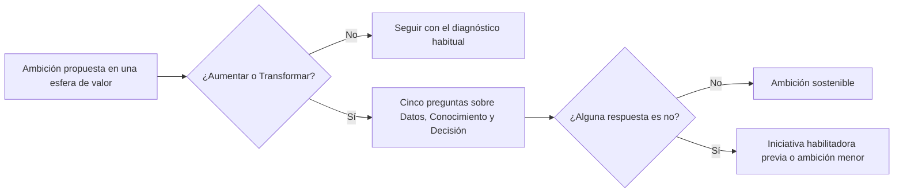

# Esferas habilitadoras

**Datos, Conocimiento y Decisión: por qué condicionan todo el valor de la IA, ejemplos por nivel de ambición y cómo diagnosticar la capacidad real**

| | |
|---|---|
| Documento | Documento 03 · Esferas habilitadoras |
| Versión | 0.1 |
| Fecha | 17-09-2026 |
| Autor | Fernando García Varela |
| Estado | En construcción. Los indicadores con fórmula de estas esferas están en el documento 10 de SEVEN-G. |
| Tipo | Esferas de la metodología |

<!-- cifras: 3 | esferas habilitadoras ; 4 | niveles de autonomía ; 12 | preguntas para el consejo ; 5 | preguntas de diagnóstico -->

---

> **Aviso legal y exención de responsabilidad.** SPHERES es una metodología de referencia que se ofrece «tal cual» y con fines exclusivamente informativos. No constituye asesoramiento jurídico, regulatorio, financiero ni profesional, ni garantiza el cumplimiento de ninguna norma. Las referencias a regulación general (como el RGPD) pueden ser incompletas, no aplicar a un caso concreto o quedar desactualizadas. **Cada organización que use SPHERES es la única responsable de identificar la normativa que le aplica, verificar su vigencia y certificar su propio cumplimiento regulatorio**, con el asesoramiento cualificado que corresponda. El autor no asume responsabilidad alguna por el uso que se haga de este contenido ni por las decisiones que se adopten con él. Los datos, cifras, compañías y casos de los ejemplos son ficticios o ilustrativos.

## 1. Qué son las esferas habilitadoras

Las esferas **05 Datos, 06 Conocimiento y 07 Decisión** no generan valor por sí mismas: **hacen posible o imposible** el valor de las esferas 01 a 04.

| Esfera | Qué habilita | Qué ocurre si falla |
|---|---|---|
| **05 · Datos** | Que los sistemas de IA tengan materia prima disponible, fiable y de uso legítimo. | Las iniciativas se retrasan, se paran o funcionan con datos que no deberían usar. |
| **06 · Conocimiento** | Que lo que sabe la organización esté accesible y no dependa de pocas personas. | Los asistentes responden mal, y el saber crítico se pierde cuando alguien se va. |
| **07 · Decisión** | Que esté claro qué decide la IA, qué valida una persona y qué no se delega nunca. | Se delega por defecto, sin supervisión real ni trazabilidad. |

Es en estas esferas **donde aparecen las preguntas incómodas**. Hablar de oportunidades en Cliente o en Producto es fácil; reconocer que no se sabe qué datos se tienen, que el conocimiento crítico está en la cabeza de tres personas o que un sistema ya fija precios sin que nadie lo haya decidido, no lo es.

> **Por qué importa.** Una ambición de Transformar en una esfera de valor sin capacidad suficiente en Datos, Conocimiento y Decisión **es una señal de riesgo, no de audacia**. La mayor parte de los retrasos y fracasos de las iniciativas de IA no se deben al modelo, sino a datos no disponibles, conocimiento no documentado o decisiones sin reglas. Diagnosticar las habilitadoras antes de fijar la ambición evita prometer lo que la organización no puede sostener.

### Cuándo una habilitadora es esfera principal

Que una iniciativa **use** datos, conocimiento o decisiones no la sitúa en estas esferas: casi todas las iniciativas de IA los usan. Una habilitadora es la **esfera principal** solo cuando el resultado principal de la iniciativa es **la propia capacidad habilitadora**.

| Iniciativa (ilustrativa) | Esfera principal | Motivo |
|---|---|---|
| Plataforma común de datos para varios casos de IA. | 05 · Datos | El resultado es la capacidad; el valor de los casos que la usan se imputa a esos casos. |
| Recomendador de productos que usa datos de comportamiento. | 01 · Cliente | La métrica principal es la conversión, aunque dependa de los datos. |
| Base de conocimiento jurídico consultable por toda la compañía. | 06 · Conocimiento | El resultado es el acceso al conocimiento. |
| Sistema que define y registra qué decisiones de crédito puede tomar un modelo y cuáles revisa una persona. | 07 · Decisión | El resultado es el sistema de decisión y su trazabilidad. |

---

## 2. Esfera 05 · Datos

**Lema:** el sustrato material de toda la IA.

### Qué es

La esfera Datos reúne la **disponibilidad, calidad, catalogación, linaje, base legal y arquitectura** de los datos que usan los sistemas de IA, y los **datos como producto**.

> **Por qué importa.** Sin datos adecuados, ningún sistema de IA funciona bien, por bueno que sea el modelo. Y sin base legal documentada, un sistema que funciona puede convertirse en un problema regulatorio y reputacional. La pregunta más útil que puede hacer un consejo sobre IA no es técnica: es si la compañía sabe qué datos tiene, dónde están, quién responde de su calidad y si puede usarlos legalmente para IA.

### Qué cubre y qué no

| Cubre | No cubre |
|---|---|
| Inventario y catálogo de los datos que usan los sistemas de IA. | El uso de los datos para un fin de negocio concreto: es la esfera de ese fin (01 a 04). |
| Calidad, vigilancia de la calidad y deriva de los datos. | La protección de datos como obligación regulatoria: se evalúa en la esfera 08. |
| Linaje: de dónde vienen los datos con los que decide cada sistema. | |
| Base legal y condiciones de uso de los datos para IA. | |
| Datos sintéticos, enriquecimiento con fuentes externas y consulta en lenguaje natural. | |
| Datos como producto o servicio. | |

### Ejemplos por nivel de ambición

| Nivel | Ejemplos | Qué lo distingue |
|---|---|---|
| **Optimizar** | Limpieza, normalización y eliminación de duplicados · Catalogación con metadatos generados por IA y linaje automatizado · Vigilancia continua de la calidad y de la deriva. | Los datos existentes se gestionan mejor y con menos esfuerzo. |
| **Aumentar** | Datos sintéticos donde los reales son escasos · Enriquecimiento con fuentes externas · Consulta de datos en lenguaje natural por cualquier empleado autorizado. | Más personas pueden usar más datos para decidir. |
| **Transformar** | Datos convertidos en producto o servicio · Arquitectura de datos distribuida y gobernada por dominios · Representación viva de la operación alimentada en tiempo real. | Los datos cambian el modelo de negocio o el modelo operativo. |

### Caso ilustrativo

*Aseguradora ficticia de ámbito regional.*

La dirección aprueba tres iniciativas de Cliente: un modelo de riesgo de abandono, un recomendador de coberturas y un asistente para agentes comerciales. A los cuatro meses, las tres están paradas en la misma fase. El motivo no es técnico: los datos de interacciones con clientes están repartidos en cuatro sistemas, no tienen responsable, y nadie ha confirmado si el consentimiento con el que se obtuvieron permite usarlos para estos fines. La compañía decide abrir una iniciativa con esfera principal **Datos** (nivel **Optimizar**): catálogo de los datos de clientes con responsable, reglas de calidad y base legal documentada para cada uso. Solo cuando esa iniciativa alcanza su primer hito se reanudan las de Cliente. En la siguiente revisión, el consejo fija **Aumentar** como ambición de la esfera Datos y pide un indicador trimestral de iniciativas bloqueadas por datos.

### Preguntas para el consejo

- ¿Sabemos qué datos tenemos, dónde están, quién responde de su calidad y si podemos usarlos legalmente para IA?
- ¿Cuántas iniciativas se retrasan o se paran por falta de datos?
- ¿Tenemos documentado de dónde vienen los datos con los que decide cada sistema en producción?
- ¿Nuestros datos son una ventaja que un competidor no puede replicar?

### Señales de alerta

- Iniciativas que llegan a la fase de construcción sin haber confirmado el acceso a los datos.
- Datos personales usados para entrenar o alimentar sistemas sin base legal documentada.
- Conjuntos de datos críticos sin responsable identificado.
- Sistemas en producción sin linaje de datos y modelos.

### Cómo se mide

Los indicadores de referencia son la cobertura del catálogo, la calidad de los datos críticos, la base legal documentada, el linaje documentado, el tiempo de acceso a los datos y las iniciativas bloqueadas por datos. Sus fórmulas están en [SEVEN-G 10 · Mapa de esferas y niveles de ambición](../../../SEVEN-G/html/es/10_SEVEN-G_Mapa_de_esferas_y_niveles_de_ambicion.html), sección 5.5, y su gobierno en [SEVEN-G 51 · Datos y conocimiento](../../../SEVEN-G/html/es/51_SEVEN-G_Datos_y_conocimiento.html).

---

## 3. Esfera 06 · Conocimiento

**Lema:** memoria organizativa e inteligencia colectiva.

### Qué es

La esfera Conocimiento reúne el **conocimiento documentado y tácito** de la organización, su **memoria**, la búsqueda y reutilización de lo que ya se sabe, los **asistentes especializados por dominio** y la capacidad de la organización para **aprender** de lo que hace y decide.

La diferencia con la esfera Datos es de naturaleza: los datos registran hechos; el conocimiento explica **cómo se hacen las cosas, por qué se decidió algo y qué funcionó o fracasó**.

> **Por qué importa.** Una parte decisiva de lo que sabe una compañía no está escrita en ningún sitio: está en las personas con más experiencia. Si mañana se fueran las personas que más saben, ¿qué se perdería? La IA puede reducir esa brecha capturando y haciendo accesible ese conocimiento, pero **solo si se empieza antes de que se vayan**. Además, los asistentes de IA generativa responden con lo que encuentran: si el conocimiento está desordenado u obsoleto, responden mal con total seguridad.

### Qué cubre y qué no

| Cubre | No cubre |
|---|---|
| Documentación interna, procedimientos y criterios. | Los datos estructurados de la operación: es la esfera 05. |
| Conocimiento tácito de expertos y su captura. | La formación de las personas como capacidad individual: es la esfera 03. |
| Búsqueda semántica y asistentes de conocimiento por dominio. | |
| Memoria de decisiones, proyectos y lecciones aprendidas. | |
| Vigencia y exactitud de las fuentes que alimentan sistemas de IA. | |
| Control de acceso a información confidencial a través de asistentes. | |

### Ejemplos por nivel de ambición

| Nivel | Ejemplos | Qué lo distingue |
|---|---|---|
| **Optimizar** | Búsqueda semántica sobre documentación interna · Bases de preguntas frecuentes actualizadas con IA · Transcripción y resumen de reuniones con registro de decisiones. | Se encuentra antes lo que ya estaba escrito. |
| **Aumentar** | Captura del conocimiento tácito de expertos · Asistentes de conocimiento por dominio (jurídico, técnico, regulatorio, producto) · Detección de patrones de éxito y fracaso en proyectos anteriores. | Las personas acceden a conocimiento experto que antes no tenían. |
| **Transformar** | El conocimiento de la organización como sistema activo que propone y no solo responde · Conocimiento propio como ventaja competitiva difícil de replicar · La compañía conserva lo que ha hecho, decidido y aprendido. | El conocimiento cambia cómo compite o se organiza la compañía. |

### Caso ilustrativo

*Ingeniería ficticia especializada en instalaciones industriales.*

La compañía identifica que el diseño de un tipo de instalación depende de dos ingenieros cercanos a la jubilación. Pone en marcha una iniciativa de **Aumentar** en Conocimiento: sesiones estructuradas en las que un asistente entrevista a los expertos sobre decisiones de diseño reales, las contrasta con los proyectos archivados y construye una base de criterios revisada por ellos mismos. El resultado es un asistente que los ingenieros más jóvenes consultan antes de cada diseño. La dirección establece dos condiciones: que una muestra de las respuestas sea revisada por expertos cada trimestre para medir su exactitud, y que el asistente respete los permisos de acceso a los proyectos de cada cliente.

### Preguntas para el consejo

- ¿Cuánto conocimiento crítico depende de pocas personas y no está disponible para la organización?
- Si se fueran mañana las personas que más saben, ¿qué se perdería? ¿Estamos empezando a capturarlo a tiempo?
- ¿Son fiables las respuestas de nuestros asistentes de conocimiento y quién las verifica?
- ¿Aprendemos de lo que hemos decidido y hecho, o repetimos errores?

### Señales de alerta

- Asistentes de conocimiento sin evaluación de la exactitud de sus respuestas.
- Documentación obsoleta que alimenta sistemas de IA generativa.
- Dominios críticos que dependen de una o dos personas sin plan de captura.
- Acceso a información confidencial a través de asistentes sin control de permisos.

### Cómo se mide

Los indicadores de referencia son la cobertura del conocimiento crítico, la concentración del conocimiento en pocas personas, la exactitud verificada de los asistentes, la resolución útil, la vigencia de las fuentes y el tiempo hasta la autonomía de las personas incorporadas. Sus fórmulas están en [SEVEN-G 10](../../../SEVEN-G/html/es/10_SEVEN-G_Mapa_de_esferas_y_niveles_de_ambicion.html), sección 5.6.

---

## 4. Esfera 07 · Decisión

**Lema:** quién decide, con qué información y con cuánta delegación.

### Qué es

La esfera Decisión reúne **qué decisiones toman, recomiendan o ejecutan los sistemas de IA**, con qué información, con qué **nivel de autonomía**, con qué **supervisión humana** y con qué **trazabilidad**.

> **Por qué importa.** Cada vez que un sistema de IA recomienda o ejecuta algo, se está repartiendo una decisión entre personas y máquinas. Si la compañía no ha definido qué decide la IA sola, qué requiere validación humana y qué no se delega nunca, **está delegando por defecto**. Y cuando algo sale mal, nadie puede reconstruir qué recomendó el sistema, qué decidió la persona y por qué.

### Los cuatro niveles de autonomía

SPHERES usa la escala de autonomía de SEVEN-G para describir cuánto se delega en cada tipo de decisión:

| Nivel | Nombre | Qué hace el sistema | Qué hace la persona | Ejemplo ilustrativo |
|---|---|---|---|---|
| **A0** | Asistencia | Informa, resume o genera contenido. | Decide y ejecuta. | Resumen de un expediente antes de que el analista lo revise. |
| **A1** | Recomendación | Propone una decisión o acción concreta. | Valida cada acción antes de ejecutarla. | Propuesta de descuento que el gestor aprueba o rechaza. |
| **A2** | Actuación supervisada | Ejecuta acciones dentro de límites definidos. | Supervisa, puede interrumpir y revisa a posteriori. | Reposición automática de existencias con revisión diaria de excepciones. |
| **A3** | Actuación autónoma | Ejecuta secuencias de acciones sin revisión individual dentro de límites estrictos. | Fija límites, supervisa agregados y dispone de interruptor de parada. | Ajuste continuo de precios de un catálogo dentro de una banda aprobada. |

El nivel de autonomía **no es lo mismo que el nivel de ambición**. Un sistema A0 que solo resume información puede formar parte de una apuesta de Transformar. A la inversa, que una decisión que tomaba una persona pase a un sistema A2 o A3 cambia quién decide, y eso apunta como mínimo a Aumentar (documento 01, sección 8, pregunta 3).

> **Por qué importa.** Asignar un nivel de autonomía a cada tipo de decisión convierte una discusión abstracta sobre "confiar en la IA" en una regla concreta que puede aprobarse, supervisarse y auditarse. Es también la base para saber qué sistemas necesitan un interruptor de parada y quién puede activarlo.

### Qué cubre y qué no

| Cubre | No cubre |
|---|---|
| Inventario de los tipos de decisión en los que interviene la IA. | El resultado de negocio de cada decisión: es la esfera de ese resultado (01 a 04). |
| Nivel de autonomía asignado a cada tipo de decisión. | Las obligaciones legales sobre decisiones automatizadas: se evalúan en la esfera 08. |
| Supervisión humana, anulación y escalado. | |
| Trazabilidad de lo que recomendó el sistema y lo que decidió la persona. | |
| Interruptores de parada y límites de actuación. | |
| Calidad y velocidad de las decisiones asistidas. | |

### Ejemplos por nivel de ambición

| Nivel | Ejemplos | Qué lo distingue |
|---|---|---|
| **Optimizar** | Paneles que priorizan la información relevante · Alertas predictivas antes de que un indicador se degrade · Automatización de decisiones de bajo riesgo y alta frecuencia. | Las mismas decisiones, con menos esfuerzo o antes. |
| **Aumentar** | Opciones con análisis de riesgo y probabilidad entre las que elige una persona · Simulación de escenarios · Trazabilidad de lo que recomendó la IA y lo que decidió la persona. | Quien decide cuenta con capacidades de análisis que no tenía. |
| **Transformar** | Decisiones autónomas en dominios acotados (precio dinámico, asignación de recursos) · Coordinación de decisiones entre sistemas con supervisión agregada · Directivos que supervisan sistemas de decisión en lugar de decidir cada caso. | Cambia quién decide y cómo se organiza la toma de decisiones. |

### Caso ilustrativo

*Operador logístico ficticio.*

El operador descubre, en su primer diagnóstico, que un sistema de asignación de rutas que se instaló como "herramienta de apoyo" lleva meses ejecutando cambios de ruta sin revisión: en la práctica funciona como A2, pero nadie lo ha decidido ni existen límites escritos. La tasa de anulación por parte de los jefes de tráfico es prácticamente cero, lo que la dirección interpretaba como éxito. Al analizarlo, se comprueba que los jefes de tráfico no tienen forma sencilla de anular una decisión. La compañía define por escrito los tipos de decisión, asigna A2 con límites (distancia máxima de desvío, clientes prioritarios excluidos), habilita un interruptor de parada con responsable designado y registra cada recomendación y cada anulación. La tasa de anulación sube primero y se estabiliza después dentro de una banda que el responsable de producto considera razonable.

### Preguntas para el consejo

- ¿Qué decide la IA sola, qué requiere validación humana y qué no se delega nunca? Si no lo hemos definido, estamos delegando por defecto.
- ¿Podemos reconstruir qué recomendó el sistema y qué decidió la persona en cada decisión relevante?
- ¿Qué sistemas actúan con autonomía A2 o A3 y quién puede pararlos?
- ¿Mejoran las decisiones con IA, o solo se toman más rápido?

### Señales de alerta

- Sistemas que ejecutan acciones sin nivel de autonomía asignado ni interruptor de parada.
- Tasa de anulación humana cercana a cero durante meses: puede indicar supervisión nominal.
- Tasa de anulación muy alta: el sistema no está calibrado o no se confía en él.
- Decisiones con efectos significativos sobre personas sin revisión humana significativa.

### Cómo se mide

Los indicadores de referencia son las decisiones con autonomía asignada, la trazabilidad de las decisiones, la tasa de anulación humana, los interruptores de parada probados, la mejora de la calidad de la decisión y la latencia de decisión. Sus fórmulas están en [SEVEN-G 10](../../../SEVEN-G/html/es/10_SEVEN-G_Mapa_de_esferas_y_niveles_de_ambicion.html), sección 5.7, y la seguridad de los sistemas que actúan en [SEVEN-G 35 · Seguridad de IA y agentes](../../../SEVEN-G/html/es/35_SEVEN-G_Seguridad_de_IA_y_agentes.html).

---

## 5. Diagnóstico rápido de las habilitadoras

Antes de fijar una ambición de Aumentar o Transformar en cualquier esfera de valor, conviene responder a cinco preguntas. No sustituyen a un diagnóstico completo, pero detectan los bloqueos más frecuentes.

| # | Pregunta | Esfera | Si la respuesta es no |
|---|---|---|---|
| 1 | ¿Están identificados, con responsable y base legal, los datos que necesita la ambición? | 05 | Abrir antes una iniciativa de Datos o reducir la ambición. |
| 2 | ¿Se ha comprobado la calidad de esos datos sobre una muestra real? | 05 | Fijar umbrales de calidad y medirlos antes de construir. |
| 3 | ¿Está documentado y accesible el conocimiento del que depende la iniciativa? | 06 | Capturar el conocimiento crítico y asignar quién verifica las respuestas. |
| 4 | ¿Está definido qué decisiones tomará o recomendará el sistema y con qué nivel de autonomía? | 07 | Definir tipos de decisión, nivel A0–A3 y supervisión antes de desplegar. |
| 5 | ¿Se puede reconstruir y, si hace falta, parar lo que haga el sistema? | 07 | Diseñar trazabilidad e interruptor de parada como requisitos, no como mejoras. |

<!-- grafico: Coherencia entre ambición y habilitadoras | Una ambición alta en una esfera de valor se contrasta con la capacidad real de las habilitadoras -->

> **Por qué importa.** Este diagnóstico es barato y rápido, y evita el error más costoso de las carteras de IA: aprobar iniciativas ambiciosas que se paran meses después por causas que podían conocerse desde el primer día.

---

## 6. Documentos relacionados

| Documento | Relación |
|---|---|
| **documento 00 · Qué es SPHERES y para qué sirve** | Presentación del mapa completo. |
| **documento 01 · Niveles de ambición** | Diferencia entre nivel de ambición y nivel de autonomía. |
| **documento 02 · Esferas donde se genera valor** | Las esferas cuyo valor depende de estas. |
| **documento 04 · Regulación y gobierno de la IA** | Protección de datos y decisiones automatizadas como obligación (esfera 08). |
| [SEVEN-G 10 · Mapa de esferas y niveles de ambición](../../../SEVEN-G/html/es/10_SEVEN-G_Mapa_de_esferas_y_niveles_de_ambicion.html) | Reglas de clasificación e indicadores con fórmula. |
| [SEVEN-G 51 · Datos y conocimiento](../../../SEVEN-G/html/es/51_SEVEN-G_Datos_y_conocimiento.html) | Gobierno y preparación de datos y conocimiento para IA. |
| [SEVEN-G 35 · Seguridad de IA y agentes](../../../SEVEN-G/html/es/35_SEVEN-G_Seguridad_de_IA_y_agentes.html) | Niveles de autonomía y controles de los sistemas que actúan. |

---

## 7. Control de versiones

| Versión | Fecha | Cambios |
|---|---|---|
| 0.1 | 17-09-2026 | Primera versión. Desarrolla las esferas 05 a 07 con qué son, por qué importan, cuándo son esfera principal, alcance, ejemplos por nivel, casos ilustrativos, preguntas para el consejo, señales de alerta y medición; incluye los niveles de autonomía A0–A3 y un diagnóstico rápido de cinco preguntas. |
