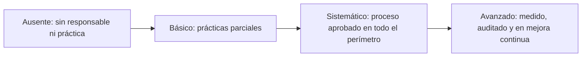

# Regulación y gobierno de la IA

**Las esferas 08 y 09: los límites dentro de los que se usa la IA y el sistema que conecta las otras ocho, evaluados por dimensiones y grados y no por niveles de ambición**

| | |
|---|---|
| Documento | Documento 04 · Regulación y gobierno de la IA |
| Versión | 0.1 |
| Fecha | 17-09-2026 |
| Autor | Fernando García Varela |
| Estado | En construcción. Los grados, indicadores y reglas vigentes están en el documento 10 de SEVEN-G. |
| Tipo | Esferas de la metodología |

<!-- cifras: 2 | esferas con grados propios ; 6 | dimensiones ; 4 | grados ; 3 | formas de obtener capacidades -->

---

> **Aviso legal y exención de responsabilidad.** SPHERES es una metodología de referencia que se ofrece «tal cual» y con fines exclusivamente informativos. No constituye asesoramiento jurídico, regulatorio, financiero ni profesional, ni garantiza el cumplimiento de ninguna norma. Las referencias a regulación general (como el Reglamento Europeo de IA, el RGPD o la LOPDGDD) y a regulación específica de cada sector o jurisdicción pueden ser incompletas, no aplicar a un caso concreto o quedar desactualizadas por cambios normativos, interpretaciones o criterios de las autoridades. **Cada organización que use SPHERES es la única responsable de identificar la normativa que le aplica, verificar su vigencia y certificar su propio cumplimiento regulatorio**, con el asesoramiento cualificado que corresponda. El autor no asume responsabilidad alguna por el uso que se haga de este contenido ni por las decisiones que se adopten con él. Los datos, cifras, compañías y casos de los ejemplos son ficticios o ilustrativos.

## 1. Por qué estas dos esferas son distintas

Las esferas 01 a 07 describen **dónde** se usa la IA y **qué la hace posible**. Las esferas 08 y 09 describen **dentro de qué límites** se usa y **cómo se gobierna**.

| Esfera | Papel en el mapa | Pregunta de referencia para el consejo |
|---|---|---|
| **08 · Regulación, ética y responsabilidad** | **Los límites**: la normativa aplicable, los principios éticos que la compañía asume voluntariamente y la cadena de responsabilidad cuando algo falla. | ¿Gobernamos de forma proactiva o esperamos a que el regulador nos obligue? |
| **09 · Gobierno de la IA** | **El centro**: la meta-esfera que conecta las otras ocho con una estructura de responsabilidad, decisión y supervisión. | ¿Tiene la IA un gobierno corporativo con la misma formalidad que las finanzas, los riesgos o el cumplimiento? |

Por eso **no se evalúan con Optimizar, Aumentar y Transformar**. No generan valor por sí mismas: fijan las condiciones para que el valor de las demás sea legítimo, sostenible y controlable. En lugar de niveles de ambición, cada una se evalúa en **tres dimensiones** con **cuatro grados**.

> **Por qué importa.** Si estas esferas se midieran con niveles de ambición, aparecerían frases como "Transformar la regulación" o "Aumentar el gobierno", que no significan nada verificable. Peor aún: invertir en cumplimiento se leería como una simple eficiencia y rebajaría el perfil de la cartera, o se usaría para inflarlo. Los grados por dimensión permiten decir con precisión qué capacidad tiene la compañía y cuál necesita.

---

## 2. Los cuatro grados

Los grados son comunes a las seis dimensiones de las esferas 08 y 09.

| Grado | Criterio general | Evidencia mínima | Cómo se reconoce en la práctica |
|---|---|---|---|
| **Ausente** | No hay responsable ni práctica definida, o existen solo de forma puntual y no documentada. | — | "Eso lo mira cada proyecto." |
| **Básico** | Existen prácticas y responsables, pero dependen de personas o proyectos concretos y no cubren todo el perímetro. | Documentos o registros parciales. | Hay una persona que sabe del tema y algunas evaluaciones hechas, pero no de todos los sistemas. |
| **Sistemático** | Proceso definido, aprobado y aplicado a todo el perímetro, con responsables y evidencias verificables. | Procedimiento aprobado, registros completos, indicadores calculados. | Cualquier sistema de IA de la compañía pasa por el mismo proceso y deja evidencia. |
| **Avanzado** | Sistemático, con indicadores en objetivo durante al menos dos trimestres, mejora continua y revisión independiente. | Informe de auditoría interna o externa sin no conformidades mayores abiertas. | El proceso funciona, se mide, se audita y mejora. |

<!-- grafico: Progresión de los grados | Cada grado incorpora los requisitos del anterior -->

Tres reglas para usar bien los grados:

1. **Un grado se asigna con evidencia**, no por autoevaluación optimista. Sin la evidencia mínima, se asigna el grado inferior.
2. **Los grados no son niveles de madurez de la compañía.** Sirven como evidencia para las dimensiones de estrategia y gobierno y de riesgo, seguridad y cumplimiento del modelo de madurez de SEVEN-G, pero no las sustituyen.
3. **El objetivo se fija por dimensión.** "Llegar a Sistemático en Cumplimiento y a Básico en Liderazgo ético en doce meses" es un objetivo verificable; "mejorar el gobierno de la IA" no lo es.

---

## 3. Esfera 08 · Regulación, ética y responsabilidad

**Lema:** normativa, principios y cadena de responsabilidad.

### Qué es

La esfera 08 reúne **el marco normativo aplicable a la IA** (regulación general de IA y de protección de datos, y regulación sectorial), **los principios éticos** que la compañía asume más allá del mínimo legal y **la cadena de responsabilidad** cuando un sistema de IA causa un daño o comete un error.

> **Por qué importa.** El coste de esperar a que el regulador obligue se mide en sanciones, pero sobre todo en **reputación y confianza**. Una compañía que descubre en una inspección, en una reclamación o en la prensa que uno de sus sistemas estaba mal clasificado o discriminaba a un colectivo pierde algo que ningún ahorro compensa. Además, la regulación de la IA cambia con rapidez: lo que hoy es una buena práctica puede ser una obligación en poco tiempo.

### Las tres dimensiones

| Dimensión | Qué evalúa | Ejemplo de grado Básico | Ejemplo de grado Sistemático | Ejemplo de grado Avanzado |
|---|---|---|---|---|
| **Cumplimiento** | Clasificación de los sistemas según el Reglamento Europeo de IA, obligaciones de transparencia y supervisión humana, protección de datos en decisiones automatizadas y perfilado, y regulación sectorial. | Algunos sistemas clasificados a demanda, cuando un proyecto lo pide. | Todos los sistemas inventariados están clasificados; las evaluaciones exigidas se hacen antes de invertir en la construcción; las no conformidades se corrigen en plazo. | Lo anterior, con indicadores en objetivo dos trimestres y auditoría sin no conformidades mayores abiertas. |
| **Anticipación** | Vigilancia de la regulación emergente, evaluaciones de impacto antes del despliegue y preparación para auditorías externas. | Se sigue la regulación de forma informal, a través de noticias o de asesores. | Proceso de vigilancia con responsable; cada cambio relevante tiene análisis de impacto en plazo; se hacen simulacros de auditoría. | La compañía adapta sus sistemas antes de que la obligación sea aplicable y lo documenta. |
| **Liderazgo ético** | Principios propios más allá del mínimo legal, un órgano ético con capacidad real de veto y transparencia pública sobre el uso de la IA. | Principios publicados sin mecanismo para aplicarlos. | Principios aprobados por el consejo, revisión ética de las iniciativas que lo requieren y órgano con capacidad de veto documentada. | Informe público periódico sobre el uso de la IA y decisiones de veto o modificación registradas. |

> **Por qué importa.** Las tres dimensiones responden a tres riesgos distintos. Sin **Cumplimiento**, la compañía incumple hoy. Sin **Anticipación**, incumplirá mañana y tendrá que rehacer sistemas con prisa. Sin **Liderazgo ético**, puede cumplir la ley y aun así perder la confianza de clientes, empleados y sociedad por usos legales pero inaceptables.

### Qué cubre y qué no

| Cubre | No cubre |
|---|---|
| Clasificación regulatoria de los sistemas de IA. | Los riesgos operativos y de seguridad de cada sistema: se gestionan con la metodología de riesgos de SEVEN-G. |
| Obligaciones de transparencia, supervisión humana y documentación. | La gestión de la calidad de los datos: es la esfera 05. |
| Protección de datos en decisiones automatizadas y perfilado. | |
| Regulación sectorial aplicable (por ejemplo, en banca, seguros, salud o energía). | |
| Vigilancia regulatoria y evaluaciones de impacto. | |
| Principios éticos, órgano ético y transparencia pública. | |

**Regla de uso en el mapa.** La esfera 08 es la esfera principal de una iniciativa **solo cuando su finalidad es el cumplimiento o la ética** (por ejemplo, un sistema que vigila cambios normativos y los asigna a responsables). **Nunca** se usa para señalar que una iniciativa de otra esfera tiene riesgo regulatorio: eso se registra en su clasificación regulatoria y en su registro de riesgos.

### Caso ilustrativo

*Entidad financiera ficticia.*

La entidad tiene en producción un modelo que prioriza solicitudes de financiación y un asistente que responde a clientes. Ninguno de los dos está clasificado según la regulación de IA aplicable; el primero podría afectar de forma significativa a personas y el segundo interactúa con clientes sin informarles de que es un sistema de IA. La esfera 08 se diagnostica así: **Cumplimiento, Básico** (hay un análisis jurídico del asistente, pero no del modelo); **Anticipación, Ausente** (nadie vigila qué obligaciones serán aplicables); **Liderazgo ético, Básico** (hay principios publicados, pero ningún órgano los aplica). El consejo fija como objetivo a doce meses **Sistemático** en Cumplimiento y en Anticipación, y **Básico** en Liderazgo ético con un órgano que tenga capacidad real de veto. La primera acción es clasificar todos los sistemas del inventario, empezando por los que afectan a decisiones sobre personas.

### Preguntas para el consejo

| Dimensión | Preguntas |
|---|---|
| **Cumplimiento** | ¿Están clasificados todos nuestros sistemas de IA? ¿Alguno podría ser una práctica prohibida o de alto riesgo sin que lo sepamos? ¿Quién firma esa clasificación? |
| **Anticipación** | ¿Qué obligaciones nos serán aplicables en los próximos años y a qué sistemas afectan? ¿Estamos preparados para una auditoría externa de IA? |
| **Liderazgo ético** | ¿Tenemos principios propios que vayan más allá de la ley? ¿Hay alguien con capacidad real de decir que no a una iniciativa rentable pero inadecuada? |

### Señales de alerta

- Sistemas en producción pendientes de clasificación regulatoria más allá del plazo aprobado.
- Evaluaciones de impacto realizadas después de la puesta en producción.
- Comité ético sin ninguna decisión registrada en un año.
- Uso de herramientas de IA no autorizadas detectado y no regularizado.

### Cómo se mide

Los indicadores de referencia son los sistemas clasificados, las evaluaciones exigidas completadas en plazo, las no conformidades regulatorias fuera de plazo, los análisis de cambios regulatorios en plazo, la adaptación anticipada, el uso no autorizado regularizado, la revisión ética aplicada, la capacidad efectiva de veto y la transparencia pública. Sus fórmulas están en [SEVEN-G 10 · Mapa de esferas y niveles de ambición](../../../SEVEN-G/html/es/10_SEVEN-G_Mapa_de_esferas_y_niveles_de_ambicion.html), sección 6. Las obligaciones concretas se analizan en [SEVEN-G 34 · Mapeo regulatorio](../../../SEVEN-G/html/es/34_SEVEN-G_Mapeo_regulatorio.html) y la política corporativa en [SEVEN-G 31 · Política corporativa y uso aceptable](../../../SEVEN-G/html/es/31_SEVEN-G_Politica_corporativa_y_uso_aceptable.html).

---

## 4. Esfera 09 · Gobierno de la IA

**Lema:** la esfera que conecta las otras ocho.

### Qué es

La esfera 09 es la **meta-esfera**. Reúne la **responsabilidad última sobre la IA**, los órganos que deciden y supervisan, la gestión de la cartera, las puertas de decisión, la información al consejo, el **equilibrio entre velocidad y control** y la relación con los **proveedores de IA**.

> **Por qué importa.** Las otras ocho esferas pueden estar bien analizadas y, aun así, no pasar nada si nadie tiene la responsabilidad de decidir, priorizar, supervisar y parar. La IA necesita un gobierno corporativo con la **misma formalidad que las finanzas, la auditoría o el cumplimiento**: responsables designados, reglas de decisión, información periódica y capacidad real de corregir el rumbo. Sin él, la IA crece por acumulación de proyectos y nadie responde del conjunto.

### Las tres dimensiones

| Dimensión | Qué evalúa | Ejemplo de grado Básico | Ejemplo de grado Sistemático | Ejemplo de grado Avanzado |
|---|---|---|---|---|
| **Estructura** | Quién tiene la responsabilidad última de la estrategia de IA, si hay un marco que la conecte con la estrategia de negocio, si existe una cartera priorizada por impacto y riesgo y si el consejo recibe información periódica y comprensible. | Responsable designado; la cartera es una lista de proyectos. | Tesis de IA y apetito de riesgo aprobados; comité de IA operativo; registro de iniciativas con roles y puertas de decisión; información trimestral al consejo. | Lo anterior, con las recomendaciones del consejo al día y una revisión anual completa de la estrategia. |
| **Equilibrio entre velocidad y control** | Si la compañía acelera la adopción con el riesgo bajo control, si hay puertas de decisión en el ciclo de vida, cómo mide su madurez y si puede parar una iniciativa que no funciona. | Algunos controles, aplicados de forma desigual. | Puertas de decisión con validación independiente en todas las iniciativas; intensidad de control proporcional al riesgo; plazos de decisión medidos; paradas y retiradas registradas. | Tiempos de decisión dentro de plazo sin aumento de incidencias; calibración anual de plazos y umbrales. |
| **Ecosistema de proveedores** | Si la compañía depende de un solo proveedor de modelos, si evalúa construir, comprar o aliarse para cada capacidad, si los contratos protegen sus datos y su propiedad intelectual y si entiende la estructura de costes de la IA. | Proveedores conocidos, sin evaluación homogénea. | Registro de proveedores con nivel de exigencia; cláusulas contractuales mínimas; coste de IA conocido por categoría y por caso. | Estrategia de salida probada para los proveedores críticos y concentración dentro del apetito de riesgo. |

> **Por qué importa.** Las tres dimensiones evitan tres fracasos de gobierno distintos. Sin **Estructura**, nadie responde. Sin **Equilibrio entre velocidad y control**, el gobierno o frena todo, y los equipos lo eluden, o no controla nada. Sin gobierno del **Ecosistema de proveedores**, la compañía descubre tarde que depende de un tercero que fija el precio, las condiciones y el uso de sus datos.

### Construir, comprar o aliarse

Una de las decisiones más frecuentes de la dimensión Ecosistema es cómo obtener cada capacidad de IA:

| Opción | Cuándo tiene sentido | Riesgo principal | Pregunta de control |
|---|---|---|---|
| **Construir** | La capacidad es diferencial y la compañía tiene datos y talento propios. | Coste y plazo mayores; dependencia de pocas personas. | ¿Es realmente una ventaja que nadie nos puede vender? |
| **Comprar** | La capacidad es común en el mercado y no diferencia. | Dependencia del proveedor, uso de los datos y coste creciente. | ¿Podemos salir si cambian el precio o las condiciones? |
| **Aliarse** | La capacidad exige conocimiento o datos que la compañía no tiene sola. | Reparto de la propiedad intelectual y de los resultados. | ¿Está claro quién es dueño de qué y qué pasa si la alianza termina? |

### Qué cubre y qué no

| Cubre | No cubre |
|---|---|
| Responsable último, órganos y reparto de roles sobre la IA. | Las decisiones que toman los sistemas de IA en la operación: es la esfera 07. |
| Tesis de IA, ambición por esfera y apetito de riesgo. | Las obligaciones legales como tales: es la esfera 08. |
| Cartera de iniciativas, puertas de decisión, paradas y retiradas. | |
| Información periódica al consejo y seguimiento de sus recomendaciones. | |
| Proveedores de modelos y de IA: evaluación, contratos, concentración, salida y costes. | |

### Caso ilustrativo

*Grupo industrial ficticio con varias filiales.*

Cada filial ha lanzado sus propias iniciativas de IA y contratado sus propios proveedores. El consejo pide un informe y descubre que nadie puede darlo: no existe un registro común, no hay un responsable último y el gasto en modelos está repartido en partidas de tecnología de cada filial. La esfera 09 se diagnostica así: **Estructura, Ausente**; **Equilibrio entre velocidad y control, Básico** (dos filiales tienen comités propios); **Ecosistema de proveedores, Ausente**. En el primer trimestre, el grupo designa un responsable de la IA que informa al consejo, crea un comité con capacidad de parar iniciativas, da de alta todas las iniciativas en un registro común y consolida el gasto en modelos. Al revisar el registro, el comité para tres iniciativas duplicadas y descubre que casi todo el gasto en modelos está concentrado en un único proveedor sin estrategia de salida.

### Preguntas para el consejo

| Dimensión | Preguntas |
|---|---|
| **Estructura** | ¿Quién tiene la responsabilidad última de la estrategia de IA? ¿Hay un marco que la conecte con la estrategia de negocio? ¿Hay una cartera priorizada por impacto y riesgo? ¿Recibimos información periódica y comprensible? |
| **Equilibrio entre velocidad y control** | ¿Aceleramos la adopción con el riesgo bajo control? ¿Hay puertas de decisión en el ciclo de vida? ¿Cómo medimos nuestra madurez? ¿Podemos parar una iniciativa que no funciona? |
| **Ecosistema de proveedores** | ¿Dependemos de un solo proveedor de modelos? ¿Evaluamos construir, comprar o aliarse para cada capacidad? ¿Protegen los contratos nuestros datos y nuestra propiedad intelectual? ¿Entendemos la estructura de costes de la IA? |

### Señales de alerta

- Nadie ha parado ni retirado una iniciativa en los últimos doce meses.
- Iniciativas en producción sin decisión registrada ni revisión periódica vigente.
- Tiempos de decisión muy por encima de lo razonable, que empujan a los equipos a eludir el proceso.
- Un único proveedor concentra la mayor parte del gasto en modelos sin estrategia de salida.

### Cómo se mide

Los indicadores de referencia son la cobertura del registro de iniciativas y sistemas, la revisión de continuidad vigente, las recomendaciones del consejo cerradas en plazo, el tiempo de decisión en las puertas, el tiempo hasta producción, la capacidad de parar, la concentración en el proveedor principal de modelos, la estrategia de salida y el coste de IA imputado. Sus fórmulas están en [SEVEN-G 10](../../../SEVEN-G/html/es/10_SEVEN-G_Mapa_de_esferas_y_niveles_de_ambicion.html), sección 7. El modelo de gobierno se desarrolla en [SEVEN-G 30 · Modelo de gobierno](../../../SEVEN-G/html/es/30_SEVEN-G_Modelo_de_gobierno.html) y la gestión de proveedores en [SEVEN-G 36 · Terceros y proveedores de IA](../../../SEVEN-G/html/es/36_SEVEN-G_Terceros_y_proveedores_de_IA.html). El registro de iniciativas de SEVEN-G (T01) y el panel de IA para el consejo (T17) son las herramientas que dan soporte a esta esfera.

---

## 5. Cómo se presentan 08 y 09 en el mapa

En el mapa de la cartera, las esferas 08 y 09 **no ocupan columnas de Optimizar, Aumentar y Transformar**. Se muestran en un bloque separado con el grado actual y el grado objetivo de cada dimensión.

*Ejemplo ilustrativo de una compañía ficticia.*

| Esfera | Dimensión | Grado actual | Grado objetivo | Lectura |
|---|---|---|---|---|
| 08 | Cumplimiento | Sistemático | Sistemático | En objetivo; mantener. |
| 08 | Anticipación | Básico | Sistemático | Brecha: no hay proceso de vigilancia regulatoria. |
| 08 | Liderazgo ético | Básico | Básico | En objetivo para este año. |
| 09 | Estructura | Sistemático | Sistemático | En objetivo. |
| 09 | Equilibrio entre velocidad y control | Básico | Sistemático | Brecha: las puertas de decisión no se aplican a todas las iniciativas. |
| 09 | Ecosistema de proveedores | Ausente | Básico | Brecha prioritaria: dependencia de un proveedor sin evaluación. |

Las iniciativas cuya esfera principal es 08 o 09 (por ejemplo, una herramienta de inventario de sistemas o de vigilancia regulatoria) tienen su propio nivel de ambición como cualquier otra, pero **ese nivel no califica la esfera**. Su inversión se muestra en una banda aparte, de habilitación de gobierno y cumplimiento, para no mezclarla con la inversión que busca valor.

> **Por qué importa.** Separar visualmente estas dos esferas permite al consejo ver dos cosas a la vez sin confundirlas: dónde y con qué ambición se apuesta por la IA, y si la compañía tiene los límites y el gobierno necesarios para sostener esas apuestas.

---

## 6. Documentos relacionados

| Documento | Relación |
|---|---|
| **documento 00 · Qué es SPHERES y para qué sirve** | Presentación del mapa completo. |
| **documento 01 · Niveles de ambición** | Por qué los niveles de ambición no se aplican a estas esferas. |
| **documento 03 · Esferas habilitadoras** | Decisiones automatizadas y datos personales desde el punto de vista de la capacidad. |
| **documento 05 · Conversación con el consejo** | Cómo tratar regulación y gobierno en la sesión con el consejo. |
| [SEVEN-G 10 · Mapa de esferas y niveles de ambición](../../../SEVEN-G/html/es/10_SEVEN-G_Mapa_de_esferas_y_niveles_de_ambicion.html) | Grados, reglas de no mezcla e indicadores con fórmula. |
| [SEVEN-G 30 · Modelo de gobierno](../../../SEVEN-G/html/es/30_SEVEN-G_Modelo_de_gobierno.html) | Órganos, roles y reglas de decisión. |
| [SEVEN-G 34 · Mapeo regulatorio](../../../SEVEN-G/html/es/34_SEVEN-G_Mapeo_regulatorio.html) | Obligaciones regulatorias aplicables a los sistemas de IA. |
| [SEVEN-G 36 · Terceros y proveedores de IA](../../../SEVEN-G/html/es/36_SEVEN-G_Terceros_y_proveedores_de_IA.html) | Evaluación, contratos y salida de proveedores. |

---

## 7. Control de versiones

| Versión | Fecha | Cambios |
|---|---|---|
| 0.1 | 17-09-2026 | Primera versión. Desarrolla las esferas 08 y 09 con su papel en el mapa, los cuatro grados, las seis dimensiones con ejemplos por grado, alcance, casos ilustrativos, preguntas para el consejo, señales de alerta, medición, la decisión de construir, comprar o aliarse y su presentación en el mapa. |
