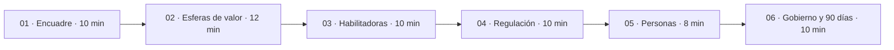
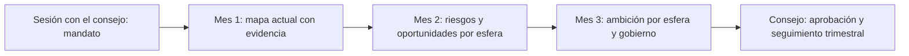

# Conversación con el consejo

**Cómo usar las nueve esferas y los tres niveles en una primera sesión de sesenta minutos: preparación, guion, preguntas, posición sobre las personas y primeros noventa días**

| | |
|---|---|
| Documento | Documento 05 · Conversación con el consejo |
| Versión | 0.1 |
| Fecha | 17-09-2026 |
| Autor | Fernando García Varela |
| Estado | En construcción. El guion completo, los formatos de respuesta y las preguntas difíciles están en el documento 61 de SEVEN-G. |
| Tipo | Guía de aplicación |

<!-- cifras: 60 | minutos de sesión ; 6 | bloques ; 9 | preguntas de referencia ; 90 | días de plan inicial -->

---

> **Aviso legal y exención de responsabilidad.** SPHERES es una metodología de referencia que se ofrece «tal cual» y con fines exclusivamente informativos. No constituye asesoramiento jurídico, regulatorio, financiero ni profesional, ni garantiza el cumplimiento de ninguna norma. Las referencias a regulación general (como el Reglamento Europeo de IA) y a regulación específica de cada sector o jurisdicción pueden ser incompletas, no aplicar a un caso concreto o quedar desactualizadas. **Cada organización que use SPHERES es la única responsable de identificar la normativa que le aplica, verificar su vigencia y certificar su propio cumplimiento regulatorio**, con el asesoramiento cualificado que corresponda. Esta metodología es una ayuda genérica y gratuita, compartida con la comunidad para que nadie tenga que empezar desde cero; cada persona u organización puede y debe adaptarla a su propio uso. No debe entenderse que sus partes jurídicamente sensibles hayan sido revisadas por una asesoría jurídica: esas revisiones, para cada empresa o sector, son responsabilidad última de la empresa, el consultor o la organización que la use. Aunque se procura mantenerla al día, alguna norma puede haber cambiado sin que se recoja aquí. En la máxima medida permitida por la ley, el autor no asume responsabilidad alguna por los efectos de su aplicación en ninguna organización ni por su aplicabilidad completa. La metodología no otorga certificación de ningún tipo. El autor no asume responsabilidad alguna por el uso que se haga de este contenido ni por las decisiones que se adopten con él. Los datos, cifras, compañías y casos de los ejemplos son ficticios o ilustrativos.

## 1. Para qué sirve esta conversación

Un consejo de administración no piensa en "casos de uso de IA". Piensa en **riesgo, oportunidad, responsabilidad y ventaja competitiva**. La conversación que propone SPHERES traduce la IA a esos términos y termina con decisiones concretas.

Sus objetivos son cuatro:

| Objetivo | Resultado al terminar la sesión |
|---|---|
| **Entender el alcance** | El consejo comprende que la IA afecta a toda la organización, no solo a tecnología. |
| **Situar a la compañía** | Existe una primera lectura de dónde está la IA de la compañía en el mapa y con qué ambición. |
| **Posicionarse** | El consejo ha expresado su posición, aunque sea provisional, sobre las prioridades y sobre las personas. |
| **Decidir** | Hay un mandato con responsable y fecha para los primeros noventa días. |

> **Por qué importa.** Muchas sesiones de consejo sobre IA terminan con una sensación de interés y ninguna decisión. El mapa de esferas da a la conversación una estructura que avanza de lo general a lo concreto y obliga a cerrar con un mandato. Sin esa estructura, la IA vuelve al orden del día seis meses después en el mismo punto.

---

## 2. Principios de la conversación

| # | Principio | Cómo se aplica | Qué se evita |
|---|---|---|---|
| 1 | **Negocio antes que tecnología.** | Se habla de clientes, oferta, personas, procesos, riesgo y responsabilidad. Los términos técnicos se traducen o se omiten. | Una sesión sobre modelos, plataformas o proveedores. |
| 2 | **Preguntas antes que respuestas.** | Cada bloque plantea una pregunta de referencia al consejo y se escucha antes de proponer. | Una presentación comercial que el consejo solo escucha. |
| 3 | **Un ejemplo por nivel basta.** | En cada esfera se elige un ejemplo de Optimizar, uno de Aumentar y uno de Transformar, preferiblemente de la propia compañía o de su sector. | Recorrer catálogos de posibilidades. |
| 4 | **Honestidad sobre las carencias.** | Las habilitadoras se presentan con lo que se sabe y lo que no; "sin dato" se dice. | Ocultar que no hay inventario o que no se sabe qué datos se pueden usar. |
| 5 | **Sin cifras sin respaldo.** | Solo se usan cifras de la compañía o de fuentes verificables; los ejemplos se marcan como ilustrativos. | Estadísticas de mercado sin fuente para crear urgencia. |
| 6 | **Terminar con una decisión.** | El último bloque pide un mandato explícito con responsable y fecha de vuelta. | "Lo estudiaremos". |

---

## 3. Preparación

La calidad de la sesión depende de la preparación. Se recomienda empezar entre dos y tres semanas antes.

| Cuándo | Qué | Quién |
|---|---|---|
| **Dos o tres semanas antes** | Entrevistas breves con la presidencia, la dirección general y las direcciones de negocio, personas, tecnología y riesgos. Lista preliminar de iniciativas y sistemas de IA conocidos. | Quien presenta, con la oficina de IA si existe |
| **Dos semanas antes** | **Primer mapa preliminar**: cada iniciativa conocida se sitúa en su esfera principal y su nivel de ambición (documento 01). Se anotan los grados aproximados de las esferas 08 y 09 (documento 04). Se eligen los ejemplos por nivel. | Quien presenta |
| **Una semana antes** | Nota de dos páginas para el consejo: objetivo de la sesión, nueve esferas, tres niveles, las preguntas de referencia y la decisión que se pedirá al final. | Secretaría del consejo |
| **El día anterior** | Ensayo con tiempos. Cada bloque cabe en su tiempo o se recorta. | Quien presenta |

### Cómo construir el mapa preliminar

1. **Reunir la lista** de iniciativas y sistemas de IA de las entrevistas, de los presupuestos y de los contratos con proveedores. Es habitual descubrir iniciativas que la dirección no conocía.
2. **Asignar la esfera principal** de cada una: la esfera en la que se mide su métrica principal, no el área que la patrocina.
3. **Asignar el nivel de ambición** con las cinco preguntas del documento 01. En caso de duda, el nivel inferior.
4. **Diagnosticar las habilitadoras** con las cinco preguntas rápidas del documento 03.
5. **Estimar los grados** de las dimensiones de 08 y 09 con la evidencia disponible.
6. **Marcar lo que no se sabe.** Un mapa preliminar con huecos declarados es más útil que uno completo e inventado.

> **Por qué importa.** Presentar al consejo su propia compañía en el mapa, aunque sea de forma preliminar, cambia el tono de la sesión: se pasa de hablar de la IA en general a hablar de decisiones propias. Y los huecos del mapa suelen ser, por sí mismos, el primer hallazgo relevante.

---

## 4. Guion de sesenta minutos

<!-- grafico: Guion de la sesión | Seis bloques que van del encuadre a la decisión -->

| Bloque | Minutos | Objetivo | Pregunta de referencia | Resultado |
|---|---|---|---|---|
| **01 · Encuadre estratégico** | 0–10 | Situar la IA como cuestión de negocio y presentar el mapa. | ¿En qué negocio estamos y cómo cambia la IA sus reglas? | Dos o tres esferas prioritarias anotadas. |
| **02 · Esferas donde se genera valor** | 10–22 | Ver dónde está hoy la IA de la compañía y dónde podría estar. | ¿Usamos la IA para proteger el negocio actual o para construir el siguiente? | Primera lectura de la cartera y de si hay alguna apuesta de Transformar. |
| **03 · Esferas habilitadoras** | 22–32 | Diagnosticar la capacidad real. | ¿Sabemos qué datos tenemos, qué conocimiento depende de pocas personas y qué decisiones ya hemos delegado? | Carencias habilitadoras reconocidas. |
| **04 · Regulación, ética y responsabilidad** | 32–42 | Saber si la compañía gobierna de forma proactiva o reactiva. | ¿Gobernamos de forma proactiva o esperamos a que el regulador nos obligue? | Saber si existe inventario con clasificación regulatoria y quién responde de él. |
| **05 · Posición sobre las personas** | 42–50 | Obtener un posicionamiento explícito. | ¿La IA va a sustituir, aumentar o reorganizar el trabajo de las personas? | Posición provisional o encargo con fecha. |
| **06 · Gobierno de la IA y primeros 90 días** | 50–60 | Cerrar con una decisión. | ¿Encargamos el diagnóstico y la estructura de gobierno en noventa días? | Mandato con responsable, órgano que recibe el resultado y fecha de vuelta. |

### Bloque 01 · Encuadre estratégico

**Qué se presenta.** Por qué la IA es un asunto del consejo: riesgo, oportunidad, responsabilidad y ventaja competitiva. Las nueve esferas agrupadas en donde se genera valor, habilitadoras, límites y meta-esfera. Los tres niveles de ambición como tipos de apuesta, no como escalera.

**Qué se pregunta.** ¿Qué dos o tres esferas les preocupan más hoy?

**Qué evitar.** Empezar por la tecnología o por la evolución de los modelos.

### Bloque 02 · Esferas donde se genera valor

**Qué se presenta.** Cliente, Producto y servicio, Personas y Operaciones, con un ejemplo por nivel en cada una. Por ejemplo, en Cliente: clasificar y enrutar consultas (Optimizar), preparar cada visita comercial con las necesidades probables del cliente (Aumentar), un canal principal de relación atendido por un asistente con supervisión (Transformar). Después, el mapa preliminar de la compañía en estas cuatro esferas.

**Qué se pregunta.** ¿Usamos la IA para proteger el producto actual o para construir el siguiente? Si un competidor conoce mejor a nuestros clientes, ¿cuánto tardamos en perder relevancia?

**Qué evitar.** Recorrer todos los ejemplos posibles o presentar la eficiencia como transformación.

### Bloque 03 · Esferas habilitadoras

**Qué se presenta.** Datos, Conocimiento y Decisión, con los hallazgos de las entrevistas: calidad y base legal de los datos, dependencia del conocimiento de pocas personas, decisiones ya delegadas en sistemas sin nivel de autonomía definido.

**Qué se pregunta.** ¿Hemos definido qué decisiones puede tomar la IA sola, cuáles requieren validación humana y cuáles no deben delegarse nunca?

**Qué evitar.** Convertir el bloque en una revisión de arquitectura tecnológica.

### Bloque 04 · Regulación, ética y responsabilidad

**Qué se presenta.** Qué exige el Reglamento Europeo de IA según el nivel de riesgo de cada sistema, la protección de datos en decisiones automatizadas y la regulación sectorial aplicable, siempre con la fecha de consulta. Las tres dimensiones: Cumplimiento, Anticipación y Liderazgo ético. Suele ser el tema que más preocupa al consejo.

**Qué se pregunta.** ¿Gobernamos de forma proactiva o esperamos a que el regulador nos obligue? ¿Hay alguien con capacidad real de decir que no a una iniciativa rentable pero inadecuada?

**Qué evitar.** Presentar la regulación como un catálogo de sanciones o dar por cerradas interpretaciones que requieren criterio jurídico.

### Bloque 05 · Posición sobre las personas

Se trata en la sección 6 de este documento.

### Bloque 06 · Gobierno de la IA y primeros noventa días

**Qué se presenta.** La meta-esfera y sus tres dimensiones: Estructura, Equilibrio entre velocidad y control y Ecosistema de proveedores. El plan de noventa días de la sección 7.

**Qué se pide.** Una decisión explícita: ¿encargamos el diagnóstico y la estructura de gobierno en noventa días, con qué responsable y con qué fecha de vuelta al consejo?

**Qué evitar.** Terminar sin decisión.

---

## 5. Banco de preguntas por esfera

Cada esfera tiene una **pregunta de referencia**, pensada para abrir la conversación, y **preguntas de seguimiento** para profundizar cuando el consejo lo pida.

| Esfera | Pregunta de referencia | Preguntas de seguimiento |
|---|---|---|
| **01 · Cliente** | Si un competidor conoce mejor a nuestros clientes porque usa mejor la IA, ¿cuánto tardamos en perder relevancia? | ¿Qué parte de la relación con el cliente ya está mediada por IA y quién responde de su calidad? ¿Sabemos si la IA mejora la retención o solo reduce el coste de atender? |
| **02 · Producto y servicio** | ¿Usamos la IA para proteger el producto actual o para construir el siguiente? | ¿Qué parte de los ingresos procede de productos que no existirían sin IA? ¿Conocemos el coste de IA por unidad de servicio? |
| **03 · Personas** | ¿La IA sustituye, aumenta o reorganiza el trabajo de las personas? | ¿Qué ocurre con la capacidad liberada? ¿Qué proporción de las iniciativas nace de los propios empleados? |
| **04 · Operaciones** | ¿Sabemos qué procesos son candidatos a automatización inmediata y cuáles necesitan un rediseño completo? | ¿Automatizamos tareas o rediseñamos procesos? ¿Qué pasa si falla un sistema que soporta una operación crítica? |
| **05 · Datos** | ¿Sabemos qué datos tenemos, dónde están, quién responde de su calidad y si podemos usarlos legalmente para IA? | ¿Cuántas iniciativas se retrasan por falta de datos? ¿Son nuestros datos una ventaja difícil de replicar? |
| **06 · Conocimiento** | Si se fueran mañana las personas que más saben, ¿qué se perdería? | ¿Quién verifica las respuestas de nuestros asistentes? ¿Aprendemos de lo que decidimos o repetimos errores? |
| **07 · Decisión** | ¿Qué decide la IA sola, qué requiere validación humana y qué no se delega nunca? | ¿Podemos reconstruir qué recomendó el sistema y qué decidió la persona? ¿Quién puede parar un sistema que actúa? |
| **08 · Regulación, ética y responsabilidad** | ¿Gobernamos de forma proactiva o esperamos a que el regulador nos obligue? | ¿Están clasificados todos nuestros sistemas? ¿Quién firma esa clasificación? ¿Tenemos principios que vayan más allá de la ley? |
| **09 · Gobierno de la IA** | ¿Tiene la IA un gobierno corporativo con la misma formalidad que las finanzas, los riesgos o el cumplimiento? | ¿Quién responde en última instancia? ¿Podemos parar una iniciativa que no funciona? ¿Dependemos de un solo proveedor de modelos? |

> **Por qué importa.** Las preguntas de referencia son deliberadamente incómodas. Su función no es obtener una respuesta inmediata, sino que el consejo reconozca que no la tiene y encargue el trabajo para obtenerla.

---

## 6. La posición sobre las personas

El bloque 05 es el más breve y el más delicado. Se plantea una sola pregunta: **¿la IA va a sustituir, aumentar o reorganizar el trabajo de las personas en esta compañía?**

### Las tres posiciones

| Posición | Qué significa | Qué implica para la compañía | Riesgo si no se gestiona |
|---|---|---|---|
| **Sustituir** | La IA asume trabajo que hoy hacen personas y la compañía reduce capacidad. | Decisión explícita de la dirección, plan social responsable, diálogo con la representación de los trabajadores cuando proceda y comunicación transparente. | Rechazo interno, pérdida de talento clave y riesgo reputacional. |
| **Aumentar** | La IA amplía lo que las personas pueden hacer; la plantilla se mantiene y cambia su trabajo. | Formación, rediseño de roles, evaluación y retribución coherentes con el nuevo trabajo. | Inversión sin retorno si no hay adopción real. |
| **Reorganizar** | La IA cambia la estructura: desaparecen funciones y aparecen otras. | Plan de transición, reciclaje profesional, nuevos roles de supervisión y de calidad, y criterios de movilidad interna. | Incertidumbre prolongada y salida de las personas con más opciones. |

En la práctica, una compañía puede adoptar posiciones distintas por función. Lo que no debe ocurrir es que la posición no exista y cada proyecto la decida por su cuenta.

### Los tres papeles que conviene recordar

Antes de pedir la posición, se recuerda que las personas son a la vez **receptoras** (les cambian herramientas y expectativas), **sujetos** (la IA puede cambiar o eliminar su puesto) y **promotoras** (quien mejor conoce un proceso identifica usos que nadie externo vería). El documento 02 los desarrolla.

### Qué se pide al consejo

Un posicionamiento explícito, aunque sea provisional. Si el consejo no está en condiciones de fijarlo en la sesión, se encarga una propuesta con fecha.

> **Por qué importa.** Esta respuesta define la cultura, la capacidad de atraer y retener talento y la relación con la plantilla durante años. Rebajar la pregunta para que resulte cómoda es un error: las personas de la organización perciben la posición real de la dirección aunque no se formule, y la ausencia de posición se interpreta casi siempre como la peor de las tres.

---

## 7. Primeros noventa días

La sesión termina con un mandato para los primeros noventa días. El mapa de esferas es el hilo conductor de los tres meses.

| Periodo | Objetivo | Qué se hace con el mapa | Resultado para el consejo |
|---|---|---|---|
| **Mes 1** | Diagnóstico | Inventario completo de iniciativas y sistemas; mapa actual por esfera y nivel; grados de 08 y 09 con evidencia; diagnóstico de las habilitadoras. | Mapa de la situación actual con los "sin dato" explícitos. |
| **Mes 2** | Riesgos y oportunidades | Principales riesgos y oportunidades por esfera, con responsable, impacto económico estimado y plazo. | Lista priorizada de riesgos y oportunidades por esfera. |
| **Mes 3** | Estructura de gobierno | Propuesta de ambición objetivo por esfera, grados objetivo de 08 y 09, indicadores principales, órganos, roles y ritmo de información al consejo. | Ambición por esfera y estructura de gobierno para aprobar. |

<!-- grafico: Primeros noventa días | El mapa pasa de preliminar a aprobado -->

El plan detallado, con entregables, responsables y criterios, está en [SEVEN-G 90 · Guía de implantación](../../../SEVEN-G/html/es/90_SEVEN-G_Guia_de_implantacion.html).

> **Por qué importa.** Noventa días es un plazo suficiente para pasar de la intuición a la evidencia y lo bastante corto para que el consejo mantenga la atención. Al final del periodo, el mapa deja de ser un ejercicio de sesión y se convierte en la herramienta con la que el consejo supervisa la IA cada trimestre.

---

## 8. Después de la sesión

| Plazo | Acción | Responsable |
|---|---|---|
| **Dos días hábiles** | Nota de conclusiones: esferas prioritarias, lecturas del mapa, posición sobre las personas y decisión adoptada. | Quien presenta |
| **Cinco días hábiles** | Registro de las decisiones y encargos con responsable y fecha. | Secretaría del consejo |
| **Siguiente sesión** | Primer punto del orden del día: estado de lo decidido y mapa actualizado. | Responsable designado para la IA |

A partir del diagnóstico, el mapa se revisa **cada trimestre** en la supervisión del consejo, con las brechas entre la ambición objetivo y la cartera, y **cada año** en la revisión de la estrategia de IA. En SEVEN-G, el panel de IA para el consejo (T17) muestra el mapa de calor de la cartera y el registro de recomendaciones y decisiones conserva lo que el consejo pide y su cumplimiento.

---

## 9. El papel de quien acompaña al consejo

La sesión puede conducirla la dirección, un consejero con experiencia en IA o un asesor interno o externo. En todos los casos conviene respetar estas reglas:

| Hace | No hace |
|---|---|
| Ayuda al consejo a preguntar bien, interpretar la evidencia y seguir lo decidido. | Dirige la oficina de IA ni toma decisiones que corresponden al consejo o a la dirección. |
| Traduce a lenguaje de negocio las cuestiones técnicas. | Usa cifras de mercado sin fuente para crear urgencia. |
| Señala cifras sin respaldo, ausencias no declaradas y tecnicismos innecesarios. | Recomienda proveedores, productos o servicios en los que tenga interés. |
| Declara sus intereses y relaciones con proveedores. | Supervisa iniciativas en las que él o su organización prestan servicios de implantación. |

El detalle de este papel, su independencia y la formación del consejo en IA están en [SEVEN-G 61 · Guía de conversación con el consejo](../../../SEVEN-G/html/es/61_SEVEN-G_Guia_de_conversacion_con_el_consejo.html), sección 10.

> **Por qué importa.** La utilidad del mapa de esferas depende de la confianza del consejo en quien lo presenta. Si la conversación se percibe como el preludio de una venta, el consejo desconfiará del diagnóstico, por bueno que sea.

---

## 10. Errores frecuentes

| Error | Consecuencia | Cómo evitarlo |
|---|---|---|
| Empezar por la tecnología. | El consejo desconecta o delega el tema en el área de sistemas. | Abrir con la pregunta de negocio y el mapa. |
| Presentar solo oportunidades. | El consejo aprueba ambición sin conocer las carencias ni los límites. | Dedicar tiempo propio a habilitadoras, regulación y gobierno. |
| Usar cifras de mercado sin fuente. | Pérdida de credibilidad en cuanto un consejero pregunta de dónde salen. | Usar datos propios o fuentes verificables; marcar los ejemplos como ilustrativos. |
| Presentar un mapa completo sin evidencia. | Decisiones sobre una imagen falsa de la compañía. | Declarar los huecos y los "sin dato". |
| Evitar la pregunta sobre las personas. | La posición la toman los proyectos uno a uno. | Dedicar un bloque propio y pedir posición o encargo. |
| Terminar sin decisión. | La IA vuelve al orden del día en el mismo punto meses después. | Preparar la decisión que se pedirá y formularla en el último bloque. |
| No hacer seguimiento. | El mapa se queda en un documento de sesión. | Registrar decisiones y revisar el mapa cada trimestre. |

---

## 11. Documentos relacionados

| Documento | Relación |
|---|---|
| **documento 00 · Qué es SPHERES y para qué sirve** | Presentación del mapa y ejemplo completo de lectura. |
| **documento 01 · Niveles de ambición** | Clasificación de las iniciativas para el mapa preliminar. |
| **documento 02 · Esferas donde se genera valor** | Ejemplos y preguntas de los bloques 02 y 05. |
| **documento 03 · Esferas habilitadoras** | Diagnóstico rápido para el bloque 03. |
| **documento 04 · Regulación y gobierno de la IA** | Dimensiones y grados para los bloques 04 y 06. |
| [SEVEN-G 61 · Guía de conversación con el consejo](../../../SEVEN-G/html/es/61_SEVEN-G_Guia_de_conversacion_con_el_consejo.html) | Guion completo, formatos de respuesta, preguntas difíciles y papel del consejero con experiencia en IA. |
| [SEVEN-G 62 · Registro de recomendaciones y decisiones](../../../SEVEN-G/html/es/62_SEVEN-G_Registro_de_recomendaciones_y_decisiones.html) | Registro de lo que decide y recomienda el consejo. |
| [SEVEN-G 90 · Guía de implantación](../../../SEVEN-G/html/es/90_SEVEN-G_Guia_de_implantacion.html) | Plan detallado de los primeros noventa días. |

---

## 12. Control de versiones

| Versión | Fecha | Cambios |
|---|---|---|
| 0.1 | 17-09-2026 | Primera versión. Desarrolla la conversación con el consejo basada en el mapa de esferas: objetivos, principios, preparación y mapa preliminar, guion de sesenta minutos, banco de preguntas por esfera, posición sobre las personas, primeros noventa días, seguimiento, papel de quien acompaña al consejo y errores frecuentes. |
